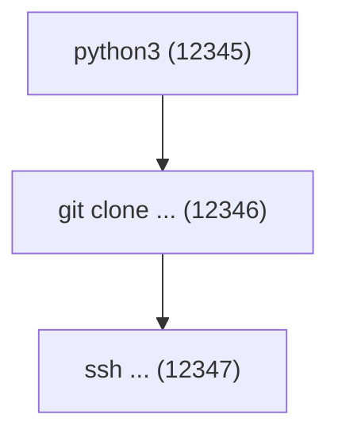

# Monitor Process - 进程行为监控

本 skill 用于深度监控特定进程的运行时行为，通过 eBPF 追踪其系统调用活动。

## 使用场景

- 调试 Agent 的文件访问问题
- 审计进程的安全行为
- 分析进程的资源使用模式
- 检测异常或恶意行为
- 追踪工具调用链（tool call → subprocess → file access）

## 监控准备

### 1. 注册进程进行追踪

**选项 A：追踪命令名**

使用 `add_tracked_command` MCP 工具：

```json
{
  "command": "python3",
  "tag": "ai-agent"
}
```

这会追踪所有名为 `python3` 的进程（精确 16 字节匹配）。

**选项 B：Agent 自注册**

如果进程是 Python/Node Agent，使用 adapter 注册：

```python
# Python
from agent_tracker import register_pid
register_pid(tag="my-agent", agent_run_id="run-123")
```

```javascript
// Node.js
const { registerPID } = require('./agentTracker');
registerPID({ tag: 'my-agent', agentRunId: 'run-123' });
```

### 2. 配置追踪路径（可选）

如果只关心特定路径的访问，使用 `add_tracked_path`：

```json
{
  "path": "/home/user/.ssh/id_rsa",
  "tag": "sensitive-file"
}
```

## 监控方法

### 方法 1：实时事件流（推荐）

使用 `query_events` MCP 工具按 PID 或 comm 过滤：

```json
{
  "pid": 12345,
  "limit": 200
}
```

或按命令名过滤：

```json
{
  "comm": "python3",
  "limit": 200
}
```

**优点**：
- 低延迟，实时获取
- 可精确过滤
- 包含完整事件详情

**缺点**：
- 需要轮询或周期调用
- 不保证捕获所有事件（如果进程活动频繁）

### 方法 2：历史事件回放

使用 `tail_events` 获取最近的事件历史：

```json
{
  "limit": 500
}
```

然后在本地过滤出目标进程的事件。

**优点**：
- 可回溯分析
- 适合事后调查
- 支持持久化日志（如果启用）

**缺点**：
- 延迟较高
- 需要在海量事件中过滤

### 方法 3：系统健康和性能指标

使用 `get_system_health` MCP 工具查看：

```
- collectorHealth: 事件采集器状态
- tracepointBootstrap: eBPF 程序加载状态
- otelExporter: OTLP 导出器状态
- cgroupSandboxAttached: 网络拦截是否启用
- lsmEnforcerAttached: 文件拦截是否启用
```

## 监控维度

### 1. 文件访问模式

**关注事件类型**：
- `openat`: 打开文件
- `unlinkat`: 删除文件
- `mkdirat`: 创建目录

**分析要点**：
- 访问频率（是否频繁读写？）
- 路径模式（集中在哪些目录？）
- 敏感文件（是否访问 /etc/passwd、~/.ssh/ 等？）
- 临时文件（/tmp/ 下的活动）

**示例查询**：

步骤：

1. 调用 `query_events`，参数 `{ "pid": 12345, "eventType": "openat", "limit": 100 }`。
2. 提取所有 `path` 字段。
3. 按目录前缀分组统计。
4. 识别异常：
   - 访问 `/proc/<other_pid>/`：可能在探测其他进程。
   - 访问 `/sys/kernel/debug/`：可能在尝试提权。
   - 访问 `~/.aws/credentials`：可能在窃取凭证。

### 2. 网络行为模式

**关注事件类型**：
- `connect`: TCP 连接
- `bind`: 监听端口
- `sendto`: UDP 发送
- `recvfrom`: UDP 接收

**分析要点**：
- 连接目标（IP、域名、端口）
- 连接频率（是否有 DDoS 行为？）
- 监听行为（是否开放后门端口？）
- 协议选择（TCP vs UDP）

**示例分析**：

1. 获取该进程的所有 `connect` 事件。
2. 提取目标 IP 和端口。
3. 按目标分组：
   - API 服务器（`api.openai.com:443`）：正常。
   - C&C 服务器（可疑 IP:8443）：告警。
   - 本地服务（`127.0.0.1:5432`）：数据库访问。
4. 计算连接成功率（`ESTABLISHED` vs `FAILED`）。
5. 识别端口扫描（短时间大量不同端口）。

### 3. 进程创建链

**关注事件类型**：
- `execve`: 执行新程序

**分析要点**：
- 父子进程关系
- 执行的命令行参数
- 是否有 shell 注入风险
- 是否执行了意外的子程序

**示例分析**：

获取该进程的所有 `execve` 事件，并绘制进程树：



检查：

- 命令参数是否包含用户输入（注入风险）
- 执行路径是否在 PATH 中（劫持风险）
- 是否有 `/bin/sh -c "..."` 模式（shell 注入）

### 4. 资源使用模式

**关注事件类型**：
- `ioctl`: I/O 控制（可能涉及硬件访问）
- 高频 `openat` + `unlinkat`: 临时文件管理
- 大量 `connect`: 网络密集

**分析要点**：
- 事件频率分布
- 高频操作类型
- 资源竞争（多次失败重试）

## 异常检测规则

### 规则 1：未授权文件访问

```
IF 进程尝试访问：
  - /etc/shadow
  - ~/.ssh/id_rsa
  - ~/.aws/credentials
  - /proc/*/environ
THEN 告警："敏感文件访问"
```

### 规则 2：异常网络行为

判定条件：进程在短时间内（5 秒）满足以下任一项时，告警并考虑隔离：

- 连接 `>10` 个不同目标：`端口扫描`
- 连接已知恶意 IP：`C&C 通信`
- 监听非预期端口（非 `8000-9000`）：`后门`

### 规则 3：提权尝试

```
IF 进程执行：
  - sudo / su
  - pkexec
  - setuid 程序（如 passwd）
  - 修改 /etc/sudoers
THEN 告警："提权尝试"
```

### 规则 4：数据外泄

```
IF 进程：
  - 读取大量文件（>100 个）
  - 然后立即发起网络连接
  - 上传大量数据（通过 TLS 捕获观察）
THEN 告警："疑似数据外泄"
```

## 响应策略

### 低风险行为

- 仅记录日志
- 添加到审计报告

### 中风险行为

- 实时告警
- 使用 `block_network_destination` 阻止可疑连接
- 使用 `block_file_access` 阻止敏感文件访问

### 高风险行为

- 立即告警
- 使用 `block_process_cgroup` 隔离整个进程（阻止所有网络）
- 使用 BPF LSM 阻止进一步文件操作
- 终止进程（通过 wrapper 或手动 kill）

## 集成 Wrapper 策略

如果进程通过 `agent-wrapper` 启动，可以在检测到异常后：

```
1. 通过 wrapper 规则预先限制行为：
   - BLOCK 特定命令
   - REWRITE 命令参数（移除危险参数）
   - ALERT 但允许执行（仅记录）

2. 动态调整规则：
   - 检测异常后，POST /config/wrapper-rules 添加新规则
   - 该规则立即生效，影响后续执行
```

## 性能优化

- 使用 `limit` 参数控制返回事件数量
- 按 `eventType` 精确过滤，减少无关事件
- 对于长期监控，启用 OTLP 导出到外部系统
- 定期清理内存中的事件缓存（通过 `maxEventAge`）

## 完整监控流程示例

```
# 1. 准备
add_tracked_command({ command: "python3", tag: "agent" })

# 2. 启动 Agent（假设 PID=12345）

# 3. 实时监控（轮询）
while monitoring:
  events = query_events({ pid: 12345, limit: 50 })
  
  # 分析文件访问
  for event in filter(events, type="openat"):
    if is_sensitive(event.path):
      alert("敏感文件访问", event)
  
  # 分析网络连接
  for event in filter(events, type="connect"):
    if is_suspicious(event.dstIP):
      block_network_destination({ ip: event.dstIP })
      alert("阻止可疑连接", event)
  
  # 分析进程创建
  for event in filter(events, type="execve"):
    if has_shell_injection(event.args):
      alert("疑似 shell 注入", event)
  
  sleep(1)

# 4. 事后分析
history = tail_events({ limit: 1000 })
generate_audit_report(history, pid=12345)
```

## 验证方法

1. 启动一个测试进程（如 Python REPL）
2. 追踪该进程（add_tracked_command 或自注册）
3. 在进程中执行操作：
   - 打开文件：`open('/etc/passwd')`
   - 网络请求：`import requests; requests.get('http://example.com')`
   - 创建子进程：`import subprocess; subprocess.run(['ls'])`
4. 调用 `query_events` 查询该 PID 的事件
5. 验证所有操作都被正确捕获
