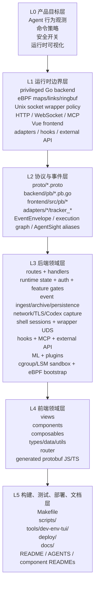
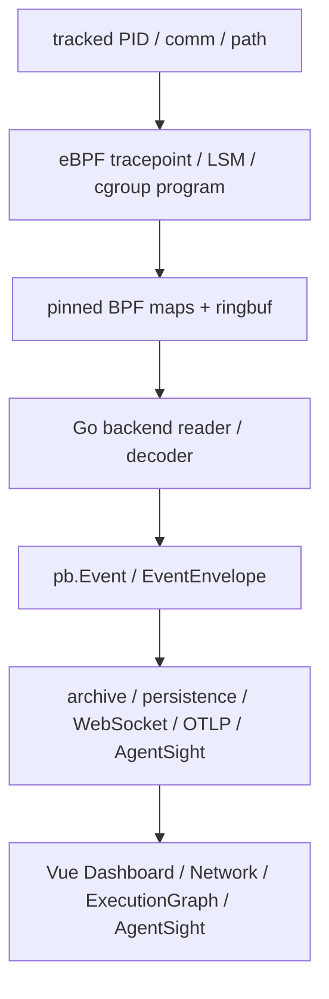
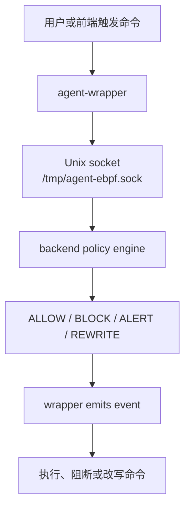
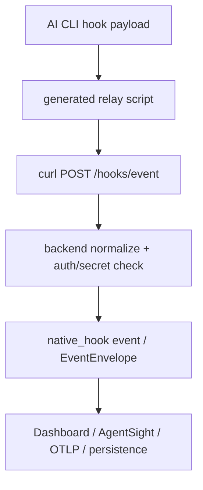
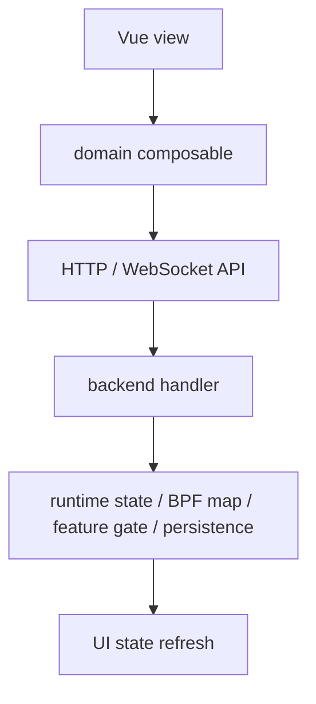

# 00 — 全局层级与导航

本文件提供 `agent-ebpf-filter` 的多层结构图。先读它，再进入其他 references。

## 项目定位

`agent-ebpf-filter` 是一个面向本地 Linux 工作站 / 节点的 Agent 观测与约束系统：

- 用 eBPF 追踪进程、文件、网络和部分 OS enforcement 行为。
- 用 Go 后端聚合事件、提供 API、WebSocket、MCP、策略和运行时配置。
- 用 Vue 3 前端展示 Dashboard、Network、ExecutionGraph、AgentSight、Config 等工作台。
- 用 `agent-wrapper` 对 CLI 命令进行策略拦截。
- 用 Python / Node adapters 注册 Agent 进程 PID。
- 用 native hooks 接入 Claude Code、Gemini、Codex、Copilot、Kiro、Cursor 等 AI CLI。

## 多层结构

## 顶层目录职责

| 路径 | 角色 | 何时进入 |
| --- | --- | --- |
| `backend/` | Go 后端与 eBPF runtime | API、事件、策略、网络、TLS、ML、sandbox、MCP、AgentSight |
| `backend/ebpf/` | eBPF C 程序与生成绑定 | syscall tracing、cgroup sandbox、LSM、TLS uprobes |
| `frontend/` | Vue 3 + Vite 前端 | 页面、组件、状态、类型、路由、可视化 |
| `wrapper/` | `agent-wrapper` CLI | 命令拦截、ALLOW/BLOCK/ALERT/REWRITE |
| `adapters/` | Python / JS Agent PID 注册 | Agent SDK 接入、进程 register/unregister |
| `proto/` | protobuf 源定义 | 事件字段、配置、shell、system、registration 协议 |
| `docs/` | 架构/API/安全/benchmark 文档 | 行为变化、设计理解、用户文档 |
| `scripts/` | dev/build/smoke/report 脚本 | 启动、安装、验证、报告生成 |
| `tools/dev-env-tui/` | Go TUI 开发环境配置 | `.env.dev` / `.env.dev.mk` 引导 |
| `deploy/` | 部署清单 | Kubernetes / 服务部署行为 |
| `.devcontainer/` | Dev Container 配置 | 容器开发环境 |
| `.claude/skills/` | 项目级 Claude Code skills | Agent 辅助知识库 |

## 核心数据流

### eBPF 事件流

### Wrapper 策略流

### Native hook 流

### 前端配置流

## 跨层同步规则

有些改动绝不能只改一层：

| 改动 | 通常需要同步 |
| --- | --- |
| 新事件字段 | `proto/`、backend decode/emit、frontend type/display/filter、docs |
| 新事件类型 | eBPF/kernel mapping、protobuf enum/message、backend event conversion、frontend option list、tests/docs |
| 新 config 字段 | `proto/tracker_config.proto`、backend config handler/state/env、frontend `types/config.ts` 与 composable/tab、docs |
| 新 HTTP API | `backend/routes.go`、handler、frontend composable、auth/feature gate、external docs |
| 新 WebSocket | route、broadcaster、frontend stream composable、auth token 拼接 |
| 新 runtime gate | backend `features.go` / helpers、Config Runtime UI、docs |
| 新 eBPF map | C program、Go generated bindings、bootstrap/open/pin、status API、docs |
| 新 hook provider | backend detection/install/event parsing、frontend catalog/UI、docs |
| 新 page/tab | router、view、components/composables、navigation、docs/screenshots 如需要 |

## 选择下一份文档

- 想知道怎么构建、运行、验证：读 `01-root-build-runtime.md`。
- 想改 Go 后端：读 `02-backend-layers.md`。
- 想改 Vue 前端：读 `03-frontend-layers.md`。
- 想改 proto/eBPF/生成文件：读 `04-proto-ebpf-generated.md`。
- 想改 hooks/wrapper/adapters/security：读 `05-agent-integrations-security.md`。
- 想按页面/功能域快速找文件：读 `06-feature-domain-index.md`。
- 想获得操作步骤和检查清单：读 `07-agent-workflows-checklists.md`。
