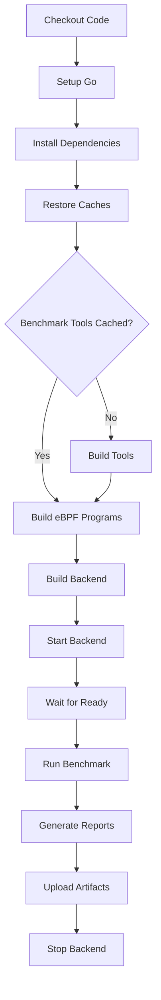

# GitHub Actions 基准测试工作流

## 📋 概述

自动化的 eBPF 性能基准测试工作流，可在 GitHub Actions 云端环境中运行。

## 🚀 如何使用

### 手动触发测试

1. 进入仓库的 **Actions** 标签页
2. 选择 **eBPF Performance Benchmark** 工作流
3. 点击 **Run workflow** 按钮
4. 配置参数：
   - **cycles**: 测试周期数 (默认：100)
   - **syscalls**: 系统调用集合
     - `basic`: 10 个基础系统调用
     - `extended`: 18 个扩展系统调用（推荐）

### 通过 GitHub CLI

```bash
# 使用默认参数（100 周期，扩展集合）
gh workflow run benchmark.yml

# 自定义参数
gh workflow run benchmark.yml \
  -f cycles=50 \
  -f syscalls=extended
```

### 通过 API

```bash
curl -X POST \
  -H "Accept: application/vnd.github+json" \
  -H "Authorization: Bearer $GITHUB_TOKEN" \
  https://api.github.com/repos/OWNER/REPO/actions/workflows/benchmark.yml/dispatches \
  -d '{"ref":"main","inputs":{"cycles":"100","syscalls":"extended"}}'
```

## 📊 输出内容

### GitHub Step Summary

工作流完成后，在 Actions 运行页面会显示：
- 测试配置信息
- 核心指标（平均开销、范围等）
- 详细的 ASCII 图表（可展开）

### Artifacts

每次运行生成 2 个 artifact：

1. **benchmark-results-{syscalls}-{cycles}-cycles**
   - `summary.json` - JSON 格式的完整数据
   - `baseline_final.json` - 基线测试数据
   - `ebpf_final.json` - eBPF 测试数据

2. **benchmark-charts-{syscalls}-{cycles}-cycles**
   - `summary_chart.txt` - ASCII 图表
   - `report.txt` - 终端可视化报告

保留期：90 天

### PR 评论（如果适用）

如果工作流在 PR 上下文中运行，会自动添加评论包含：
- 平均开销
- 每个系统调用的详细结果
- Artifact 链接

## 🔧 技术细节

### 运行环境

- **OS**: Ubuntu Latest (GitHub Hosted Runner)
- **内核**: GitHub Actions 提供的最新 LTS 内核
- **架构**: x86_64

### 缓存策略

工作流使用多层缓存加速运行：

1. **Go 模块缓存**
   - 缓存 `~/go/pkg/mod` 和 `~/.cache/go-build`
   - Key: `${{ runner.os }}-go-${{ hashFiles('**/go.sum') }}`

2. **基准工具缓存**
   - 缓存编译好的 `benchmark-syscalls` 和 `benchmark-syscalls-extended`
   - Key: `${{ runner.os }}-benchmark-${{ hashFiles('scripts/*.go') }}`
   - 只有源码改变时才重新编译

### 执行流程



### 性能优化

- **并行构建**: Go 模块和工具并行编译
- **增量编译**: 利用 Go build cache
- **工具缓存**: 避免重复编译基准工具
- **后台运行**: Backend 在后台运行，不阻塞测试

## 📈 预期运行时间

| 配置 | 预计时间 |
|------|----------|
| 10 syscalls × 50 cycles | ~8 分钟 |
| 10 syscalls × 100 cycles | ~12 分钟 |
| 18 syscalls × 50 cycles | ~15 分钟 |
| 18 syscalls × 100 cycles | ~25 分钟 |

*包含环境设置、编译、测试和报告生成*

## 🔍 故障排除

### Backend 启动失败

**症状**: "Waiting for backend to start... timeout"

**可能原因**:
- 内核不支持 eBPF
- 缺少必要的内核模块
- 权限问题

**解决方案**:
```yaml
# 添加到工作流
- name: Check kernel support
  run: |
    cat /sys/kernel/btf/vmlinux | head
    mount | grep bpf
```

### 测试结果异常

**症状**: 开销 > 50% 或测试失败

**可能原因**:
- GitHub Actions runner 性能波动
- 系统负载高
- 时钟源不稳定

**解决方案**:
- 重新运行工作流
- 增加测试周期数以平滑噪声
- 检查 GitHub Actions 状态页

### Artifact 上传失败

**症状**: "Error: Unable to upload artifact"

**可能原因**:
- 文件太大（>10GB）
- 网络问题

**解决方案**:
```yaml
# 排除原始数据文件
path: |
  reports/ebpf-overhead-extended-*/
  !reports/ebpf-overhead-extended-*/raw_*
```

## 🎯 使用建议

### 开发测试

```bash
# 快速验证（50 周期，基础集合）
gh workflow run benchmark.yml -f cycles=50 -f syscalls=basic
```

### 发布前验证

```bash
# 完整测试（100 周期，扩展集合）
gh workflow run benchmark.yml -f cycles=100 -f syscalls=extended
```

### PR 性能回归检测

在 PR 中手动触发工作流，查看对比结果。

## 📚 相关文档

- [性能报告](../docs/delivery/performance_final_report.md) - 完整的性能分析
- [技术解释](../docs/delivery/why_faster_analysis.md) - 为什么某些调用更快
- [快速参考](../BENCHMARK_QUICKREF.txt) - 一页纸总结

## 🔐 安全考虑

- **权限**: 工作流使用 `sudo` 运行 backend（需要加载 eBPF）
- **隔离**: 每次运行在独立的 runner 中
- **清理**: Backend 进程在测试后自动停止
- **数据**: 测试数据不包含敏感信息

## 💡 贡献

改进建议：
- 添加性能回归检测阈值
- 实现跨版本对比
- 集成到 PR 检查中
- 添加性能趋势图

---

**维护者**: Agent eBPF Filter Team  
**最后更新**: 2026-06-21
