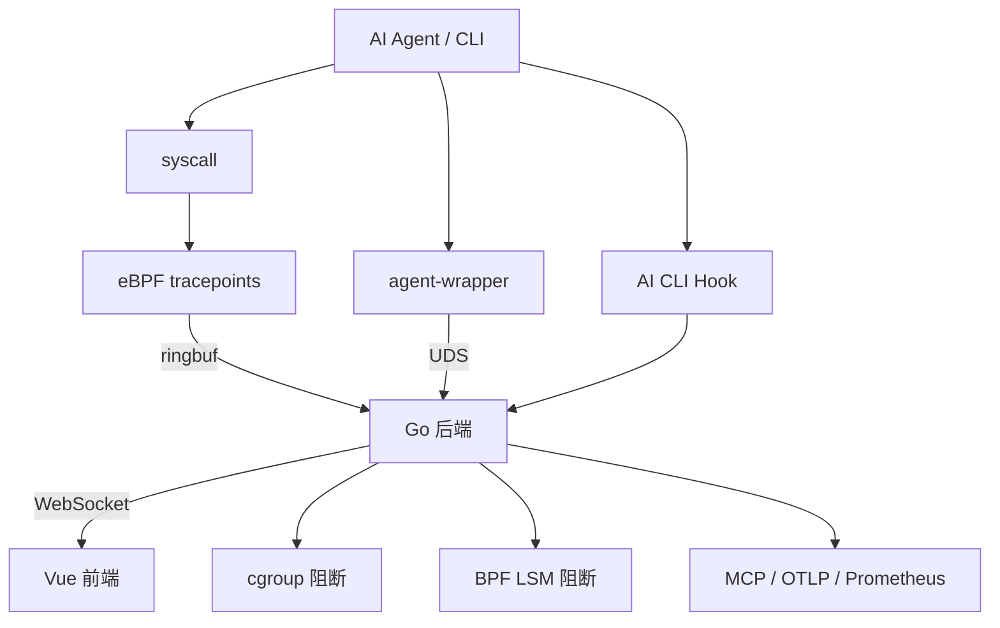

# Agent eBPF Filter

面向 Linux 本地工作站和实验环境的 **AI Agent 行为观测与安全控制系统**。

---

## 项目简介

Agent eBPF Filter 通过 Go 后端 + eBPF 内核探针 + Vue 3 前端 + CLI Wrapper + 多语言适配器，实时追踪 AI Agent、开发者 CLI 与子进程的文件访问、进程执行、网络连接和策略命中行为，并提供可视化分析、运行时配置与内核级阻断能力。

### 核心问题

当 AI Agent 或开发者 CLI 在本机执行任务时，系统如何回答：

- 它实际执行了什么命令？
- 它打开、修改或删除了哪些文件？
- 它连接了哪些网络目标？
- 这些行为属于哪个 Agent run、哪个 tool call、哪个 trace？
- 是否触发了 wrapper / cgroup / LSM / ML / semantic policy？
- 高风险诊断数据是否经过脱敏？

### 核心能力

| 能力 | 描述 |
| --- | --- |
| **内核事实采集** | eBPF tracepoint 捕获 exec/open/connect/sendto/recvfrom 等 9 类 syscall |
| **Agent 语义关联** | PID registration、native hooks、wrapper 提供 run_id / tool_call_id / trace_id |
| **用户态 + 内核态控制** | wrapper (ALLOW/BLOCK/ALERT/REWRITE)、cgroup 网络阻断、BPF LSM 文件/执行阻断 |
| **可视化工作台** | Dashboard、Network、Execution Graph、AgentSight、Config、ML、Plugins |
| **安全默认值** | release-mode auth、runtime gates、四级脱敏、高风险能力默认关闭 |
| **对外集成** | MCP、External API v1、OTLP span 导出、Prometheus metrics |

---

## 快速开始

### 环境要求

- Linux，支持 eBPF + BTF
- Go 1.26.2+
- Bun（前端构建）
- clang / LLVM（eBPF 编译）
- `sudo` 或 `pkexec`

### 开发模式

```bash
make predev          # 安装开发依赖
make dev             # 启动后端 + 前端开发会话
```

### 生产模式

```bash
make run             # 构建并运行
```

### 系统服务安装

```bash
make install         # 安装为 systemd 服务（或 rc.local fallback）
make uninstall       # 卸载
```

---

## 系统架构



---

## 编译期功能选择

```bash
# 默认：完整功能
AGENT_BUILD_FEATURES=all make backend

# 仅核心模块
AGENT_BUILD_FEATURES=core make backend

# 选择性功能
AGENT_BUILD_FEATURES=tls_capture,ml,plugins make backend
```

编译期选择只决定"当前构建是否包含该模块"，危险能力仍需 `/config/runtime` 运行时 gate 和 release mode access token 才能使用。后端通过 `GET /system/features` 暴露状态，前端据此区分"未编译""运行时关闭"和"可用"。

---

## 项目结构

| 目录 | 说明 |
| --- | --- |
| `backend/` | Go 后端（HTTP/WS API、eBPF 加载、策略引擎） |
| `backend/ebpf/` | eBPF 程序（tracker、cgroup sandbox、LSM enforcer） |
| `frontend/` | Vue 3 + TypeScript + Vite 前端 |
| `wrapper/` | agent-wrapper 命令拦截器 |
| `adapters/` | Python / Node.js PID 注册适配器 |
| `kernel-ml/` | 可选 DKMS 内核态 ML 推理模块 |
| `proto/` | Protobuf 协议定义 |
| `docs/` | VitePress 文档站 |
| `deploy/` | Kubernetes 部署清单 |

---

## 文档

项目提供完整的 [VitePress 文档站](docs/index.md)，按以下结构组织：

- **[指南](docs/guide/what-is-agent-ebpf-filter.md)** — 项目介绍、快速开始、功能总览
- **[架构](docs/architecture/overview.md)** — 总体架构、数据流、运行时边界
- **[后端与内核](docs/backend/runtime-startup.md)** — 启动链路、路由 API、事件管线、ML
- **[前端工作台](docs/frontend/workbench.md)** — 工作台总览、路由、组件
- **[安全模型](docs/security/model.md)** — 安全模型、策略语义、Runtime Gates
- **[集成](docs/integrations/agents.md)** — Agents、Wrapper、Native Hooks、MCP/OTLP
- **[运维交付](docs/operations/build-and-run.md)** — 构建、部署、验证
- **[答辩交付](docs/delivery/competition-defense.md)** — 答辩主线、演示脚本、评测报告

本地预览文档站：

```bash
bun install
bun run docs:dev
```

---

## 许可证

[GPL-3.0](LICENSE)

---

## 致谢

本项目在架构设计和技术选型上受到 [AgentSight](https://github.com/eunomia-bpf/agentsight) 项目的启发。详见 [AgentSight 项目致敬](docs/reference/agentsight-acknowledgment.md)。
