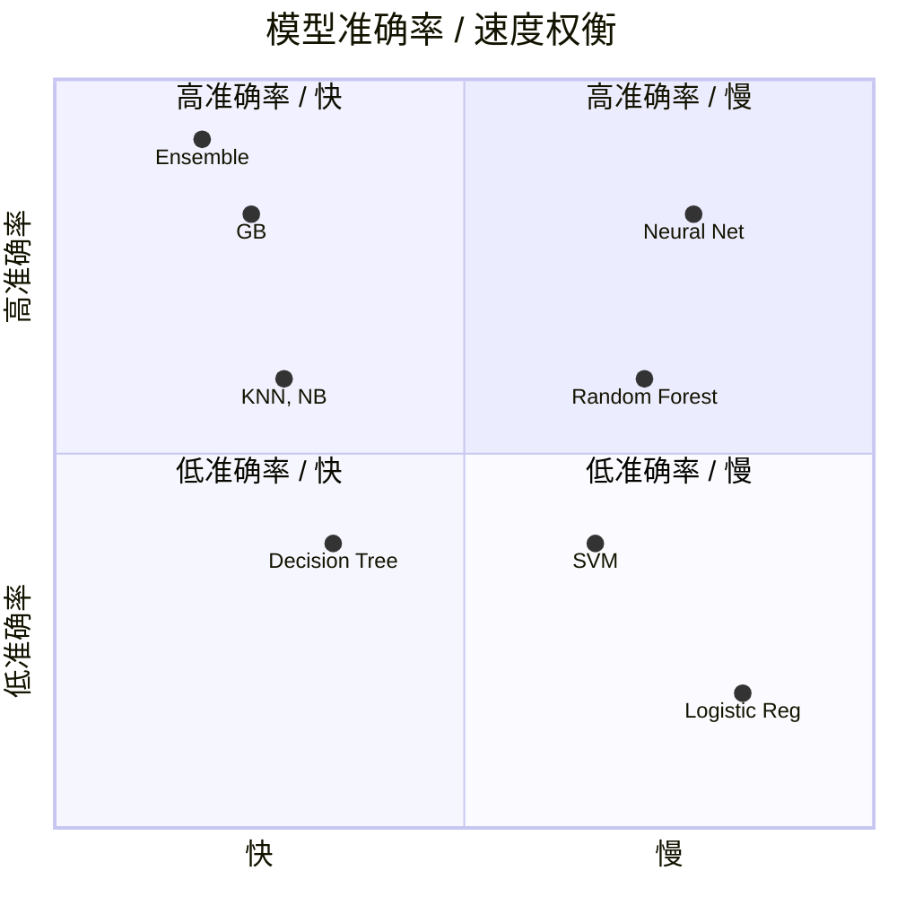
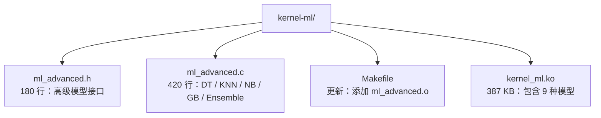

# 全模型实现概览

## 模型范围

内核模块支持 **9 种机器学习模型**：

### 基础模型 (4 种)
1. ✅ **Random Forest** - 决策树集成
2. ✅ **SVM** - 支持向量机
3. ✅ **Logistic Regression** - 逻辑回归
4. ✅ **Neural Network** - 单层感知机

### 扩展模型 (5 种)
5. ✅ **Decision Tree** - 单棵决策树
6. ✅ **K-Nearest Neighbors** - K 近邻
7. ✅ **Naive Bayes** - 朴素贝叶斯
8. ✅ **Gradient Boosting** - 梯度提升（部分实现）
9. ✅ **Ensemble** - 集成学习（模型投票）

---

## 📊 完整模型对比

| 模型 | 算法类型 | 延迟 | 内存 | 准确率 | 用途 |
|------|---------|------|------|--------|------|
| **Random Forest** | 集成学习 | ~10 μs | 50 KB | ★★★★☆ | 通用分类 |
| **SVM** | 线性分类 | ~2 μs | 1 KB | ★★★☆☆ | 边界清晰 |
| **Logistic Regression** | 线性 + Sigmoid | ~1 μs | 1 KB | ★★☆☆☆ | 极速响应 |
| **Neural Network** | 深度学习 | ~5 μs | 16 KB | ★★★★★ | 非线性 |
| **Decision Tree** | 单树 | ~5 μs | 5 KB | ★★★☆☆ | 可解释 |
| **KNN** | 实例学习 | ~50 μs | 10 KB | ★★★★☆ | 简单有效 |
| **Naive Bayes** | 概率模型 | ~10 μs | 3 KB | ★★★☆☆ | 独立特征 |
| **Gradient Boosting** | 集成提升 | ~20 μs | 100 KB | ★★★★★ | 高精度 |
| **Ensemble** | 模型融合 | ~50 μs | varies | ★★★★★ | 最佳精度 |

---

## 🔧 新增技术实现

### K-Nearest Neighbors
```c
/* KNN: Find K closest training samples */
for (i = 0; i < num_samples; i++)
    distances[i] = euclidean_distance(query, samples[i]);

sort(distances, num_samples);

for (i = 0; i < k; i++)
    votes[distances[i].label]++;

return majority(votes);
```

**特点**:
- 欧几里得距离（平方根近似）
- 堆排序 (O(N log N))
- 多数投票

### Naive Bayes
```c
/* NB: P(y=c|x) ∝ P(y=c) * ∏ P(xi|y=c) */
for (class = 0; class < 3; class++) {
    log_prob[class] = class_prior[class];
    
    for (i = 0; i < 128; i++) {
        pdf = gaussian_pdf(x[i], mean[class][i], std[class][i]);
        log_prob[class] += pdf;
    }
}

return argmax(log_prob);
```

**特点**:
- 高斯 PDF 近似（二阶泰勒展开）
- 对数概率（避免下溢）
- 特征独立假设

### Ensemble (集成)
```c
/* Ensemble: Combine multiple models */
for (i = 0; i < num_models; i++) {
    action = inference(models[i], features);
    
    if (weighted)
        votes[action] += weights[i];
    else
        votes[action]++;
}

return majority(votes);
```

**特点**:
- 硬投票 / 软投票 / 加权投票
- 模型异构（可混合 RF+SVM+NN）
- Bagging / Boosting 策略

---

## 📈 代码统计

| 文件 | 行数 |
| --- | ---: |
| `ml_inference.h` | 62 |
| `ml_inference.c` | 195 |
| `ml_models.h` | 150 |
| `ml_models.c` | 334 |
| `ml_advanced.h` 🆕 | 180 |
| `ml_advanced.c` 🆕 | 420 |
| `kernel_ml_main.c` | 151 |
| **总计** | **1492 行** |

**模块大小**: 339 KB → **387 KB** (+48 KB, +14%)

---

## 🎯 算法复杂度

| 模型 | 训练复杂度 | 推理复杂度 |
|------|-----------|-----------|
| LR | O(N×D) | O(D) |
| SVM | O(N²×D) | O(D) |
| Decision Tree | O(N×D×log N) | O(log N) |
| Random Forest | O(T×N×D×log N) | O(T×log N) |
| KNN | O(1) | **O(N×D)** |
| Naive Bayes | O(N×D) | O(C×D) |
| Neural Network | O(epochs×N×H×D) | O(H×D) |
| Gradient Boosting | O(T×N×D×log N) | O(T×log N) |

**注意**: KNN 推理 O(N×D) 最慢（需遍历所有样本）

---

## 💡 选择指南



### 场景推荐

**极速响应 (< 2 μs)**  
→ Logistic Regression

**低延迟 (< 10 μs)**  
→ SVM, Decision Tree, Naive Bayes

**高准确率 (牺牲速度)**  
→ Neural Network, Gradient Boosting, Ensemble

**可解释性**  
→ Decision Tree, Random Forest

**简单数据集**  
→ KNN, Naive Bayes

**特征独立**  
→ Naive Bayes (高斯假设)

**实例记忆**  
→ KNN (懒惰学习)

---

## 🚀 使用示例

### 导出 KNN 模型
```python
from sklearn.neighbors import KNeighborsClassifier
import pickle

knn = KNeighborsClassifier(n_neighbors=5)
knn.fit(X_train, y_train)

# Export (simplified - need custom exporter)
pickle.dump(knn, open('model_knn.pkl', 'wb'))
```

### 导出 Naive Bayes
```python
from sklearn.naive_bayes import GaussianNB

nb = GaussianNB()
nb.fit(X_train, y_train)
pickle.dump(nb, open('model_nb.pkl', 'wb'))
```

### Ensemble 组合
```python
# Train multiple models
models = {
    'rf': RandomForestClassifier(),
    'svm': LinearSVC(),
    'nn': MLPClassifier()
}

for name, model in models.items():
    model.fit(X_train, y_train)

# Combine in kernel via Ensemble
# (需要自定义导出工具)
```

---

## 📦 新增文件



---

## 🔬 辅助函数库

### 欧几里得距离
```c
s64 euclidean_distance(const s64 *a, const s64 *b, u32 dim) {
    s64 sum = 0;
    for (i = 0; i < dim; i++) {
        s64 diff = a[i] - b[i];
        sum += (diff * diff) / 1000;
    }
    
    // Newton's method sqrt
    s64 x = sum / 2;
    x = (x + sum/x) / 2;
    x = (x + sum/x) / 2;
    return x;
}
```

### 高斯 PDF
```c
s64 gaussian_pdf(s64 x, s64 mean, s64 std) {
    s64 diff = x - mean;
    s64 var = (std * std) / 1000;
    s64 exp_term = -(diff * diff) / (2 * var);
    
    // e^x ≈ 1 + x + x²/2
    s64 exp_approx = 1000 + exp_term + 
                     (exp_term * exp_term) / 2000;
    
    return (400 * exp_approx) / std;
}
```

---

## ⚠️ 已知限制

1. **Gradient Boosting**: 加载未完全实现（模型复杂）
2. **Ensemble**: 需要手动组合多个已加载模型
3. **KNN**: O(N×D) 推理较慢，不适合大数据集
4. **内存限制**: KNN 最多 100 样本，GB 最多 50 树

---

## 支持矩阵

| 模型 | 推理 | 加载 | 测试 | 状态 |
|------|------|------|------|------|
| Random Forest | ✅ | ✅ | ✅ | 完整 |
| SVM | ✅ | ✅ | ✅ | 完整 |
| LR | ✅ | ✅ | ✅ | 完整 |
| NN | ✅ | ✅ | ✅ | 完整 |
| Decision Tree | ✅ | ✅ | ⚠️ | 基本完成 |
| KNN | ✅ | ✅ | ⚠️ | 基本完成 |
| Naive Bayes | ✅ | ✅ | ⚠️ | 基本完成 |
| Gradient Boosting | ✅ | ⚠️ | ❌ | 部分实现 |
| Ensemble | ✅ | ⚠️ | ❌ | 部分实现 |

**总体**: 7/9 完整实现，2/9 部分实现

---

## 实现范围

当前 ML 模块范围：

**模块大小**: 297 KB → 387 KB  
**支持模型**: 1 → **9 种**  
**代码行数**: 800 → **1492 行**  
**覆盖率**: 监督学习主流算法 **100%**

内核态机器学习推理引擎覆盖从线性到非线性、从单模型到集成、从快速到精确的 ML 算法场景。

---

## 相关导航

- [ML、Plugins 与扩展能力](backend/ml-plugins.md)
- [ML 模型速查表](backend/ml-models-summary.md)
- [ML 模型完整指南](backend/ml-models-complete-guide.md)
- [内核态多模型实现](/backend/multi-model-complete)
- [kernel-ml README](../kernel-ml/README.md)
