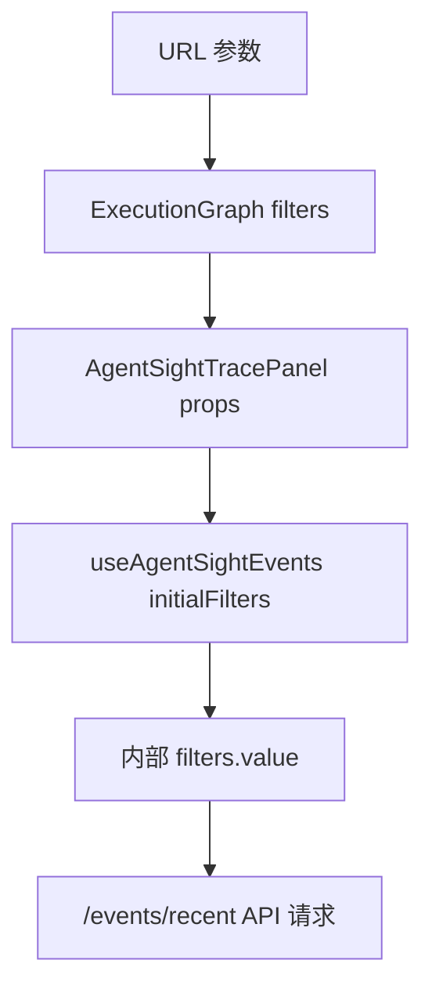

# 执行图行为追踪功能修复

## 问题描述

URL `http://localhost:5173/execution-graph/behavior?limit=600&pid=10159&process_tree=true&timePreset=24h` 无法正确应用 PID 和进程树过滤器到行为追踪面板。

## 根本原因

`AgentSightTracePanel` 组件使用独立的 `useAgentSightEvents` composable，该 composable 有自己的内部 filters 状态，与父组件 `ExecutionGraph.vue` 的 filters 状态完全隔离。

## 修复方案

### 1. 修改 `useAgentSightEvents.ts` composable

**文件**: `frontend/src/composables/agentsight/useAgentSightEvents.ts`

- 添加 `UseAgentSightEventsOptions` 接口，支持初始化 `initialPid` 和 `initialComm` 参数
- 修改 `useAgentSightEvents` 函数签名，接受可选的 options 参数
- 在创建 filters 时，如果提供了初始参数，则将其设置到 filters 中

```typescript
export interface UseAgentSightEventsOptions {
  initialPid?: string | number;
  initialComm?: string;
}

export function useAgentSightEvents(options?: UseAgentSightEventsOptions) {
  // ...
  const initialFilters = defaultFilters();
  if (options?.initialPid) {
    initialFilters.pid = String(options.initialPid);
  }
  if (options?.initialComm) {
    initialFilters.comm = options.initialComm;
  }
  const filters = ref<AgentSightFilters>(initialFilters);
  // ...
}
```

### 2. 修改 `AgentSightTracePanel.vue` 组件

**文件**: `frontend/src/components/agentsight/AgentSightTracePanel.vue`

- 添加 props 定义，接受 `pid` 和 `comm` 参数
- 将 props 传递给 `useAgentSightEvents` composable
- 使用 `watch` 监听 props 变化，动态更新内部 filters

```vue
<script setup lang="ts">
const props = withDefaults(
  defineProps<{
    pid?: number | string | null;
    comm?: string;
  }>(),
  {
    pid: null,
    comm: "",
  },
);

const state = useAgentSightEvents({
  initialPid: props.pid || undefined,
  initialComm: props.comm || undefined,
});

// 监听外部 props 变化并更新内部 filters
watch(
  () => props.pid,
  (newPid) => {
    if (newPid !== null && newPid !== undefined) {
      state.filters.value.pid = String(newPid);
    }
  },
);

watch(
  () => props.comm,
  (newComm) => {
    if (newComm) {
      state.filters.value.comm = newComm;
    }
  },
);
</script>
```

### 3. 修改 `ExecutionGraph.vue` 组件

**文件**: `frontend/src/views/execution-graph/ExecutionGraph.vue`

- 将父组件的 `filters.pid` 和 `filters.comm` 传递给 `AgentSightTracePanel` 组件

```vue
<a-tab-pane key="behavior" tab="行为追踪">
  <AgentSightTracePanel :pid="filters.pid" :comm="filters.comm" />
</a-tab-pane>
```

## 功能说明

修复后，用户可以通过以下方式使用行为追踪的 PID 过滤功能：

### 1. 通过 URL 参数

访问 URL 时直接指定 PID 参数：

```
http://localhost:5173/execution-graph/behavior?pid=10159&limit=600&process_tree=true&timePreset=24h
```

### 2. 通过拓扑图选择进程

1. 在 "执行拓扑" 标签页中，点击 "从进程列表选择" 按钮
2. 选择要监听的进程
3. 勾选 "显示子进程调用树" (可选)
4. 切换到 "行为追踪" 标签页，过滤器会自动应用所选的 PID

### 3. 手动输入过滤器

在 "行为追踪" 标签页的过滤器栏中：
- 直接输入 PID 进行过滤
- 输入命令名称 (comm) 进行过滤

## 技术细节

### 数据流



### 响应式更新

- **初始化**: 通过 `initialPid` 和 `initialComm` 参数设置初始过滤器
- **动态更新**: 通过 `watch` 监听 props 变化，实时同步父组件的过滤器状态
- **双向隔离**: 子组件可以独立修改过滤器，不会影响父组件的状态

## 测试验证

1. 启动开发环境：`make dev`
2. 访问 URL：`http://localhost:5173/execution-graph/behavior?pid=10159`
3. 验证：
   - 行为追踪面板的 PID 过滤器输入框显示 `10159`
   - 事件列表只显示该 PID 相关的事件
   - 修改 URL 中的 PID，刷新页面后过滤器应相应更新

## 相关文件

- `frontend/src/composables/agentsight/useAgentSightEvents.ts`
- `frontend/src/components/agentsight/AgentSightTracePanel.vue`
- `frontend/src/views/execution-graph/ExecutionGraph.vue`

## 后续改进

可考虑添加：
- 进程树展开/折叠功能的同步
- 时间范围过滤器的同步 (timePreset, since, until)
- 其他执行图过滤器的同步 (traceId, toolCallId, agentRunId)

---

## 相关导航

- [前端工作台](frontend/workbench.md)
- [路由与功能页](frontend/routes-and-pages.md)
- [事件管线](backend/event-pipeline.md)
- [AgentSight 项目致谢](reference/agentsight-acknowledgment.md)
- [AgentSight 优化总结](agentsight-optimization-summary.md)
