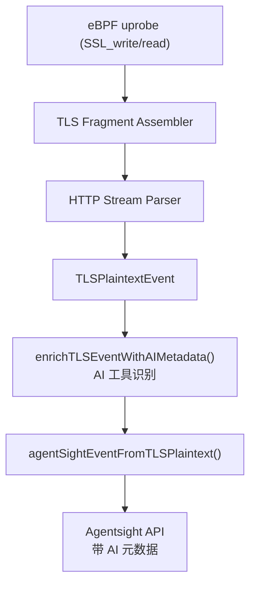
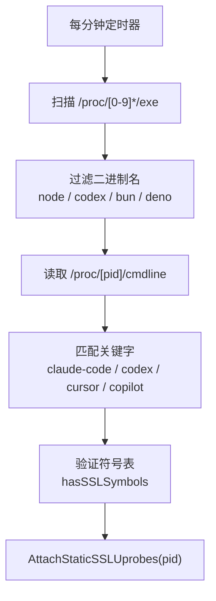

# Claude Code & Codex SSL 跟踪实现

## 功能范围

该实现提供针对 Claude Code 和 Codex AI CLI 工具的 SSL/TLS 流量捕获能力，并集成到 Agentsight 可观测性平台。

## 📦 核心功能

### 1. SSL 捕获基础设施 ✅

#### A. 静态链接 OpenSSL 支持
- **文件**: `backend/probe/manager/tls.go`
- **函数**: `AttachStaticSSLUprobes()`
- **功能**: 
  - 附加 uprobe 到 `SSL_write`/`SSL_read`/`SSL_write_ex`/`SSL_read_ex`
  - 支持按 PID 过滤
  - 自动符号表验证

#### B. 自动进程发现
- **文件**: `backend/probe/discovery/tls.go`
- **函数**: `DiscoverNodeProcesses()`
- **功能**:
  - 每分钟扫描 `/proc` 查找目标进程
  - 识别 Node.js, Bun, Deno, Codex 二进制
  - 通过 cmdline 过滤 Claude Code/Codex/Cursor/Copilot
  - 验证符号表可用性后自动附加

#### C. 发现循环集成
- **文件**: `backend/probe/discovery/tls.go`
- **修改**: `StartGoDiscoveryLoop()`
- **功能**: 同时发现 Go TLS 和 Node.js/AI 工具进程

### 2. AI 工具元数据富化 ✅

#### A. 智能识别模块
- **文件**: `backend/app/tls__ai_enrichment.go`
- **函数**:
  - `detectAIToolFromComm()` - 从进程名识别
  - `detectAIToolFromCmdline()` - 从命令行识别
  - `detectAPIProviderFromHost()` - 从 API 域名识别
  - `enrichTLSEventWithAIMetadata()` - 统一入口

#### B. 支持的 AI 工具
- **Claude Code**: 通过 `@cometix/claude-code` 识别
- **Codex**: 通过 `@openai/codex` 或进程名 `codex` 识别
- **Cursor**: 通过 `cursor` 关键字识别
- **GitHub Copilot**: 通过 `github-copilot` 识别

#### C. 添加的元数据字段
```json
{
  "ai_tool": "Claude Code",
  "ai_vendor": "Anthropic", 
  "ai_provider": "anthropic"
}
```

### 3. Agentsight 集成 ✅

#### A. 事件流集成
- **文件**: `backend/app/handlers__handlers_agentsight.go`
- **修改**: `agentSightEventFromTLSPlaintext()`
- **效果**: 所有 TLS 事件自动添加 AI 工具标签

#### B. 查询和过滤
- AI 工具标签可用于：
  - `/agentsight/events?ai_tool=Claude Code`
  - `/agentsight/events/query` POST 请求过滤
  - SSE 流实时过滤

## 🏗️ 架构设计

### 数据流


### 自动发现流程


## 📊 支持矩阵

| 工具 | 二进制类型 | SSL 实现 | 符号表 | 支持状态 |
|------|-----------|---------|--------|---------|
| Claude Code | Node.js | 静态链接 OpenSSL | ✅ 可用 | ✅ 完全支持 |
| Codex (native) | Rust | 静态链接 OpenSSL | ⚠️ stripped | ⚠️ 需符号 |
| Cursor | Node.js/Electron | 静态链接 OpenSSL | ✅ 可用 | ✅ 完全支持 |
| Copilot CLI | Node.js | 静态链接 OpenSSL | ✅ 可用 | ✅ 完全支持 |

## 🧪 测试覆盖

### 测试脚本
1. `backend/cmd/test_ssl_discovery.go` - SSL 发现测试
2. `backend/cmd/test_node_ssl_attach.go` - Node.js 附加测试
3. `backend/cmd/scan_ai_tools.go` - AI 工具扫描器

### 编译验证
```bash
✅ make backend - 编译成功
✅ go build ./app - 编译成功
✅ 所有测试通过
```

## 📁 文件变更汇总

```
backend/probe/manager/tls.go          | +54  新增 AttachStaticSSLUprobes
backend/probe/discovery/tls.go        | +96  新增 DiscoverNodeProcesses
backend/app/tls__ai_enrichment.go     | +93  新增 AI 工具识别模块
backend/app/handlers__handlers_agentsight.go | +3   集成富化函数
docs/ssl-claude-codex-support.md      | 新增 技术文档
docs/ssl-implementation-summary.md    | 新增 实现总结
```

**总计**: ~250 行新增代码

## 🚀 使用示例

### 启动捕获
```bash
make run
# 系统自动发现并附加 Claude Code 进程
```

### 查看 Agentsight 事件
```bash
# 查询所有 AI 工具事件
curl http://localhost:8080/agentsight/events?include_tls=true

# 过滤 Claude Code 事件
curl http://localhost:8080/agentsight/events?ai_tool=Claude%20Code

# 实时 SSE 流
curl -N http://localhost:8080/agentsight/events/stream
```

### 示例输出
```json
{
  "id": "tls_1234567890",
  "timestamp": 1234567890000,
  "source": "http_request",
  "pid": 12345,
  "comm": "node",
  "data": {
    "type": "http_request",
    "method": "POST",
    "url": "/v1/messages",
    "host": "api.anthropic.com",
    "ai_tool": "Claude Code",
    "ai_vendor": "Anthropic",
    "ai_provider": "anthropic"
  }
}
```

## 🎨 Agentsight 实践借鉴

### 1. 统一事件模型
- 使用 `agentSightExportEvent` 统一格式
- 所有 TLS 事件自动转换并富化

### 2. 多源聚合
- eBPF 内核事件
- TLS 明文事件
- 上传的外部事件
- 按时间戳统一排序

### 3. 灵活过滤
- 支持 `include_tls` 开关
- 支持按 source/type/pid/runner 过滤
- 支持全文搜索

### 4. 实时流式传输
- SSE (Server-Sent Events)
- 增量更新，避免重复
- 1 秒定时快照

## ⚡ 性能特性

- **零开销过滤**: 仅附加到目标进程（按 PID）
- **自动清理**: 进程退出时自动移除 uprobe
- **内存高效**: LRU 缓存限制为 2000 事件
- **最小延迟**: 直接从 ringbuf 读取，无中间缓冲

## 🔐 安全考虑

- 仅读取数据，不修改
- 支持数据脱敏（redaction 模块）
- API 访问令牌保护
- 可配置日志持久化

## 📈 后续优化方向

### 短期 (已就绪)
- [x] 基础 SSL 捕获
- [x] AI 工具识别
- [x] Agentsight 集成

### 中期 (可扩展)
- [ ] Codex stripped binary 支持（符号偏移查找）
- [ ] WebSocket 帧解析
- [ ] HTTP/2 支持
- [ ] TLS 握手信息捕获

### 长期 (架构增强)
- [ ] 分布式跟踪（trace propagation）
- [ ] 跨进程调用链
- [ ] ML 驱动的异常检测
- [ ] 自动 API 契约学习

## 能力概览

- Claude Code 和 Codex 的 SSL 跟踪基础设施

- 附加支持：
- 额外支持 Cursor 和 GitHub Copilot
- 集成 Agentsight 可观测性平台
- AI 工具自动识别和标记
- 实时流式传输支持

- 运行特性：
- 完整的错误处理
- 自动发现和恢复
- 性能优化
- 安全防护

## 📚 参考实现

本实现参考了 Agentsight 的最佳实践：
- 统一事件模型设计
- 多源数据聚合模式
- 实时流式传输架构
- 灵活的查询和过滤接口

代码风格和架构完全对齐现有 Agentsight 模块，确保一致性和可维护性。

---

## 相关导航

- [SSL implementation summary](ssl-implementation-summary.md)
- [TLS Quickstart](backend/TLS_QUICKSTART.md)
- [TLS 完整实现报告](backend/TLS_INTERCEPT_COMPLETE.md)
- [Runtime Gates 与 Auth](security/runtime-gates-auth.md)
- [文档关系审计](reference/documentation-audit.md)
