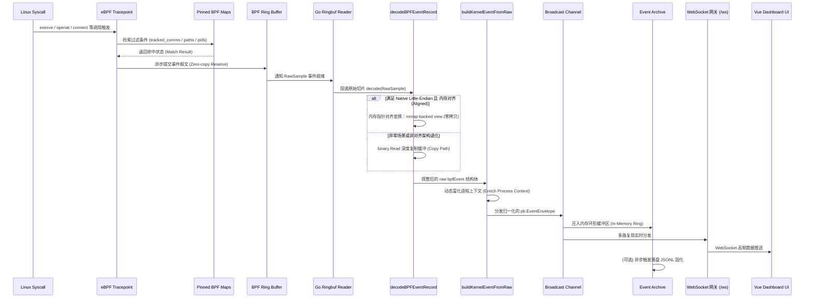
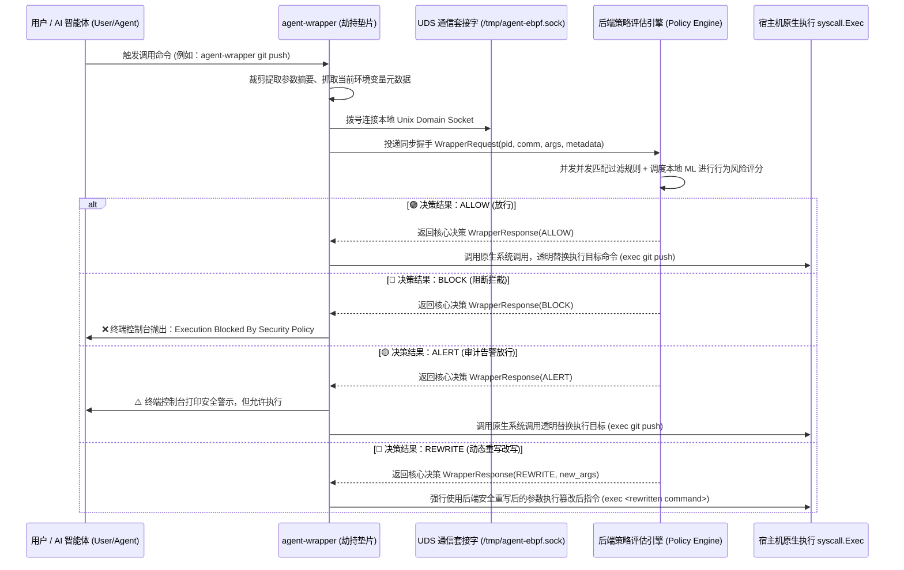
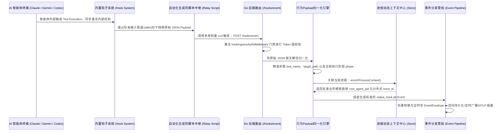
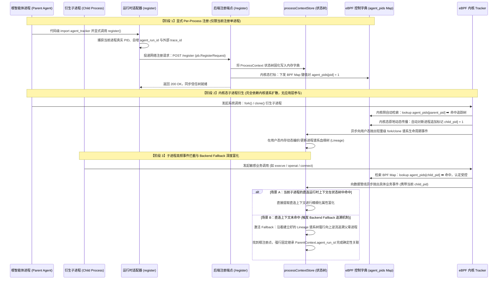
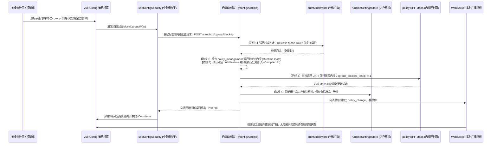
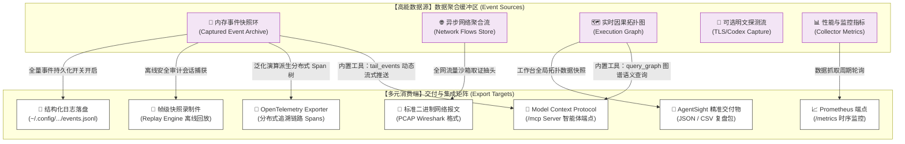

# 🌊 数据流管线全景

本篇深度解析 **Agent eBPF Filter** 的五维核心数据流向：**内核事件流、Wrapper 策略流、Native Hook 语义流、前端配置流以及多元导出流**。通过系统级时序与因果拓扑，向开发者展示用户态语义流如何与内核态客观事实进行高频、安全的交叉验证。

## 1. eBPF 内核事件流 (数据热路径)

内核事件流是系统的核心数据动脉，负责将高频发生的 Linux 系统调用（Syscalls）免拷贝、异步地泵入用户态后端，直至在前端工作台完成虚拟化瀑布流渲染。



### 🔬 核心底控：Ringbuf 零拷贝解码机制

后端在 `decodeBPFEventRecord()` 热路径中实施了极致的性能压榨。在常见的 `x86_64`（小端、天然内存对齐）Linux 环境下，系统直接通过 `unsafe.Pointer` 进行指针对齐变换，消除应用层二次拷贝成本：

```go
func decodeBPFEventRecord(sample []byte) (*bpfEvent, error) {
    if len(sample) < minEventSize {
        return nil, ErrTooShort
    }

    // 黄金热路径：判断系统是否为标准小端架构且内存首地址天然对齐
    if isNativeLittleEndian && isAligned(sample) {
        // 【高性能零拷贝】通过指针直接将宿主机内存映射为结构体 View
        evt := (*bpfEvent)(unsafe.Pointer(&sample[0]))
        collectorMetricsStore.RecordRingbufDecode(true)
        return evt, nil
    }

    // 降级软路径：跨平台或错位数据退化到标准内存复制
    evt := &bpfEvent{}
    if err := binary.Read(bytes.NewReader(sample), binary.LittleEndian, evt); err != nil {
        return nil, err
    }
    collectorMetricsStore.RecordRingbufDecode(false)
    return evt, nil
}

```

#### 📌 关键源码入口

- **内核探针端**：`backend/ebpf/agent_tracker.c`、`backend/ebpf/agent_tracker_common.h`
- **常驻消费端**：`backend/app/runtime__jobs_background.go`
- **上下文聚合**：`backend/app/events__context_event.go`、`backend/app/events__graph_execution.go`
- **协议描述符**：`proto/tracker_events.proto`

## 🛡️ 2. Wrapper 命令策略流 (同步安全阻断)

Wrapper 作为命令拦截垫片（Shim），在 AI CLI 发起执行的“前置毫秒级”切入。它并非传统的沙盒（Sandbox），而是针对指定暴露的命令实施硬干预的策略控制层。



## 3. Native Hook 语义流 (应用层富化)

eBPF 只能捕获底层的系统调用事实，而 Native Hooks 则是 AI 框架的“眼睛”。它负责主动向后端上报更高级别的大模型语义（如：Tool 名、Prompt 上下文），帮助系统完成“因果链”拼图。



## 🆔 4. PID Registration 信任树拓扑流 (生命周期关联)

> 🚨 **高频概念防错说明**
> 注册语义是**严格 Per-Process（单进程）**的显式声明。后代进程的追踪与关联并非依靠 Adapter 自动递归调用，而是依赖**内核态 fork/clone 谱系扩散**配合**后端 Fallback 追溯机制**完美闭环，请严格区分它们的职责边界。



## ⚙️ 5. 前端配置与策略下发流 (控制闭环)

当安全管理员或 AI 系统在 Vue Workbench 上进行控制变更（例如：动态封禁某 IP 行为）时，控制流必须突破五道防线，才能最终热加载注入内核态：



## 📤 6. 多维导出分流矩阵

全归一化后的数据资产拥有完整的多元分流导出管线，通过模块化解耦，同时兼顾人类可读性（UI/JSONL）、系统排查取证（PCAP）以及 AI 协议集成（MCP）：



### 📊 分流策略核心映射参考矩阵

| 导出通道名称               | 数据源头 (From)               | 物理流向目标 (To)                          | 核心应用场景与生产价值                                                                 |
| -------------------------- | ----------------------------- | ------------------------------------------ | -------------------------------------------------------------------------------------- |
| **JSONL Persistence**      | `CapturedEventArchive` 内存环 | `~/.config/agent-ebpf-filter/events.jsonl` | 本地安全合规审计，长期无损历史事件冷增量固化。                                         |
| **Event Recording**        | 事件流快照 / 拓扑图帧         | 文件系统流化件或浏览器 Memory              | 针对高危黑客攻防、恶意脚本破坏过程的“帧级”重现与复盘。                                 |
| **Network Export**         | L4/L7 异步 Flow 存储字典      | 结构化 JSONL 或标准二进制 `.pcap` 报文     | 用于网络侧流量特征二次深度挖掘与标准 WireShark 工具链取证。                            |
| **AgentSight Export**      | `EventEnvelope` 统一上下文    | 标准多维 JSON / 结构化 CSV 格式            | 提供跨团队安全分析报告的高效转换，方便报表化交付。                                     |
| **OpenTelemetry**          | 归一化系统调用离散事实        | 注册的外部远程 OTLP 采集网关               | 将底层的系统行为泛化，向上折叠为企业级 `agent.run` 分布式链路 Spans。                  |
| **Prometheus**             | 系统监测器 / 控制器指标       | 宿主机只读探针端点 `/metrics`              | 对接 Grafana 仪表盘，长期监控拦截成功率、延迟及环形缓冲溢出度。                        |
| **Model Context Protocol** | 后端全量配置与行为拓扑        | HTTP 可流化 `/mcp` 协议端点                | 将控制面降维为标准的 Tools 集合，允许外部大模型（如 Cursor）通过指令自主决策阻断状态。 |

## 🔗 相关导航

- 🗺️ [总体架构](overview.md) —— 解构项目 L0-L5 分层设计依赖视图
- 🚰 [事件管线](../backend/event-pipeline.md) —— 详解从内核空间到用户空间的数据降噪算法
- 🧬 [协议与事件模型](protocol-events.md) —— 查看全量 Protobuf 序列化定义规范
- 🖥️ [前端工作台](../frontend/workbench.md) —— 掌握大并发实时事件流下的前端零防抖虚拟化渲染实现
- 🔌 [MCP、External API 与 OTLP](../integrations/mcp-external-otlp.md) —— 分离路径下智能体协议网关的双向握手细节说明
