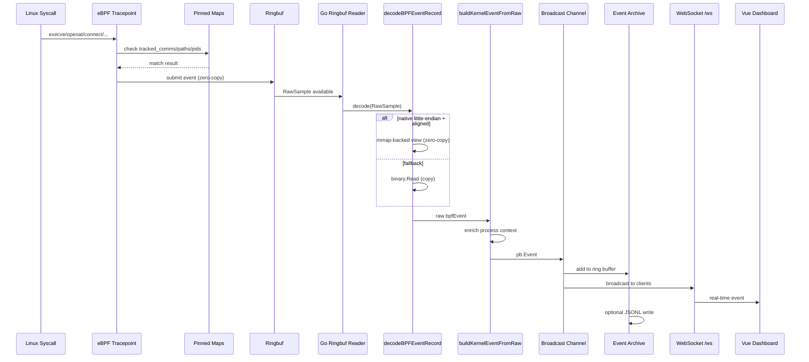
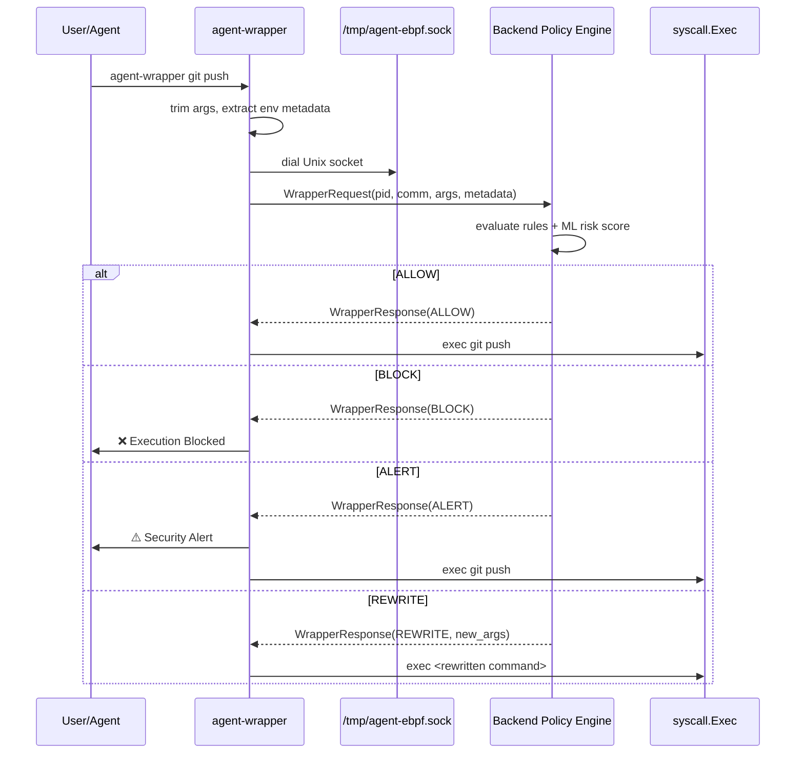
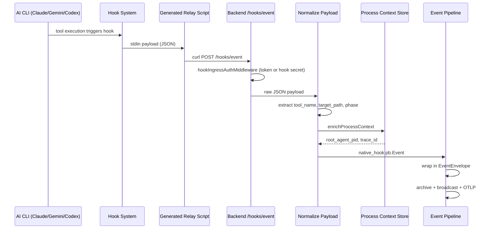
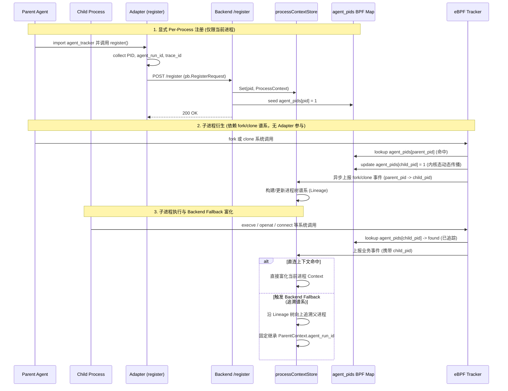
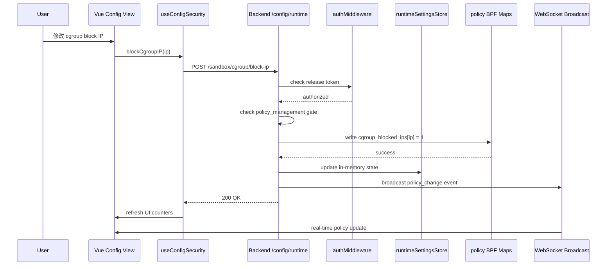
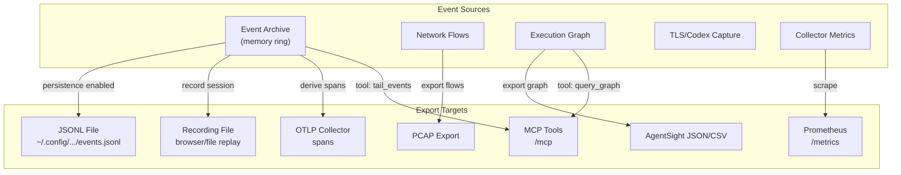

# 数据流

本页描述 Agent eBPF Filter 的核心数据流：内核事件流、wrapper 策略流、native hook 流、前端配置流、导出流。

## eBPF 事件流



关键文件：

- `backend/ebpf/agent_tracker.c`
- `backend/ebpf/agent_tracker_common.h`
- `backend/app/runtime__jobs_background.go`
- `backend/app/events__context_event.go`
- `backend/app/events__graph_execution.go`
- `proto/tracker_events.proto`

### ringbuf decode

后端 `decodeBPFEventRecord()` 会优先将 ringbuf RawSample 解释为 mmap-backed `bpfEvent` view：

```go
// 伪代码示例
func decodeBPFEventRecord(sample []byte) (*bpfEvent, error) {
    if len(sample) < minEventSize {
        return nil, ErrTooShort
    }
    
    // 条件：native little-endian + alignment
    if isNativeLittleEndian && isAligned(sample) {
        // zero-copy: 直接构造 view
        evt := (*bpfEvent)(unsafe.Pointer(&sample[0]))
        collectorMetricsStore.RecordRingbufDecode(true)
        return evt, nil
    }
    
    // fallback: copy path
    evt := &bpfEvent{}
    if err := binary.Read(bytes.NewReader(sample), binary.LittleEndian, evt); err != nil {
        return nil, err
    }
    collectorMetricsStore.RecordRingbufDecode(false)
    return evt, nil
}
```

这使热路径在常见 Linux x86_64 环境下减少复制成本，同时保留跨平台 fallback。

## Wrapper 策略流



Wrapper 是命令 shim / policy layer。它不是完整 sandbox；它只覆盖经 wrapper 调用的命令路径。

## Native Hook 流



Hooks 的价值是提供 AI CLI 语义，例如工具名、目标路径、摘要、长度和 hook phase。eBPF 仍提供系统事实。

## PID Registration 流



注册语义是 per-process。子进程关联依赖 fork/clone lineage 与 backend fallback，不应描述成 adapter 自动递归注册所有后代。

## 前端配置流



示例：Config Security 页面操作 cgroup / LSM policy 时，需要：

1. release mode token；
2. policy management runtime gate；
3. 对应 build feature compiled in；
4. 后端 API 写入 map；
5. UI 刷新 status / counters。

## 导出流




| 导出 | 源 | 目标 |
| --- | --- | --- |
| JSONL persistence | CapturedEventArchive | `~/.config/agent-ebpf-filter/events.jsonl` |
| Event recording | event archive / graph snapshots | file-backed 或 browser-memory replay |
| Network export | flow store | JSONL / PCAP |
| AgentSight export | EventEnvelope / TLS / metrics | JSON / JSONL / CSV |
| OTLP | derived spans | OTLP HTTP endpoint |
| Prometheus | collector/system metrics | `/metrics` |
| MCP | config/event APIs | `/mcp` streamable HTTP |

---

## 相关导航

- [总体架构](overview.md)
- [事件管线](../backend/event-pipeline.md)
- [协议与事件模型](protocol-events.md)
- [前端工作台](../frontend/workbench.md)
- [MCP、External API 与 OTLP](../integrations/mcp-external-otlp.md)
