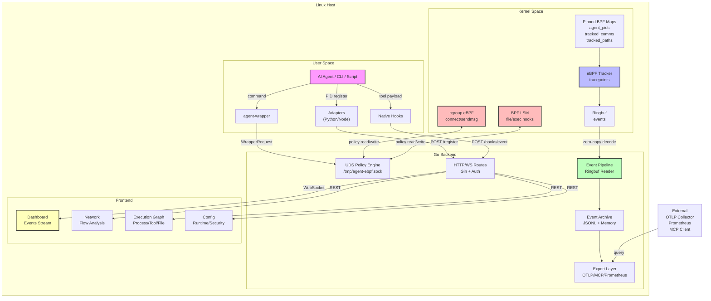
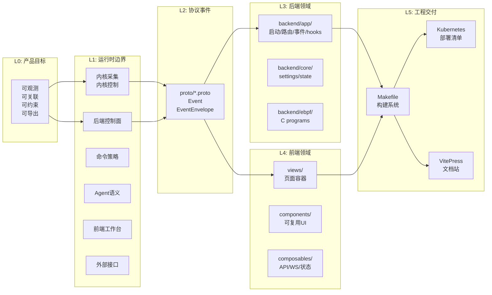

# 总体架构

Agent eBPF Filter 的架构可以按 L0–L5 六层理解：从产品目标到运行时边界，再到协议事件、后端领域、前端领域和工程交付。

## L0：产品目标层

目标是为 AI Agent、开发者 CLI 和本地自动化脚本提供 **可观测、可关联、可约束、可导出** 的 OS 行为证据链。

```text
AI Agent / Developer CLI
  → 实际命令、文件、网络、进程行为
  → 关联 tool call / trace / run metadata
  → 可视化与导出
  → 用户态或内核态策略控制
```

## L1：运行时边界层

运行时由多个边界组成：

| 边界 | 组件 | 责任 |
| --- | --- | --- |
| 内核采集 | eBPF tracepoints、ringbuf、pinned maps | 捕获系统调用事实 |
| 内核控制 | cgroup eBPF、BPF LSM | 阻断网络目标、文件和执行 |
| 后端控制面 | Go backend / Gin / WebSocket | 聚合事件、管理配置、认证、策略、导出 |
| 命令策略 | `agent-wrapper` + UDS | ALLOW / BLOCK / ALERT / REWRITE |
| Agent 语义 | adapters、native hooks | PID 注册、tool metadata、trace context |
| 前端工作台 | Vue 3 + Vite | 实时展示、配置、安全策略、图谱 |
| 外部接口 | MCP、OTLP、Prometheus、External API | 查询、导出、集成 |

## L2：协议与事件层

协议源头是 `proto/`：

- `tracker.proto`：聚合 import；
- `tracker_common.proto`：通用类型；
- `tracker_events.proto`：统一事件模型；
- `tracker_registration.proto`：PID 注册；
- `tracker_config.proto`：runtime / security / ML config；
- `tracker_shell.proto`：shell sessions；
- `tracker_system.proto`：系统指标。

生成物分布在：

- `backend/pb/*.pb.go`
- `frontend/src/pb/*`
- `adapters/python/tracker_*_pb2.py`
- `adapters/js/tracker_pb.js`

## L3：后端领域层

当前后端实现已经大量迁移到 `backend/app/` 和 `backend/core/`：

| 领域 | 当前入口 |
| --- | --- |
| 启动链 | `backend/app/main.go` |
| 路由注册 | `backend/app/routes__routes.go` |
| runtime settings | `backend/core/state_types.go` |
| feature manifest | `backend/app/feature_manifest.go` |
| ringbuf / background jobs | `backend/app/runtime__jobs_background.go` |
| eBPF runtime | `backend/app/runtime__runtime_ebpf.go`、`backend/ebpf/*` |
| 事件上下文 | `backend/app/events__context_event.go` |
| Execution Graph | `backend/app/events__graph_execution.go` |
| Network | `backend/app/events__events_network.go`、`backend/app/events__event_flows.go` |
| Hooks | `backend/app/hooks__hooks.go`、`backend/app/hooks__kiroantigravityhooks.go` |
| Config handlers | `backend/app/handlers__handlers_config.go` 等 |
| Plugins | `backend/app/handlers__handlers_plugin.go`、`backend/app/plugin*` |
| ML | `backend/app/ml__*.go`、`backend/ml/` |

::: warning 历史路径提醒
部分旧文档仍写 `backend/main.go`、`backend/routes.go`、`backend/features.go`。当前代码的实际入口多位于 `backend/app/*.go` 和 `backend/core/*.go`。维护文档时应优先核验当前路径。
:::

## L4：前端领域层

前端位于 `frontend/src/`，采用 Vue 3 + `<script setup lang="ts">` + Vite。

```text
frontend/src/
  main.ts
  App.vue
  router/index.ts
  views/
  components/
  composables/
  types/
  data/
  utils/
  pb/   # generated
```

路由级 feature meta 会将未编译进前端 build 的页面导向 `FeatureUnavailable`。

## L5：工程交付层

| 类型 | 入口 |
| --- | --- |
| 构建 | `Makefile` |
| 开发环境 | `make predev`、`make dev`、`tools/dev-env-tui/` |
| devcontainer | `.devcontainer/`、`make exec` |
| 安装 | `make install`、`scripts/install-service.sh` |
| 部署 | `deploy/kubernetes/` |
| benchmark | `docs/benchmark.md`、`benchmarks/`、`make runtime-benchmark` |
| 文档站 | `docs/.vitepress/config.ts`、`docs/**/*.md` |

## 总架构图



## 分层视图



---

## 相关导航

- [数据流](data-flow.md)
- [运行时边界](runtime-boundaries.md)
- [协议与事件模型](protocol-events.md)
- [代码入口索引](../reference/code-entrypoints.md)
- [项目结构深挖](../project-structure-deep-dive.md)
