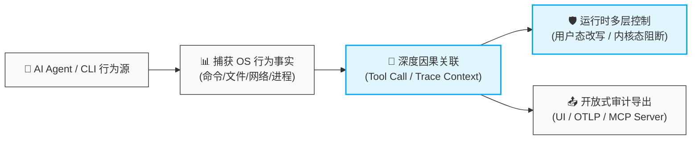
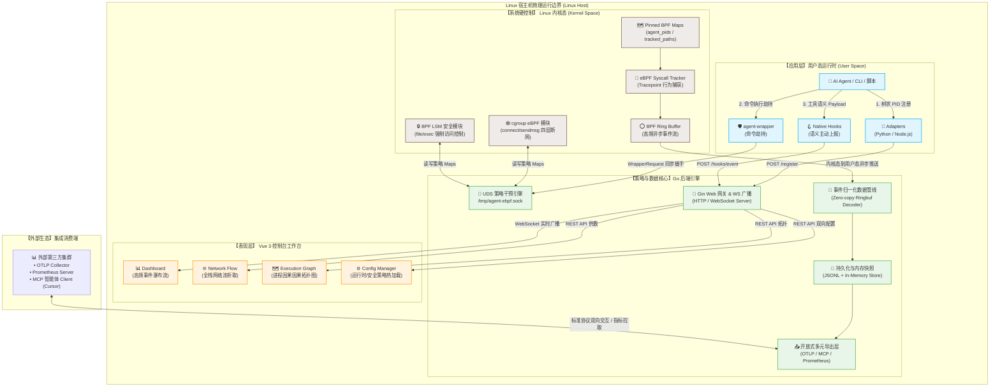
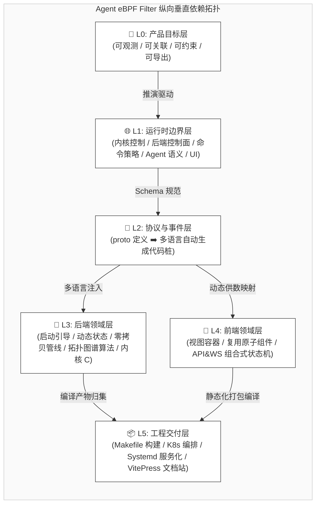

# 🗺️ 总体架构

Agent eBPF Filter 的宏观架构遵循 **L0–L5 六层深度解耦设计**。从最顶层的“产品战略目标”向下延伸，贯穿运行时边界、通信协议、后端领域引擎、前端微视窗，直至底层的自动化工程交付流水线。

## 🎯 L0：产品目标层

核心目标是为 **AI Agent、开发者 CLI、本地自动化脚本** 提供一套具备 **可观测、可关联、可约束、可导出** 能力的 OS 级别全行为全时空证据链。



## 🌐 L1：运行时边界层

系统运行时由七个清晰的核心边界相互协作，共同围合成完整的纵深防御与审计网：

| 运行时边界       | 核心组件                                          | 关键职责边界                                                        |
| ---------------- | ------------------------------------------------- | ------------------------------------------------------------------- |
| **内核采集面**   | eBPF Tracepoints, Kernel Ringbuf, Pinned BPF Maps | 零侵入、高性能地捕获底层系统调用（Syscall）客观事实。               |
| **内核控制面**   | cgroup eBPF, BPF LSM 安全模块                     | 实施网络四层流量、敏感文件系统及进程执行的毫秒级硬阻断。            |
| **后端控制面**   | Go Backend Core, Gin Engine, WebSocket Server     | 负责高频事件汇聚归一化、全景状态管理、策略下发、动态认证。          |
| **命令策略面**   | `agent-wrapper`, Unix Domain Socket (UDS)         | 拦截应用层指令，执行 `ALLOW` / `BLOCK` / `ALERT` / `REWRITE` 决策。 |
| **Agent 语义面** | Process Adapters, Native Hooks Relay              | 绑定 PID 信任树，注入 Tool Metadata 元数据及大模型 Trace 上下文。   |
| **前端工作台**   | Vue 3, Vite, Pinia 状态机                         | 提供大并发实时事件流瀑布、因果拓扑图谱、策略可视化编排。            |
| **外部生态接口** | MCP Server, OTLP Exporter, Prometheus Metrics     | 对接 AI 新型 IDE（Cursor 等）、分布式链路追踪及标准监控看板。       |

## 📑 L2：协议与事件层

全站的通信数据结构与序列化源头严格收敛于 `proto/` 目录，通过强类型 Schema 保证跨语言体系的物理边界一致性：

### 🧬 Protocol Buffer 核心定义

- **`tracker.proto`**：顶层网关桩文件，统筹聚合全量子模块的 Import。
- **`tracker_common.proto`**：定义通用元数据、进程树凭证及基础类型基架。
- **`tracker_events.proto`**：统一事件模型，规整高频归一化的系统调用与网络事件。
- **`tracker_registration.proto`**：处理 AI Agent 动态生命周期中的 PID 树注册信任协议。
- **`tracker_config.proto`**：定义运行时门控（Runtime Gates）、安全阻断字典及 ML 评分配置。
- **`tracker_shell.proto`**：承载 PTY 交互式 Shell 远程会话的流式通信控制。
- **`tracker_system.proto`**：宿主机 CPU、内存、GPU 及系统级常规遥测指标 Schema。

### 📦 多语言自动生成桩（Generated Artifacts）

每次协议变更后，编译工具链会自动向各端精准派生静态代码：

- **Go Backend** ➡️ `backend/pb/*.pb.go`
- **Vue Frontend** ➡️ `frontend/src/pb/*`
- **Python Adapter** ➡️ `adapters/python/tracker_*_pb2.py`
- **Node.js Adapter** ➡️ `adapters/js/tracker_pb.js`

## 🦀 L3：后端领域层

后端架构基于领域驱动设计（DDD）演进，核心引擎与业务逻辑均收敛于 `backend/app/` 和 `backend/core/` 目录，实现了高内聚的管道式设计：

| 后端核心领域           | 实际源文件入口位置                         | 职责内涵说明                                        |
| ---------------------- | ------------------------------------------ | --------------------------------------------------- |
| **系统引导启动链**     | `backend/app/main.go`                      | 负责特权级校验、环境基架审计及服务平滑引导。        |
| **路由与 API 注册**    | `backend/app/routes__routes.go`            | 统筹传统 REST 接口、实时 WebSocket 及高级认证门禁。 |
| **运行时内存状态**     | `backend/core/state_types.go`              | 维护并发安全、高可用的 Runtime 动态配置锁。         |
| **特性清单宣告**       | `backend/app/feature_manifest.go`          | 宣告编译期与运行期的 Feature 矩阵，实现模块解耦。   |
| **异步内核环形缓冲区** | `backend/app/runtime__jobs_background.go`  | 高效调度 Ringbuf Reader 与后台常驻审计消费协程。    |
| **eBPF 内核空间联动**  | `backend/app/runtime__runtime_ebpf.go`<br>`backend/ebpf/*` | 加载编译后的 BPF C 字节码，固定 Links 并双向维护 Maps。 |
| **事件归一化上下文** | `backend/app/events__context_event.go` | 组装 Process 与 Syscall 上下文，将其拼装为 EventEnvelope。 |
| **Execution Graph** | `backend/app/events__graph_execution.go` | 动态构建并裁剪网状的行为因果拓扑图谱算法。 |
| **网络流异步聚合** | `backend/app/events__events_network.go`<br>`backend/app/events__event_flows.go` | 汇聚 L4 原始连接，富化 DNS/SNI 元数据，生成网络 Flows。 |
| **自动化挂钩中心** | `backend/app/hooks__hooks.go`<br>`backend/app/hooks__kiroantigravityhooks.go` | 运维与检测应用层主动上报钩子的健康度状态。 |
| **可视化配置处理器** | `backend/app/handlers__handlers_config.go` 等 | 承接前端手动修改或策略热加载的下发网关。 |
| **动态插件加载层** | `backend/app/handlers__handlers_plugin.go`<br>`backend/app/plugin*` | 提供自定义 BPF 逻辑或伪代码编译器的热注入通道。 |
| **AI 异常推理核心** | `backend/app/ml__*.go`<br>`backend/ml/` | 调度轻量化本地推理模型，进行行为风险评分与反馈回路。 |

> ⚠️ **历史路径重要防错纠偏提示**
> 在进行旧版本文档迁移或重构时请务必注意：部分早期设计文档中残存的 `backend/main.go`、`backend/routes.go`、`backend/features.go` 路径已**彻底作废**。当前的实际物理入口严格收敛于 `backend/app/*.go` 和 `backend/core/*.go`。在提 PR 维护文档时，**请优先核验当前最新的物理路径**。

## 🎨 L4：前端领域层

前端控制台工程深嵌于 `frontend/src/`，全面拥抱 **Vue 3 单文件组件（SFC）**、**`<script setup lang="ts">` 组合式语法糖** 与 **Vite 极速构建引擎**：

```text
frontend/src/
  ├── main.ts             # 视图层全局初始化总入口
  ├── App.vue             # 根视图外壳容器
  ├── router/index.ts     # 动态路由门控与权限守护
  ├── views/              # 视窗级大容器（Dashboard、Network、Graph 等）
  ├── components/         # 原子级/块级可复用 UI 高性能组件
  ├── composables/        # 核心业务逻辑抽离：API 请求、WS 订阅、全域状态机
  ├── types/              # 纯前端视图特有类型定义字典
  ├── data/               # 静态配置、内置元数据常量
  ├── utils/              # 纯函数、时空转换工具集
  └── pb/                 # 【自动生成】符合原生的 Protobuf TS 桩文件

```

> 💡 **动态特性裁剪（Feature Flag Integration）**：
> 前端路由层内建了精密的 Feature Meta 守卫。当检测到后端 Feature Manifest 中某项高级能力未在本次编译构建中激活时，路由会自动将页面重定向至 `FeatureUnavailable` 占位视窗，杜绝前端越权操作。

## 📦 L5：工程交付层

项目通过工业级的自动化脚本和工程配置，保障了全生命周期的全自动就绪与可重复交付：

| 工程交付分类     | 核心入口或脚本位置 | 构建与集成职能                                                     |
| ---------------- | ------------------ | ------------------------------------------------------------------ |
| **统一编译系统** | `Makefile`         | 统筹全量及分项组件（Proto、Kernel、Backend、Frontend）的单核构建。 |
| **一键开发就绪** | `make predev`<br>`make dev`<br>`tools/dev-env-tui/` | 并行拉取全栈依赖，拉起热加载引擎，调动控制台 TUI 监控界面。 |
| **标准容器沙箱** | `.devcontainer/`<br>`make exec` | 保证在非 Linux 主机上开发时，内核头文件及 Clang 工具链的一键装箱。 |
| **宿主系统集成** | `make install`<br>`scripts/install-service.sh` | 注册 Systemd 守护进程，平滑处理古老环境向 `rc.local` 的退化挂载。 |
| **云原生集群编排** | `deploy/kubernetes/` | 提供特权 DaemonSet 清单，适配大规模云端智能体监控集群。 |
| **基准与效能测试** | `docs/benchmark.md`<br>`benchmarks/`<br>`make runtime-benchmark` | 执行高并发 Ringbuf 吞吐压测、内存对齐开销度量及拦截时延审计。 |
| **现代化文档体系** | `docs/.vitepress/config.ts`<br>`docs/**/*.md` | 驱动高响应式的全量技术演进与架构设计说明站。 |

## 📐 总架构图

项目的全功能链路及双轨制内核拦截拓扑图如下所示：



## 🥞 分层依赖视图

六层设计之间的单向依赖与协同拓扑逻辑如下所示：



## 🔗 相关导航

- 🌊 [数据流](data-flow.md) —— 内核 Ringbuf 解码至前端虚拟化渲染时序
- 🧱 [运行时边界](runtime-boundaries.md) —— 详解各组件的安全防护隔离圈
- 🧬 [协议与事件模型](protocol-events.md) —— 原生 Protobuf 序列化细节与事件封包定义
- 📂 [代码入口索引](../reference/code-entrypoints.md) —— 快速核对文档中提及的底层核心函数
- ⛏️ [项目结构深挖](../project-structure-deep-dive.md) —— 跨越 C、Go、TS 的多语言目录工程组织规范