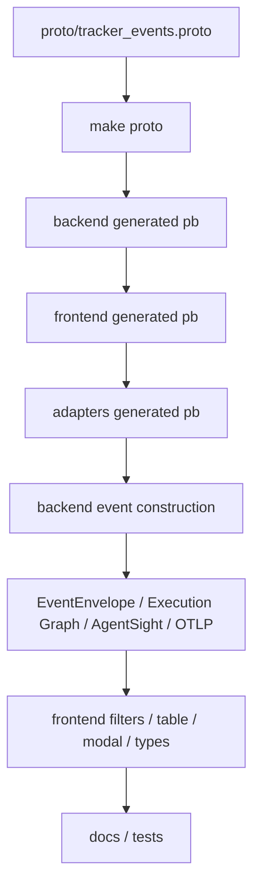
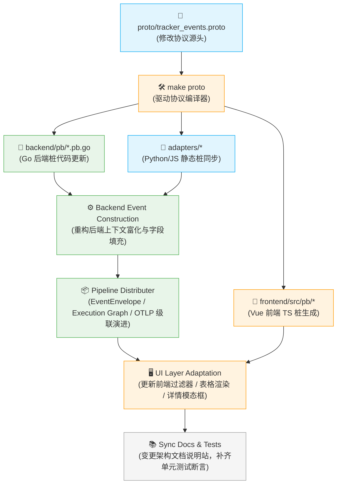

# 协议与事件模型

协议层是本项目跨 Go 后端、Vue 前端、adapters 和外部集成的一致性源头。

## Proto 文件分工

| 文件 | 作用 |
| --- | --- |
| `proto/tracker.proto` | 聚合 import，保持下游兼容 |
| `proto/tracker_common.proto` | 通用类型 |
| `proto/tracker_events.proto` | Event、EventEnvelope、各种 payload、event enum |
| `proto/tracker_registration.proto` | register / unregister |
| `proto/tracker_config.proto` | config / runtime / security / ML |
| `proto/tracker_shell.proto` | shell session |
| `proto/tracker_system.proto` | system stats / runtime system |

## Event 基础字段

`proto/tracker_events.proto` 中 `Event` 是统一事实记录，包含：

- 进程：`pid`、`ppid`、`uid`、`gid`、`tgid`、`comm`；
- syscall：`type`、`event_type`、`retval`、`duration_ns`、`extra_info`；
- 文件：`path`、`extra_path`、`mode`、`bytes`；
- 网络：`flow_id`、`src_ip`、`dst_ip`、`dst_port`、`transport`、`dns_name`、`sni`、`http_host`、`tls_alpn`；
- Agent 语义：`root_agent_pid`、`agent_run_id`、`task_id`、`tool_call_id`、`tool_name`、`trace_id`、`span_id`、`cwd`；
- 策略：`decision`、`risk_score`、`behavior`；
- 隐私：`argv_digest`、`redaction_level`、`sanitized_fields`；
- 网络统计：bytes / packets / first_seen / last_seen / geo / scope。

## EventEnvelope

EventEnvelope 将不同来源的事件统一包装，用于：

- `/ws/envelopes`；
- `/events/graph`；
- AgentSight import/export/query.
- OTLP span derivation.
- recording / replay；
- external API compatibility.

Envelope 语义上包含：

- schema version.
- timestamp；
- source；
- event id.
- legacy event.
- typed payload oneof.
- process / tool / trace context.

## 新增事件字段时必须同步：

## - 不复用已发布字段号；
- 新字段尽量 optional / additive；
- JSONL persistence 应兼容旧数据；
- generated files 不手改；
- `tracker.proto` 保持聚合入口，不承载领域细节。

## - [数据流](data-flow.md)
- [事件管线](../backend/event-pipeline.md)
- [生成文件边界](../reference/generated-files.md)
- [前端组件与 Composables](../frontend/components-composables.md)
- [代码入口索引](../reference/code-entrypoints.md)
# 🧬 协议与事件模型

协议层作为全站的**一致性源头**（Single Source of Truth），横跨 Go 后端、Vue 前端、语言适配器（Adapters）以及外部生态集成。通过强类型的契约 Schema，项目从根本上保证了高频内核事件在跨语言、跨架构传输中的结构确定性与解析高效性。

## 1. Proto 文件分工与职责

所有传输层协议的基石都收敛于 `proto/` 目录中，各组件分工明确，形成了松耦合的 Schema 矩阵：

| 协议定义文件 | 🧱 核心覆盖领域与职责边界 |
| --- | --- |
| **`proto/tracker.proto`** | **全网总参桩**。仅负责聚合（Import）下游子协议模块，对外部网关和基础工具链暴露统一编译入口，保持架构的长期后向兼容，自身不承载任何业务领域细节。 |
| **`proto/tracker_common.proto`** | **公用类型字典**。定义跨模块复用的基础结构体（如唯一标识、基础元数据、通用错误码等）。 |
| **`proto/tracker_events.proto`** | **事件模型核心**。全站最核心的定义文件，规整归一化 `Event`、全时空包装器 `EventEnvelope`、各种敏感诊断 Payload 以及全局状态/事件枚举（Enums）。 |
| **`proto/tracker_registration.proto`** | **生命周期同步**。定义 AI Agent 启动时的动态 PID 注册（Register）与消亡注销（Unregister）握手协议。 |
| **`proto/tracker_config.proto`** | **控制面安全策略定义**。承载运行时门控（Runtime Gates）、三层控制策略字典、机器学习评分模型参数等配置 Schema。 |
| **`proto/tracker_shell.proto`** | **流式会话协议**。驱动底层 PTY 交互式远程 Shell 会话与终端状态机的流式双向传输规约。 |
| **`proto/tracker_system.proto`** | **常规指标拓扑**。统筹宿主机 CPU、内存、GPU、磁盘 IO 等传统可观测性时序遥测指标。 |

## 2. Event 统一事实记录字段

`proto/tracker_events.proto` 中定义的 `Event` 结构体是过滤器捕获的**系统唯一客观事实记录**。为了在全景复盘时消除信息孤岛，单个事件包多维交织了以下八类属性：

* **🧑‍🌾 进程基础凭证（Identity Context）**：精准锚定事件发起者，包含 `pid`、父进程 `ppid`、用户 `uid`、用户组 `gid`、线程组 `tgid` 以及进程名 `comm`。
* **⚡ 系统调用事实（Syscall Context）**：捕获系统级动作，包含系统调用类型 `type`、细分事件 `event_type`、内核返回值 `retval`、内核态耗时纳秒数 `duration_ns` 及附加动态扩展属性 `extra_info`。
* **💾 文件系统轨迹（File Context）**：审计 I/O 边界，包含目标文件绝对路径 `path`、变更关联路径（如重命名目标）`extra_path`、访问权限模式 `mode` 以及单次读写吞吐字节数 `bytes`。
* **🌐 全栈网络属性（Network Context）**：解构流量边界，包含流唯一标识 `flow_id`、四层源/目的 IP 地址（`src_ip`/`dst_ip`）、目的端口 `dst_port`、传输层协议 `transport`，以及七层深度富化的 `dns_name`、`sni` 握手标识、HTTP 报头 `http_host` 与 TLS 协商层的 `tls_alpn`。
* **🤖 AI 智能体语义（Agent Semantic Context）**：因果链核心，包含绑定的根智能体 `root_agent_pid`、运行实例唯一标识 `agent_run_id`、任务序列 `task_id`、当前 Tool Call 标识 `tool_call_id`、工具别名 `tool_name` 以及分布式链路追踪的 `trace_id`、`span_id` 和当前执行工作目录 `cwd`。
* **🛡️ 拦截决策控制（Enforcement Context）**：记录安全防御痕迹，包含最终执行策略决策 `decision`（ALLOW/BLOCK 等）、本地模型异常评分 `risk_score` 及匹配的敏感行为分类 `behavior`。
* **🙈 隐私保护与脱敏（Redaction Context）**：捍卫数据红线，包含强行哈希化后的命令参数摘要 `argv_digest`、全域脱敏等级标定 `redaction_level` 以及明确被擦除的字段列表 `sanitized_fields`。
* **📈 网络流异步度量（Flow Metrics）**：长周期流统计，包含累计传输字节数、报文包总数、流首见/末见微秒级时钟（`first_seen`/`last_seen`）、GeoIP 地理空间归属地以及网络作用域边界 `scope`。

## 3. 统一包装器模型：EventEnvelope

为了向异构的消费端提供标准一致的流化分发接口，所有离散的业务事件在向外分流前，必须经过多态包装器 `EventEnvelope` 的二次规整封装。

### 典型消费与转换路径

`EventEnvelope` 是系统在数据中枢向外辐射的唯一标准化交付物，深度应用于：

* **实时通道**：高效驱动高效前端 WebSocket 流式网关 `/ws/envelopes`。
* **拓扑因果演进**：向前端 [Execution Graph](/architecture/data-flow) 定时拉取接口无缝供数。
* **快照持久化**：支持安全工作台大容量行为包（AgentSight）的一键导出、无损导入与按需检索。
* **生态泛化演进**：派生生成符合 OpenTelemetry 规范的分布式 Trace/Span 树状链路。
* **取证重现**：为系统录制（Recording）与离线仿真回放（Replay）提供帧级别的时序资产。

### Envelope 核心 Schema 语义内涵

每一个标准的包装袋中都具备高度内聚的自解释结构：

1. **Schema Version**：强版本标识，用以驱动用户态多版本混布场景下的平滑升级降级。
2. **Timestamp & Event ID**：全局唯一雪花 ID 配合微秒级时钟戳，提供确定性的行为全序链。
3. **Source**：标记事件源物理归属（如 eBPF 内核 Tracker、应用层 Native Hook 或系统遥测）。
4. **Typed Payload (Oneof)**：使用 Protobuf 的 `oneof` 多态语法，强类型包裹具体的子事件实例，彻底消除泛型反序列化开销。
5. **Context Block**：统一挂载全局富化后的完整进程拓扑上下文、AI 工具元数据链和大模型 Trace 跟踪上下文。

## 4. 字段变更原子同步链

由于项目跨语言、跨空间部署，任何协议字段的添加、修改或删除，**必须**严格遵循以下全自动化构建与交叉同步流水线，严禁在下游任何环节进行手动逻辑打补丁：

## 5. 生产级向后兼容原则

为了确保在分布式集群灰度升级期间，新老系统混布时网络流与落盘数据不发生雪崩解体，协议演进必须死守以下**安全红线**：

* **🚫 绝不复用字段号**：任何已被历史版本声明、废弃（Deprecated）或保留的标签字段号（Field Tag Numbers），**严禁**重新分配给新字段。
* **➕ 坚持“可选与增量”设计**：新引入的字段必须强制声明为可选（Optional）或满足增量附加（Additive）原则，下游消费端若未适配，必须能够基于默认缺省值安全退化运行。
* **💾 日志无损兼容**：落盘的持久化历史事件流（JSONL Persistence）必须支持无损解码，新版代码引擎必须能够无缝解析旧版本数据，丢失的字段自动按空值或未知类型平滑降级。
* **🔒 坚守工具链生成边界**：所有自动生成的协议静态桩文件（Generated Files），**绝对禁止执行人工手写改动**。任何定制化逻辑必须通过扩展结构体（Extension wrapper）或组合子设计实现。
* **🧱 坚守网关职责纯洁性**：顶层的 `tracker.proto` 仅作为全工程的统一编译聚合入口，**禁止**在其中塞入任何具体的业务领域属性或字段定义。

## * [数据流](data-flow.md) —— 深入了解事件在各层协议桩之间的流动时序
* [事件管线](../backend/event-pipeline.md) —— 研读后端如何通过协议进行数据的清洗与因果富化
* [生成文件边界](../reference/generated-files.md) —— 明确自动生成代码与手动代码的物理防线
* [前端组件与 Composables](../frontend/components-composables.md) —— 掌握 UI 层如何优雅解耦和消费 Protobuf TS 对象
* [代码入口索引](../reference/code-entrypoints.md) —— 快速定位协议生成脚本与反序列化核心逻辑位置