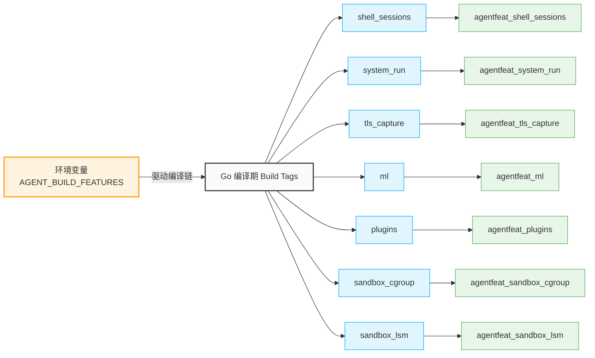

# 🧱 运行时边界

在 **Agent eBPF Filter** 的设计体系中，多层运行时边界交织在一起，共同约束着系统的行为。明确并划分这些边界的职责，能够有效避免将**内核态观测、主动拦截控制、高危深度诊断与生产环境安全语义**混淆，确保系统在复杂生产集群中的绝对受控。

## 🔑 1. 权限边界 (Privilege Boundaries)

后端引擎作为宿主机常驻服务，在引导启动时面临严格的 Linux 特权隔离边界。以下底层核心能力必须在 **Root 特权 / 显式能力集** 下方可执行：

* **内核字节码装载**：加载 eBPF 探针程序到内核，以及将其对应的 Maps/Links 固化（Pinning）至 `bpffs`（BPF 虚拟文件系统）。
* **硬阻断钩子挂载**：动态附加 eBPF cgroup 探针到四层网络套接字，以及将 BPF LSM 挂钩注入内核 Linux 安全模块。
* **高危端口常驻**：绑定可选的宿主机 `80` / `443` 端口进行全局流量重定向（Domain Forward Proxy）。

> 🚀 **自提权引导机制**：系统引导链内建 `ensureBackendPrivileges()` 检查器。若检测到当前执行环境的特权能力缺失，引擎将尝试通过预设的 `sudo` 或 `pkexec` 通道触发安全自提权流程；提权失败则立即安全退出，杜绝越权或非法部分挂载。

## 🛠️ 2. 编译期特性边界 (Build Feature Boundaries)

通过环境变量 `AGENT_BUILD_FEATURES` 强行控制 Go 后端的编译期标签（Build Tags）。编译期裁剪是系统的**硬边界**，未被编译引入的模块在运行时无法通过任何配置或配置下发来激活。

* **全量模式 (`agentfeat_all`)**：默认编译策略，将全量可选高级特性全部编译塞入交付产物。
* **轻量内核模式 (`core`)**：通过逗号隔离的列表，精准剔除不必要的诊断层（如 TLS 捕获、机器学习模块），压缩二进制体积，极限收紧安全攻击面。

## 🚧 3. 运行时门控边界 (Runtime Gate Boundaries)

> 💡 **核心原则：即使功能编译进二进制，高风险能力在默认状态下依然保持关闭。**

运行时门控（Runtime Gates）充当了系统内存中的**高危软红线**，需要管理员通过热加载显式打开。

* **📟 远程交互门控**：`shell sessions` 会话开关、远程拉起指令外部接口（`/system/run`）。
* **🎛️ 策略与挂钩门控**：`hook management` 自动化钩子注入控制、`policy management` 拦截阻断规则热修改门禁。
* **🔑 深度诊断门控**：`tls capture` 明文捕获网关、`domain forward proxy` 强转代理、`kernel risk feedback` 内核风险特征自学习反馈环。
* **🔌 数据外向分流**：`otlp export` 分布式链路遥测 Span 上报通道。

## 🎫 4. 身份认证边界 (Auth Boundaries)

根据部署环境的安全级别，身份认证边界提供分级的受控保护：

* **🧪 研发调试模式 (Dev Mode)**：默认完全关闭 Auth 校验，方便本地快速运行多端联调。
* **🚀 生产就绪模式 (Release Mode)**：所有涉及敏感数据提取、策略下发、长连接广播的端点必须携带系统级分配的 `Runtime Access Token`。

### 📡 令牌传输规约

系统网关在鉴权层强行在以下三条物理通道中检索合法 Token：

* **标准 HTTP 报头**：`X-API-KEY: <token>`
* **RFC 标准承载报头**：`Authorization: Bearer <token>`
* **流式长连接通道 (WebSocket / MCP)**：强制在握手 URL 中检索 Query 参数 `?key=<token>`

## 🙈 5. 数据安全与隐私边界 (Data Boundaries)

由于过滤器常驻于 Linux 系统调用底层，为了防止对用户态 AI Agent 隐私及敏感业务密文造成二次泄露，系统执行严格的脱敏与摘要化（Redaction & Sanitization）安全红线：

* **🚫 零明文参数**：系统调用中高频生成的命令行参数 `argv`、智能体的提示词/回复词（Prompt/Response）在落盘及 UI 广播时，必须转化为 **SHA256 哈希摘要（Digest）+ 长度（Length）** 的形式保存。
* **✂️ 深度诊断截断**：在经过显式授权临时开启的 TLS / Codex capture 明文诊断通道中，Payload 必须通过脱敏规则引擎强行清洗，并根据配置长度进行物理强行截断。
* **🏷️ 审计状态标记**：每一个标准的归一化 `Event` 数据包中，必须强制包含 `redaction_level`（脱敏等级）与 `sanitized_fields`（已被擦除的敏感字段名列表）的元数据打标，供上游合规审计。

## 🛡️ 6. 核心拦截控制边界 (Control Boundaries & Non-Goals)

为了帮助开发者和架构师准确评估产品应用场景，以下明确划分了各控制路径的**实际能力覆盖范围**以及明确的**非治理目标（Non-Goals）**：

| 控制路径 (Path) | 🛡️ 实际阻断覆盖范围 (Scope) | ❌ 非系统设计治理目标 (Non-Goal) |
| --- | --- | --- |
| **Wrapper 劫持层** | 仅覆盖并拦截经由 `agent-wrapper` 垫片透明启动的直接命令路径。 | **不提供** 类似 Docker/K8s Cgroups 的全面容器化文件/进程命名空间沙盒。 |
| **cgroup eBPF 层** | 实现基于精确 `cgroup id`、四层确切 `IPv4/IPv6` 目标地址及端口的硬阻断。 | **不适合** 作为支持 CIDR 大网段匹配、动态 Range 规则的通用集群企业级防火墙。 |
| **BPF LSM 层** | 实施针对精准执行体绝对路径（Exec Path）、特定文件名、文件单体 Basename 的强制访问控制。 | **不提供** 递归目录树（Recursive Directory）前缀匹配及海量模糊通配符匹配策略。 |
| **Runtime Gates** | 提供后端核心高危 API 接口、Web 控制端点及长连接下发的动态内存“总开关”。 | **不承担** 替代 Linux 内核原生自主访问控制（DAC/ACL）的系统基础职责。 |
| **Native Hooks** | 专门捕捉与析取已被接入并经过符号化适配的 AI CLI 工具语义及 Payload。 | **不保证** 能够自动侦测、识别并捕获未曾接入或闭源加密的第三方智能体私有流量。 |

## 🔗 相关导航

* 🗺️ [总体架构](overview.md) —— 解构 L0-L5 六层垂直依赖视图
* 🌊 [数据流](data-flow.md) —— 内核事件零拷贝解码至前端虚拟化渲染时序
* 🎫 [Runtime Gates 与 Auth](../security/runtime-gates-auth.md) —— 深入鉴权中间件与动态热锁控制细节
* 🔒 [安全模型](../security/model.md) —— 解密纵深防御模型的运行机理
* 🎛️ [Runtime Settings 与 Feature Manifest](../backend/runtime-settings-features.md) —— 检查编译期 Feature Flag 的裁剪定义