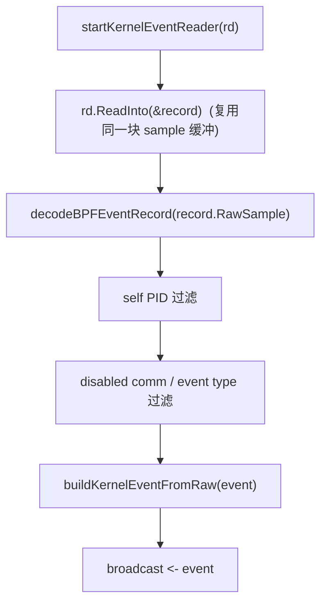

# 事件管线

事件管线负责把内核、wrapper、hooks、TLS、policy、system metrics 等不同来源统一成 `pb.Event` 与 `EventEnvelope`。

## 内核事件读取

`backend/app/jobs_background.go` 中：

## 解码策略

读取循环持有一个 `ringbuf.Record`，通过 `ReadInto` 复用其 `RawSample` 缓冲：内核 ring
到用户态只有一次必要拷贝，之后每条事件不再分配新的 sample 切片。

`decodeBPFEventRecord()`：

- 如果 RawSample 长度不足，返回错误；
- 如果 native little-endian 且内存对齐，则直接构造 `*bpfEvent` view（指针在下一次 `ReadInto` 前有效）；
- 否则 `binary.Read` 到新结构体；
- 记录 zero-copy / copy 指标。

### 字符串与 payload 视图

- `events.SanitizeUTF8()` 先在字节视图上裁掉 NUL 填充，再只拷贝有效前缀：一条 `openat`
  事件从复制 256 字节路径缓冲降为按实际长度分配一次；含嵌入 NUL 或非法 UTF-8 的输入走
  慢路径，语义与旧实现逐字节一致（见 `sanitize_test.go`）。
- `events.TrimNUL()` 返回原缓冲的切片视图，协议探测 (`DetectAndRecordProtocol`) 直接读取
  原始 payload，不再经过 string→[]byte 往返，TLS/DNS 头里的 NUL 字节也得以保留。
- 禁用 comm 的过滤 (`commDisabled`) 用 `map[string(bytes)]` 的临时视图查表，整条过滤链路
  在常见情况下零分配。

## Process context

`backend/app/events/context_event.go` 将注册、wrapper 和 hook 的上下文归一化。

| 构造函数 | 来源 |
| --- | --- |
| `buildProcessContextFromRegister()` | `/register` payload |
| `buildProcessContextFromWrapperRequest()` | `pb.WrapperRequest` |
| `buildProcessContextFromHookPayload()` | native hook JSON payload |
| `normalizeProcessContext()` | 去空白、规范 decision、补 root pid、清理 risk score |
| `enrichEventContext()` | 将 context 注入 `pb.Event` |

## Broadcast 与 archive

事件进入 broadcast channel 后，后端会：

- 每 50 ms 或每 50 条打包成一个 `EventBatch` 广播给 `/ws`（无订阅者时跳过序列化）；
- 构造 EventEnvelope；
- 写入 CapturedEventArchive；
- 按配置写 JSONL；
- 推送 `/ws/envelopes`；
- 更新 Execution Graph / AgentSight / OTLP 派生数据；
- 触发可选 kernel risk feedback。

### WebSocket 扇出 (`internal/wsfanout`)

`/ws`、`/ws/envelopes` 与 `/ws/tls-capture` 共用 `wsfanout.Hub`。一次 `Broadcast` 只序列化
一份 payload（protobuf 或 TLS 事件的 JSON），并包装成 `websocket.PreparedMessage`：帧头与
payload 只编码一次，随后对每个连接用向量写直接发送，不再按连接逐个编码、拷贝。每个连接有
独立的有界队列和 writer goroutine，慢客户端在队列满时被断开，不会阻塞事件摄取；断开原���
通过 `Options.OnDrop` 回调上报（`queue_full` / `write_deadline_failure` / `write_failure`），
`TLSBroadcaster.Status()` 的计数即由此维护。无订阅者时两条路径都直接跳过序列化。该包不
依赖 `app`，可独立测试。

TLS 广播在 16 个订阅者下的开销：43.4 µs / 33 次分配 → 14.2 µs / 3 次分配（编码成本不再随
订阅者数量线性增长）。

## EventArchive

`backend/core/state_types.go` 中 `EventArchive` 是 bounded ring：

- `Add()` 满容量后以 O(1) 覆盖最旧槽位，不在事件写锁内搬移完整数组；
- `Snapshot(limit)` 返回最新 N 条；
- `EvictOlderThan()` 按逻辑接收顺序原地压缩并清理失效引用；
- `SetMax()` 动态调整容量；
- `Clear()` 清空内存记录。

底层缓冲按需增长且 backing capacity 不超过 `MaxEventCount`。默认 1500 条归档在
稳定写入阶段不再让单条捕获事件复制约 1500 个记录结构，容量调大时追加成本也保持恒定。

## 语义关联状态

`BuildSemanticAlerts()` 会跨事件关联 secret access、chmod 后执行、fork window、
agentic resource loop 和多 Agent 文件写入。关联状态不能随长期运行或攻击者控制的
context/path 无限增长，因此 `SemanticAlertState` 使用五个受同一互斥锁保护的有界 LRU：

- secret、executable、fork 和 agentic-loop 各最多 4096 个 context；
- file-mutation 最多 8192 个 path；总容量上限为 24576；
- context、path、target、mode 和 prompt digest 都有字节上限，超长值使用稳定 SHA-256
  后缀保留区分度，不把原始大值留在状态中；
- `extra_info` 采用流式字段扫描，只检查前 64 KiB，prompt digest 最多 256 bytes，
  不再复制并切分整段 metadata；
- 与 prompt/API/file-I/O correlation 无关的事件在创建 key 和加锁前返回，不写入空 window；
- 每 5 秒由可取消的后台任务扫描 TTL，按容量淘汰则在插入时以 O(1) 完成。

`/system/collector-health` 暴露各类 entry 数、总量/上限、TTL/容量淘汰、受限值、
忽略的超限 metadata 和最后 GC 时间。Prometheus 对应暴露
`agent_ebpf_semantic_state_entries{kind=...}`、`*_max_entries` 及四个累计 counter。

## 工具行为基线

工具基线在 `BuildSemanticAlerts()` 末尾执行一次原子的 **detect-then-record**：
先只用此前行为判断 drift，再把当前行为写入 baseline。这样当前事件不会在检查前把自己
加入 baseline；并发出现同一种新行为时，也只有第一个观察会产生 drift，后续观察直接
命中刚写入的样本。`enrichEventContext()` 只负责上下文，不再提前污染 baseline。

为避免冷启动误报，某个工具至少需要 3 种既有行为且累计 16 次有效观察后，新的
`comm/eventType` 组合才会触发 baseline drift。状态边界如下：

- 最多 512 个工具、每个工具最多 128 个行为样本，总上限 65536；
- 外层工具和内层行为都使用 O(1) LRU 容量淘汰；key 使用结构体，不再拼接字符串；
- 工具名、comm 和 event type 受 rune 数限制，超长值使用稳定 SHA-256 派生后缀，
  去空白后的短切片会 clone，避免小值长期引用攻击者控制的大字符串；
- 每分钟由可取消后台任务统一清理 24 小时 TTL；观察时只从当前工具的 LRU 尾部移除
  已过期项，不再在事件热路径扫描当前工具或全部 65536 个样本。

collector health 和 Prometheus 暴露 tools/samples 占用、观察数、drift 数、TTL/容量
淘汰、受限值与最后 GC 时间。

## 异步 JSONL 持久化

事件一旦通过 `enqueueBroadcastEvent()` 进入队列，所有权就移交给 broadcaster：生产者必须
每次构造新事件，入队后不得再读写。broadcaster 先用未脱敏的事件推导语义告警，再由
`recordCapturedEvent()` 原地完成 schema 归一化和脱敏（不再 `proto.Clone`），写入内存
`EventArchive`，并把同一条记录非阻塞地提交给持久化 writer。envelope 的 `LegacyEvent`
与记录共享同一个事件对象，脱敏只执行一次。事件捕获热路径不再执行 JSON 编码、文件
写入或逐条 `Flush()`。

持久化 writer 的边界如下：

- 单消费者队列容量为 4096；队列满时只丢弃该条持久化副本，不阻塞 broadcast、
  WebSocket、录制或其他派生 worker；
- 使用 256 KiB 用户态缓冲区，按 128 条或 250 ms 批量刷盘；
- 单条记录复用录制管线的约 4 MiB JSONL 上限；单条编码失败只记失败并继续处理，
  文件写入/刷盘失败则终止当前 writer generation；
- JSONL 行只包含 `receivedAt` 与 `event`；`recording.MarshalRecord()` 不再为每条记录构造
  （或 `proto.Clone`）随后被丢弃的 envelope，envelope 在尾读时重新推导；
- 配置替换、禁用、清空日志和后端停机会先停止接收，并在 5 秒期限内排空已接受记录；
- 相同日志配置不会重启 writer；切换路径先准备新文件，再排空旧 generation，配置保存
  失败时回滚原 writer；
- 累计成功/失败计数只在实际刷盘完成后更新，不再把“未启用持久化”记为成功。

`/system/collector-health` 暴露 writer active/stopping、queue length/capacity、
pending、当前 generation 的 enqueued/persisted/failed/dropped、最后刷盘时间与最后错误。
Prometheus 同时暴露 active、queue、pending 和 generation failure/drop gauges。

## 持久化尾读

`RecentEventsContext()` 在读取持久化文件前插入 flush barrier，因此 barrier 之前已接受的
记录对本次读取可见。读取器基于请求开始时的文件大小快照，从文件尾部按 256 KiB
反向读取，只解析满足 `limit` 所需的最新有效 JSONL，再恢复时间顺序。它限制：

- 单次最多返回 50000 条（具体 HTTP/MCP 调用方可进一步收紧）；
- 单行最多约 4 MiB；
- 最多检查 250000 行和 128 MiB；
- 全程检查请求取消信号，并统一使用 10 秒处理期限。

取消会直接向上传播，不再继续扫描或写响应。非取消类文件读取失败会记录警告并回退到
有界内存 archive；格式错误或缺少 event 的单行会被跳过。

## Event schema

当前 `eventSchemaVersion` 是 `event.v3`。事件字段变化时必须同步 proto、生成物、后端构造、前端显示、图谱、AgentSight、OTLP 和 docs。

## 跨文档影响

事件管线是多条文档路线的交汇点：

| 变化 | 同步阅读 / 更新 |
| --- | --- |
| 新增 syscall event type 或字段 | [协议与事件模型](/architecture/protocol-events)、[生成文件边界](/reference/generated-files)、[eBPF 与 OS Enforcement](/backend/ebpf-os-enforcement) |
| 新增 wrapper / hook / adapter context 字段 | [Agents、Adapters 与 PID 注册](/integrations/agents)、[Wrapper 命令策略](/integrations/wrapper)、[Native Hooks](/integrations/native-hooks) |
| 改 EventEnvelope、AgentSight projection 或 replay | [前端工作台](/frontend/workbench)、[路由与功能页](/frontend/routes-and-pages)、[MCP、External API 与 OTLP](/integrations/mcp-external-otlp) |
| 改 redaction / TLS / Codex ingest | [脱敏与隐私](/security/redaction-privacy)、[Sanitization](../security/sanitization.md)、[安全模型](/security/model) |
| 改 kernel risk scoring / feedback | [ML、Plugins 与扩展能力](/backend/ml-plugins)、[策略语义](/security/policy-semantics)、[验证页](/operations/verification-benchmark) |

维护建议：先用本页确认事件从哪里进入、在哪里归一化、广播到哪些出口，再根据 [文档地图](/reference/documentation-map) 的“变更影响链”检查是否漏掉前端、外部 API 或安全说明。
