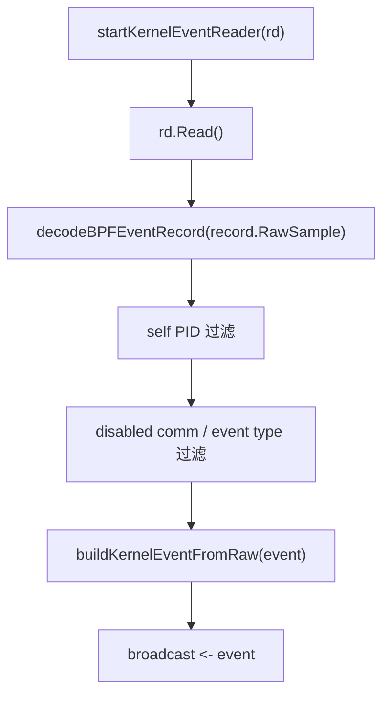

# 事件管线

事件管线负责把内核、wrapper、hooks、TLS、policy、system metrics 等不同来源统一成 `pb.Event` 与 `EventEnvelope`。

## `backend/app/jobs_background.go` 中：

## `decodeBPFEventRecord()`：

- 如果 RawSample 长度不足，返回错误；
- 如果 native little-endian 且内存对齐，则直接构造 `*bpfEvent` view；
- 否则 `binary.Read` 到新结构体；
- 记录 zero-copy / copy 指标。

## Process context

`backend/app/events/context_event.go` 将注册、wrapper 和 hook 的上下文归一化。

| 构造函数 | 来源 |
| --- | --- |
| `buildProcessContextFromRegister()` | `/register` payload |
| `buildProcessContextFromWrapperRequest()` | `pb.WrapperRequest` |
| `buildProcessContextFromHookPayload()` | native hook JSON payload |
| `normalizeProcessContext()` | 去空白、规范 decision、补 root pid、清理 risk score |
| `enrichEventContext()` | 将 context 注入 `pb.Event` |

## Broadcast 与 archive

事件进入 broadcast channel 后，后端会：

- 广播给 `/ws`；
- 构造 EventEnvelope；
- 写入 CapturedEventArchive；
- 按配置写 JSONL；
- 推送 `/ws/envelopes`；
- 更新 Execution Graph / AgentSight / OTLP 派生数据；
- 触发可选 kernel risk feedback。

## EventArchive

`backend/core/state_types.go` 中 `EventArchive` 是 bounded ring：

- `Add()` 超出容量时裁掉最旧记录；
- `Snapshot(limit)` 返回最新 N 条；
- `EvictOlderThan()` 按时间清理；
- `SetMax()` 动态调整容量；
- `Clear()` 清空内存记录。

## Event schema

当前 `eventSchemaVersion` 是 `event.v3`。事件字段变化时必须同步 proto、生成物、后端构造、前端显示、图谱、AgentSight、OTLP 和 docs。

## 事件管线是多条文档路线的交汇点：

| 变化 | 同步阅读 / 更新 |
| --- | --- |
| 新增 syscall event type 或字段 | [协议与事件模型](/architecture/protocol-events)、[生成文件边界](/reference/generated-files)、[eBPF 与 OS Enforcement](/backend/ebpf-os-enforcement) |
| 新增 wrapper / hook / adapter context 字段 | [Agents、Adapters 与 PID 注册](/integrations/agents)、[Wrapper 命令策略](/integrations/wrapper)、[Native Hooks](/integrations/native-hooks) |
| 改 EventEnvelope、AgentSight projection 或 replay | [前端工作台](/frontend/workbench)、[路由与功能页](/frontend/routes-and-pages)、[MCP、External API 与 OTLP](/integrations/mcp-external-otlp) |
| 改 redaction / TLS / Codex ingest | [脱敏与隐私](/security/redaction-privacy)、[Sanitization](../security/sanitization.md)、[安全模型](/security/model) |
| 改 kernel risk scoring / feedback | [ML、Plugins 与扩展能力](/backend/ml-plugins)、[策略语义](/security/policy-semantics)、[验证页](/operations/verification-benchmark) |

维护建议：先用本页确认事件从哪里进入、在哪里归一化、广播到哪些出口，再根据 [文档地图](/reference/documentation-map) 的“变更影响链”检查是否漏掉前端、外部 API 或安全说明。
