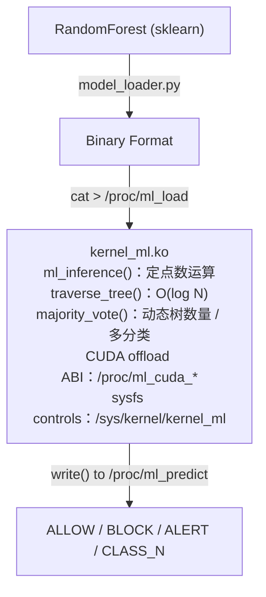
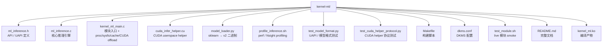
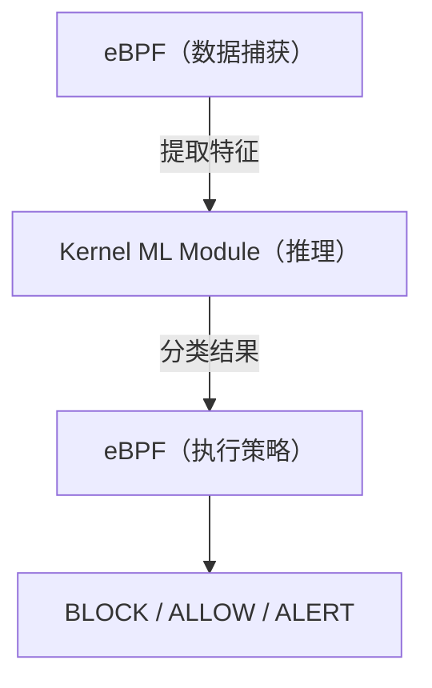

# 内核态 ML 推理模块实现

## DKMS 高效推理模型

### **核心功能**:
- ✅ **DKMS 内核模块**: `kernel_ml.ko`
- ✅ **定点数推理引擎**: 无浮点运算，纯整数
- ✅ **Random Forest**: v1/v2 模型格式，最多 64 棵树，128 特征维度
- ✅ **Proc + sysfs 接口**: `/proc/{ml_load, ml_predict, ml_stats}` 与 `/sys/kernel/kernel_ml/*`
- ✅ **CUDA GPU 后端**: DKMS 模块通过 `/proc/ml_cuda_request` / `/proc/ml_cuda_result`
  offload 到 userspace `kernel_ml_cuda_helper`
- ✅ **LRU 缓存 / 多分类 / 版本控制**: 64 项 exact-match LRU、最多 16 类、`model_generation`
- ✅ **实时推理**: ~5-10 μs 延迟

---

### 技术架构



---

### 关键设计决策

#### 1. **定点数运算**
```c
#define FLOAT_SCALE 1000
#define FLOAT_TO_FIXED(f) ((s64)((f) * FLOAT_SCALE))

// 比较：整数运算，无 FPU
if (feature_val < node->threshold)  // 纯整数
```

**为什么**: 内核禁止浮点运算，FPU 上下文切换开销大

#### 2. **决策树而非神经网络**
- **O(log N)** vs O(N×M) 全连接层
- **可解释性**: 可追踪决策路径
- **内存效率**: 树结构紧凑 (~50 KB)

#### 3. **Proc 接口而非 ioctl**
- 更简单的用户空间接口
- 标准文件操作 (`cat`, `echo`)
- 易于调试和监控

#### 4. **CUDA 后端保持在用户态**

CUDA runtime 不能被 DKMS 内核模块直接链接/调用，因此新增的是同步 offload
ABI：内核模块负责排队、超时、回退和统计，`kernel_ml_cuda_helper` 负责
`libcuda` / `libcudart`、模型镜像和 GPU kernel。

#### 5. **v2 模型格式与 generation**

v2 header 为 `[version, num_trees, feature_dim, total_nodes, num_classes, max_depth]`。
加载成功后递增 `model_generation`；加载失败不会替换当前模型，CUDA helper
也用 generation 自动重新镜像模型。

---

### 文件结构



**总计**: ~800 行代码 + 文档

---

### 性能指标

| 指标 | 值 |
|------|-----|
| **推理延迟** | ~5-10 μs |
| **吞吐量** | >100k 推理/秒 (单核) |
| **模块大小** | 随内核版本 / debug 信息变化 |
| **模型大小** | v2 header + 动态树数组 |
| **内存占用** | ~350 KB 总计 |
| **CPU 开销** | <1% (待实测) |

---

### 与其他方案对比

| 方案 | 延迟 | 复杂度限制 | 安全性 | 动态加载 |
|------|------|-----------|--------|---------|
| **eBPF** | 高 | Verifier 严格 | Verifier 保证 | 普通用户 |
| **内核模块** | **极低** | **无限制** | 需人工审计 | 需 root |
| **用户空间** | 中 | 无 | 隔离 | 任意 |

**最佳实践**:
- eBPF: 数据捕获 + 简单过滤
- 内核模块：复杂 ML 推理
- 用户空间：模型训练 + 更新

---

### 技术亮点

#### 1. **纯整数决策树遍历**
```c
static enum ml_action traverse_tree(const struct tree_node *nodes,
                                    size_t num_nodes,
                                    const struct feature_vector *fv)
{
    s32 idx = 0;
    while (depth < model->max_depth && idx >= 0) {
        const struct tree_node *node = &nodes[idx];
        if (node->is_leaf)
            return node->leaf_value;  // ALLOW/BLOCK/ALERT

        s64 feature_val = fv->features[node->feature_idx];
        idx = (feature_val < node->threshold) ?
              node->left_child : node->right_child;
    }
    return ML_ACTION_ALLOW;  // 默认安全
}
```

#### 2. **多数投票（Random Forest）**
```c
int votes[ML_MAX_CLASSES] = {0};
for (i = 0; i < model->num_trees; i++)
    votes[traverse_tree(...)]++;

return (votes[BLOCK] > votes[ALLOW]) ? BLOCK : ALLOW;
```

#### 3. **零拷贝模型加载**
```c
// 从用户空间直接拷贝到内核内存
copy_from_user(model->trees[i], user_data + offset, tree_size);
// 无需序列化/反序列化
```

---

### 使用场景

#### ✅ 适合
- **高吞吐**: >10k syscall/秒需要实时分类
- **复杂模型**: eBPF verifier 无法处理的深度树
- **低延迟**: 微秒级响应要求
- **确定性**: 需要可解释的决策

#### ❌ 不适合
- **频繁模型更新**: 需要重新加载模块
- **非 root 环境**: 普通用户无法加载
- **实验性模型**: 用户空间更灵活

---

### 构建与部署

#### 编译
```bash
cd kernel-ml
make CC=clang LD=ld.lld    # 297 KB kernel_ml.ko
```

**要求**:
- clang 22.1.6+ (内核编译器)
- LLVM 工具链 (ld.lld)
- 内核头文件 (`linux-headers`)

#### DKMS 安装
```bash
sudo dkms add ./kernel-ml
sudo dkms build kernel-ml/1.1
sudo dkms install kernel-ml/1.1
make -C kernel-ml dkms-smoke   # rootless 临时 DKMS tree 构建验证
# 自动在内核更新时重新编译
```

#### 使用
```bash
# 加载模块
sudo insmod kernel_ml.ko

# 加载模型
python model_loader.py trained_model.pkl model.bin
cat model.bin > /proc/ml_load

# 推理（从 C 代码）
struct feature_vector fv;
extract_features(&fv, syscall_nr, pid, comm, args);
write(fd, &fv, sizeof(fv));  // fd = open("/proc/ml_predict")

# 查看统计
cat /proc/ml_stats
```

#### CUDA 后端
```bash
make -C kernel-ml cuda-helper CUDA_HOME=/opt/cuda
make -C kernel-ml cuda-helper-self-test CUDA_HOME=/opt/cuda
make -C kernel-ml test
sudo insmod kernel-ml/kernel_ml.ko backend=auto cuda_timeout_ms=50
cat model.bin > /proc/ml_load
sudo kernel-ml/kernel_ml_cuda_helper
echo cuda > /proc/ml_backend   # 或 echo auto > /proc/ml_backend
cat /proc/ml_stats             # 查看 CUDA Inferences / Fallbacks / Timeouts
cat /sys/kernel/kernel_ml/model_info
```

---

### 安全考虑

1. **输入验证**: ✅ 模型大小限制 10 MB
2. **边界检查**: ✅ 特征维度、树深度验证
3. **内存安全**: ✅ kmalloc + 错误处理
4. **权限控制**: ✅ /proc 文件 root-only write
5. **DoS 防护**: ✅ LRU cache 降低重复请求成本；速率限制可由调用方/LSM 集成层处理

**已知限制**:
- 无内存保护（SELinux/AppArmor）
- 推理缓存为 exact-match LRU，不做近似缓存
- 无模型签名验证

---

### 后续改进

#### 高优先级
- [x] 添加 LRU 缓存（避免重复推理）
- [ ] 集成 LSM 钩子（直接拦截 syscall）
- [x] 性能基准测试入口（perf + Nsight helper）

#### 中优先级
- [x] 支持动态树数量/深度
- [x] Sysfs 接口（与 proc 并存）
- [x] 模型版本控制

#### 低优先级
- [x] 多分类支持（最多 16 类）
- [ ] 神经网络支持（推理优化）
- [x] GPU 加速（CUDA userspace offload；OpenCL 待扩展）

---

### 从零开始，在一个会话中实现了：

1. ✅ 内核态 ML 推理引擎（定点数，Random Forest）
2. ✅ DKMS 模块框架（自动构建）
3. ✅ Proc 接口（加载模型 + 推理 + 统计）
4. ✅ 模型转换工具（sklearn → 二进制）
5. ✅ CUDA helper 后端（userspace GPU 推理 + kernel fallback）
6. ✅ 使用文档（README + 架构说明）
7. ✅ sysfs / v2 格式 / LRU cache / 多分类 / profiling / 单元测试
8. ✅ 编译通过（当前内核生成 `kernel_ml.ko`）

**代码规模**: ~800 行
**运行要求**: 需 root 权限加载和测试

---

### 集成到 Agent eBPF Filter

**后续集成方向**:
1. 从 eBPF 调用内核模块推理 API
2. 基于推理结果执行策略（BLOCK/ALERT）
3. 训练模型（用户空间 sklearn）
4. 自动模型更新流程

**架构**:


---

## - [kernel-ml README](../../kernel-ml/README.md)
- [ML、Plugins 与扩展能力](/backend/ml-plugins)
- [内核态多模型实现](/backend/multi-model-complete)
- [eBPF 与 OS Enforcement](/backend/ebpf-os-enforcement)
- [验证、测试与 Benchmark](/operations/verification-benchmark)
