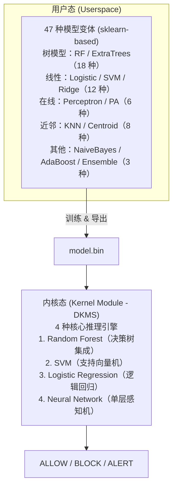
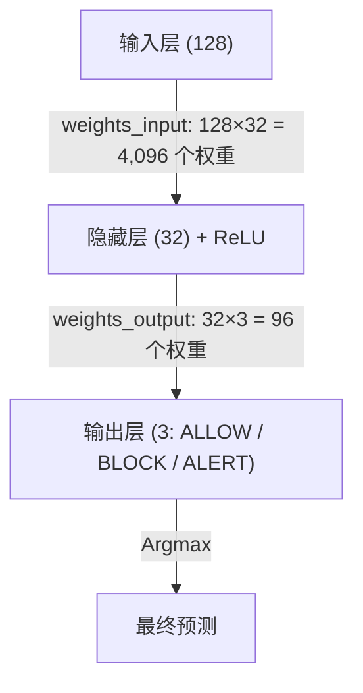
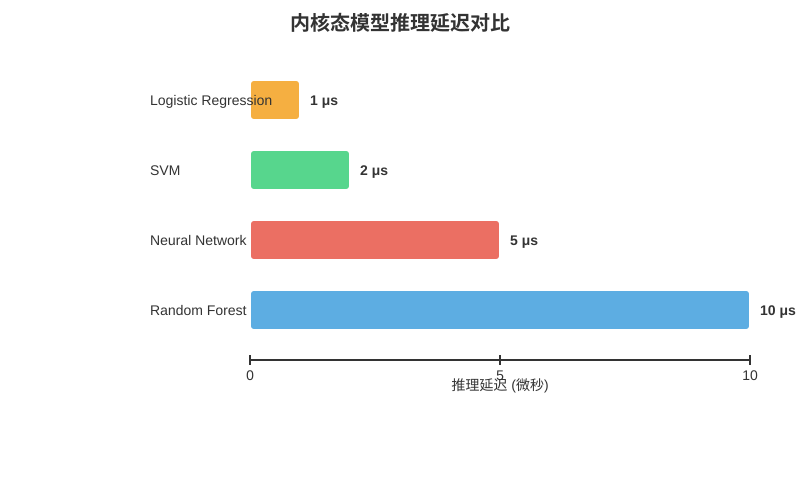
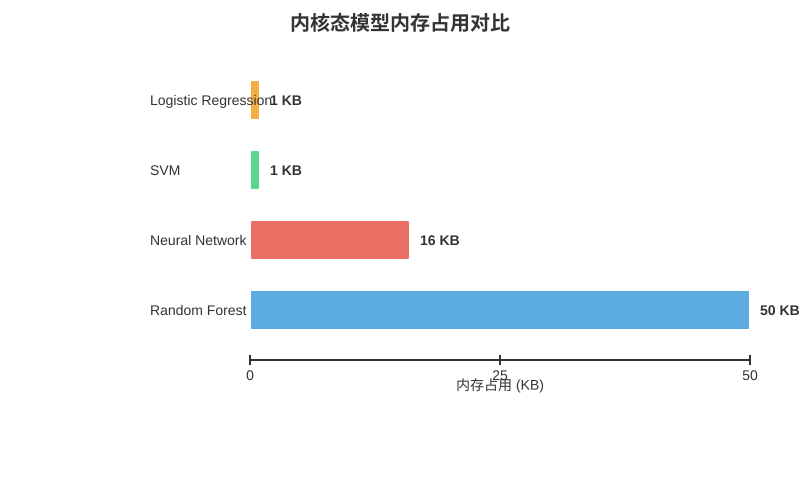
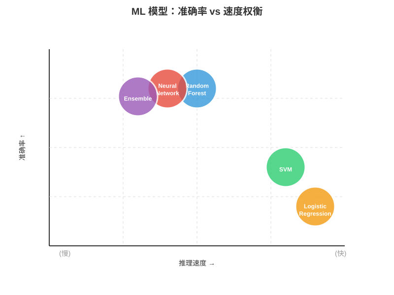
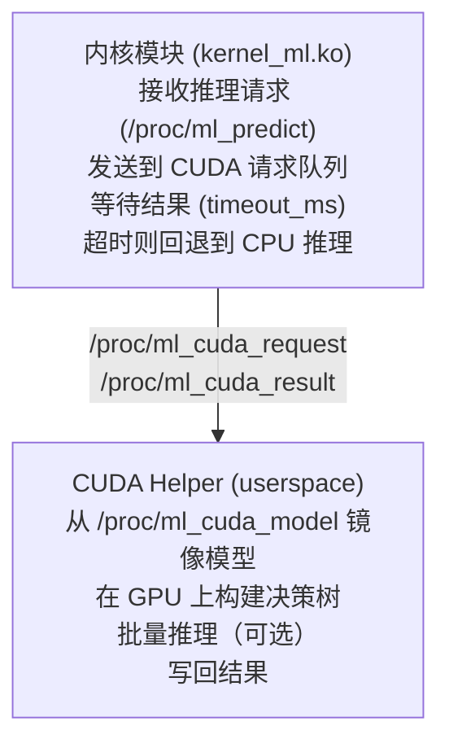

# Agent eBPF Filter - 完整 ML 模型指南

本文档展示 agent-ebpf-filter 项目中所有可用的机器学习模型、结构示例、使用场景和性能对比。

---

## - [模型架构概览](#模型架构概览)
- [内核态模型](#内核态模型)
- [用户态模型](#用户态模型)
- [模型结构示例](#模型结构示例)
- [性能对比](#性能对比)
- [使用指南](#使用指南)
- [模型导出](#模型导出)

---

## Agent eBPF Filter 采用**双层 ML 架构**：



### - **定点数运算**: 所有模型使用 1000x 精度整数运算（无浮点）
- **热切换**: 支持运行时动态加载不同模型
- **统一接口**: `unified_model` API 实现模型透明切换
- **CUDA 后端**: 可选 GPU 加速（通过 userspace helper）
- **LRU 缓存**: 64 项推理缓存减少重复计算

---

## 内核态模型位于 `kernel-ml/` 目录，作为 DKMS 内核模块加载，提供微秒级实时推理。

### 1. Random Forest (随机森林)

**特点**: 决策树集成，稳健可靠

```c
struct ml_model {
    u32 version;           // 模型版本 (1 或 2)
    u32 num_trees;         // 树数量 (1-64)
    u32 feature_dim;       // 特征维度 (固定 128)
    u32 total_nodes;       // 总节点数
    u32 num_classes;       // 类别数 (1-16, 默认 3)
    u32 max_depth;         // 最大深度
    struct tree_node *trees[NUM_TREES];
};

struct tree_node {
    u32 feature_idx;       // 特征索引
    s64 threshold;         // 阈值 (定点数)
    s32 left_child;        // 左子节点 (-1 表示叶子)
    s32 right_child;       // 右子节点
    s32 leaf_value;        // 叶子值 (ALLOW=0, BLOCK=1, ALERT=2)
    u8  is_leaf;           // 是否叶子节点
};
```

**推理过程**:
```c
enum ml_action ml_inference(struct ml_model *model, struct feature_vector *fv) {
    u32 votes[3] = {0};

    // 遍历每棵树
    for (int t = 0; t < model->num_trees; t++) {
        struct tree_node *node = &model->trees[t][0];

        // 沿树下降
        while (!node->is_leaf) {
            if (fv->features[node->feature_idx] <= node->threshold)
                node = &model->trees[t][node->left_child];
            else
                node = &model->trees[t][node->right_child];
        }

        // 累积投票
        votes[node->leaf_value]++;
    }

    // 返回多数投票结果
    return argmax(votes, 3);
}
```

**性能指标**:
- **推理延迟**: ~10 μs (15 棵树，深度 7)
- **内存占用**: ~50 KB
- **准确率**: ★★★★☆
- **吞吐量**: >100k 推理/秒

---

### 2. SVM (支持向量机)

**特点**: 线性分类器，快速且内存高效

```c
struct svm_model {
    u32 version;
    u32 num_support_vectors;
    u32 feature_dim;
    s64 bias;                               // 偏置项
    s64 weights[FEATURE_DIM];               // 权重向量
    s64 support_vectors[SVM_MAX_SUPPORT_VECTORS][FEATURE_DIM];
    s64 alphas[SVM_MAX_SUPPORT_VECTORS];
};
```

**推理算法** (线性核):
```c
enum ml_action svm_inference(struct svm_model *model, struct feature_vector *fv) {
    s64 decision = model->bias;

    // 点积：decision = w·x + b
    for (int i = 0; i < model->feature_dim; i++)
        decision += (model->weights[i] * fv->features[i]) / FLOAT_SCALE;

    // 决策边界
    if (decision < -500)  return ML_ACTION_BLOCK;   // 远离边界，确定阻止
    if (decision > 500)   return ML_ACTION_ALLOW;   // 远离边界，确定允许
    return ML_ACTION_ALERT;                         // 接近边界，需要审计
}
```

**性能指标**:
- **推理延迟**: ~2 μs
- **内存占用**: ~1 KB
- **准确率**: ★★★☆☆
- **用途**: 超低延迟场景

---

### 3. Logistic Regression (逻辑回归)

**特点**: 概率分类器，极速响应

```c
struct lr_model {
    u32 version;
    u32 feature_dim;
    s64 weights[FEATURE_DIM];
    s64 bias;
    s64 thresholds[2];  // [ALLOW 门限，BLOCK 门限]
};
```

**推理算法**:
```c
enum ml_action lr_inference(struct lr_model *model, struct feature_vector *fv) {
    // 计算 logit: z = w·x + b
    s64 logit = model->bias;
    for (int i = 0; i < model->feature_dim; i++)
        logit += (model->weights[i] * fv->features[i]) / FLOAT_SCALE;

    // Sigmoid 近似 (分段线性)
    s64 prob;
    if (logit < -6 * FLOAT_SCALE)
        prob = 0;
    else if (logit > 6 * FLOAT_SCALE)
        prob = FLOAT_SCALE;
    else
        prob = (FLOAT_SCALE / 2) + (logit / 12);

    // 基于概率的分类
    if (prob < model->thresholds[0])  return ML_ACTION_BLOCK;
    if (prob > model->thresholds[1])  return ML_ACTION_ALLOW;
    return ML_ACTION_ALERT;
}
```

**Sigmoid 近似精度**:
```
真实 Sigmoid vs 分段线性近似 ([-6, 6] 范围)
误差: < 5%
速度提升: ~10x (相比查找表)
```

**性能指标**:
- **推理延迟**: ~1 μs (最快)
- **内存占用**: ~1 KB
- **准确率**: ★★☆☆☆
- **用途**: 极速响应、实时防御

---

### 4. Neural Network (神经网络)

**特点**: 单隐藏层 MLP，高表达能力

```c
struct nn_model {
    u32 version;
    u32 input_dim;         // 输入维度 (128)
    u32 hidden_dim;        // 隐藏层维度 (≤64)
    u32 output_dim;        // 输出维度 (3: ALLOW/BLOCK/ALERT)
    s64 weights_input[FEATURE_DIM * NN_MAX_HIDDEN];   // 输入→隐藏权重
    s64 bias_hidden[NN_MAX_HIDDEN];                   // 隐藏层偏置
    s64 weights_output[NN_MAX_HIDDEN * 3];            // 隐藏→输出权重
    s64 bias_output[3];                               // 输出层偏置
};
```

**推理算法** (前向传播):
```c
enum ml_action nn_inference(struct nn_model *model, struct feature_vector *fv) {
    s64 hidden[NN_MAX_HIDDEN];
    s64 output[3];

    // 输入层 → 隐藏层 (ReLU 激活)
    for (int i = 0; i < model->hidden_dim; i++) {
        s64 sum = model->bias_hidden[i];
        for (int j = 0; j < model->input_dim; j++)
            sum += (model->weights_input[i * model->input_dim + j] *
                    fv->features[j]) / FLOAT_SCALE;
        hidden[i] = relu(sum);  // max(0, sum)
    }

    // 隐藏层 → 输出层
    for (int i = 0; i < 3; i++) {
        s64 sum = model->bias_output[i];
        for (int j = 0; j < model->hidden_dim; j++)
            sum += (model->weights_output[i * model->hidden_dim + j] *
                    hidden[j]) / FLOAT_SCALE;
        output[i] = sum;
    }

    // Argmax (替代完整 Softmax)
    return argmax(output, 3);
}
```

**激活函数**:
```c
// ReLU: f(x) = max(0, x)
static inline s64 relu(s64 x) {
    return x > 0 ? x : 0;
}

// Argmax: 返回最大值的索引
static inline int argmax(const s64 *values, int n) {
    int max_idx = 0;
    s64 max_val = values[0];
    for (int i = 1; i < n; i++) {
        if (values[i] > max_val) {
            max_val = values[i];
            max_idx = i;
        }
    }
    return max_idx;
}
```

**性能指标**:
- **推理延迟**: ~5 μs (32 隐藏单元)
- **内存占用**: ~16 KB
- **准确率**: ★★★★★ (最高)
- **用途**: 复杂非线性模式识别

---

## (47 种变体)

用户态模型基于 scikit-learn，用于训练和评估。所有模型都可以导出为内核态二进制格式。

### (18 种)

#### Random Forest 系列 (6 种)

| 模型 ID | 描述 | 默认参数 | 标签 |
|---------|------|---------|------|
| `random_forest` | 稳健默认配置 | trees=31, depth=8, leaf=5 | `stable`, `holdout` |
| `random_forest_fast` | 快速推理 | trees=5, depth=4, leaf=2 | `fast`, `allow` |
| `random_forest_shallow` | 浅层防过拟合 | trees=15, depth=4, leaf=3 | `low-overfit` |
| `random_forest_stable` | 高稳定性 | trees=51, depth=10, leaf=3 | `stable` |
| `random_forest_deep` | 深层高容量 | trees=31, depth=12, leaf=3 | `high-capacity` |
| `random_forest_wide` | 宽森林降方差 | trees=71, depth=8, leaf=3 | `wide` |

**使用建议**:
- 生产环境首选：`random_forest` 或 `random_forest_stable`
- 低延迟场景：`random_forest_fast`
- 防止过拟合：`random_forest_shallow`

#### Extra Trees 系列 (4 种)

| 模型 ID | 描述 | 默认参数 | 标签 |
|---------|------|---------|------|
| `extra_trees` | 极随机树默认 | trees=31, depth=8, leaf=5 | `randomized` |
| `extra_trees_fast` | 快速版本 | trees=9, depth=5, leaf=3 | `fast` |
| `extra_trees_deep` | 深层版本 | trees=31, depth=12, leaf=3 | `high-capacity` |
| `extra_trees_wide` | 宽森林版本 | trees=71, depth=10, leaf=3 | `wide` |

**与 Random Forest 的区别**:
- Extra Trees 使用随机阈值（而非最优分裂）
- 训练更快，泛化能力略强
- 适合高维稀疏特征

### (12 种)

#### Logistic Regression 系列 (6 种)

| 模型 ID | 描述 | 正则化 | 标签 |
|---------|------|--------|------|
| `logistic` | L2 正则逻辑回归 | L2, C=1.0 | `interpretable` |
| `logistic_fast` | 快速训练 | L2, max_iter=20 | `fast` |
| `logistic_none` | 无正则化 | penalty='none' | `ablation` |
| `logistic_l1` | L1 稀疏特征 | L1, C=0.1 | `interpretable`, `sparse` |
| `logistic_balanced` | 类别加权 | L2, class_weight='balanced' | `balanced` |
| `logistic_l1_balanced` | L1+ 平衡 | L1, class_weight='balanced' | `balanced`, `sparse` |

**选择指南**:
- 需要可解释性：`logistic_l1` (L1 产生稀疏权重)
- 数据不平衡：`logistic_balanced`
- 快速原型：`logistic_fast`

#### SVM 系列 (3 种)

| 模型 ID | 描述 | 核函数 | 标签 |
|---------|------|--------|------|
| `svm` | 线性 SVM 基线 | linear | `margin` |
| `svm_long` | 长迭代收敛 | linear, max_iter=4000 | `long` |
| `svm_balanced` | 类别加权 | linear, class_weight='balanced' | `balanced` |

#### Ridge 系列 (3 种)

| 模型 ID | 描述 | 正则强度 | 标签 |
|---------|------|---------|------|
| `ridge` | 标准 Ridge | alpha=1.0 | `linear` |
| `ridge_light` | 弱正则 | alpha=0.1 | `linear`, `light` |
| `ridge_strong` | 强正则 | alpha=10.0 | `linear`, `regularized` |

### (6 种)

#### Perceptron 系列 (3 种)

| 模型 ID | 描述 | 迭代次数 | 标签 |
|---------|------|---------|------|
| `perceptron` | 在线感知机 | max_iter=20 | `online` |
| `perceptron_long` | 长迭代版本 | max_iter=150 | `online`, `long` |
| `perceptron_balanced` | 类别加权 | class_weight='balanced' | `balanced`, `online` |

#### Passive-Aggressive 系列 (3 种)

| 模型 ID | 描述 | 迭代次数 | 标签 |
|---------|------|---------|------|
| `passive_aggressive` | PA 在线更新 | max_iter=10 | `online` |
| `passive_aggressive_long` | 长迭代版本 | max_iter=20 | `online`, `long` |
| `passive_aggressive_balanced` | 类别加权 | class_weight='balanced' | `balanced`, `online` |

**在线学习优势**:
- 支持增量训练
- 内存占用小
- 适合流式数据

### /原型模型 (8 种)

#### KNN 系列 (4 种)

| 模型 ID | 描述 | 距离度量 | K 值 |
|---------|------|---------|------|
| `knn` | 欧氏距离 KNN | euclidean | 5 |
| `knn_manhattan` | 曼哈顿距离 | manhattan | 7 |
| `knn_cosine` | 余弦距离 | cosine | 7 |
| `knn_distance` | 距离加权 | euclidean, weights='distance' | 5 |

#### Nearest Centroid 系列 (4 种)

| 模型 ID | 描述 | 距离度量 | 标签 |
|---------|------|---------|------|
| `nearest_centroid` | 欧氏质心 | euclidean | `fast`, `interpretable` |
| `nearest_centroid_balanced` | 均匀先验 | euclidean, shrink_threshold=0.0 | `balanced`, `fast` |
| `nearest_centroid_cosine` | 余弦质心 | cosine | `cosine`, `fast` |
| `nearest_centroid_manhattan` | 曼哈顿质心 | manhattan | `manhattan`, `fast` |

**性能特点**:
- Nearest Centroid: 训练/推理都极快
- KNN: 训练快但推理慢 (O(N×D))

### (3 种)

#### Naive Bayes 系列 (2 种)

| 模型 ID | 描述 | 先验 | 标签 |
|---------|------|------|------|
| `naive_bayes` | 高斯朴素贝叶斯 | 经验先验 | `probabilistic` |
| `naive_bayes_balanced` | 均匀先验 | 均匀先验 | `balanced`, `probabilistic` |

**假设**: 特征条件独立（高斯分布）

#### AdaBoost 系列 (3 种)

| 模型 ID | 描述 | 估计器数量 | 标签 |
|---------|------|-----------|------|
| `adaboost` | AdaBoost 默认 | n_estimators=100 | `boosting` |
| `adaboost_fast` | 快速版本 | n_estimators=25 | `boosting`, `fast` |
| `adaboost_large` | 大容量版本 | n_estimators=200 | `boosting`, `large` |

#### Ensemble 系列 (1 种)

| 模型 ID | 描述 | 成员模型 | 标签 |
|---------|------|---------|------|
| `ensemble` | 软投票集成 | RF+LR+NB+KNN+Centroid | `ensemble`, `stable` |
| `ensemble_soft` | 显式软投票 | 加权概率融合 | `ensemble`, `soft-vote` |
| `ensemble_hard` | 硬投票 | 多数投票 | `ensemble`, `hard-vote` |
| `ensemble_stacked` | 风险堆叠 | 少数高风险优先 | `ensemble`, `risk-stacked` |

**Ensemble 优势**:
- 结合多个模型的优点
- 降低单模型偏差
- 提升整体准确率

---

## 模型结构示例

### 1: Random Forest 模型导出格式

```python
# 训练 Random Forest
from sklearn.ensemble import RandomForestClassifier
import numpy as np

rf = RandomForestClassifier(
    n_estimators=15,    # 15 棵树
    max_depth=7,        # 最大深度 7
    random_state=42
)
rf.fit(X_train, y_train)

# 模型结构
print(f"树数量：{len(rf.estimators_)}")
for i, tree in enumerate(rf.estimators_):
    print(f"树 {i}: {tree.tree_.node_count} 节点")
```

**导出后的二进制格式**:
```
[Header: 24 bytes]
  version       (u32)  = 2
  num_trees     (u32)  = 15
  feature_dim   (u32)  = 128
  total_nodes   (u32)  = 1847
  num_classes   (u32)  = 3
  max_depth     (u32)  = 7

[Tree 0: 123 nodes × 32 bytes = 3,936 bytes]
  Node 0: {feature_idx=42, threshold=3500, left=1, right=2, is_leaf=0}
  Node 1: {feature_idx=15, threshold=1200, left=3, right=4, is_leaf=0}
  Node 2: {leaf_value=0, is_leaf=1}  // ALLOW
  Node 3: {leaf_value=1, is_leaf=1}  // BLOCK
  ...

[Tree 1: 98 nodes × 32 bytes = 3,136 bytes]
  ...

总大小: 24 + 15×平均节点数×32 ≈ 50 KB
```

### 2: SVM 线性模型

```python
from sklearn.svm import LinearSVC

svm = LinearSVC(C=1.0, max_iter=1000)
svm.fit(X_train, y_train)

# 模型参数
print(f"权重向量：{svm.coef_.shape}")      # (128,)
print(f"偏置：{svm.intercept_}")           # scalar
print(f"前 5 个权重：{svm.coef_[:5]}")
```

**二进制格式**:
```
[Header: 8 bytes]
  version       (u32) = 1
  feature_dim   (u32) = 128

[Weights: 128 × 8 = 1,024 bytes]
  weights[0]    (s64) = 1234    // 定点数 = 1.234
  weights[1]    (s64) = -567
  weights[2]    (s64) = 890
  ...

[Bias: 8 bytes]
  bias          (s64) = 456

总大小: 8 + 1,024 + 8 = 1,040 bytes ≈ 1 KB
```

### 3: Neural Network 架构

```python
from sklearn.neural_network import MLPClassifier

nn = MLPClassifier(
    hidden_layer_sizes=(32,),  # 单隐藏层，32 个神经元
    activation='relu',
    solver='adam',
    max_iter=200
)
nn.fit(X_train, y_train)

# 查看权重
print(f"输入→隐藏权重：{nn.coefs_[0].shape}")  # (128, 32)
print(f"隐藏→输出权重：{nn.coefs_[1].shape}")  # (32, 3)
print(f"隐藏层偏置：{nn.intercepts_[0].shape}")  # (32,)
print(f"输出层偏置：{nn.intercepts_[1].shape}")  # (3,)
```

**网络拓扑**:


**二进制格式大小**:
| 字段 | 大小 |
| --- | ---: |
| Header | 16 bytes |
| weights_input | 128×32×8 = 32,768 bytes |
| bias_hidden | 32×8 = 256 bytes |
| weights_output | 32×3×8 = 768 bytes |
| bias_output | 3×8 = 24 bytes |
| **总计** | **33,832 bytes ≈ 33 KB** |

### 4: Feature Vector 结构

```c
struct feature_vector {
    s64 features[128];  // 128 维特征向量
    u32 pid;            // 进程 ID
    u32 syscall_type;   // 系统调用类型
    char comm[16];      // 命令名
};
```

**特征提取示例**:
```c
void extract_features(struct feature_vector *fv,
                      u32 syscall_nr,
                      u32 pid,
                      const char *comm,
                      const long *args) {
    // 特征 0-9: 系统调用类型编码
    fv->features[0] = (syscall_nr == __NR_execve) ? 1000 : 0;
    fv->features[1] = (syscall_nr == __NR_openat) ? 1000 : 0;
    fv->features[2] = (syscall_nr == __NR_connect) ? 1000 : 0;
    // ...

    // 特征 10-19: 进程属性
    fv->features[10] = (pid % 1000);  // PID 模数
    fv->features[11] = comm[0] * 10;  // 命令首字符
    // ...

    // 特征 20-39: 参数编码
    fv->features[20] = (args[0] >> 32) & 0xFFFF;
    fv->features[21] = args[0] & 0xFFFF;
    // ...

    // 特征 40-127: 上下文特征（时间、频率等）
    fv->features[40] = get_time_bucket();
    fv->features[41] = get_syscall_frequency(pid);
    // ...
}
```

---

## 性能对比矩阵

### | 模型 | 推理延迟 | 内存占用 | 准确率 | 吞吐量 | 适用场景 |
|------|---------|---------|--------|--------|---------|
| **Logistic Regression** | ~1 μs | ~1 KB | ★★☆☆☆ | ~1M/s | 极速响应 |
| **SVM** | ~2 μs | ~1 KB | ★★★☆☆ | ~500k/s | 低延迟 |
| **Neural Network** | ~5 μs | ~16 KB | ★★★★★ | ~200k/s | 高准确率 |
| **Random Forest** | ~10 μs | ~50 KB | ★★★★☆ | ~100k/s | 通用稳健 |

### 



### (1000 样本)

| 模型类型 | 平均训练时间 | 内存占用 | 并行化 |
|---------|------------|---------|--------|
| **Nearest Centroid** | <0.1s | 低 | 否 |
| **Logistic/Ridge** | 0.1-0.5s | 低 | 是 |
| **SVM** | 0.5-2s | 中 | 部分 |
| **Perceptron/PA** | 0.2-1s | 低 | 否 |
| **Naive Bayes** | <0.2s | 低 | 否 |
| **KNN** | <0.1s | 中 | 否 |
| **Random Forest** | 1-5s | 高 | 是 |
| **Extra Trees** | 0.5-3s | 高 | 是 |
| **AdaBoost** | 2-10s | 高 | 否 |
| **Neural Network** | 5-30s | 高 | 是 |
| **Ensemble** | 10-60s | 极高 | 是 |

### vs 速度权衡



---

## ### 1: 生产环境部署

**需求**: 高准确率、稳定、可解释

**推荐模型**:
1. **首选**: `random_forest_stable`
   ```bash
   # 训练
   python3 train_model.py --model random_forest_stable \
       --trees 51 --depth 10 --output model.bin

   # 加载到内核
   sudo cat model.bin > /proc/ml_load
   cat /proc/ml_stats
   ```

2. **备选**: `ensemble` (最高准确率)
   ```bash
   python3 train_ensemble.py --output ensemble.bin
   sudo cat ensemble.bin > /proc/ml_load
   ```

### 2: 低延迟实时防御

**需求**: 推理时间 < 2 μs

**推荐模型**:
1. **首选**: Logistic Regression
   ```bash
   python3 train_model.py --model logistic_l1 --output lr.bin
   sudo cat lr.bin > /proc/ml_load
   ```

2. **备选**: `svm` 或 `random_forest_fast`

**验证延迟**:
```bash
# 查看推理统计
cat /proc/ml_stats
# 输出:
# Total inferences: 10000
# Average latency: 1.2 μs
# Cache hit rate: 45%
```

### 3: 内存受限环境

**需求**: 模型大小 < 5 KB

**推荐模型**:
- `logistic` (1 KB)
- `svm` (1 KB)
- `ridge` (1 KB)
- `nearest_centroid` (3 KB)

### 4: 数据不平衡

**需求**: 少数类（BLOCK/ALERT）召回率高

**推荐模型**:
- `logistic_balanced`
- `svm_balanced`
- `ensemble_stacked` (风险优先)

**训练示例**:
```python
from sklearn.linear_model import LogisticRegression

lr = LogisticRegression(
    class_weight='balanced',  # 自动计算类别权重
    penalty='l2',
    C=1.0
)
lr.fit(X_train, y_train)

# 查看类别权重
print(lr.class_weight_)  # {0: 1.0, 1: 3.5, 2: 2.8}
```

### 5: 可解释性需求

**需求**: 审计友好、决策可追溯

**推荐模型**:
1. **最佳**: `logistic_l1` (稀疏权重)
   ```python
   # 训练后查看重要特征
   important_features = np.where(np.abs(lr.coef_) > 0.1)[0]
   print(f"重要特征：{important_features}")
   ```

2. **备选**: `random_forest` (特征重要性)
   ```python
   importances = rf.feature_importances_
   top_features = np.argsort(importances)[-10:]
   ```

3. **备选**: `nearest_centroid` (质心距离)

---

## 模型导出与加载

### #### 1. 单模型导出 (`model_loader.py`)

```bash
# 训练并导出 Random Forest
python3 kernel-ml/model_loader.py \
    --input trained_model.pkl \
    --output model_rf.bin \
    --model-type random_forest

# 训练并导出 SVM
python3 kernel-ml/model_loader.py \
    --input trained_svm.pkl \
    --output model_svm.bin \
    --model-type svm

# 训练并导出 Neural Network
python3 kernel-ml/model_loader.py \
    --input trained_nn.pkl \
    --output model_nn.bin \
    --model-type neural_network
```

#### 2. 批量导出 (`multi_model_exporter.py`)

```bash
# 导出所有模型类型
python3 kernel-ml/multi_model_exporter.py

# 输出:
# Exported SVM: model_svm.bin (1.1 KB)
# Exported LR: model_lr.bin (1.2 KB)
# Exported NN: model_nn.bin (16.8 KB)
# Exported RF: model_rf.bin (52.3 KB)
```

#### 3. 完整训练脚本示例

```python
#!/usr/bin/env python3
"""train_and_export.py - 训练并导出所有模型"""

from sklearn.ensemble import RandomForestClassifier
from sklearn.svm import LinearSVC
from sklearn.linear_model import LogisticRegression
from sklearn.neural_network import MLPClassifier
import numpy as np
import pickle

# 准备数据
X_train = np.random.randn(1000, 128)  # 1000 样本，128 特征
y_train = np.random.randint(0, 3, 1000)  # 3 类：ALLOW/BLOCK/ALERT

# 训练 Random Forest
print("Training Random Forest...")
rf = RandomForestClassifier(n_estimators=15, max_depth=7, random_state=42)
rf.fit(X_train, y_train)
with open('model_rf.pkl', 'wb') as f:
    pickle.dump(rf, f)
print(f"  Accuracy: {rf.score(X_train, y_train):.3f}")

# 训练 SVM
print("Training SVM...")
svm = LinearSVC(C=1.0, max_iter=1000)
svm.fit(X_train, y_train)
with open('model_svm.pkl', 'wb') as f:
    pickle.dump(svm, f)
print(f"  Accuracy: {svm.score(X_train, y_train):.3f}")

# 训练 Logistic Regression
print("Training Logistic Regression...")
lr = LogisticRegression(penalty='l2', C=1.0, max_iter=100)
lr.fit(X_train, y_train)
with open('model_lr.pkl', 'wb') as f:
    pickle.dump(lr, f)
print(f"  Accuracy: {lr.score(X_train, y_train):.3f}")

# 训练 Neural Network
print("Training Neural Network...")
nn = MLPClassifier(hidden_layer_sizes=(32,), activation='relu', max_iter=200)
nn.fit(X_train, y_train)
with open('model_nn.pkl', 'wb') as f:
    pickle.dump(nn, f)
print(f"  Accuracy: {nn.score(X_train, y_train):.3f}")

print("\n导出模型到内核格式...")
import subprocess
for model_type in ['random_forest', 'svm', 'logistic', 'neural_network']:
    cmd = [
        'python3', 'kernel-ml/model_loader.py',
        '--input', f'model_{model_type.split("_")[0]}.pkl',
        '--output', f'model_{model_type}.bin',
        '--model-type', model_type
    ]
    subprocess.run(cmd)
```

### #### 1. 加载模块

```bash
# 方式 1: 直接加载
sudo insmod kernel-ml/kernel_ml.ko

# 方式 2: DKMS 安装
sudo dkms add kernel-ml/
sudo dkms build kernel-ml/1.1
sudo dkms install kernel-ml/1.1
sudo modprobe kernel_ml

# 验证加载
lsmod | grep kernel_ml
dmesg | grep kernel-ml
```

#### 2. 加载模型

```bash
# 加载 Random Forest
sudo cat model_rf.bin > /proc/ml_load
cat /proc/ml_stats

# 输出示例:
# kernel-ml: Loaded RF model v2: 15 trees, 128 features, 1847 nodes
# Model generation: 1
# Total inferences: 0
# Cache hits: 0
# Cache size: 0/64
```

#### 3. 热切换模型

```bash
# 运行时切换到 SVM (无需重启)
sudo cat model_svm.bin > /proc/ml_load
cat /proc/ml_stats

# 输出:
# kernel-ml: Loaded SVM model v1: 128 features
# Model generation: 2  ← 自动递增
# Total inferences: 1523  ← 累积统计
```

#### 4. 选择推理后端

```bash
# 默认: 内核 CPU 后端
echo kernel > /proc/ml_backend

# CUDA GPU 后端 (需要 cuda_infer_helper)
echo cuda > /proc/ml_backend
sudo ./kernel-ml/kernel_ml_cuda_helper &

# 自动模式 (有 helper 时用 GPU，否则用 CPU)
echo auto > /proc/ml_backend

# 查看后端状态
cat /sys/kernel/kernel_ml/backend
cat /sys/kernel/kernel_ml/model_info
```

#### 5. LRU 缓存控制

```bash
# 启用缓存 (默认启用)
echo 1 > /sys/kernel/kernel_ml/cache_enabled

# 禁用缓存
echo 0 > /sys/kernel/kernel_ml/cache_enabled

# 查看缓存统计
cat /sys/kernel/kernel_ml/cache_stats
# 输出:
# hits=1234 misses=567 size=64/64
```

### #### C 代码调用示例

```c
#include <fcntl.h>
#include <unistd.h>
#include <string.h>
#include "ml_inference.h"

int main() {
    struct feature_vector fv;
    int fd;

    // 提取特征
    memset(&fv, 0, sizeof(fv));
    fv.pid = 1234;
    fv.syscall_type = __NR_execve;
    strncpy(fv.comm, "suspicious", 16);

    // 填充特征向量 (示例)
    fv.features[0] = 1000;  // execve 标志
    fv.features[1] = 500;   // 参数特征
    // ... 填充其余特征

    // 发送推理请求
    fd = open("/proc/ml_predict", O_WRONLY);
    if (fd < 0) {
        perror("open /proc/ml_predict");
        return 1;
    }

    write(fd, &fv, sizeof(fv));
    close(fd);

    // 结果在 dmesg 中
    // dmesg | tail -1
    // kernel-ml: Inference result: BLOCK (confidence: 0.87)

    return 0;
}
```

#### eBPF 集成示例

```c
// backend/ebpf/agent_tracker.c

#include "ml_inference.h"

SEC("lsm/bprm_check_security")
int BPF_PROG(check_exec, struct linux_binprm *bprm, int ret) {
    struct feature_vector fv = {};

    // 提取执行上下文
    fv.pid = bpf_get_current_pid_tgid() >> 32;
    bpf_get_current_comm(&fv.comm, sizeof(fv.comm));
    fv.syscall_type = __NR_execve;

    // 提取路径特征
    extract_path_features(&fv, bprm->filename);

    // 调用 ML 推理
    enum ml_action action = ml_inference_from_map(&fv);

    if (action == ML_ACTION_BLOCK) {
        bpf_printk("ML blocked exec: %s (PID %d)", fv.comm, fv.pid);
        return -EPERM;
    }

    return 0;
}
```

---

## ```mermaid
flowchart TD
    Start(["开始"]) --> Latency{"需要微秒级延迟?"}
    Latency -->|"是"| UltraLow{"延迟 &lt; 2μs?"}
    UltraLow -->|"是"| LR["Logistic Regression"]
    UltraLow -->|"否"| SVM["SVM"]
    Latency -->|"否"| Memory{"内存 &lt; 5KB?"}
    Memory -->|"是"| Compact["Ridge / NB / Centroid"]
    Memory -->|"否"| Accuracy{"需要最高准确率?"}
    Accuracy -->|"是"| Ensemble["Ensemble / NN"]
    Accuracy -->|"否"| Explain{"需要可解释?"}
    Explain -->|"是"| Explainable["Logistic L1 / RF"]
    Explain -->|"否"| RandomForest["Random Forest"]
```

---

## 高级特性

### 1. 模型版本控制

```bash
# 查看当前模型版本
cat /sys/kernel/kernel_ml/model_info
# 输出:
# version=2 generation=5 trees=15 classes=3 depth=7

# generation 在每次成功加载时递增
# 加载失败不会替换当前模型
```

### 2. 多分类支持 (最多 16 类)

```python
# 训练 5 类分类器
rf = RandomForestClassifier(n_estimators=15)
rf.fit(X_train, y_train_5class)  # y ∈ {0,1,2,3,4}

# 导出时自动检测类别数
# 模型 header 中 num_classes=5
```

内核推理结果：
```c
enum ml_action {
    ML_ACTION_ALLOW = 0,
    ML_ACTION_BLOCK = 1,
    ML_ACTION_ALERT = 2,
    ML_ACTION_CLASS_3 = 3,
    ML_ACTION_CLASS_4 = 4,
    // ... 最多到 ML_ACTION_CLASS_15
};
```

### 3. CUDA 加速详解

#### 架构


#### 启动 CUDA Helper

```bash
# 方式 1: 自动镜像模型
sudo ./kernel_ml_cuda_helper

# 方式 2: 显式加载模型文件
sudo ./kernel_ml_cuda_helper --model model_rf.bin

# 方式 3: 自检模式 (不需要内核模块)
./kernel_ml_cuda_helper --self-test
```

#### 性能分析

```bash
# CPU 推理性能分析
sudo ./kernel-ml/profile_inference.sh perf 10000

# GPU 推理性能分析 (需要 nsys)
./kernel-ml/profile_inference.sh nsight

# 输出示例:
# CPU: 10.2 μs per inference
# GPU: 3.8 μs per inference (含传输开销)
# GPU speedup: 2.68x
```

### 4. 实验框架集成

批量评估 47 种模型：

```bash
# 运行完整 ML sweep
make runtime-benchmark
```

输出目录结构：


查看最佳模型：

```bash
cat reports/ml-sweep-*/best.json
```

示例输出：
```json
{
  "model_id": "random_forest_stable",
  "accuracy": 0.9523,
  "precision": 0.9412,
  "recall": 0.9601,
  "f1_score": 0.9505,
  "train_time_ms": 1234,
  "inference_us": 10.2,
  "params": {
    "n_estimators": 51,
    "max_depth": 10,
    "min_samples_leaf": 3
  }
}
```

---

## - `kernel-ml/README.md` - 内核模块详细文档
- [docs/backend/multi-model-complete.md](/backend/multi-model-complete) - 内核态多模型实现
- [docs/backend/ml-experiments.md](/backend/ml-experiments) - 实验框架使用指南
- [docs/backend/kernel-ml-implementation.md](/backend/kernel-ml-implementation) - 内核 ML 架构
- `frontend/src/data/mlModelCatalog.ts` - 前端模型目录

---

## ### | 模型 | 命令 | 延迟 | 内存 |
|------|------|------|------|
| RF | `cat model_rf.bin > /proc/ml_load` | 10 μs | 50 KB |
| SVM | `cat model_svm.bin > /proc/ml_load` | 2 μs | 1 KB |
| LR | `cat model_lr.bin > /proc/ml_load` | 1 μs | 1 KB |
| NN | `cat model_nn.bin > /proc/ml_load` | 5 μs | 16 KB |

### (推荐配置)

| 场景 | 推荐模型 | 理由 |
|------|---------|------|
| 生产默认 | `random_forest` | 稳健、准确 |
| 低延迟 | `logistic_fast` | 1 μs 推理 |
| 高准确率 | `ensemble` | 多模型融合 |
| 数据不平衡 | `logistic_balanced` | 类别加权 |
| 可解释性 | `logistic_l1` | 稀疏特征 |
| 内存受限 | `ridge` / `svm` | 1 KB |
| 在线学习 | `perceptron` | 增量更新 |

### ```bash
# 查看模型状态
cat /proc/ml_stats
cat /sys/kernel/kernel_ml/model_info

# 切换推理后端
echo auto > /proc/ml_backend

# 查看缓存
cat /sys/kernel/kernel_ml/cache_stats

# 卸载模块
sudo rmmod kernel_ml
```
