# ML 模型对比可视化

本文档通过图表和可视化展示所有模型的性能特征。

## 📊 模型分布图

### 准确率 vs 推理速度

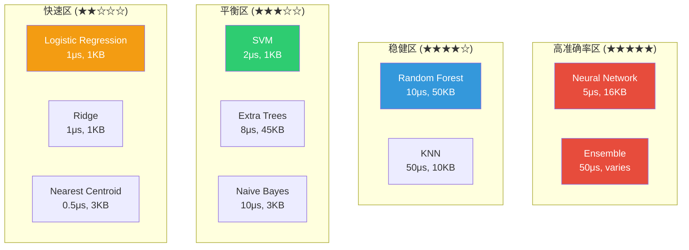

## 🎯 模型选择决策树

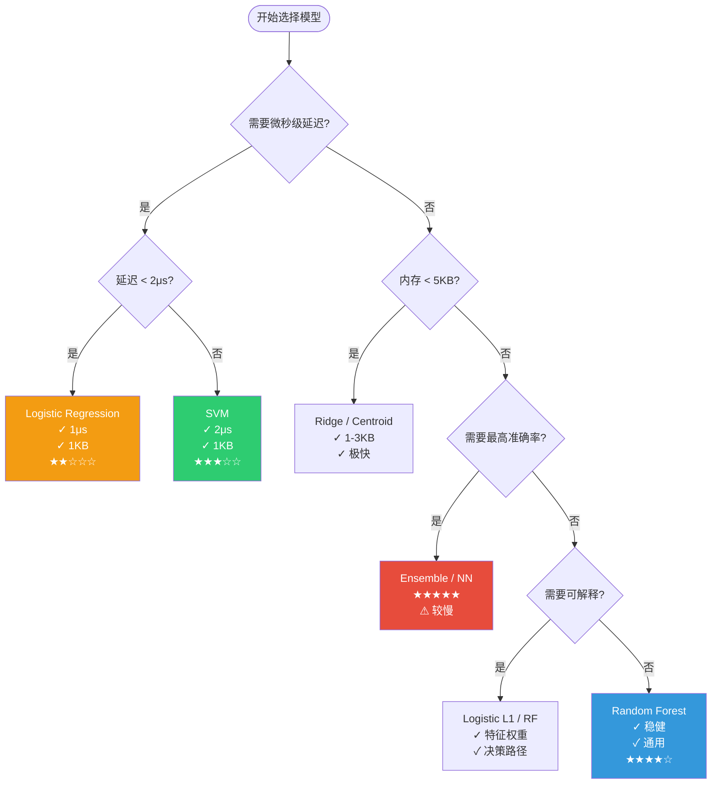

## 🏗️ 模型架构图谱

### Random Forest 架构

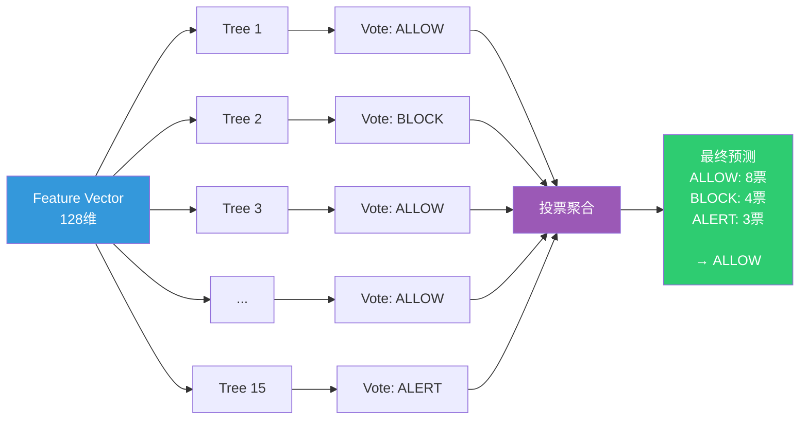

### Neural Network 架构

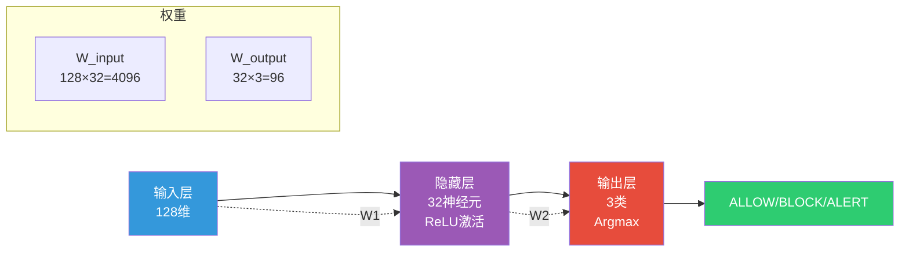

### SVM 决策边界

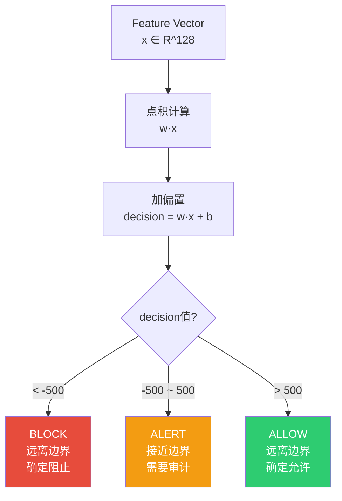

## 📈 性能矩阵热图

### 内核态模型性能比较

| 指标 / 模型 | Logistic | SVM | NN | Random Forest |
|-----------|---------|-----|----|--------------|
| **推理延迟** | 🟢🟢🟢🟢🟢 | 🟢🟢🟢🟢⚪ | 🟢🟢🟢⚪⚪ | 🟢🟢⚪⚪⚪ |
| **内存占用** | 🟢🟢🟢🟢🟢 | 🟢🟢🟢🟢🟢 | 🟢🟢🟢⚪⚪ | 🟢⚪⚪⚪⚪ |
| **准确率** | 🟢🟢⚪⚪⚪ | 🟢🟢🟢⚪⚪ | 🟢🟢🟢🟢🟢 | 🟢🟢🟢🟢⚪ |
| **可解释性** | 🟢🟢🟢🟢⚪ | 🟢🟢🟢⚪⚪ | 🟢⚪⚪⚪⚪ | 🟢🟢🟢🟢⚪ |
| **训练速度** | 🟢🟢🟢🟢⚪ | 🟢🟢🟢⚪⚪ | 🟢⚪⚪⚪⚪ | 🟢🟢🟢⚪⚪ |

图例：🟢 好 | ⚪ 中

## 🔄 模型家族谱系

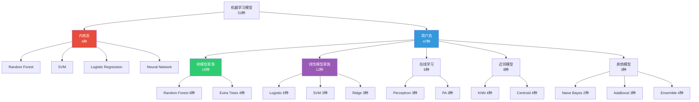

## 🎯 使用场景地图

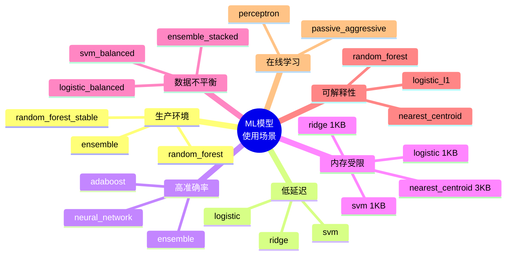

## 📊 训练时间分布

```mermaid
gantt
    title 模型训练时间对比 (1000 样本)
    dateFormat X
    axisFormat %s

    section 极快 <0.2s
    Nearest Centroid :0, 1
    Naive Bayes      :0, 2

    section 快速 0.2-1s
    Logistic         :0, 5
    Ridge            :0, 4
    Perceptron       :0, 6

    section 中等 1-5s
    SVM              :0, 15
    Random Forest    :0, 30
    Extra Trees      :0, 20

    section 较慢 5-30s
    Neural Network   :0, 150
    AdaBoost         :0, 80

    section 慢 >30s
    Ensemble         :0, 400
```

## 🔬 特征工程流程

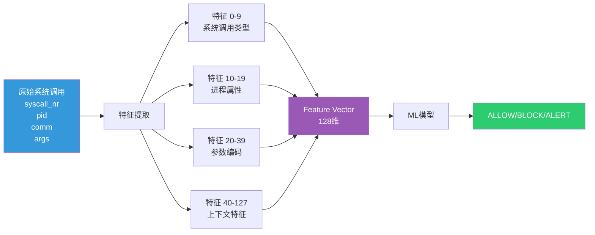

## 🚀 推理管线

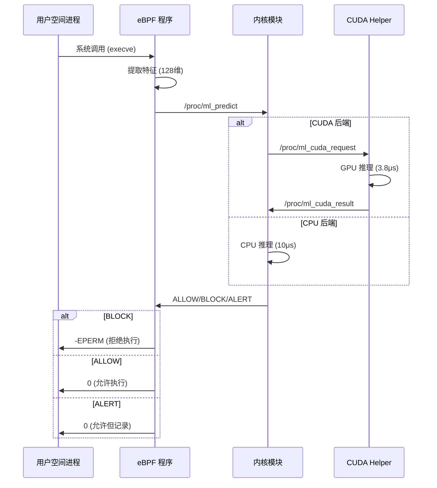

## 📦 模型文件格式

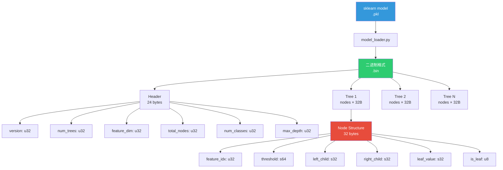

---

## 📚 相关文档

- [ML 模型速查表](./ml-models-summary.md)
- [ML 模型完整指南](./ml-models-complete-guide.md)
- [内核态多模型实现](/backend/multi-model-complete)
