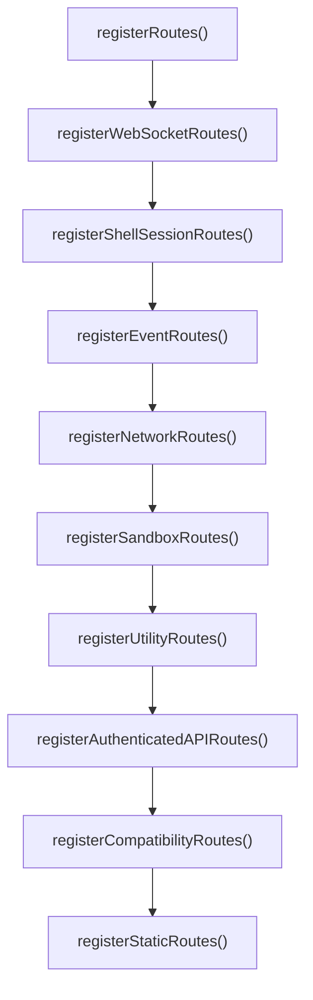

# 路由与 API

路由总入口是 `backend/app/routes__routes.go`。

## 注册顺序

## WebSocket routes

| 路径 | 用途 | 条件 |
| --- | --- | --- |
| `/ws` | protobuf event stream | auth |
| `/ws/system` | system stats | auth |
| `/ws/camera` | camera stream | auth |
| `/ws/sensors` | sensors stream | auth |
| `/ws/microphone` | microphone stream | auth |
| `/ws/ml-status` | ML status stream | `FeatureML` |
| `/ws/envelopes` | EventEnvelope stream | auth |
| `/ws/events/graph` | Execution graph stream | auth |
| `/ws/tls-capture` | TLS capture stream | `FeatureTLSCapture` |

## Shell session routes

受 `FeatureShellSessions`、`authMiddleware()` 和 `shellSessionsEnabledMiddleware()` 保护：

- `POST /shell-sessions`
- `GET /shell-sessions`
- `DELETE /shell-sessions/:id`
- `POST /shell-sessions/:id/input`
- `GET /ws/shell`
- `GET /ws/shell-sessions`

## Event routes

- `GET /events/recent`
- `GET /events/graph`
- `GET /events/recording`
- `POST /events/recording/start`
- `POST /events/recording/stop`
- `POST /events/recording/replay`
- `POST /events/recording/browser/save`

## Network routes

- `GET /network/flows`
- `GET /network/flows/:flowID`
- `GET /network/tcp-state`
- `GET /network/analyze`
- `GET /network/dns-lookup`
- `GET /network/dns-cache`
- `GET /network/interfaces`
- `GET /network/geoip`
- `GET /network/export/jsonl`（`FeatureNetworkExport`）
- `POST /network/export-pcap`（`FeatureNetworkExport`）

## Sandbox routes

### cgroup

- `GET /sandbox/cgroup/status`
- `POST /sandbox/cgroup/block-cgroup`
- `POST /sandbox/cgroup/unblock-cgroup`
- `POST /sandbox/cgroup/block-pid`
- `POST /sandbox/cgroup/unblock-pid`
- `POST /sandbox/cgroup/block-ip`
- `POST /sandbox/cgroup/unblock-ip`
- `POST /sandbox/cgroup/block-port`
- `POST /sandbox/cgroup/unblock-port`

写操作需要 `FeaturePolicyManagement` 编译进来并启用 runtime policy management gate。

### LSM

- `GET /sandbox/lsm/status`
- `POST /sandbox/lsm/block-exec-path`
- `POST /sandbox/lsm/unblock-exec-path`
- `POST /sandbox/lsm/block-exec-name`
- `POST /sandbox/lsm/unblock-exec-name`
- `POST /sandbox/lsm/block-file-name`
- `POST /sandbox/lsm/unblock-file-name`

## Utility routes

- `GET /metrics`
- `POST /hooks/event`
- `POST /register`
- `POST /unregister`
- `POST /cluster/heartbeat`
- `POST /cluster/register`

## Authenticated API group

`registerAuthenticatedAPIRoutes()` 用 `api := r.Group("/", authMiddleware())` 包裹：

- `/config/**`
- `/system/**`
- `/tls-capture/**`
- `/codex/capture`
- `/agentsight/**`
- `/plugins/**`
- `/data/clear-events*`
- `/shell-sessions/cleanup`
- `/mcp`
- `/cluster/state`
- `/cluster/nodes`

## Compatibility routes

- `/api/**`：AgentSight compatibility；
- `/api/v1/**`：external API。

## API 文档 (Scalar)

`registerDocsRoutes` 注册了人类可读的交互式 API 参考界面，**无需鉴权**（仅暴露端点结构，无敏感数据）：

- `GET /docs`：基于 [Scalar](https://scalar.com/) 的交互式 API Reference。OpenAPI 文档由 `buildExternalOpenAPISpec()` 生成并**内联**进页面（而非让 Scalar 二次 fetch `/api/v1/openapi.json`），因此即使 release 模式开启 auth 也能正常渲染。
- `GET /openapi.json`：未鉴权的 OpenAPI 3.0.3 文档（与 `/api/v1/openapi.json` 内容一致，供外部工具直接拉取）。

修改 external API 端点后，记得同步更新 `buildExternalOpenAPISpec()`（`backend/app/api__api_external.go`），Scalar 页面会自动反映。

## 新增 API 检查表

- 放入正确 register group；
- 是否需要 auth；
- 是否需要 runtime gate；
- 是否需要 build feature；
- 是否需要 frontend composable；
- 是否需要 `docs/integrations/external-api.md`；
- 是否涉及 security docs。

---

## 相关导航

- [后端启动链路](runtime-startup.md)
- [Runtime Settings 与 Feature Manifest](runtime-settings-features.md)
- [Runtime Gates 与 Auth](../security/runtime-gates-auth.md)
- [External API](../integrations/external-api.md)
- [代码入口索引](../reference/code-entrypoints.md)
