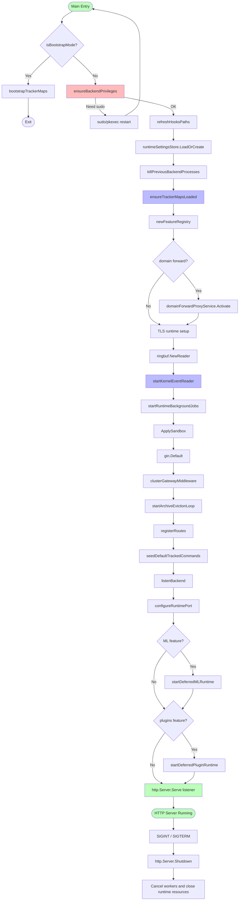
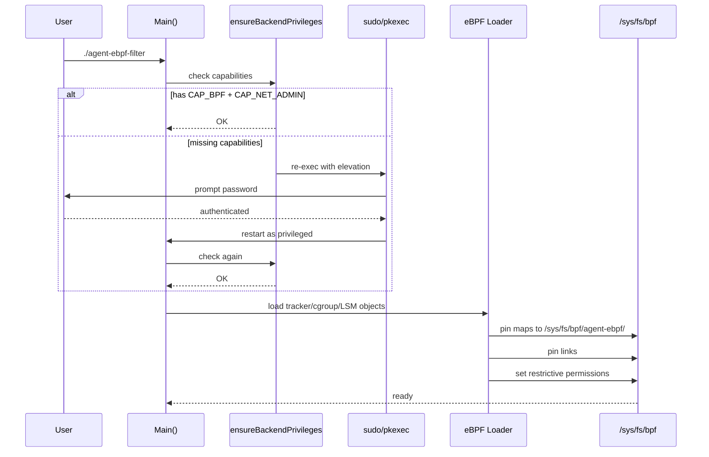
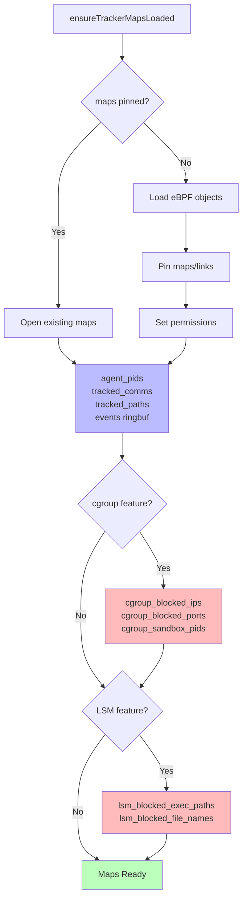

# 后端启动链路

当前后端主入口位于 `backend/app/main.go`。这点很重要：部分历史文档仍写 `backend/main.go`，维护时应以当前代码为准。

## Main() 启动顺序



## Bootstrap 与特权



启动最先处理两件事：

1. bootstrap mode：只初始化 eBPF components 后退出；
2. 特权检查：如果当前进程能力不足，后端可通过 `sudo` / `pkexec` 自提权重启。

需要特权的原因：

- 加载 eBPF object；
- attach tracepoint / cgroup / LSM；
- pin maps / links；
- 可选绑定 80/443；
- 管理 bpffs 下的 restrictive map permissions。

## Runtime settings 加载

`runtimeSettingsStore.LoadOrCreate()` 会加载或创建运行时配置，默认位置：

```bash
~/.config/agent-ebpf-filter/runtime.json
```

典型配置结构：

```json
{
  "log_persistence_enabled": true,
  "log_file_path": "~/.config/agent-ebpf-filter/events.jsonl",
  "access_token": "<auto-generated-uuid>",
  "max_event_count": 10000,
  "max_event_age": "24h",
  "shell_sessions_enabled": false,
  "system_run_enabled": false,
  "hook_management_enabled": false,
  "policy_management_enabled": false,
  "otlp_enabled": false,
  "otlp_endpoint": "http://localhost:4318/v1/traces",
  "otlp_service_name": "agent-ebpf-filter",
  "tls_capture_enabled": false,
  "ml_config": {},
  "kernel_risk_feedback": {
    "enabled": false,
    "min_risk_score": 0.7
  }
}
```

配置会影响：

- auth token；
- event archive 大小和过期时间；
- JSONL persistence；
- shell sessions；
- system run；
- hook management；
- policy management；
- TLS capture；
- OTLP；
- ML；
- domain forward；
- kernel risk feedback。

## eBPF 初始化



`ensureTrackerMapsLoaded()` 负责主 tracker maps 和 links 的加载 / 打开 / pinning。

主 pin 路径：

```text
/sys/fs/bpf/agent-ebpf/maps
/sys/fs/bpf/agent-ebpf/links
```

cgroup 与 LSM 有各自子目录：

```text
/sys/fs/bpf/agent-ebpf/cgroup_sandbox/maps
/sys/fs/bpf/agent-ebpf/cgroup_sandbox/links
/sys/fs/bpf/agent-ebpf/lsm_enforcer/maps
/sys/fs/bpf/agent-ebpf/lsm_enforcer/links
```

## 后台任务

`startRuntimeBackgroundJobs(ctx, features)` 启动：

```go
// 伪代码示例
func startRuntimeBackgroundJobs(ctx context.Context, features FeatureRegistry) {
    // 核心事件广播
    go startEventBroadcaster(ctx, broadcastChan)
    
    // Wrapper UDS 策略服务器
    go startWrapperUDSServer(ctx, "/tmp/agent-ebpf.sock")
    
    // 可选：内核风险反馈闭环
    if features.IsEnabled("kernel_risk_feedback") {
        go startKernelRiskFeedbackWorker(ctx)
    }
    
    // 网络层 GC
    go startCgroupAttributionGC(ctx)
    go startDNSCacheGC(ctx)
    go startTCPStateTrackerGC(ctx)
    go startFlowAggregatorGC(ctx)
    
    // 可选：外泄检测
    go startExfilDetectionLoop(ctx)
    
    // GeoIP 初始化
    go initGeoIPDatabase(ctx)
    
    // 可选：cgroup / LSM 加载
    if features.IsEnabled("sandbox_cgroup") {
        go loadCgroupSandbox(ctx)
    }
    if features.IsEnabled("sandbox_lsm") {
        go loadLSMEnforcer(ctx)
    }
}
```

- event broadcaster.
- kernel risk feedback worker.
- UDS server.
- cgroup attribution GC.
- DNS cache GC.
- TCP state tracker GC.
- flow aggregator GC.
- exfil detection loop.
- GeoIP init.
- optional cgroup sandbox loader.
- optional LSM enforcer loader.

## 端口选择

后端会在 `8080..8089` 选择并**直接保留**一个可用 listener，随后写入运行时端口 handoff 文件。前端 Vite dev proxy、adapters 和 hook endpoint 推导会依赖该端口。选择与实际 `Serve` 共用同一个 listener，避免“探测后释放、启动前被其他进程抢占”的 TOCTOU 竞态。

设置 `AGENT_BACKEND_PORT` 后只尝试该端口；绑定失败会作为启动错误返回，不会继续运行并发布一个实际未监听的端口。

```go
// 伪代码
func listenBackend() (net.Listener, int, error) {
    for port := 8080; port <= 8089; port++ {
        listener, err := net.Listen("tcp", fmt.Sprintf(":%d", port))
        if err == nil {
            return listener, port, nil
        }
    }
    return nil, 0, errors.New("no available backend port")
}

func configureRuntimePort(port int) {
    // 写入 backend/.port 供前端 dev proxy 和 adapters 读取
    os.WriteFile("backend/.port", []byte(strconv.Itoa(port)), 0644)
}
```

## 优雅关闭

主进程通过 `signal.NotifyContext` 处理 `SIGINT` 和 `SIGTERM`：

1. 停止接收新的 HTTP 连接，并给活动请求最多 5 秒完成；
2. 取消 runtime context，停止轮询、归档清理和其他 context-aware workers；
3. 关闭 Wrapper UDS listener 与已连接客户端，socket 路径为 `/tmp/agent-ebpf.sock`；
4. 关闭 ring buffer、TLS controller、OTel exporter、network state，并等待 research task runtime 收尾；
5. 如果优雅关闭期间再次收到终止信号，恢复操作系统默认处理，允许强制退出。

延迟启动的 ML 与插件任务也监听 runtime context，因此快速停止时不会在 shutdown 已开始后才启动。

Wrapper UDS 启动会拒绝覆盖普通文件、符号链接或仍可连接的活跃 socket；只在确认 inode 未变化后删除失效 socket。关闭时同样按 inode 校验后清理，避免误删并发创建的替代路径。listener、连接处理器和延迟 TLS attach 都纳入 runtime background job 的关闭等待边界。

---

## 相关导航

- [构建与运行](../operations/build-and-run.md)
- [运行时边界](../architecture/runtime-boundaries.md)
- [Runtime Settings 与 Feature Manifest](runtime-settings-features.md)
- [路由与 API](routes-api.md)
- [代码入口索引](../reference/code-entrypoints.md)
