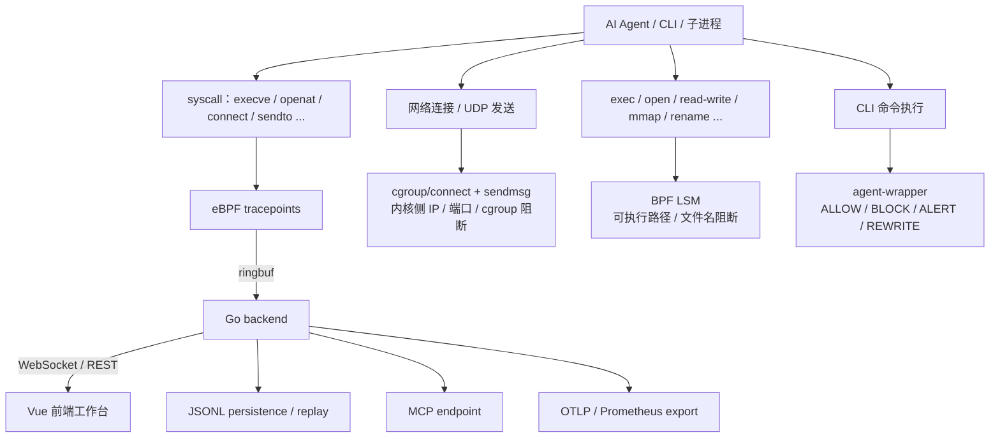

# 比赛答辩主线

> 项目：Agent eBPF Filter
> 赛道：功能挑战赛道（操作系统相关系统 / 工具方向）
> 源代码协议：GPL-3.0

Agent eBPF Filter 适合作为操作系统设计赛项目，从"内核观测 + 安全控制 + 可视化工作台 + 工程交付"四条线讲述。

---

## 项目背景与问题定义

随着 Claude Code、Codex、Gemini CLI、Copilot CLI 等自动化编程代理在开发工作流中大量使用，传统日志和终端输出无法回答：

| 问题 | 传统方案的不足 |
| --- | --- |
| Agent 实际执行了哪些命令？ | 终端日志不完整，子进程行为不可见 |
| Agent 读写了哪些文件？ | 缺少 OS 级审计，只有 Agent 自报 |
| Agent 连接了哪些网络目标？ | 缺少进程级归因，无法区分 Agent 与系统流量 |
| 行为属于哪个 Agent run / tool call？ | 无法关联 Agent 语义与 OS 事实 |
| 危险行为能否在内核侧及时阻断？ | 传统工具只观测不控制 |
| 证据链能否被回放、导出、用于答辩？ | 日志散落，无法结构化回放 |

**本项目目标**：构建围绕"AI Agent 执行链"的操作系统级观测与安全控制平面。

---

## 系统架构概述

### 核心组件

| 组件 | 位置 | 作用 |
| --- | --- | --- |
| eBPF syscall tracker | `backend/ebpf/agent_tracker.c` | 采集 9 类 syscall 事件 |
| cgroup sandbox | `backend/ebpf/cgroup_sandbox.c` | 内核侧 TCP/UDP 精确阻断 |
| BPF LSM enforcer | `backend/ebpf/lsm_enforcer.c` | 内核侧文件 / 执行强制阻断 |
| Go backend | `backend/` | HTTP/WS/MCP/API、策略管理、事件归档 |
| Vue frontend | `frontend/src/` | 实时仪表盘、网络流、行为图谱、配置管理 |
| agent-wrapper | `wrapper/main.go` | 命令侧 ALLOW/BLOCK/ALERT/REWRITE |
| Adapters | `adapters/` | Python / Node PID 注册 |
| kernel-ml | `kernel-ml/` | 可选 DKMS 内核态 ML 推理模块 |

---

## 技术方案与创新点

### 创新点 1：面向 AI Agent 的 OS 级执行链观测

传统审计工具关注单个进程或单类事件。本项目把 Agent 声明意图（hook 元数据）、wrapper 决策、eBPF syscall、网络流、文件访问、行为图谱统一成同一条执行证据链。

### 创新点 2：观测与阻断一体化

项目不仅展示事件，还提供从用户态到内核态的"纵深防御"：

- **Wrapper 层**：命令级 ALLOW/BLOCK/ALERT/REWRITE
- **cgroup eBPF 层**：精确 L4 网络阻断（cgroup id / IPv4 / IPv6 / TCP/UDP 端口）
- **BPF LSM 层**：文件系统与内核执行强控（15 个 LSM hook）
- **Runtime Gates**：动态开关高风险能力

### 创新点 3：安全基线与高风险诊断能力分离

TLS 明文捕获、PTY、`/system/run`、policy mutation、domain forwarder 等敏感能力均设计为**默认关闭**，安全基线依赖 syscall、网络元数据、digest 和脱敏后的事件。

### 创新点 4：可回放、可验证的证据链

项目包含 runtime replay benchmark、JSONL persistence、AgentSight 导入导出、Execution Graph replay，可在答辩中稳定复现正常与恶意场景。

### 创新点 5：可选内核态 ML 推理

`kernel-ml/` DKMS 模块提供纯整数定点数运算、Random Forest v2 模型、LRU 推理缓存和可选 CUDA offload，目标延迟 ~5-10μs。

---

## 核心能力展示要点

### eBPF Syscall 观测

- 覆盖 `execve`、`openat`、`connect`、`mkdirat`、`unlinkat`、`ioctl`、`bind`、`sendto`、`recvfrom` 共 9 类 tracepoint
- ringbuf + zero-copy decode 低延迟管线
- PID / TGID / comm / agent_run_id / tool_call_id / trace_id 多维关联

### cgroup 网络阻断

- cgroup/connect4 + connect6 + sendmsg4 + sendmsg6 四个 hook
- 支持精确 cgroup id、IPv4/IPv6 目的地址、IPv4-mapped IPv6、TCP/UDP 端口
- 阻断发生在连接完成前，内核级确定性

### BPF LSM 文件/执行阻断

- 覆盖 `bprm_check_security`、`file_open`、`file_permission`、`mmap_file`、`file_mprotect`、`inode_setattr`、`inode_create`、`inode_link`、`inode_symlink`、`inode_unlink`、`inode_mkdir`、`inode_rmdir`、`inode_mknod`、`inode_rename` 共 14 个 LSM hook
- 支持可执行路径、可执行 basename、文件/目录 basename 三种匹配

### 前端工作台

- Dashboard：实时事件流 + strace-style 摘要
- Network：per-process TCP/UDP flow attribution + DNS/SNI/HTTP Host 富化
- Execution Graph：Agent → Process → Tool → Syscall → File/Network → Policy 因果图
- AgentSight：Log / Timeline / Process Tree / Metrics 四视图复盘

---

## 答辩中必须说清的技术边界

::: warning 精确表述要求
以下限制必须在答辩中主动说明，避免评委质疑时无法自圆其说。
:::

- `tracked_paths` 是 **exact path** 匹配，不是递归目录树
- destination blocking 是 **exact IP/port** 匹配，不是 CIDR/range
- BPF LSM file policy 是 **basename-based**，不是路径前缀
- TLS capture **默认关闭**，是高风险诊断能力
- wrapper 是 **命令级 shim**，不是完整 sandbox
- release mode 需要 **runtime access token**
- 高风险能力需要 **runtime gate** 显式开启

---

## 与同类项目的差异化

| 对比维度 | AgentSight | 本项目 |
| --- | --- | --- |
| 技术栈 | Rust + Next.js | Go + Vue 3 |
| 产品定位 | 纯观测 | 观测 + 控制 |
| 控制能力 | 无 | wrapper / cgroup / BPF LSM |
| 安全模型 | TLS capture 默认开启 | TLS capture 默认关闭 |
| ML 推理 | 无 | 可选内核态 DKMS 模块 |
| 目标场景 | 通用观测 | 包含操作系统课程答辩交付 |

---

## 推荐叙事结构

1. **问题背景**（1min）：AI Agent 行为不可见、不可审计、难关联
2. **核心方案**（2min）：eBPF 捕获事实 + hooks/wrapper/adapters 提供语义
3. **内核能力**（3min）：tracepoint、ringbuf、cgroup、BPF LSM
4. **后端控制面**（2min）：runtime settings、auth、feature gates、EventEnvelope
5. **前端工作台**（2min）：Dashboard、Network、Execution Graph、Config
6. **安全边界**（1min）：默认关闭高风险能力、redaction、token
7. **演示与评测**（3min）：live events、network flow、policy blocking、record/replay
8. **工程交付**（1min）：Makefile、devcontainer、K8s、docs、AI usage disclosure

---

## 相关导航

- [演示脚本](demo-script.md)
- [评测报告](evaluation.md)
- [第三方与 AI 使用披露](compliance.md)
- [总体架构](../architecture/overview.md)
- [安全模型](../security/model.md)
- [文档地图](../reference/documentation-map.md)
