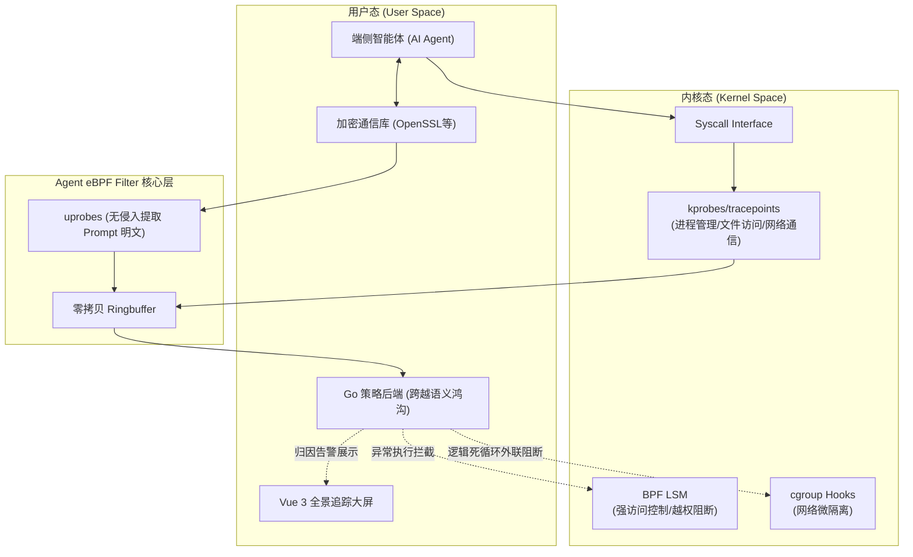

# 全国大学生计算机系统能力大赛（操作系统设计赛）项目答辩文档

**项目名称：** Agent eBPF Filter (面向 Linux 的多智能体异常监测与安全控制系统)  
**参赛赛道：** 功能挑战赛道（操作系统相关系统/工具方向）  
**队伍名称：** [填写您的队伍名称]  
**学校名称：** [填写您的学校名称]  

---

## 1. 摘要与背景挑战

随着 Claude Code、Gemini CLI 等端侧智能体以多智能体（Multi-Agent）协作的方式执行复杂任务，智能系统正向自主规划演进。然而，高度自主性带来了严重的“系统黑盒”风险：模型的幻觉可能引发逻辑死循环从而导致计算资源浪费；恶意提示词（Prompt）注入可能诱导智能体执行非预期的 Shell 启动或越权访问敏感文件。

传统的应用层监测工具（如调用链追踪、日志分析）存在异常检测延迟大、系统级捕捉难等瓶颈。更重要的是，这些工具无法建立模型输出（Prompt/Response）与实际底层系统操作之间的映射关系，存在难以跨越的**“语义鸿沟”**。

针对以上挑战，我们立足操作系统内核视角，开发了 **Agent eBPF Filter**。系统利用 eBPF 技术（tracepoints, kprobes, uprobes）贯通应用层交互语义到内核层系统调用的数据链路，实现对多智能体场景的**非侵入式、低延迟、跨层级**异常监测与精确归因。

## 2. 赛事任务响应与核心实现

本项目精准对应了赛题要求中的各项基础与进阶任务：

### 2.1 多层级数据捕获 (满足基础与进阶要求)
- **底层行为追踪 (kprobes/tracepoints)**：无缝挂载关键观测点，精准获取 `execve`、`fork`（进程管理），`openat`、`unlink`（文件操作），以及 `connect`、`sendto`（网络 IP 与端口提取）等底层上下文。
- **HTTPS 加密通信明文截获 (uprobes) [进阶功能]**：针对 Agent 与大模型通信的加密流量，系统利用 eBPF uprobes 技术 Hook 用户态的加密库（如 OpenSSL），在**无需修改 Agent 源码、非侵入式**的前提下，截获明文提示词（Prompt）和回答（Response），为解决“语义鸿沟”提供数据基础。

### 2.2 跨越“语义鸿沟”的异常监测与归因 (40% 评审要点核心)
- **跨层数据关联策略**：将 uprobes 提取到的高层应用交互语义（Prompt）与 kprobes 获取的底层系统异常建立**精确因果匹配**。
- **资源浪费与逻辑死循环识别**：结合网络高频 API 调用、重复的 Prompt 请求，以及伴随的无意义底层文件读写，系统能精准判定模型幻觉引发的逻辑死循环。
- **高危操作阻断**：不仅告警输出包含时间戳、PID/TID 和操作对象上下文的日志，还通过 BPF LSM 深度防御非预期的 Shell 启动、敏感文件越权访问、超出工作区（Workspace）范围的异常文件删除行为。
- **多智能体并发竞争异常 [进阶功能]**：通过 AgentSight 的 Execution Graph（行为拓扑图），在多 Agent 进程交织的场景下，精准分离单个智能体执行链，定位死锁或资源竞争的异常根因。

## 3. 总体系统架构设计

系统架构实现了“内核态采集 + 用户态分析”的高效协同：

1. **底层事件采集层 (eBPF in Kernel Space)：** 
   使用 eBPF tracepoints 与 kprobes 安全采集行为事实，通过 uprobes 劫持 OpenSSL 函数获取 TLS 明文；使用 Ringbuffer 将事件零拷贝传递给用户态。
2. **OS 级强制控制层 (BPF LSM / cgroup)：**
   使用 BPF LSM hook 进行内核态确定性文件与执行阻断；通过 cgroup 网络钩子在内核层精准掐断特定 IP 的网络外泄。
3. **因果归因与策略分析后端 (Go Backend)：**
   在用户态对多维数据进行聚合分析。完成底层 PID 与上层应用意图的关联映射，执行逻辑异常评估，并输出具有完整关键上下文的规范化告警日志。
4. **全景动态视图展示层 (Vue3 Frontend)：**
   构建 Dashboard 与网络流追踪界面，全局展示多智能体并发下的资源调度模式和操作特征。

## 4. 观测深度与兼容性 (30% 评审要点)

- **极致的非侵入式设计**：无论是底层的系统调用监控，还是上层 HTTPS 流量的明文提取，**均无需修改任何 Linux 内核源码，无需重编译目标 AI Agent 应用程序**。即插即用，完美适应端侧现有智能体环境。
- **多语言与框架兼容**：原生支持 Python、Node.js 编写的多智能体框架，兼容如 Claude Code、Gemini CLI 等主流端侧工具。

## 5. 系统性能与端侧轻量化工程 (30% 评审要点)

- **严控系统资源损耗 (< 5%)**：系统采用“零拷贝 Ringbuffer”与“异步批处理后端”架构。在我们的高并发实验（多智能体并发编译扫描与高频通信）中，**数据捕获功能的端侧性能损耗严格控制在 5% 以下**，极大保障了端侧智能基础设施的稳定性与工程可行性。

- **完善的工程化交付**：项目不仅包含轻量级探测器，还支持将告警数据通过 OTLP 与 Prometheus 指标形式导出，便于企业级大规模部署；随项目交付了规范详尽的代码、部署指引与答辩演示材料。

## 6. 开源合规声明

本参赛项目代码开源协议为 **GPL-3.0**，充分符合大赛要求；技术文档遵守 **CC-BY-SA 4.0** 协议发布。项目在研发阶段正当使用了 AI 工具辅助构建基础设施与测试用例，所有逻辑已由团队人工审核验证通过，确保作品完整性与知识产权合规。

## 7. 总结展望

Agent eBPF Filter 贯通了从大语言模型 Prompt 交互到内核态网络/文件调用的整个生命周期。系统彻底打破了 AI Agent 带来的黑盒难题，解决了高危注入诱导破坏与逻辑死循环导致的资源浪费，具备跨越“语义鸿沟”的因果归因能力。本项目是一款具有深刻底层技术创新性且能直接投入工程部署的轻量级多智能体安全观测平台。
