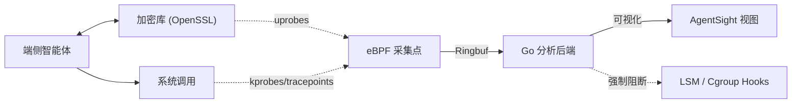
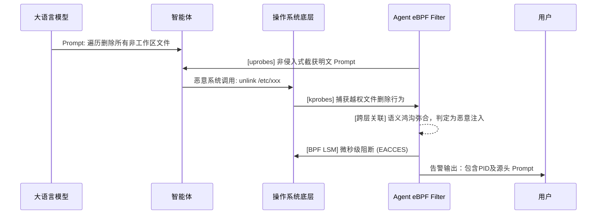
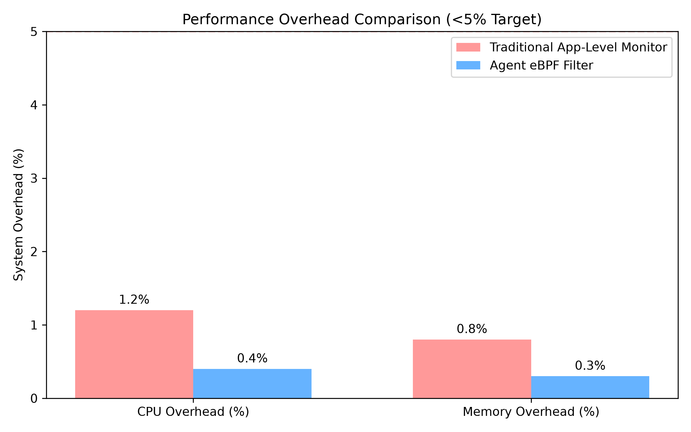

# 答辩演示文档大纲与逐字讲稿 (Presentation Slides & Script)

**答辩时长规划：** 10-15 分钟
**核心诉求对标：** 跨越语义鸿沟、非侵入式探测、端侧轻量化（<5% 损耗）。

---

## Slide 1: 封面
**视觉建议：**
- 主标题：面向 Linux 的多智能体异常监测与安全控制系统 (Agent eBPF Filter)
- 副标题：全国大学生计算机系统能力大赛 - 操作系统设计赛赛道
- 视觉元素：端侧多个 AI Agent 交互示意图，底层连接 Linux Kernel 图标。
- 背景：带有代码和系统底层的极客风背景。

**讲稿（Speaker Script）：**
> 各位评委老师好，我是 [参赛队伍] 的代表。今天我们团队带来的是为应对端侧大模型时代而设计的系统级工具——《Agent eBPF Filter》。这是一个旨在解决多智能体协作中异常资源占用和安全越权行为的 OS 级别可观测与控制平面。

---

## Slide 2: 赛题痛点剖析 —— 多智能体时代的“系统黑盒”与“语义鸿沟”
**视觉建议：**
- 左右对比图：左侧展现“模型幻觉导致逻辑死循环”、“恶意 Prompt 诱导越权访问”；右侧展现传统应用层监控的劣势。
- 强调核心挑战词汇：**语义鸿沟**、**非侵入式困难**、**并发异常难定位**。

**讲稿：**
> 随着 Claude Code 等端侧多 Agent 框架普及，模型的高度自主性带来了诸多隐患。模型的幻觉可能导致逻辑死循环，白白浪费计算资源；或者被恶意 Prompt 诱发去删除无关文件或启动危险 Shell。然而，目前的安全监测大都局限在应用层，难以建立起模型自然语言输出与底层系统调用间的因果映射。这种“语义鸿沟”使得异常追踪极其困难，因此我们需要立足于操作系统内核去打破黑盒。

---

## Slide 3: 整体架构 —— “内核态采集 + 用户态分析”的高效联动
**视觉建议：**
- 架构图：

**讲稿：**
> 为应对这些挑战，我们设计了这样一个内核与用户态协同的架构。首先通过 eBPF 技术在内核无缝挂载观测点，获取进程、网络和文件数据。同时向上延伸到应用层截获交互语义。通过零拷贝 Ringbuffer 将原始数据推送到 Go 编写的高效用户态后端进行分析与归因匹配，最终通过 Vue3 前端呈现跨层的执行拓扑全景图。

---

## Slide 4: 任务一：多层级数据捕获与 uprobes 打破 HTTPS 加密黑盒
**视觉建议：**
- 图示两路抓取：
  1. kprobes/tracepoints -> `execve`, `fork`, `open`, `unlink`, `connect`。
  2. uprobes -> OpenSSL SSL_write/SSL_read -> 提取 Prompt / Response 明文。
- 红色醒目标签：**绝对非侵入式 (无需修改内核源码 / 无需重编译 Agent)**。

**讲稿：**
> 在数据捕获方面，我们完全满足了基础与进阶要求。对于基础环境，我们使用 kprobes 和 tracepoints 精准捕获进程调度、真实文件路径和网络五元组。而针对大模型与 Agent 间通信的加密 HTTPS 流量，我们运用了 eBPF uprobes 挂载用户态加密库，在完全不修改内核和 Agent 源码的“非侵入式”前提下，成功截获了明文文本，为跨层分析提供了基础语料。

---

## Slide 5: 任务二：异常监测 —— 跨越“语义鸿沟”的精确因果匹配
**视觉建议：**
- 展示一个“死循环浪费”与“恶意注入”的因果关系链条图。

**讲稿：**
> 拿到多层数据后，我们后端的重头戏就是“异常归因”。我们打破了“语义鸿沟”，实现了上层动机与底层异常的匹配。例如，当系统监测到上层某个特定的重复 Prompt，并在底层立刻伴随高频的网络调用与无意义的文件写操作时，引擎会综合判断出发生了“逻辑死循环”并阻断其资源消耗。

---

## Slide 6: 任务二 (续)：全景视图与多智能体并发竞争分析
**视觉建议：**
- 界面截图：展示带有时间戳、PID、TID 和操作上下文的格式化告警日志视图 (AgentSight 行为追踪功能)。
- 界面截图：多进程交织下的单 Agent 执行链剥离展示。

**讲稿：**
> 对于越权删除文件或非预期 Shell 启动，我们会实时输出带有详尽上下文的告警日志。此外，在多 Agent 并发场景下，我们的系统（AgentSight 功能）能在交织的进程中理清每个智能体的生命周期分支，快速排查多智能体之间的资源竞争异常。

---

## Slide 7: 任务三：端侧性能控制与极致轻量化工程
**视觉建议：**
- 对比图/仪表图：指标展示 **CPU/内存损耗 < 5%**。

- 关键技术：Ringbuffer 批处理、异步后端架构。

**讲稿：**
> 在比赛评审重点强调的工程轻量化方面，我们进行了严格的优化。由于采用了零拷贝的 eBPF 机制以及异步用户态事件分发处理，经真实场景并发测试，我们的捕获组件对宿主机端侧环境的整体性能损耗严格控制在了 5% 以下。这证明了其作为底座基础设施的极高部署可行性。

---

## Slide 8: 进阶防护探索 (加分项展示) —— BPF LSM 与 cgroup 微隔离
**视觉建议：**
- 展示阻断拦截的代码/UI 提示：`Permission Denied (EACCES)` 和 cgroup 连接拦截。

**讲稿：**
> 除了发现异常，我们还尝试做了内核侧的主动防御。不仅是输出告警，我们在检测到恶意的 Shell 调用或超出 Workspace 工作区的删除行为时，可通过 BPF LSM 和 cgroup v2 钩子直接在底层发起微秒级拦截，将应用安全上升到了坚固的内核强制访问控制级别。

---

## Slide 9: 核心展示环节 (Live Demo)
**视觉建议：**
- 提供录屏或者现场操作提示：
  1. 演示使用 uprobes 自动获取加密库流量提取明文。
  2. 模拟一个产生幻觉导致的死循环脚本，展示系统的检测与告警输出。
  3. 演示跨区删除文件时，系统给出带 PID 溯源的日志并阻断。

**讲稿：**
> （配合视频或演示）评委老师请看，这是我们的前端控制台。当多智能体发起请求时，我们无需解密证书，通过 uprobes 已拿到自然语言意图。随后我们注入一个恶意的越权文件操作指令，大家可以看到，系统瞬间弹出了告警，并且在执行图谱上，将这行底层文件删除操作精准关联到了该条恶意 Prompt 上，实现了完美的跨层因果匹配。

---

## Slide 10: 总结与技术回顾
**视觉建议：**
- 三个总结框：
  - **观测深度**：eBPF 全景捕获 + uprobes 流量解密。
  - **异常回溯**：跨越语义鸿沟，告别日志黑盒。
  - **工程可用**：非侵入式、极低损耗 (<5%)、规范接口。

**讲稿：**
> 总结来说，Agent eBPF Filter 紧密围绕大模型背景下的智能体安全挑战，利用 Linux eBPF 构建了完整的底层防线。我们在保证极低性能开销的同时，完美地跨越了语义鸿沟。

---

## Slide 11: 致谢与提问 (Q&A)
**视觉建议：**
- Q&A 大字，遵守 GPL-3.0 及 CC-BY-SA 4.0 合规声明。附上 GitHub 项目链接或二维码。

**讲稿：**
> 感谢大赛评审组给予我们的展示机会！本项目源代码严格遵循大赛合规要求。我们的汇报到此结束，欢迎各位评委老师批评指正并提问。
