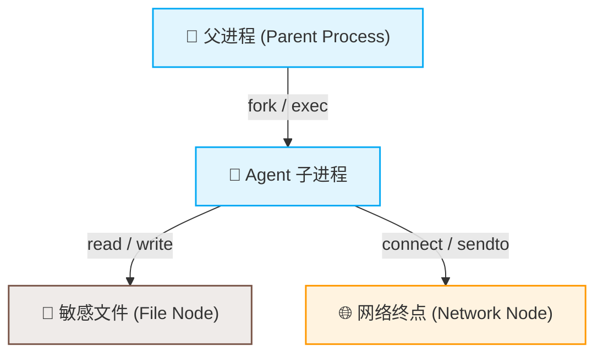

# 🗺️ Execution Graph（进程执行图谱）

Execution Graph 视图为审计人员提供了一个**以进程为核心节点的全时空因果拓扑图谱**。传统的日志列表难以呈现复杂的子进程树和文件/网络资源竞争关系，而执行图谱通过可视化的关系连线将整个 Agent 执行期间的操作系统事实串联成一条清晰的证据链。

---

## 1. 节点与关系模型

执行图谱由以下几类节点和关系构成：

* **进程节点 (Process Node)**：包含 PID、进程名（comm）、执行时间、异常评分、运行状态（在线/退出）。
* **资源节点**：
  * **文件节点 (File Node)**：被进程操作的文件（如 `openat`, `mkdir`, `unlink`），标注为 `READ`、`WRITE`、`CREATE` 或 `DELETE`。
  * **网络节点 (Network Node)**：进程访问的远端 IP 和端口，显示连接状态。
* **关系连线 (Edge)**：
  * 进程 ➡️ 进程：`fork/exec` 派生因果树。
  * 进程 ➡️ 文件：`read/write/metadata` 读写关系。
  * 进程 ➡️ 网络：`socket connect/send` 网络流连通。

---

## 2. 前端高级交互

### 2.1 轨迹录制与回放
执行图谱与 `AgentSight` 录制回放引擎深度绑定。用户可以：
1. 载入一段历史 Agent 运行日志（JSONL 格式）。
2. 点击“Play”按钮，图谱会根据时间戳以动态时序呈现节点的诞生、连线的建立以及数据读写的发生过程。
3. 调整回放速度（如 0.5x, 1x, 2x, 5x），直观还原攻击事件发生时的系统级行为序列。

### 2.2 风险高亮与下钻分析
* **红色预警节点**：图谱会自动将触发安全策略（如越权读取 `.ssh`、派生非法子 shell）的节点高亮为红色。
* **高风险关系链**：对偏离正常开发基线的复杂管道流或循环分叉（resource-wasting loop）进行闪烁提示。
* **双向数据下钻**：在图谱中双击任意进程节点，可自动过滤 Dashboard 事件瀑布，仅呈现该进程在底层发生的所有系统调用（Syscall）明文。

---

## 🔗 相关导航

- [🎨 前端工作台总览](workbench.md) —— 前端设计模式与原则
- [📊 Dashboard 事件流](dashboard.md) —— 事件数据源头
- [📂 代码入口索引](../reference/code-entrypoints.md) —— 后端拓扑图构建算法位置
- [🎯 演示脚本](../delivery/demo-script.md) —— 演示进程图谱时的操作步骤
