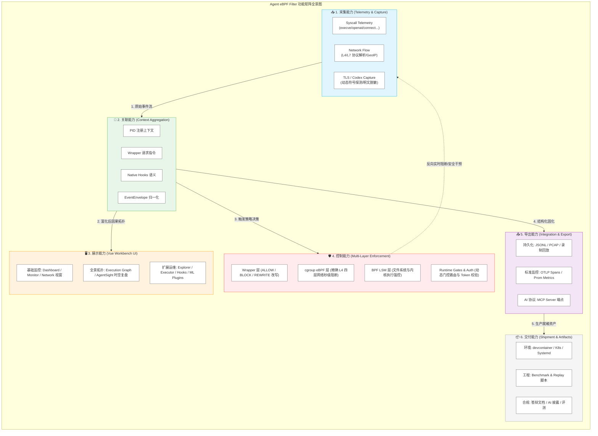

# 🎯 功能总览

Agent eBPF Filter 的核心功能聚焦于大模型智能体（AI Agent）运行时的安全与可观测性，整体可切分为“采集、关联、展示、控制、导出、交付”六大能力维度。

## 📥 1. 采集能力 (Telemetry & Capture)

### 🪟 Syscall 级别运行时观测

主 eBPF Tracker 深度覆盖以下核心系统调用（Syscall Tracepoints），构建确定性的行为审计轨：

* **进程与执行**：`execve`
* **文件系统**：`openat`、`mkdirat`、`unlinkat`
* **网络通信**：`connect`、`bind`、`sendto`、`recvfrom`
* **设备与底控**：`ioctl`

> 💡 **性能黑科技**：底层事件通过 Linux Kernel `ringbuf` 异步推送至 Go 后端。后端默认采用 **Mmap-backed Zero-copy View** 机制，针对内存对齐的 Native-endian 样本进行免拷贝高能解码；在极端或错位场景下，自动无缝回退至标准 Copy Path，确保绝对稳定性。

### 🌐 全栈网络流拓扑 (Network Flow)

在 Syscall 事件链的基础上，网络层具备深度的 L4/L7 协议解析与上下文聚合能力：

* **流归因（Flow Attribution）**：支持强确定的 TCP / UDP 流量到进程/线程的绑定。
* **协议与上下文富化**：自动提取并富化 DNS / SNI / HTTP Host / ALPN 等关键元数据。
* **网络画像与状态**：支持网络接口实时流量图（Traffic Charts）、死流/历史流（Stale/Historic Flow）标记、TCP 状态机跟踪及边缘协议侦测（Protocol Detection）。
* **地理与导出**：内建 GeoIP 归属地解析，支持一键导出标准 JSONL 或 PCAP 原始报文。

### 🔑 TLS / Codex 明文捕获 (敏感诊断)

> ⚠️ **高风险审计警示**
> TLS 明文捕获作为可选的深层诊断能力，**默认保持关闭**。
> * **动态探测**：启用后支持对系统级 OpenSSL、GnuTLS、NSS 以及 Go 运行时 TLS 符号表的自动挂载与探测。
> * **Codex 显式捕获**：针对现代化 AI 应用常用的 `rustls` / `reqwest` 等无传统符号表或静态链接场景，提供源码级显式上报适配器。
> * **安全红线**：普通事件流在传输与落盘时仅携带 Metadata、摘要（Digest）以及脱敏状态（Redaction State），绝不在无保护状态下固化敏感明文凭据。
> 
> 

## 🔗 2. 关联能力 (Context Aggregation)

通过将“用户态语义”与“内核态事件”进行多维碰撞，实现完整的行为因果链追踪：

| 数据来源 | 核心关联语义 |
| --- | --- |
| **PID 注册 (PID Registration)** | 绑定 `root_agent_pid`、`agent_run_id`、`task_id`、`cwd`（当前工作目录）等。 |
| **包装器请求 (Wrapper Request)** | 捕获 AI CLI 触发的命令 `command`、参数摘要 `args digest`、拦截决策 `decision`、风险评分 `risk_score` 及工具元数据。 |
| **原生钩子 (Native Hooks)** | 上报 `hook_name`、`tool_name`、目标路径 `target_path` 以及 Payload 元数据。 |
| **事件统一包 (EventEnvelope)** | 封装将 Process、Tool、Syscall、Network、Policy、TLS 归一化后的标准全时空包。 |
| **执行图谱 (Execution Graph)** | 动态构建 `Agent -> Process -> Tool -> Syscall -> File / Network -> Policy` 的网状拓扑因果图。 |

## 🖥️ 3. 展示能力 (Vue Workbench UI Component Ecosystem)

前端控制台（Vue Workbench）采用模块化微视窗设计，提供极富科技感的多维立体观测体验：

### 📊 基础监控与看板

* **Dashboard**：提供实时高频事件流瀑布、多维复合过滤、详尽的系统调用详情模态框（Modal）以及人类可读的 Strace-style 行为摘要。
* **Monitor**：深度监控宿主机的 CPU、Memory、GPU 状态、磁盘 IO、Page Fault（缺页中断）、传感器温度（Sensor）以及 Systemd 服务和 Tracing 拓扑。
* **Network**：提供直观的网络事件流、Flows 列表、全景网络拓扑图（Network Graph）以及实时流量图表。

### 🗺️ 拓扑与全景透视

* **Execution Graph**：动态渲染进程树、工具调用链、受控文件系统与网络策略相互作用的宏观因果图谱。
* **AgentSight**：面向 AI 执行流的集成式全景复盘工具，提供 Log、时间轴（Timeline）、进程树（Process Tree）、多维指标（Metrics）交叉复盘，并支持快照导入与导出。

### ⚙️ 运维、控制与扩展

* **Explorer & Executor**：内建底层文件浏览器（支持安全预览与受控路径一键标记）；集成标准 PTY Web 终端、Tmux 视窗及 Launcher 启动器。
* **Hooks & Config**：AI CLI 自动化钩子的状态检测、一键安装、可视化配置；运行时控制门控（Runtime Gates）、注册表（Registry）以及系统健康度看板。
* **ML (机器学习工作台)**：支持本地异常检测模型的训练状态跟踪、参数微调、数据集管理（Dataset）以及 LLM 实时行为评分（Scoring）看板。
* **Plugins (插件中心)**：允许开发者通过低代码/无代码可视化构建器（Visual/Pseudocode Builder）或自定义 eBPF 插件无缝扩展过滤器的边界。

## 🛡️ 4. 控制能力 (Multi-Layer Enforcement)

过滤器提供从用户态到内核态的“纵深防御体系”，执行毫秒级的实时阻断与重写：

| 控制层级 | 执行机制 | 核心阻断语义 |
| --- | --- | --- |
| **Wrapper 层** | 监听 Unix Domain Socket `/tmp/agent-ebpf.sock` | 支持最上层的 `ALLOW`（放行）、`BLOCK`（阻断）、`ALERT`（告警）以及 `REWRITE`（参数改写拦截） |
| **cgroup eBPF 层** | 挂载至 cgroup `connect` / `sendmsg` 钩子 | 实现基于精确 `cgroup id`、`IPv4/IPv6` 目标地址及 `TCP/UDP` 端口的四层网络秒级阻断 |
| **BPF LSM 层** | 注入 Linux 安全模块 `exec` / `file` 核心钩子 | 基于绝对执行路径（Executable Path）、执行体别名（Basename）以及敏感目标文件名的强制访问控制 |
| **Runtime Gates** | 内存热加载路由 `/config/runtime` | 动态开关 Shell 拦截、System_run 策略、Hooks 状态、TLS 捕获、OTLP 导出以及 80/443 端口强转门控 |
| **Release Auth** | 统一生成的 Runtime Access Token | 强力保护敏感控制 API、WebSocket 广播流、MCP 端点以及外部 API 的越权访问 |

## 📤 5. 导出能力 (Integration & Data Persistence)

* **📄 结构化日志落盘 (JSONL Persistence)**：支持按需将全量或过滤后的事件实时固化写入用户目录 `~/.config/agent-ebpf-filter/events.jsonl`。
* **📼 录制与回放 (Recording & Replay)**：支持对高危历史行为或执行拓扑图谱进行“帧级快照录制”，便于离线审计与红蓝对抗回放。
* **📊 开放多格式导出**：
* **AgentSight 侧**：支持一键导出标准的 JSON、JSONL 或 CSV 表格。
* **网络取证侧**：支持导出用于流量分析的 JSONL 元数据或标准的行业 PCAP 报文文件。

* **🔌 企业级生态对接**：
* **OpenTelemetry (OTLP)**：自动将底层离散的 Syscall/网络行为，向上派生归纳为符合分布式追踪规范的 `agent.run`、`codex.task`、`tool.call` 链路 Spans。
* **Prometheus**：标准暴露 `/metrics` 端点，供 Grafana 提取系统级性能与阻断频率监控指标。
* **Model Context Protocol (MCP)**：暴露标准 `/mcp` 接口，将本系统的配置变更与事件流虚拟化为 Tools，供外部大模型直接掌控。

## 📦 6. 交付能力 (Shipment & Artifacts)

项目致力于提供“开箱即用”的高集成度完整产物：

* **🐳 容器化开发环境**：内置标准的 `devcontainer` 配置，实现工具链的一键就绪。
* **☸️ 云原生编排**：提供开箱即用的 Kubernetes Manifests（包含 DaemonSet 配置及安全特权描述）。
* **💾 传统服务集成**：内建 `systemd` 服务安装脚本，并在古老发行版上自动优雅退化至 `rc.local` 引导加载。
* **🧪 自动化基准测试**：提供专门的压力测试（Benchmark）与事件回放（Replay）工程脚本。
* **🎓 学术与合规物料**：内含专为“全国计算机系统能力挑战赛（操作系统设计赛）”准备的完整答辩文档、AI 工具使用透明度披露指引、第三方开源授权告示（Notice）以及详尽的性能评测报告模板。

## 🔗 相关导航

* [项目是什么](what-is-agent-ebpf-filter.md)
* [快速开始](quick-start.md)
* [阅读路线](reading-paths.md)
* [总体架构](../architecture/overview.md)
* [前端工作台](../frontend/workbench.md)