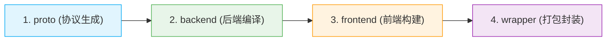

# 🚀 快速开始

欢迎使用 **Agent eBPF Filter**。本篇指引将带你以最短路径完成开发环境配置、运行、构建以及文档站的启动。

## 🛠️ 1. 环境前提

由于涉及 Linux 内核底层特性，完整运行该项目需要满足以下系统与工具链要求：

### 核心系统与内核基架

* **Linux Kernel**：必须支持 **eBPF**、**BTF**、**cgroup v2** 以及 **BPF LSM**（部分高级拦截功能强依赖）。
* **特权级运行环境**：加载 eBPF 程序、Pin Maps/Links 以及绑定可选的 `80`/`443` 端口需要 **Root 特权**。
* **网络依赖**：Native Hooks Relay 机制依赖宿主机安装有 `curl`。

### 编译与开发工具链

* **后端与内核端**：Go、clang / LLVM
* **前端与文档站**：Bun（Vite 运行环境）
* **脚本与效能**：Python / uv


## 💻 2. 核心开发流水线

项目使用 `make` 自动化编排了复杂的并行的依赖下载与环境启动，请遵循以下顺序进行本地开发。

### Step 1: 准备开发依赖

在首次拉取代码或工具链更新时运行：

```bash
make predev

```

> 💡 **原理解析**：`make predev` 会**并行**拉取并配置 Go、Python、Frontend 以及基础设施 TUI 依赖。同时，它已内建处理了常见的前端不可写 `GOPATH` 等权限痛点。

### Step 2: 一键启动开发环境

依赖就绪后，直接执行全栈热加载：

```bash
make dev

```

运行后，后端会自动在 `8080..8089` 范围内寻找可用端口，并将胜出端口写入 `backend/.port`。前端 Vite Dev Server 和各适配器（Adapters）会自动读取该文件实现**无感代理**。

**💡 专家提示：支持模块拆分启动**
如果你只想专注于单一端的调试，可选择拆分命令：

* 仅调试后端：`make dev-backend`
* 仅调试前端：`make dev-frontend`

---

## 📦 3. 组件编译与构建

当你需要进行全量打包或验证交付物时，可以使用统一构建命令：

```bash
make all

```

项目的构建依赖关系及流水线如下所示：



### 🔬 常用分项构建

如果不需要整条流水线，可以直接构建目标组件：

```bash
make proto     # 仅生成 Protobuf 桩文件
make backend   # 仅编译 Go 后端
make frontend  # 仅打包前端 Vue 资源
make wrapper   # 仅编译 Agent 包装器

```

---

## 🧪 4. 最小化快速验证手册

为了在提交代码（PR）前确保没有破坏现有功能，请根据你的**改动类型**运行对应的最小化验证命令：

| 改动影响范围 | 最小化验证命令 |
| --- | --- |
| **Markdown / 架构文档** | `bun run docs:build` |
| **Go 后端核心业务** | `cd backend && go test ./...` |
| **Wrapper 智能体包装器** | `cd wrapper && go test ./...` |
| **Vue / TypeScript 前端** | `cd frontend && bun run build` |
| **Proto 协议文件** | `make proto`，随后联合编译 backend/frontend 验证 |
| **主 eBPF Tracker 采集器** | `cd backend/ebpf && go generate` <br>

<br> `cd backend && go build ./...` |
| **cgroup / LSM 拦截内核** | `make ebpf-cgroup` 或 `make ebpf-lsm` |

---

## 📖 5. 本地文档站运维

项目文档站基于 **VitePress** 构建，文档源码均位于仓库内。

### 本地实时预览

```bash
bun install
bun run docs:dev

```

### 生产环境仿真构建

```bash
bun run docs:build    # 执行静态化编译
bun run docs:preview  # 本地启动静态服务器预览产物

```

> ⚠️ **依赖隔离说明**
> 如果本地提示找不到 `vitepress`，请务必先在根目录下执行 `bun install`。
> 请注意：**前端应用**的依赖位于 `frontend/package.json`，而**文档站**的依赖位于根目录 `package.json`，两者相互独立。

---

## ⚠️ 安全与高风险操作提示

> ❗ **重要告警**
> 以下操作带有外向网络变更或高特权系统修改效果。在非隔离的生产/测试环境执行前，**必须获得明确授权**：

* 💾 **系统集成**：`make install` 将会向系统注册并安装守护服务。
* 🛡️ **内核防御**：启动具有特权的 eBPF / cgroup / BPF LSM 实时阻断与拦截（Enforcement）。
* 🤖 **劫持配置**：修改 AI 终端的全局 CLI Hook 配置。
* 🔓 **隐私捕获**：开启 **TLS 明文捕获**（可能涉及敏感凭据泄漏风险）。
* 🌐 **流量重定向**：启用 `80`/`443` 端口的强行域名转发（Domain Forward）。
* 🗑️ **数据操作**：清空持久化历史事件，或通过 `/system/run` 开启远程交互式 Shell 终端会话。

---

## 🔗 相关导航

* 📘 [项目是什么](what-is-agent-ebpf-filter.md) —— 愿景、痛点与核心价值
* 🎯 [功能总览](capabilities.md) —— 支持哪些语义审计与阻断策略
* 🏗️ [构建与运行](../operations/build-and-run.md) —— 进阶部署与高级参数配置
* 🗺️ [总体架构](../architecture/overview.md) —— 双轨内核态与 MCP 路径深度解密
* 🧭 [阅读路线](reading-paths.md) —— 针对内核开发者与前端开发者的源码速查指南