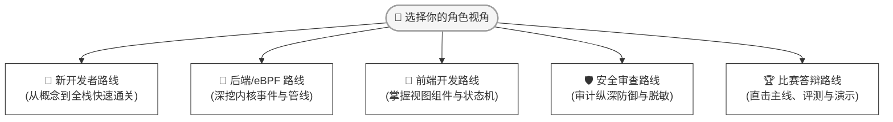

这里是为您修复后的完整阅读路线文档。重点修正了 **“2. 任务型阅读路线”** 中由于不规则换行和未转义的 `|` 字符导致的 Markdown 表格解析崩溃问题。

# 🧭 阅读路线

由于 Agent eBPF Filter 跨越了 Linux 内核态（eBPF/LSM）、用户态后端（Go）以及前端工作台（Vue 3），全站内容较为庞大。**不同角色在不同阶段的关注点完全不同**，建议根据以下量身定制的路线图进行探索。

## 🎯 路线图总览

## 🚀 1. 面向角色的渐进式路线

### 👶 新开发者路线：从零熟悉项目

> 适合刚加入项目、需要建立宏观认知并成功运行全栈系统的同学。

1. 📘 [项目是什么](/guide/what-is-agent-ebpf-filter) —— 明确愿景与核心痛点
2. 🚀 [快速开始](/guide/quick-start) —— 最短路径搭建环境、编译并跑通项目
3. 🗺️ [总体架构](/architecture/overview) —— 建立双轨制拓扑的宏观视角
4. 🌊 [数据流](/architecture/data-flow) —— 理解事件如何从内核一路走到前端
5. ⚙️ [启动链路](/backend/runtime-startup) —— 摸清后端初始化的第一行代码
6. 🔌 [路由与 API](/backend/routes-api) —— 掌握传统业务端点布局
7. 🖥️ [前端工作台](/frontend/workbench) —— 熟悉 UI 视窗的构成
8. 📂 [代码入口索引](/reference/code-entrypoints) —— 拿着地图直接对照源码阅读

### 🦀 后端 / eBPF 开发路线：深挖底控与管线

> 适合关注内核 Tracepoint、eBPF Maps 性能优化、异步零拷贝解码及 Go 策略引擎的同学。

1. ⚙️ [后端启动链路](/backend/runtime-startup) —— 关注特权提升与 eBPF 加载依赖
2. 🔀 [事件管线](/backend/event-pipeline) —— 深挖 Ringbuf Decode 到数据分流的机制
3. 🛡️ [eBPF 与 OS Enforcement](/backend/ebpf-os-enforcement) —— 研读 cgroup 与 LSM 的底层阻断实现
4. 🧱 [协议与事件模型](/architecture/protocol-events) —— 弄清序列化与归一化事件包的结构
5. 🎛️ [Runtime Settings 与 Feature Manifest](/backend/runtime-settings-features) —— 掌握动态控制门控的内存锁机制
6. 📑 [生成文件边界](/reference/generated-files) —— 理清编译期自动生成的桩代码与手写代码的物理边界

### 🎨 前端开发路线：高频视窗渲染与状态

> 适合关注大并发 WebSocket 实时事件流、数据图表平滑渲染、页面模块化扩展的同学。

1. 🖥️ [前端工作台总览](/frontend/workbench) —— 掌握前端架构底座与设计原则
2. 🛣️ [路由与功能页](/frontend/routes-and-pages) —— 熟悉各运维、监控视窗的配置入口
3. 📦 [组件与 Composables](/frontend/components-composables) —— 解耦核心复用逻辑与数据流订阅
4. 🛠️ [构建与 Feature Flags](/frontend/build-feature-flags) —— 学习如何通过编译期标记裁切非必要模块
5. 📋 [维护检查清单](/reference/maintenance-checklists) —— 确保日常 UI 改动不破坏整体规范

### 🛡️ 安全审查路线：纵深防御与合规红线

> 适合负责红蓝对抗、内核漏洞防御、敏感凭据脱敏以及 AI 智能体指令安全审计的专家。

1. 🔒 [安全模型](/security/model) —— 解构五层防御矩阵的宏观机理
2. 🎫 [Runtime Gates 与 Auth](/security/runtime-gates-auth) —— 审计 Token 鉴权与动态门控路由
3. 📜 [策略语义](/security/policy-semantics) —— 评估黑白名单、绝对路径匹配的严密性
4. 🙈 [脱敏与隐私](/security/redaction-privacy) —— 严查 TLS 明文捕获场景下的哈希摘要与内容擦除机制
5. 🤖 [Wrapper 命令策略](/integrations/wrapper) —— 走通针对 AI CLI 的本地判定与改写链路
6. 🪝 [Native Hooks](/integrations/native-hooks) —— 审查应用层语义主动上报的守卫机制
7. 🛠️ [eBPF 与 OS Enforcement](/backend/ebpf-os-enforcement) —— 从内核视角断定安全策略的强制执行度

### 🏆 比赛答辩路线：冲击奖项的最短路径

> 专为参加“全国计算机系统能力挑战赛（操作系统设计赛）”等学术/技术工程答辩打造。

1. 🥇 [比赛答辩主线](/delivery/competition-defense) —— 提炼核心创新点、赛题痛点与直击评委的演说主线
2. 🗺️ [总体架构](/architecture/overview) —— 用于答辩 PPT 的核心技术拓扑大图
3. 🎯 [功能总览](/guide/capabilities) —— 快速向评委证明项目的完备性与工程交付质量
4. 🎬 [演示脚本](/delivery/demo-script) —— 红蓝对抗实时阻断、AI 劫持拦截的可视化 Demonstration 编排
5. 📈 [评测报告](/delivery/evaluation) —— 用 Zero-copy、Mmap 吞吐量等量化指标和图表征服评委
6. 📝 [第三方与 AI 使用披露](/delivery/compliance) —— 完善开源告示与合规披露，确保评审无硬伤

## ⚡ 2. 任务型阅读路线 (直奔主题的影响链)

如果你不是从头通读文档，而是正在**迭代或修复某个具体功能**，请依照下表推荐的**上下游影响链**进行跨章节跳转：

| 当前维护任务 | 💡 推荐阅读与跳转顺序 | 🏁 提测/结束前必查项 |
| :--- | :--- | :--- |
| **新增 / 修改后端 API** | [路由与 API](/backend/routes-api)   ⬇️   [Runtime Gates 与 Auth](/security/runtime-gates-auth)   ⬇️   [External API](../external-api.md)   ⬇️   [前端路由与功能页](/frontend/routes-and-pages) | • 是否补齐了鉴权与 Gate 开关？  • 是否提供了 MCP 或 API Alias？  • 前端 Composable 订阅是否正常销毁？ |
| **修改事件字段或 Protobuf** | [协议与事件模型](/architecture/protocol-events)   ⬇️   [事件管线](/backend/event-pipeline)   ⬇️   [生成文件边界](/reference/generated-files)   ⬇️   [组件与 Composables](/frontend/components-composables) | • 运行 `make proto` 后，后端、前端和各适配器的 Struct 是否全部同步且编译通过？ |
| **调整 cgroup / BPF LSM 策略** | [eBPF 与 OS Enforcement](/backend/ebpf-os-enforcement)   ⬇️   [策略语义](/security/policy-semantics)   ⬇️   [安全模型](/security/model)   ⬇️   [验证页](/operations/verification-benchmark) | • 检查 Key 匹配语义、Pin Path 是否正确？  • Map 的读写权限是否收紧？  • Policy Gate 联动是否准确？ |
| **调整 Runtime Gate 或编译 Feature** | [Runtime Settings 与 Feature Manifest](/backend/runtime-settings-features)   ⬇️   [Runtime Gates 与 Auth](/security/runtime-gates-auth)   ⬇️   [前端 Feature Flags](/frontend/build-feature-flags) | • **严禁**将“代码编译进来了”误写或等同于“该功能在运行时默认已启用”。 |
| **调整 ML / 内核风险反馈回路** | [ML、Plugins 与扩展能力](/backend/ml-plugins)   ⬇️   [ML 模型完整指南](/backend/ml-models-complete-guide)   ⬇️   [内核 ML README](../../kernel-ml/README.md)   ⬇️   [评测报告](/delivery/evaluation) | • 后端 Registry、前端 Catalog、kernel-ml UAPI 以及本地单元测试的演进版本必须保持绝对一致。 |
| **调整 TLS / Codex 捕获与脱敏** | [脱敏与隐私](/security/redaction-privacy)   ⬇️   [Sanitization](../sanitization.md)   ⬇️   [TLS Quickstart](../backend/TLS_QUICKSTART.md)   ⬇️   [安全模型](/security/model) | • 确认该功能默认保持关闭？  • 脱敏过滤器是否生效？  • Body 裁切长度是否在安全阈值内？ |
| **仅对纯文档进行修订** | [文档地图](/reference/documentation-map)   ⬇️   [文档关系审计](/reference/documentation-audit)   ⬇️   [维护检查清单](/reference/maintenance-checklists)   ⬇️   [验证页](/operations/verification-benchmark) | • 新页面是否正确配置进 Sidebar 目录？  • 相对链接是否打破？  • 是否有对应的 Mermaid 架构同步更新？ |

## 🔍 3. 跨页校验与良好开发习惯

为了保证文档与代码库的强一致性，全团队请务必养成以下“顺手校验”的习惯：

- 📖 **能力与源码对齐**：每当你阅读文档中提到某项“高能指标或采集能力”时，请顺手翻阅 [代码入口索引](/reference/code-entrypoints)，确保能在当前源码中找到对应的底层 C / Go 函数名。
- 🔒 **默认安全策略交叉比对**：每当阅读关于“安全/默认值/脱敏”的段落描述时，请立即核对 [Runtime Gates 与 Auth](/security/runtime-gates-auth) 与 [策略语义](/security/policy-semantics) 的代码逻辑，杜绝“文档安全，代码大开”的现象。
- 🧪 **构建命令闭环**：每当在文档中看到任意一条“构建/验证/压测”命令，请确保其已被收录在 [验证、测试与 Benchmark](/operations/verification-benchmark) 手册中，或已集成为标准 `make` 指令。
- 🤖 **提交前自动化审计**：
  - 每次本地文档修改完毕后，在提交 PR 前请务必至少在本地执行一次：`python3 scripts/check-doc-links.py` 确保无死链。
  - 若涉及导航栏（Sidebar）、Frontmatter 属性元数据或复杂 Mermaid 图表的变更，请本地执行 `bun run docs:build` 验证 VitePress 静态化编译是否通过。