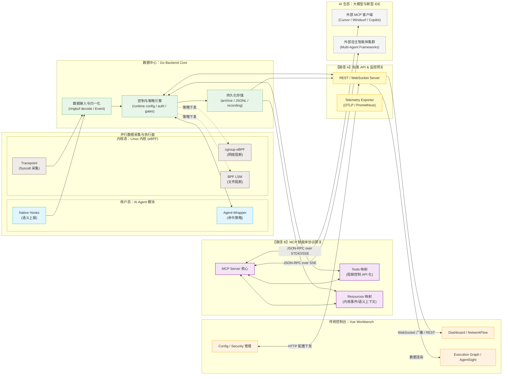

# 项目是什么

Agent eBPF Filter 是一个 Linux-first 的 AI Agent 观测与控制平面。它把 eBPF、Go、Vue、CLI wrapper、native hooks、Python / Node adapters、MCP / OTLP / Prometheus 接口和可选的 ML / plugin 能力整合在一起，用于观察、关联、分析和约束本地 Agent 与开发者 CLI 的行为。

## 一句话解释

> 用内核事实看见 Agent 行为，用用户态语义解释行为，用可视化工作台呈现证据，用 wrapper / cgroup / BPF LSM 实施控制。

## 它解决的问题

AI Agent 或自动化 CLI 往往会产生大量系统行为：执行 shell、读取配置、调用网络、生成文件、安装依赖、修改仓库。仅看 prompt 或终端输出无法确认真实 OS 行为；仅看 syscall 又缺少 Agent 语义。Agent eBPF Filter 把两者合并。

| 问题 | 本项目的回答 |
| --- | --- |
| Agent 实际做了什么？ | eBPF tracepoint 捕获 exec/open/connect/sendto/recvfrom 等事实事件。 |
| 行为属于哪个 Agent run？ | adapters、hooks、wrapper 提供 root_agent_pid、agent_run_id、tool_call_id、trace_id 等上下文。 |
| 如何查看证据？ | Dashboard、Network、Execution Graph、AgentSight、录制/回放和导出。 |
| 如何约束危险行为？ | wrapper policy、cgroup destination blocking、BPF LSM 文件/执行阻断。 |
| 如何保护敏感信息？ | redaction level、digest、sanitized_fields、TLS capture 默认关闭。 |
| 如何对外集成？ | MCP、External API、OTLP、Prometheus、Kubernetes manifests。 |

## 项目边界

本项目适合：

- 本地开发工作站的 Agent 行为审计；
- 实验节点上的 eBPF / OS enforcement 演示；
- 比赛答辩中的操作系统能力展示；
- Agent 工具链的安全研究和策略原型验证；
- 对 syscall 事实、网络流、AgentSight 事件和 OTLP span 做联合分析。

本项目不应被描述为：

- 完整容器 sandbox；
- 默认开启 TLS 明文采集的代理；
- 自动递归拦截所有路径树的文件防火墙；
- CIDR/range 级网络策略引擎；
- 替代 Kubernetes / SELinux / AppArmor 的生产级强制访问控制系统。

## 当前实现主线

## 代码入口

- 后端启动：`backend/app/main.go`
- 路由注册：`backend/app/routes.go`
- runtime settings：`backend/core/state_types.go`
- feature manifest：`backend/app/feature_manifest.go`
- 事件上下文：`backend/app/events/context_event.go`
- 主 eBPF：`backend/ebpf/agent_tracker.c`
- cgroup sandbox：`backend/ebpf/cgroup_sandbox.c`
- BPF LSM：`backend/ebpf/lsm_enforcer.c`
- 前端路由：`frontend/src/router/index.ts`
- wrapper：`wrapper/main.go`
- proto 事件：`proto/tracker_events.proto`

---

## 相关导航

- [快速开始](quick-start.md)
- [功能总览](capabilities.md)
- [总体架构](../architecture/overview.md)
- [安全模型](../security/model.md)
- [阅读路线](reading-paths.md)
