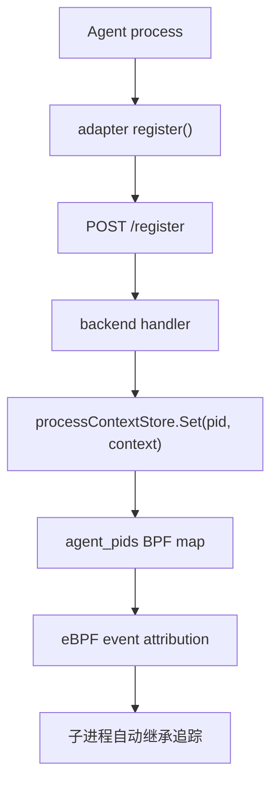
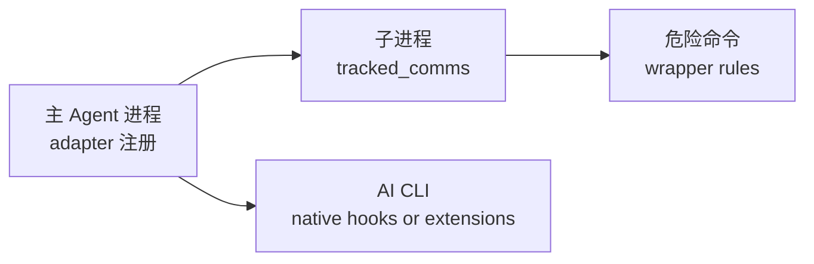

# Agents、Adapters 与 PID 注册

Agents 通过 adapters 或直接 API 调用注册当前进程 PID，使后续内核事件能关联到 Agent run / task / trace。

---

## 注册流程



---

## 支持的 Adapters

### Python Adapter

位置：`adapters/python/agent_tracker.py`

```python
from agent_tracker import AgentTracker

tracker = AgentTracker("http://127.0.0.1:8080")
tracker.start()

# 从此刻起，该进程及其子进程的 syscall 事件将被观测
import os
with open("/tmp/agent-demo.txt", "w") as f:
    f.write("hello")
print("demo pid:", os.getpid())

# 带运行上下文
tracker = AgentTracker(
    "http://127.0.0.1:8080",
    tag="My Agent",
    agent_run_id="run-001",
    trace_id="trace-abc",
    tool_call_id="tool-xyz"
)
tracker.start()
```

行为：
- 调用 `POST /register` 注册当前 PID
- 注册 `atexit` hook，进程退出时自动 `POST /unregister`
- 默认 tag 为 `AI Agent`

### Node.js Adapter

位置：`adapters/js/agentTracker.js`

```javascript
const AgentTracker = require('./agentTracker');

const tracker = new AgentTracker('http://127.0.0.1:8080');
tracker.start();

// 从此刻起观测
const fs = require('fs');
fs.writeFileSync('/tmp/agent-demo-js.txt', 'hello');
```

行为：
- 调用 `POST /register`
- 安装 `exit`、`SIGINT`、`SIGTERM` handler
- 退出时 best-effort unregister

---

## 直接调用 API

不使用 adapter 时，可直接调用注册 API：

### 注册

```bash
curl -X POST -H "Content-Type: application/json" \
  -H "X-API-KEY: <token>" \
  http://127.0.0.1:8080/register \
  -d '{
    "pid": 12345,
    "tag": "AI Agent",
    "agent_run_id": "run-001",
    "task_id": "task-222",
    "tool_call_id": "tool-456",
    "trace_id": "trace-789",
    "cwd": "/workspace/demo"
  }'
```

### 注销

```bash
curl -X POST -H "Content-Type: application/json" \
  -H "X-API-KEY: <token>" \
  http://127.0.0.1:8080/unregister \
  -d '{"pid": 12345}'
```

### 上下文字段

注册 payload 可携带以下可选字段：

| 字段 | 说明 |
| --- | --- |
| `pid` | 进程 PID（必填） |
| `tag` | 标签（默认 `AI Agent`） |
| `root_agent_pid` | 根 Agent PID |
| `agent_run_id` | Agent 运行 ID |
| `task_id` | 任务 ID |
| `conversation_id` | 会话 ID |
| `turn_id` | 对话轮次 ID |
| `tool_call_id` | 工具调用 ID |
| `tool_name` | 工具名称 |
| `trace_id` | 分布式追踪 ID |
| `span_id` | Span ID |
| `decision` | 决策记录 |
| `risk_score` | 风险评分 |
| `container_id` | 容器 ID |
| `argv_digest` | 参数摘要 |
| `cwd` | 当前工作目录 |

---

## 子进程继承追踪

- PID registration 是 **per-process** 的
- 子进程通过 `sched_process_fork` / `clone` lineage 和 userspace parent-PID fallback 自动继承追踪
- 后代进程可携带 `root_agent_pid`、`agent_run_id`、`tool_call_id`、`trace_id` 等上下文
- Adapter **不是**自动递归注册所有后代的 daemon

---

## Release Mode 认证

在 release mode 下，`/register` 和 `/unregister` 需要 runtime access token：

```bash
# 通过环境变量传递
export AGENT_API_KEY="$(jq -r .accessToken ~/.config/agent-ebpf-filter/runtime.json)"

# Python adapter 自动读取 AGENT_API_KEY 或 AGENT_EBPF_ACCESS_TOKEN
```

---

## 最佳实践

### 何时使用 Adapter

- **长时间运行的 Agent 进程**：使用 adapter 注册主进程
- **Python / Node.js Agent**：直接使用对应 adapter
- **需要 run_id / trace_id 关联**：adapter 注册时传入上下文

### 何时使用 Tracked Commands

- **子进程是常见 CLI**：如 `git`、`node`、`python`、`npm`、`cargo`、`dsh`、`pi`、`omp`
- **不想修改 Agent 代码**：通过 Configuration 页面添加命令名称
- **Shell 密集型工作流**：命令名称匹配是低开销的 exact match

### 何时使用 Native Hooks

- **监控 AI CLI 行为**：Claude Code、Gemini CLI、Codex、Pi、Oh My Pi 等
- **DeepSeek Harness**：使用 wrapper-only 的 `dsh` 命令拦截，不写入未定义的 generic hook 文件
- **需要工具调用语义**：native hook 提供 tool_name、target_path 等 Agent 层信息

### 推荐组合



---

## 相关导航

- [Wrapper 命令策略](wrapper.md)
- [Native Hooks](native-hooks.md)
- [事件管线](../backend/event-pipeline.md)
- [协议与事件模型](../architecture/protocol-events.md)
- [Runtime Gates 与 Auth](../security/runtime-gates-auth.md)
