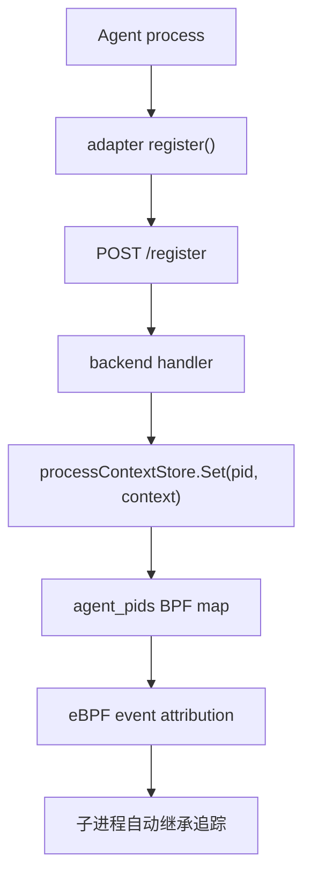
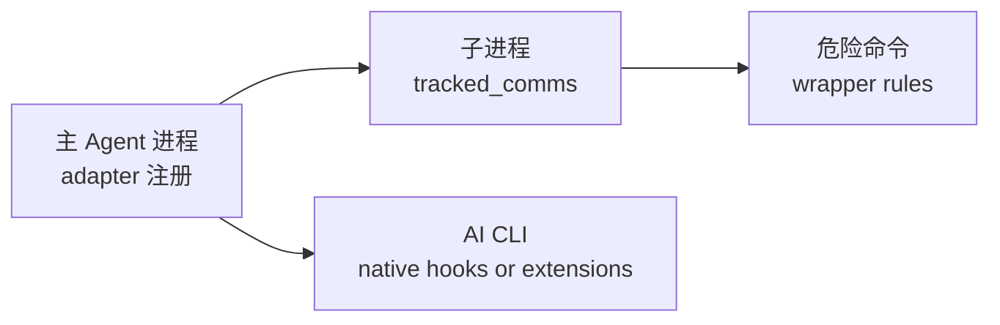

# Agents、Adapters 与 PID 注册

Agents 通过 adapters 或直接 API 调用注册当前进程 PID，使后续内核事件能关联到 Agent run / task / trace。

---

## 注册流程


```mermaid
flowchart TD
    Agent["Agent process"] --> Adapter["adapter register()"]
    Adapter --> Register["POST /register"]
    Register --> Handler["backend handler"]
    Handler --> Store["processContextStore.Set(pid, context)"]
    Store --> Map["agent_pids BPF map"]
    Map --> Attribution["eBPF event attribution"]
    Attribution --> Children["子进程自动继承追踪"]
```

---

## 支持的 Adapters

### Python Adapter

位置：`adapters/python/agent_tracker.py`

```python
from agent_tracker import AgentTracker

tracker = AgentTracker("http://127.0.0.1:8080")
tracker.start()

# 从此刻起，该进程及其子进程的 syscall 事件将被观测
import os
with open("/tmp/agent-demo.txt", "w") as f:
    f.write("hello")
print("demo pid:", os.getpid())

# 带运行上下文
tracker = AgentTracker(
    "http://127.0.0.1:8080",
    tag="My Agent",
    agent_run_id="run-001",
    trace_id="trace-abc",
    tool_call_id="tool-xyz"
)
tracker.start()
```

行为：
- 调用 `POST /register` 注册当前 PID
- 注册 `atexit` hook，进程退出时自动 `POST /unregister`
- 默认 tag 为 `AI Agent`

### Node.js Adapter

位置：`adapters/js/agentTracker.js`

```javascript
const AgentTracker = require('./agentTracker');

const tracker = new AgentTracker('http://127.0.0.1:8080');
tracker.start();

// 从此刻起观测
const fs = require('fs');
fs.writeFileSync('/tmp/agent-demo-js.txt', 'hello');
```

行为：
- 调用 `POST /register`
- 安装 `exit`、`SIGINT`、`SIGTERM` handler
- 退出时 best-effort unregister

---

## 直接调用 API

不使用 adapter 时，可直接调用注册 API：

### 注册

```bash
curl -X POST -H "Content-Type: application/json" \
  -H "X-API-KEY: <token>" \
  http://127.0.0.1:8080/register \
  -d '{
    "pid": 12345,
    "tag": "AI Agent",
    "agent_run_id": "run-001",
    "task_id": "task-222",
    "tool_call_id": "tool-456",
    "trace_id": "trace-789",
    "cwd": "/workspace/demo"
  }'
```

### 注销

```bash
curl -X POST -H "Content-Type: application/json" \
  -H "X-API-KEY: <token>" \
  http://127.0.0.1:8080/unregister \
  -d '{"pid": 12345}'
```

### 上下文字段

注册 payload 可携带以下可选字段：

| 字段 | 说明 |
| --- | --- |
| `pid` | 进程 PID（必填） |
| `tag` | 标签（默认 `AI Agent`） |
| `root_agent_pid` | 根 Agent PID |
| `agent_run_id` | Agent 运行 ID |
| `task_id` | 任务 ID |
| `conversation_id` | 会话 ID |
| `turn_id` | 对话轮次 ID |
| `tool_call_id` | 工具调用 ID |
| `tool_name` | 工具名称 |
| `trace_id` | 分布式追踪 ID |
| `span_id` | Span ID |
| `decision` | 决策记录 |
| `risk_score` | 风险评分 |
| `container_id` | 容器 ID |
| `argv_digest` | 参数摘要 |
| `cwd` | 当前工作目录 |

---

## 子进程继承追踪

- PID registration 是 **per-process** 的
- 子进程通过 `sched_process_fork` / `clone` lineage 和 userspace parent-PID fallback 自动继承追踪
- 后代进程可携带 `root_agent_pid`、`agent_run_id`、`tool_call_id`、`trace_id` 等上下文
- Adapter **不是**自动递归注册所有后代的 daemon

---

## Release Mode 认证

在 release mode 下，`/register` 和 `/unregister` 需要 runtime access token：

```bash
# 通过环境变量传递
export AGENT_API_KEY="$(jq -r .accessToken ~/.config/agent-ebpf-filter/runtime.json)"

# Python adapter 自动读取 AGENT_API_KEY 或 AGENT_EBPF_ACCESS_TOKEN
```

---

## 最佳实践

### 何时使用 Adapter

- **长时间运行的 Agent 进程**：使用 adapter 注册主进程
- **Python / Node.js Agent**：直接使用对应 adapter
- **需要 run_id / trace_id 关联**：adapter 注册时传入上下文

### 何时使用 Tracked Commands

- **子进程是常见 CLI**：如 `git`、`node`、`python`、`npm`、`cargo`、`dsh`、`pi`、`omp`
- **不想修改 Agent 代码**：通过 Configuration 页面添加命令名称
- **Shell 密集型工作流**：命令名称匹配是低开销的 exact match

## MiniMax Code（mcode）兼容

- MiniMax Code 启动器 `mcode`，以及其公开源码在启动后设置的运行时进程标题 `minimax-code` 默认作为 `Agent CLI` 追踪；现有 PID/PPID lineage 会关联可观察的子进程，但 **不会从进程名推断或伪造 run/task/tool_call ID**。
- TLS 自动发现会识别直接启动的 `mcode`、运行中的 `minimax-code`，以及源码可证明的 `@minimax-ai/code` npm 路径、`~/.minimax-code/bin/mcode` installer 启动器和源码构建 `dist/cli.js`。MiniMax Code 桌面应用源码不在公开仓库中，因此这里不假定其私有进程名或 native hook。
- Hooks 页面提供 **可选 wrapper-only** shell alias。公开 CLI 的 TUI、`exec` 与 `acp` 都从 `mcode` 入口启动；直接启动、桌面 GUI 与已经运行的进程不会因 alias 自动经过 wrapper。
- MiniMax Code 公开源码中的内置 `minimax_api` 固定使用 `anthropic-messages`：Global 默认基址为 `https://api.minimax.io/anthropic`，中国区为 `https://api.minimaxi.com/anthropic`。因此 provider fingerprint 只在对应 Host + `POST /anthropic/v1/messages` 时标记 `minimax`。
- MiniMax Code 同时支持用户自定义 BYOK provider 的 `openai-completions`、`openai-responses` 与 `anthropic-messages` 格式；这些兼容格式本身不能证明网络对端是 MiniMax。**API vendor 与调用方 harness 是两个独立维度**。
- TLS 明文采集仍受运行时开关与权限控制，默认关闭。纯 socket/eBPF 捕获不能解密 HTTPS；兼容配置不会自动开启 MITM 或读取 prompt / API key。

若需要精确的会话/任务级归属，应使用明确的 PID 注册/adapter；只有上游正式提供受支持的 hook 或 telemetry 接口时才应增加相应协议适配，不把第三方私有会话数据库当成稳定接口。

## zvec-grep 兼容

[`zvec-ai/zvec-grep`](https://github.com/zvec-ai/zvec-grep) 的 `zg` CLI 和
`zg --server --stdio` MCP bridge 已纳入 Agent eBPF Filter 的识别范围：

- `zg` 默认按 `Agent CLI` 追踪；TLS/进程元数据会将 zvec-grep 标记为
  `zvec-grep` / `zvec-ai` / `search_service`。
- zvec-grep 使用 MCP 标准的 **newline-delimited JSON** stdio 传输。AgentSight
  前端会按字节边界解析多条消息，并在采集事件把一条消息拆开时做有界重组，能够识别
  `zvec_grep_search` 和 `zvec_grep_rg` 等工具调用。
- 远程 Embedding 的请求内容仍遵循现有 TLS 脱敏和运行时开关；兼容层不会默认打开
  TLS 明文采集。

安装 zvec-grep 后可直接使用：

```bash
zg --install --target codex --yes
```

若需要将 zvec-grep 的 MCP 子进程显式关联到某一次 Agent run，仍可使用 Node
adapter 或 `/register` API 注册其 PID；仅凭 `zg` 命令识别不会伪造 run/task/trace
上下文。

### 何时使用 Native Hooks

- **监控 AI CLI 行为**：Claude Code、Gemini CLI、Codex、Pi、Oh My Pi 等
- **DeepSeek Harness**：使用原生 Cordis 插件，通过 home-level patch 观测会话与工具生命周期
- **需要工具调用语义**：native hook 提供 tool_name、target_path 等 Agent 层信息

### 推荐组合


```mermaid
flowchart LR
    Main["主 Agent 进程<br/>adapter 注册"] --> Sub["子进程<br/>tracked_comms"]
    Main --> Hook["AI CLI<br/>native hooks or extensions"]
    Sub --> Policy["危险命令<br/>wrapper rules"]
```

---

## 相关导航

- [Wrapper 命令策略](wrapper.md)
- [Native Hooks](native-hooks.md)
- [事件管线](../backend/event-pipeline.md)
- [协议与事件模型](../architecture/protocol-events.md)
- [Runtime Gates 与 Auth](../security/runtime-gates-auth.md)

### 高流量事件观察

Dashboard「全部」默认展示自动整理层：仅对当前前端缓冲窗口按进程、会话、
事件类型、目标及结果归组，优先呈现策略阻断、告警和风险评分 ≥ 70 的活动，
其次为负返回值调用。负返回值不等于安全威胁，零告警也不保证系统安全。

- 摘要与可展开的会话关联分析最多每秒更新一次，不随每个 WebSocket 批次重算。
- 分组最多显示前 50 组，每页 10 组；「最新样本」打开现有证据详情。
- 「事件明细」保留原筛选和导出功能；摘要不受明细过滤器影响，也不删除原始缓冲记录。
- 实时队列与历史加载期间的等待队列均受容量限制；溢出保留最新记录，页面显示累计移出数量。
- 页面统计不是全量历史审计。暂停接收期间不缓存或补回实时事件；导出仅覆盖当前缓冲/筛选范围。

实现分层：`dashboardTriage.ts` 负责纯函数归组，`dashboardBuffer.ts` 负责有界入队，
`useDashboardSnapshot.ts` 管理摘要刷新节奏，`DashboardTriage.vue` 负责展示与证据入口。
