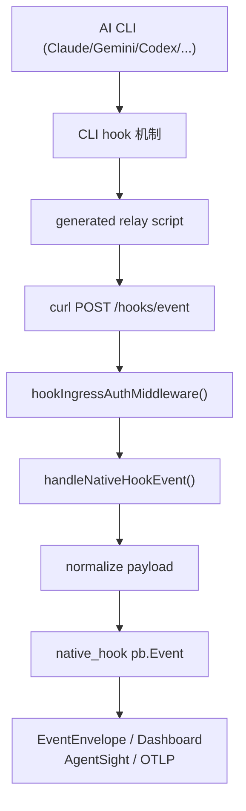

# Native Hooks

Native hooks 连接 Claude Code、Gemini CLI、Codex、GitHub Copilot、Kiro、Augment、Antigravity 等 AI CLI 的 hook 机制，把工具调用语义补充到 eBPF 事实之上。

---

## 工作原理



当 AI CLI 执行工具调用时，其 hook 机制触发 relay script，relay script 通过 `curl` 将事件 POST 到后端 `/hooks/event`。后端解析、归一化后广播到所有事件消费者。

---

## 支持的 Hook 目标

| CLI | 配置文件路径 | 安装方式 |
| --- | --- | --- |
| **Claude Code** | `~/.claude/settings.json` | Native hook |
| **Gemini CLI** | `~/.gemini/settings.json` | Native hook |
| **Codex** | `~/.codex/hooks.json` | Native hook |
| **GitHub Copilot CLI** | `~/.copilot/config.json` | Native hook |
| **Kiro CLI** | `~/.kiro/agents/agent-ebpf-hook.json` | Managed agent |
| **Augment / Auggie CLI** | `~/.augment/settings.json` | Native hook |
| **Antigravity CLI (`agy`)** | `~/.gemini/antigravity-cli/plugins/agent-ebpf-hook-active/` | Native plugin |
| **Cursor** | `~/.bashrc` / `~/.zshrc` | Wrapper alias |

---

## 安装与卸载

### 通过前端 UI

1. 进入 **Hooks** 页面
2. 选择目标 CLI
3. 点击 **安装** / **卸载**

### 安装行为

安装 native hook 时，后端会：

1. 在目标 CLI 配置目录的 `hooks/` 子目录下生成 relay script
2. 修改目标 CLI 的配置文件，注入 hook 入口
3. 为每个 hook 生成唯一的 per-hook secret

### 各 CLI 特殊行为

**Codex**：除写入 `~/.codex/hooks.json` 外，还会在 `~/.codex/config.toml` 中启用：

```toml
[features]
codex_hooks = true
```

**Kiro CLI**：创建一个 managed agent（从 `kiro_default` 克隆），写入 `~/.kiro/agents/agent-ebpf-hook.json`，并将 `~/.kiro/settings/cli.json` 中的 `chat.defaultAgent` 指向该 agent。卸载时恢复原默认 agent。

**Antigravity CLI**：在 `~/.gemini/antigravity-cli/plugins/agent-ebpf-hook-active/` 下创建 `plugin.json` 和 `hooks.json`，relay script 返回 Antigravity 要求的 JSON stdout（`decision: allow`）。

**Cursor**：使用 wrapper alias 方式，写入 `~/.bashrc` 或 `~/.zshrc`。

---

## 认证机制

### Release Mode 认证

`/hooks/event` 接受两种认证方式：

1. **Runtime access token**：`X-API-KEY`、`Authorization: Bearer` 或 `?key=`
2. **Per-hook secret**：`X-Agent-Hook-Secret` + `X-Agent-CLI` header 组合

Relay script 默认使用 per-hook secret 认证：

```bash
curl -X POST \
  -H "Content-Type: application/json" \
  -H "X-Agent-CLI: claude" \
  -H "X-Agent-Hook-Secret: <hook-secret>" \
  http://127.0.0.1:8080/hooks/event \
  -d @/path/to/hook-payload.json
```

### Hook 管理 Runtime Gate

安装 / 卸载 / 编辑 hook 配置属于危险操作，需要在 Runtime Config 中启用 `hookManagementEnabled`。

---

## Relay Script 工作原理

生成的 relay script 是 CLI-aware 的 shell 脚本：

1. 接收 CLI hook payload（stdin 或参数）
2. 补充 CLI name 和 event name（如 CLI payload 未提供）
3. 发送 `X-Agent-CLI` 和 `X-Agent-Hook-Secret` header
4. POST 到 `http://127.0.0.1:<port>/hooks/event`
5. 回调 URL 从 `AGENT_HOOK_ENDPOINT`（如设置）或 `backend/.port` 推导

### 安全数据处理

当 CLI 提供 user prompt 或 response 字段时，后端**仅存储安全元数据**：

- `sha256` digest
- 字符长度

**不持久化原始 prompt/response 文本**，从而降低隐私与合规风险。

---

## Hook 事件格式

后端接收的 hook 事件被归一化为 `native_hook` 类型的 `pb.Event`，包含：

| 字段 | 说明 |
| --- | --- |
| `cli` | CLI 标识（claude / gemini / codex 等） |
| `event_name` | 事件名称 |
| `hook_name` | Hook 配置名称 |
| `tool_name` | 工具名称（如有） |
| `target_path` | 目标路径（如有） |
| `extra_info` | 扩展信息（digest、length 等） |
| `timestamp` | 事件时间戳 |

---

## 故障排查

### Hook 安装后无事件到达

1. **检查 CLI 是否读取了正确的配置文件**：确认 CLI 版本和配置路径
2. **检查 `curl` 是否可用**：relay script 依赖 host `curl`
3. **检查后端可达性**：`curl http://127.0.0.1:<port>/hooks/event` 应返回 405（无 payload）或 401（auth）
4. **检查 hook config 标记**：配置文件中应包含 `agent-ebpf-hook-active` 标记
5. **检查 relay script 权限**：确保 relay script 有执行权限

### Hook 事件到达但无关联

- 确认后端 tracked commands / paths 是否覆盖了 CLI 执行的操作
- 检查 PID registration 是否生效

### Codex hooks 不工作

确认 `~/.codex/config.toml` 中 `[features]` 下 `codex_hooks = true` 已设置。

---

## 源码入口

- `backend/app/hooks.go` — hook 事件处理
- `backend/app/kiroantigravityhooks.go` — Kiro / Antigravity 特殊处理
- `backend/app/handlers/hooksconfig.go` — hook 配置管理 API
- `frontend/src/views/hooks/Hooks.vue` — 前端 Hook 管理页面
- `frontend/src/data/hookCatalog.ts` — hook 目标目录

---

## 相关导航

- [Agents、Adapters 与 PID 注册](agents.md)
- [Wrapper 命令策略](wrapper.md)
- [事件管线](../backend/event-pipeline.md)
- [Runtime Gates 与 Auth](../security/runtime-gates-auth.md)
- [代码入口索引](../reference/code-entrypoints.md)
