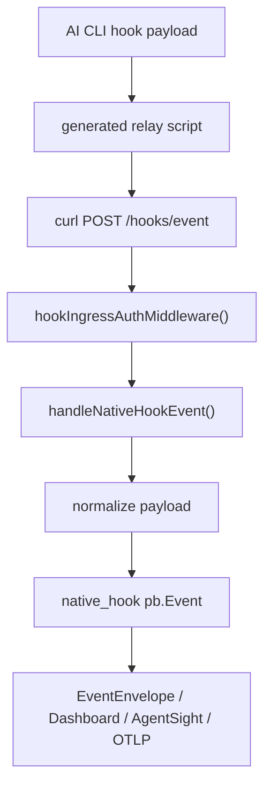

# Native Hooks

Native hooks 连接 Claude Code、Gemini、Codex、Copilot、Kiro、Cursor 等 AI CLI 的 hook 机制，把工具调用语义补充到 eBPF 事实之上。

## 链路

## 源码入口

- `backend/app/hooks__hooks.go`
- `backend/app/hooks__kiroantigravityhooks.go`
- `backend/app/handlers__handlershooksconfig.go`
- `frontend/src/views/hooks/Hooks.vue`
- `frontend/src/components/hooks/*`
- `frontend/src/data/hookCatalog.ts`
- `frontend/src/types/hooks.ts`

## 安全要求

- relay scripts 依赖 host `curl`；
- `/hooks/event` 可用 runtime token 或 per-hook secret；
- hook install / raw hook writes 是危险能力；
- 需要 runtime hook management gate；
- 修改真实 CLI hook 配置前应确认授权。

## 新 provider 清单

- detection；
- install / uninstall；
- payload parser；
- hook event display；
- frontend catalog；
- docs / README；
- per-hook secret；
- failure rollback。

---

## 相关导航

- [Agents、Adapters 与 PID 注册](agents.md)
- [Wrapper 命令策略](wrapper.md)
- [事件管线](../backend/event-pipeline.md)
- [Runtime Gates 与 Auth](../security/runtime-gates-auth.md)
- [代码入口索引](../reference/code-entrypoints.md)
