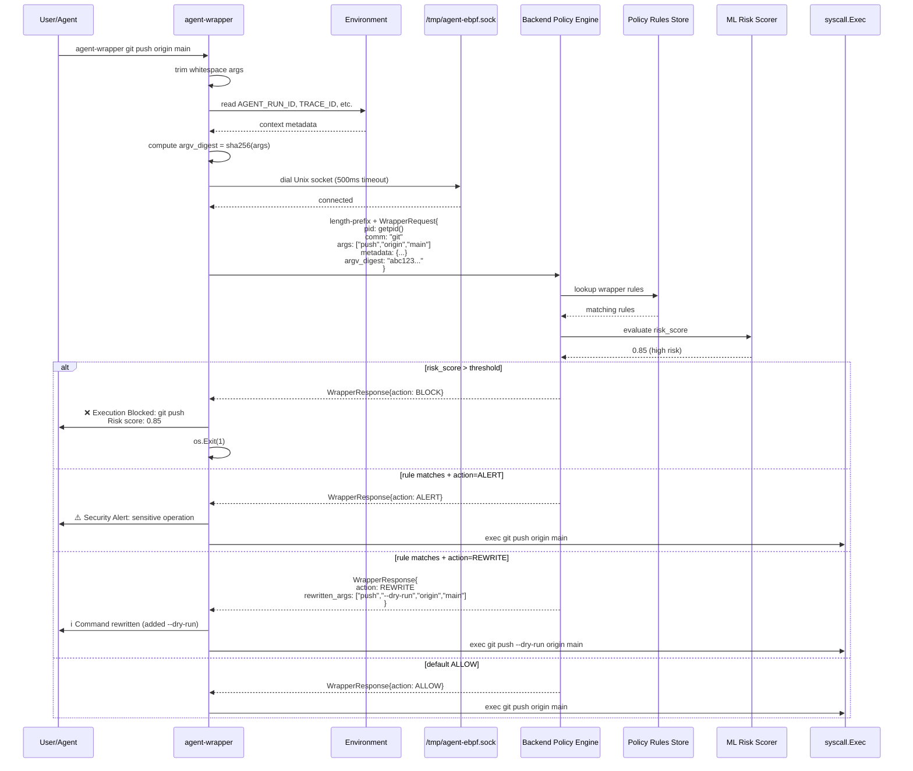
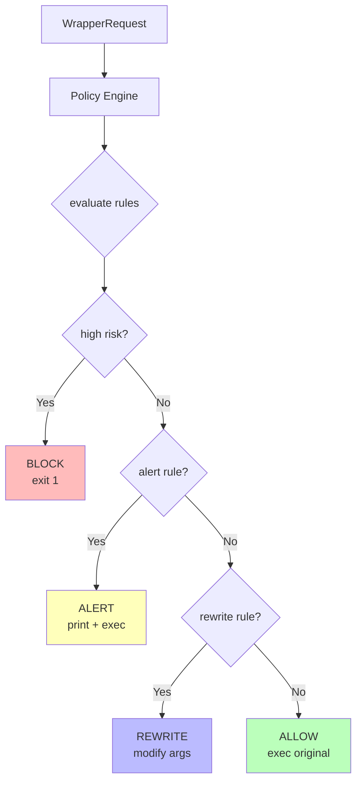
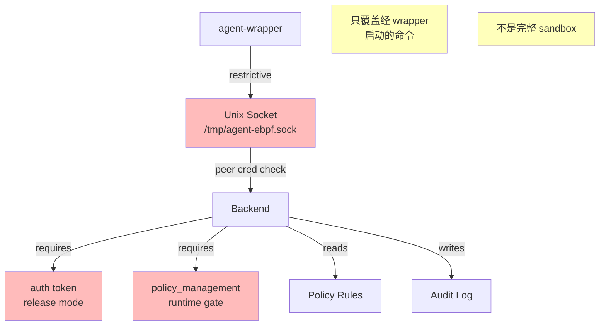

# Wrapper 命令策略

`agent-wrapper` 是命令 shim / policy layer，用于在命令执行前询问后端策略。

## 源码

- `wrapper/main.go`
- `backend/app/*uds*`
- `backend/app/*behavior*`
- `backend/app/*path_policy*`

## 执行流程



## 决策类型



| Action | 行为 |
| --- | --- |
| ALLOW | 继续执行原命令 |
| BLOCK | 打印 `Execution Blocked`，退出 1 |
| ALERT | 打印 `Security Alert`，继续执行 |
| REWRITE | 使用 `RewrittenArgs` 替换命令和参数 |

## Metadata 提取

Wrapper 从环境变量中提取 Agent context：

```go
// wrapper/main.go 伪代码
func extractMetadata() *WrapperMetadata {
    return &WrapperMetadata{
        AgentRunID:      getEnv("AGENT_EBPF_AGENT_RUN_ID", "AGENT_RUN_ID"),
        TaskID:          getEnv("AGENT_EBPF_TASK_ID", "AGENT_TASK_ID"),
        ConversationID:  getEnv("AGENT_EBPF_CONVERSATION_ID", "AGENT_CONVERSATION_ID"),
        ToolCallID:      getEnv("AGENT_EBPF_TOOL_CALL_ID", "AGENT_TOOL_CALL_ID"),
        TraceID:         getEnv("AGENT_EBPF_TRACE_ID", "TRACE_ID"),
        RiskScore:       parseFloat(getEnv("AGENT_EBPF_RISK_SCORE", "AGENT_RISK_SCORE")),
        Cwd:             getEnv("AGENT_EBPF_CWD", "PWD"),
    }
}
```

环境变量优先级：

- `AGENT_EBPF_AGENT_RUN_ID` / `AGENT_RUN_ID`
- `AGENT_EBPF_TASK_ID` / `AGENT_TASK_ID`
- `AGENT_EBPF_CONVERSATION_ID` / `AGENT_CONVERSATION_ID`
- `AGENT_EBPF_TOOL_CALL_ID` / `AGENT_TOOL_CALL_ID`
- `AGENT_EBPF_TRACE_ID` / `TRACE_ID`
- `AGENT_EBPF_RISK_SCORE` / `AGENT_RISK_SCORE`
- `AGENT_EBPF_CWD` / `PWD`

并计算 `ArgvDigest`：

```go
func computeArgvDigest(args []string) string {
    joined := strings.Join(args, " ")
    hash := sha256.Sum256([]byte(joined))
    return hex.EncodeToString(hash[:])
}
```

## 配置示例

典型 wrapper rule 配置：

```json
{
  "rules": [
    {
      "name": "block-rm-rf",
      "command_pattern": "rm",
      "args_pattern": ".*-rf.*",
      "action": "BLOCK",
      "reason": "Dangerous recursive delete"
    },
    {
      "name": "alert-git-push",
      "command_pattern": "git",
      "args_pattern": "push.*",
      "action": "ALERT",
      "reason": "Pushing to remote repository"
    },
    {
      "name": "rewrite-npm-install-add-audit",
      "command_pattern": "npm",
      "args_pattern": "install",
      "action": "REWRITE",
      "rewrite_template": ["install", "--audit"],
      "reason": "Force npm audit on install"
    }
  ]
}
```

## 安全边界



- UDS socket 应 restrictive；
- backend 应验证 peer credentials；
- protobuf 消息使用 4 字节大端长度前缀，单帧最大 4 MiB，并使用完整读写与 I/O 超时；
- policy mutation 需要 runtime gate；
- wrapper 只覆盖经它启动的命令。

---

## 相关导航

- [Agents、Adapters 与 PID 注册](agents.md)
- [Native Hooks](native-hooks.md)
- [事件管线](../backend/event-pipeline.md)
- [策略语义](../security/policy-semantics.md)
- [Runtime Gates 与 Auth](../security/runtime-gates-auth.md)
