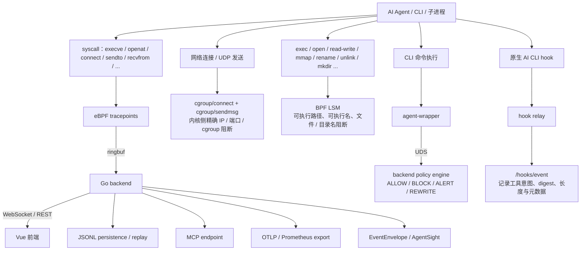
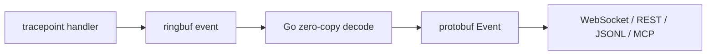
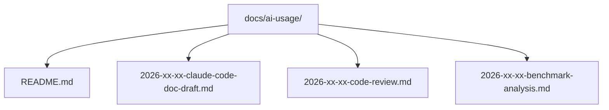

# 操作系统设计赛答辩项目文档

> 项目：Agent eBPF Filter  
> 赛道：功能挑战赛道（操作系统相关系统 / 工具方向）  
> 赛事入口：<https://os.educg.net/#/index?TYPE=26OS_F>  
> 源代码协议：GPL-3.0（见仓库根目录 `LICENSE`）  
> 本文档建议协议：CC-BY-SA 4.0（用于技术文档、答辩材料、汇报幻灯片与视频说明）  
> 状态：答辩材料草案，可在提交前补充队伍、题目编号、演示截图与评测数据。

---

## 1. 项目概述

Agent eBPF Filter 是一个面向 Linux 本地开发与实验环境的 **AI Agent 可观测与安全控制平台**。项目综合使用 eBPF、BPF LSM、cgroup、Go 后端、Vue 3 前端、CLI wrapper、多语言适配器和可选内核态 ML 推理模块，对 AI 编程代理和开发者 CLI 的文件访问、进程执行、网络连接、命令拦截、策略命中、行为图谱进行实时采集、分析、回放和控制。

项目解决的问题是：随着 Claude Code、Codex、Gemini CLI、Copilot CLI 等自动化编程代理在开发工作流中大量使用，传统日志和终端输出很难回答以下问题：

1. Agent 实际启动了哪些进程？
2. Agent 读取、创建、删除或修改了哪些文件？
3. Agent 连接了哪些网络地址、端口和域名？
4. Agent 声明的工具意图与真实 OS 行为是否一致？
5. 当发现危险行为时，能否在内核侧或命令侧及时阻断？
6. 赛后审计或答辩演示时，能否回放一次 Agent 运行的完整证据链？

本项目的目标不是简单记录终端日志，而是构建一个围绕 **“AI Agent 执行链”** 的操作系统级观测与安全控制平面。

---

## 2. 赛事契合度

根据用户提供的赛事规则文本和官网入口 <https://os.educg.net/#/index?TYPE=26OS_F>，功能挑战赛道鼓励参赛队综合运用操作系统、编译技术、体系结构等知识，构思并实现与操作系统相关的系统、模块或工具，展示面向需求的操作系统构造与优化能力。

Agent eBPF Filter 与该要求的契合点如下：

| 赛事关注点 | 本项目对应实现 |
| --- | --- |
| 操作系统功能与性能 | eBPF syscall tracepoint、ringbuf、zero-copy 解码、内核态阻断、事件低延迟广播 |
| 操作系统与硬件结合 | 可选 `kernel-ml` DKMS 模块支持内核态推理、CUDA helper offload、sysfs 控制 |
| 操作系统调试工具 | Dashboard、Network、Execution Graph、AgentSight 行为追踪、录制 / 回放 |
| 操作系统安全工具 | cgroup/connect、cgroup/sendmsg、BPF LSM file/exec enforcement、wrapper policy engine |
| 漏洞 / 异常行为分析 | secret access、unexpected network egress、child process、semantic mismatch、resource wasting loop 等语义告警 |
| 工程完整性 | Go 后端、Vue 前端、wrapper、adapters、MCP、OTLP/Prometheus、Kubernetes 节点部署文档 |
| 可答辩展示 | 支持实时 UI、事件回放、策略配置、网络流分析、Agent 运行证据链展示 |

---

## 3. 系统总体架构

### 3.1 高层数据流



### 3.2 核心组件

| 组件 | 位置 | 作用 |
| --- | --- | --- |
| eBPF syscall tracker | `backend/ebpf/agent_tracker.c` | 采集进程、文件、网络、目录、ioctl 等 syscall 事件 |
| cgroup sandbox | `backend/ebpf/cgroup_sandbox.c` | 在 kernel cgroup hook 中阻断指定 cgroup、IP、端口的 TCP/UDP 行为 |
| BPF LSM enforcer | `backend/ebpf/lsm_enforcer.c` | 在 LSM hook 中阻断 exec、open、read/write、mmap、rename、unlink、mkdir 等文件行为 |
| Go backend | `backend/` | 加载 eBPF、读取 ringbuf、提供 HTTP/WS/MCP/API、策略管理、事件归档 |
| Vue frontend | `frontend/src/` | 实时仪表盘、网络流、行为图谱、配置、安全策略、ML、Hook 管理 |
| agent-wrapper | `wrapper/main.go` | 命令侧拦截，向 backend 查询 ALLOW/BLOCK/ALERT/REWRITE |
| Python / JS adapters | `adapters/` | 为 Python / Node Agent 注册 PID 与运行元数据 |
| kernel-ml | `kernel-ml/` | 可选 DKMS 内核态 ML 推理模块，支持 sysfs/proc 与 CUDA helper |
| 文档与演示资产 | `docs/` | 架构、安全模型、威胁模型、benchmark、ML、AgentSight、答辩材料 |

---

## 4. 关键技术方案

### 4.1 eBPF syscall 观测

项目通过 syscall tracepoint 采集核心运行时事实。目前核心 syscall 包括：

- `execve`
- `openat`
- `connect`
- `mkdirat`
- `unlinkat`
- `ioctl`
- `bind`
- `sendto`
- `recvfrom`

采集链路为：



该方案的优势是：

1. **低侵入**：不需要修改被监控 Agent 的业务代码。
2. **事实可信**：kernel/eBPF 事件作为真实执行事实来源。
3. **低延迟**：ringbuf 适合高频事件传输。
4. **可关联**：通过 PID、TGID、comm、agent_run_id、tool_call_id、trace_id 关联 Agent 语义层与 OS 事实层。

### 4.2 cgroup 网络阻断

项目加载 cgroup/connect4、connect6、sendmsg4、sendmsg6 程序，对以下对象进行精确阻断：

- 指定 cgroup id
- IPv4 / IPv6 目的地址
- IPv4-mapped IPv6 地址
- TCP / UDP 目的端口
- UDP connected socket 和 sendto/sendmsg 目的地

该机制的特点是阻断发生在内核 hook 中，匹配策略后连接或发送操作在完成前直接失败，适合演示“从观测到控制”的 OS 级能力。

### 4.3 BPF LSM 文件 / 执行阻断

项目通过 BPF LSM hook 对文件与执行行为进行确定性阻断，覆盖：

- `bprm_check_security`：阻断指定可执行路径或可执行 basename
- `file_open`：阻断指定文件 basename 的打开
- `file_permission`：阻断已有 fd 的 read/write
- `mmap_file` / `file_mprotect`：阻断文件映射和权限变更
- `inode_setattr`：阻断 chmod/chown/truncate 等元数据变更
- `inode_create` / `inode_link` / `inode_symlink` / `inode_mkdir` / `inode_mknod`
- `inode_unlink` / `inode_rmdir` / `inode_rename`

这部分可作为答辩中的核心 OS 创新点：在用户态策略、hook 语义和 ML 风险评分之外，保留一条确定、可解释、低延迟的内核阻断路径。

### 4.4 Wrapper 与原生 Hook 双通道接入

项目同时支持两类 AI CLI 接入方式：

1. **agent-wrapper**：命令执行前通过 Unix Domain Socket 请求后端策略，执行 ALLOW/BLOCK/ALERT/REWRITE。
2. **原生 AI CLI hook**：为 Claude Code、Gemini CLI、Codex、GitHub Copilot、Kiro、Augment、Antigravity 等工具安装 hook relay，记录工具调用元数据。

hook 侧默认只记录安全元数据，例如 prompt/response 的 `sha256` digest 与长度，不依赖原始提示词全文，从而降低隐私与合规风险。

### 4.5 AgentSight 行为追踪与执行图谱

前端提供“追踪 / 行为追踪 / 录制回放”等视图，将低层事件转换为：

- 进程树
- 时间线
- Log view
- Metrics
- 执行拓扑图
- run / tool / trace / pid / path / domain / risk 过滤
- JSON / JSONL / CSV 导出

这使答辩演示可以从“一个 Agent 命令”展开到完整 OS 行为链路，而不只是展示孤立日志。

### 4.6 数据脱敏与高风险能力 gate

项目实现四级脱敏：

- None：仅开发环境
- Basic：明显密码 / token
- Standard：默认级别，覆盖常见敏感路径、凭证、网络信息
- Strict：高安全审计模式

TLS 明文捕获、PTY、`/system/run`、policy mutation、domain forwarder 等敏感能力均设计为默认关闭，需要运行时显式开启，并受 release-mode token 保护。

### 4.7 可选内核态 ML 推理

`kernel-ml/` 提供 DKMS 模块，用于探索内核态低延迟推理：

- 纯整数定点数运算，符合内核禁止浮点的约束
- Random Forest v1/v2 模型格式
- `/proc` 与 `/sys/kernel/kernel_ml/*` 控制接口
- exact-match LRU 缓存
- `kernel` / `cuda` / `auto` 后端
- CUDA userspace helper 超时回退
- 目标延迟约 5–10 μs，吞吐量目标 >100k 次 / 秒 / 单核

该模块适合作为功能挑战中的“操作系统与硬件结合、内核扩展、实时推理”展示点。

---

## 5. 创新点总结

### 5.1 面向 AI Agent 的 OS 级执行链观测

传统审计工具通常关注单个进程或单类事件。本项目把 Agent 声明意图、hook 元数据、wrapper 决策、eBPF syscall、网络流、文件访问、行为图谱统一成同一条执行证据链。

### 5.2 观测与阻断一体化

项目不仅展示事件，还支持：

- wrapper 命令级阻断 / 重写
- cgroup 网络内核阻断
- BPF LSM 文件与执行阻断
- policy API 动态更新
- 语义告警驱动的训练样本和规则生成

### 5.3 安全基线与高风险诊断能力分离

TLS 明文捕获、domain forwarder、PTY、运行命令等功能默认关闭；安全基线依赖 syscall、网络元数据、digest、长度和脱敏后的事件，而不是默认采集敏感明文。

### 5.4 可回放、可验证、可答辩演示

项目包含 runtime replay benchmark、JSONL persistence、AgentSight 导入导出、Execution Graph replay，可在答辩中稳定复现：

- 正常开发行为
- secret read
- unexpected network egress
- reverse shell
- workspace escape
- resource-wasting loop
- malicious MCP tool

### 5.5 工程化完整性

项目覆盖：

- 本地开发模式
- systemd / rc.local 安装
- devcontainer
- Kubernetes 节点部署
- MCP 工具集成
- OTLP / Prometheus 导出
- 前端可视化
- 文档化构建与测试命令

---

## 6. 可展示功能清单

答辩建议准备以下演示脚本，每个脚本控制在 1–2 分钟：

### 6.1 实时事件采集

1. 启动后端与前端。
2. 注册一个 Python 或 Node Agent。
3. 执行文件读取、网络请求、子进程命令。
4. 在 Dashboard 查看 `execve`、`openat`、`connect`、`sendto` 等事件。

### 6.2 网络阻断

1. 在 Configuration → Security Policies 添加一个目标 IP 或端口阻断规则。
2. 使用 Agent 或 shell 访问该目标。
3. 展示 cgroup hook 计数器增加，连接失败。

### 6.3 文件 / 执行阻断

1. 添加某个可执行 basename 或敏感文件 basename 的 BPF LSM 规则。
2. 尝试执行或读取。
3. 展示 `EACCES`、策略命中事件与 UI 状态。

### 6.4 Agent 行为图谱

1. 执行一个多步骤任务。
2. 打开“追踪 / 行为追踪”。
3. 展示进程树、时间线、执行图谱、事件过滤与导出。

### 6.5 异常行为回放

1. 运行 runtime replay benchmark 或加载已有 JSONL。
2. 展示正常 / 恶意场景分类。
3. 说明 false positive、false negative、延迟指标如何用于评估。

### 6.6 内核态 ML 推理（可选）

1. 加载 `kernel-ml` DKMS 模块。
2. 通过 `/proc/ml_load` 加载模型。
3. 通过 `/proc/ml_predict` 或 sysfs 触发推理。
4. 展示 latency、cache、backend、generation 等状态。

---

## 7. 构建与运行

### 7.1 开发依赖

项目主要技术栈：

- Go 1.26.2
- eBPF / clang / BTF
- Vue 3 + Vite + TypeScript
- Bun / Node.js 前端工具链
- protobuf
- 可选 DKMS / CUDA 工具链

### 7.2 常用命令

```bash
make predev       # 安装开发辅助依赖
make dev          # 后端 + 前端开发模式
make backend      # 构建 Go 后端并编译 eBPF
make frontend     # 构建 Vue 前端
make wrapper      # 构建 agent-wrapper
make proto        # 重新生成 protobuf bindings
make all          # 构建全部组件
make run          # 生产构建并运行
```

修改 eBPF 后：

```bash
cd backend/ebpf && go generate
cd ../.. && make backend
```

修改 proto 后：

```bash
make proto
```

### 7.3 验证命令

```bash
make os-enforcement-check
make os-enforcement-preflight
make runtime-benchmark
```

如果要做真实内核阻断 smoke，需要 root 或等价权限：

```bash
sudo -E ./backend/agent-ebpf-filter
make os-enforcement-smoke
```

---

## 8. 评测指标建议

答辩时建议准备以下量化指标：

| 指标 | 获取方式 | 说明 |
| --- | --- | --- |
| syscall 事件吞吐 | `/metrics`、collector health、benchmark | 评估 eBPF → backend 采集能力 |
| ringbuf drop rate | `/system/collector-health` | 评估高负载下是否丢事件 |
| wrapper decision latency | runtime replay summary | 评估命令拦截策略时延 |
| first alert / block latency | runtime replay summary | 评估从异常到告警 / 阻断的响应速度 |
| AgentSight 事件处理速度 | `docs/agentsight-optimization-summary.md` | 可展示 10,000 events 下处理优化 |
| eBPF 代码维护性 | `docs/ebpf-optimization-summary.md` | 展示 syscall handler 代码减少和可维护性提升 |
| kernel-ml 推理延迟 | `kernel-ml` 测试 / profiling | 展示内核态 ML 的微秒级推理能力 |

已有文档中可引用的结果包括：

- eBPF 优化：总源码行数从 4,570 行减少到 2,555 行，约 -44%。
- AgentSight 优化：10,000 events 测试下事件处理约从 450ms 降至 180ms。
- kernel-ml 目标：推理延迟约 5–10 μs，吞吐量目标 >100k 次 / 秒 / 单核。

正式答辩前建议重新在比赛指定环境或队伍机器上复测，并把硬件、内核版本、运行命令写入最终报告。

---

## 9. 开源合规与引用说明

### 9.1 项目源代码协议

仓库根目录已有 `LICENSE`，当前为 **GNU General Public License v3.0**。该协议满足赛事要求中“参赛作品源代码需遵循 GPL / Apache / BSD / 木兰协议中至少一种”的条件。

建议在最终提交中保持：

1. 根目录 `LICENSE` 不删除、不改写为不兼容协议。
2. README 与答辩 PPT 明确写出源代码协议为 GPL-3.0。
3. 若后续复制第三方代码片段，应在复制位置保留原始版权与许可证声明，并在本节补充来源、用途和授权信息。

### 9.2 文档与答辩材料协议

赛事要求技术文档、答辩材料（汇报幻灯片和视频）遵循 **CC-BY-SA 4.0**。建议：

- 在 `docs/` 赛事文档页脚注明：`本文档按 CC-BY-SA 4.0 许可发布。`
- 在答辩 PPT 封底注明：`本答辩材料按 CC-BY-SA 4.0 许可发布。`
- 如果 PPT 中使用外部图片、图标、论文图或网页截图，逐页标注来源和许可证。

### 9.3 第三方依赖

本项目大量依赖通过包管理器引入，而不是复制到项目源码中。主要依赖位置：

- Go backend：`backend/go.mod`
- Wrapper：`wrapper/go.mod`
- Frontend：`frontend/package.json`
- generated protobuf：由 `proto/tracker.proto` 生成
- 前端 `node_modules/` 不应作为参赛作品源码重点提交或人工复制内容说明对象；最终提交时可按比赛平台要求排除构建缓存与依赖目录。

需要在设计文档或附录中列出的典型依赖包括：

| 类别 | 依赖 | 用途 |
| --- | --- | --- |
| eBPF Go loader | `github.com/cilium/ebpf` | 加载、attach、管理 eBPF 程序与 maps |
| HTTP API | `github.com/gin-gonic/gin` | 后端 HTTP API 与路由 |
| WebSocket | `github.com/gorilla/websocket` | 实时事件推送 |
| PTY | `github.com/creack/pty/v2` | shell session / terminal |
| System metrics | `github.com/shirou/gopsutil/v3` | CPU、内存、进程等监控 |
| Protobuf | `google.golang.org/protobuf` / `protobufjs` | 前后端事件协议 |
| Frontend framework | `vue` / `vite` / `typescript` | 前端 UI 与构建 |
| UI / charts | `ant-design-vue`、`apexcharts`、`d3` | 控件、图表、网络图、执行图谱 |
| Observability | OpenTelemetry packages | OTLP trace export |

### 9.4 本仓库内的本地文档快照

`frontend/public/linux-docs/6.18/` 存在 Linux 6.18 LTS syscall / eBPF helper 的本地 markdown 快照，用于前端 Config 页面快速预览。该目录的 README 写明：

- Release：Linux 6.18 LTS
- Snapshot date：2026-04-28
- Syscall snapshots：61
- eBPF helper snapshots：17

最终提交前建议补充更明确的来源说明，例如来源为 Linux kernel 官方文档 / syscall man-page 对应资料，并在该目录 README 或附录中列出抓取来源 URL、用途和许可证。

### 9.5 复制 / 借鉴来源登记模板

如后续从往届作品、开源项目、博客或论文复制代码 / 文档，应逐项登记：

| 位置 | 来源 | 许可证 | 使用目的 | 修改说明 | 是否保留原版权声明 |
| --- | --- | --- | --- | --- | --- |
| `path/to/file` | URL / 项目名 / commit | GPL / Apache / BSD / CC... | 示例：学习 eBPF attach 模式 | 示例：重写为本项目数据结构 | 是 / 否 |
| TBD | TBD | TBD | TBD | TBD | TBD |

当前草案根据仓库信息未发现专门的“基于某往届作品”的声明；如果本项目确实参考过往届作品或优秀开源作品，应在第一次正式提交版本中补充“基础版本 / 参考版本 / 增量贡献”章节。

---

## 10. AI 工具使用披露

赛事允许合理使用 AI 工具，但要求在开发相关文档、设计文档、答辩 PPT、git commit 记录中单独说明 AI 工具成果及交互记录。

### 10.1 建议披露格式

| AI 工具 / 模型 | 使用场景 | 产生内容 | 人工复核方式 | 是否进入最终作品 |
| --- | --- | --- | --- | --- |
| Claude Code | 代码阅读、文档草案、测试命令建议、重构建议 | 文档草案、实现建议、局部代码修改建议 | 由队员阅读 diff、运行测试、检查许可证 | 是，经过人工确认后提交 |
| 其他模型 / IDE 插件 | TBD | TBD | TBD | TBD |

### 10.2 本文档生成说明

本文档初稿由参赛队在 Claude Code 辅助下整理，输入材料包括：

- 用户提供的赛事规则文本；
- 用户提供的赛事官网入口：<https://os.educg.net/#/index?TYPE=26OS_F>；
- 仓库内已有 README、架构文档、安全模型、威胁模型、benchmark、ML、AgentSight 优化文档；
- 当前 git 提交历史摘要。

由于当前环境直接抓取赛事网页时受到网络 / 安全策略限制，本文档未把官网页面正文作为事实来源展开，只把用户提供的链接作为赛事入口引用。正式提交前建议人工打开官网，下载或截图官方规则 PDF / 通知页面，并在最终文档中补充准确名称、届次、赛题编号、报名信息与官方规则链接。

### 10.3 交互记录保存建议

建议建立目录：



每次 AI 辅助记录包含：

1. 日期；
2. 工具名称和模型名称；
3. 输入问题摘要；
4. 输出摘要；
5. 被采纳内容；
6. 人工修改和验证结果；
7. 对应 git commit hash。

### 10.4 Commit message 中的披露建议

可在 commit message footer 中补充：

```text
AI-Assisted-By: Claude Code
AI-Usage: drafted documentation outline; human reviewed and edited
```

或在开发日志中集中记录，避免每个 commit 过长。

---

## 11. 提交记录与过程合规

赛事要求初赛阶段不少于 8 次提交记录，决赛阶段不少于 4 次提交记录，每次提交间隔建议 3–7 天并包含详细注释说明，禁止无注释批量代码提交。

当前仓库最近提交示例：

```text
7dc1b1e feat: Enhance AgentSight performance with optimizations and new components
828421b feat: Refactor redaction policy types and update related components
6acaeaf kernel-ml: Enhance model loading and inference with caching and sysfs interface
198284f Add CUDA inference support and backend selection to kernel-ml module
44cc97c feat: Complete ML model implementation - 9 algorithms total
d982a88 docs: Add multi-model implementation summary
27d5775 feat: Add multi-model support to kernel ML module
cf1cf18 docs: Add kernel ML module implementation summary
6c603e3 feat: Add kernel-space ML inference module (DKMS)
e4dee65 chore: Add eBPF optimization checklist
```

建议答辩文档附录整理为“开发迭代表”：

| 阶段 | Commit | 日期 | 类型 | 说明 |
| --- | --- | --- | --- | --- |
| 需求与基础架构 | TBD | TBD | docs / feat | 项目初始化、基础 README、架构说明 |
| eBPF 采集 | TBD | TBD | feat | syscall tracepoint、ringbuf、maps |
| wrapper / hook | TBD | TBD | feat | CLI 拦截与 AI 工具接入 |
| cgroup / LSM | TBD | TBD | feat | 内核侧阻断路径 |
| AgentSight | TBD | TBD | feat | 行为追踪与图谱 |
| ML / kernel-ml | TBD | TBD | feat | 用户态 / 内核态风险推理 |
| 性能优化 | TBD | TBD | refactor / perf | eBPF 和前端性能优化 |
| 文档与答辩 | TBD | TBD | docs | 合规说明、AI 使用披露、PPT |

---

## 12. 答辩 PPT 建议结构

1. **封面**：项目名、赛道、队伍、学校、成员、日期、协议声明。
2. **问题背景**：AI Agent 普及后 OS 行为不可见、不可控、不可回放的问题。
3. **目标与贡献**：可观测、可解释、可回放、可控制的 Agent 运行时安全平面。
4. **总体架构**：eBPF → Go backend → Vue UI；wrapper / hook；cgroup / LSM；MCP / OTLP。
5. **核心技术一：eBPF 采集**：syscall、ringbuf、maps、事件格式。
6. **核心技术二：内核阻断**：cgroup 网络阻断、BPF LSM 文件 / 执行阻断。
7. **核心技术三：行为图谱**：AgentSight、Execution Graph、录制回放。
8. **核心技术四：ML / kernel-ml**：用户态评分、DKMS 推理、CUDA helper。
9. **安全与隐私设计**：脱敏、digest、token auth、runtime gate、非目标说明。
10. **性能与评测**：benchmark、延迟、吞吐、优化结果、对比表。
11. **演示流程**：实时观测、网络阻断、文件阻断、异常回放。
12. **开源合规**：GPL-3.0、CC-BY-SA 4.0、第三方依赖、引用来源。
13. **AI 使用披露**：工具、场景、成果、人工复核、交互记录。
14. **开发过程**：提交时间线、阶段性成果、关键 bug 修复。
15. **总结与未来工作**：权限拆分、更多策略语言、更多 Agent 接入、分布式部署。

---

## 13. 未来工作

1. **权限拆分**：将 privileged eBPF bootstrap / map mutation 与普通 HTTP/UI server 拆成不同进程。
2. **策略语言**：从 exact-match maps 扩展到更高层 DSL，但保持 kernel decision path 的确定性。
3. **更完整的来源清单**：生成第三方依赖 SBOM，并在答辩附录列出许可证兼容性。
4. **比赛环境评测**：在指定内核版本和硬件上复测 latency、drop rate、阻断成功率。
5. **更细粒度 Agent 语义关联**：完善 tool_call_id、trace_id、span、OTLP 的统一展示。
6. **集群和 Kubernetes 演示**：强化节点级 Agent 行为审计与策略下发。

---

## 14. 提交前检查清单

- [ ] 根目录保留 `LICENSE`，并在 README / PPT 中写明 GPL-3.0。
- [ ] 技术文档和 PPT 标注 CC-BY-SA 4.0。
- [ ] 人工确认赛事官网的正式名称、届次、赛题编号和规则链接。
- [ ] 建立 AI 使用披露章节和交互记录目录。
- [ ] 梳理第三方依赖许可证，至少覆盖 Go / frontend / kernel-ml 主要依赖。
- [ ] 对复制的代码或文档逐处标注来源；如无复制，明确说明“未直接复制第三方源码，依赖通过包管理器引入”。
- [ ] 如参考往届作品或开源项目，列出基础版本、参考版本和增量贡献。
- [ ] 生成开发迭代表，确保提交次数和间隔符合赛事要求。
- [ ] 重新运行构建与关键 smoke / benchmark，并记录环境。
- [ ] 准备答辩演示数据和录屏备用方案。

---

## 15. 结论

Agent eBPF Filter 将 eBPF 观测、cgroup/LSM 内核阻断、AI CLI hook、命令 wrapper、行为图谱、数据脱敏、事件回放和可选内核态 ML 结合起来，形成一个面向 AI Agent 安全治理的操作系统级工具。它不仅满足功能挑战赛道对 OS 相关系统、调试工具、安全工具和软硬协同优化的要求，也具备较强的工程完整性和答辩展示性。

在最终参赛提交中，应继续补齐官方赛事链接核验、许可证来源清单、AI 使用披露、交互记录和提交时间线，以满足公平性、规范性和开源合规要求。

---

## 相关导航

- [比赛答辩主线](delivery/competition-defense.md)
- [演示脚本](delivery/demo-script.md)
- [评测报告](delivery/evaluation.md)
- [第三方与 AI 使用披露](delivery/compliance.md)
- [AI 使用记录](ai-usage/README.md)
- [第三方声明草案](third-party-notices.md)
