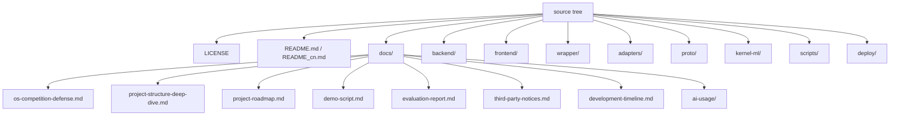

# 项目规划与交付路线图

> 项目：Agent eBPF Filter  
> 面向场景：操作系统设计赛功能挑战赛道、AI Agent 安全治理工具、Linux 本地 / 节点级观测与控制。  
> 关联结构文档：`docs/project-structure-deep-dive.md`。  
> 关联答辩文档：`docs/os-competition-defense.md`。  
> 本文档建议协议：CC-BY-SA 4.0。

---

## 1. 规划目标

本规划文档用于把当前工程从“功能丰富的研发仓库”整理为“可答辩、可评测、可迭代、可合规交付”的比赛项目。规划重点包括：

1. 明确项目愿景、边界和核心交付物；
2. 梳理已完成能力、待补齐能力和后续增强方向；
3. 制定面向比赛提交的里程碑和文档体系；
4. 建立测试、性能、合规、安全和演示准备流程；
5. 将 AI 使用披露、开源协议、引用来源、提交记录纳入工程规划。

---

## 2. 项目愿景

Agent eBPF Filter 的长期目标是成为一个 **面向 AI Agent 运行时的 Linux OS 安全观测与控制平面**。

它不只回答“Agent 输出了什么”，而是回答：

- Agent 实际运行了哪些进程；
- 访问了哪些文件；
- 连接了哪些网络地址；
- 是否触发了策略；
- 是否偏离声明意图；
- 是否能被低延迟阻断；
- 是否能在事后回放、分析和举证。

该愿景适合操作系统设计赛功能挑战赛道，因为项目同时覆盖：

- eBPF 内核观测；
- cgroup / BPF LSM 内核阻断；
- Linux 权限与运行时安全；
- OS 行为调试与可视化；
- 事件协议与跨层数据流；
- 内核态 ML / CUDA offload 探索；
- 工程化构建、部署、评测和文档交付。

---

## 3. 项目边界

### 3.1 目标内能力

| 能力 | 说明 |
| --- | --- |
| Agent 行为观测 | 基于 eBPF tracepoint 采集进程、文件、网络等 OS 事件 |
| Agent 语义关联 | 通过 PID registration、native hook、wrapper、trace id 关联语义和事实 |
| 网络与文件阻断 | 通过 cgroup/connect、cgroup/sendmsg、BPF LSM 实现内核侧阻断 |
| 命令策略控制 | 通过 agent-wrapper 实现 ALLOW/BLOCK/ALERT/REWRITE |
| 可视化分析 | Dashboard、Network、Execution Graph、AgentSight、Config、ML 等页面 |
| 录制与回放 | JSONL persistence、recording、runtime replay benchmark |
| 安全与合规 | access token、runtime gates、脱敏、危险能力默认关闭 |
| 扩展接口 | MCP、external API、OTLP、Prometheus、Kubernetes 部署 |
| 内核态 ML 探索 | DKMS 模块、定点数推理、CUDA helper offload |

### 3.2 非目标能力

| 非目标 | 原因 |
| --- | --- |
| 防御 root 攻击者 | root 可绕过或关闭本系统，需更强隔离与内核可信基 |
| 完整容器逃逸防御 | 当前是本地 / 节点观测与策略系统，不替代容器安全边界 |
| 完整网络防火墙 | 当前 cgroup 规则是 exact IP / IPv6 / port map，不是 CIDR / L7 防火墙 |
| 递归文件沙箱 | tracked path 是 exact path，LSM 文件策略是 basename，不是完整递归策略语言 |
| 默认 TLS 明文采集 | TLS capture 是高风险诊断能力，默认关闭，不作为安全基线 |
| 全自动无人工授权策略变更 | policy mutation 属于危险能力，应受 runtime gate 和 token 保护 |

---

## 4. 当前能力基线

### 4.1 已完成的核心能力

| 方向 | 当前状态 |
| --- | --- |
| eBPF syscall tracing | 已覆盖 execve、openat、connect、mkdirat、unlinkat、ioctl、bind、sendto、recvfrom 等核心事件 |
| ringbuf → backend → frontend | 已形成 live events、EventEnvelope、WebSocket、JSONL、MCP 数据链路 |
| cgroup 网络阻断 | 已支持 exact cgroup id、IPv4、IPv6、IPv4-mapped IPv6、TCP/UDP port 阻断 |
| BPF LSM 阻断 | 已覆盖 exec、open、read/write、mmap、mprotect、setattr、create/link/symlink/delete/mkdir/rmdir/mknod/rename 等 hook |
| wrapper policy | 已支持 ALLOW、BLOCK、ALERT、REWRITE |
| native AI CLI hooks | 支持多个 AI CLI 的 hook detection、installation、event ingest |
| 前端工作台 | Dashboard、Monitor、Network、Execution Graph、Executor、Hooks、Config、ML、Plugins 等页面 |
| AgentSight | 已兼容事件导入导出、行为追踪、进程树、时间线、metrics、query |
| 脱敏 | 已实现多级 redaction 和 key removal |
| runtime gates | shell、system run、hook management、policy mutation、TLS capture 等危险能力默认关闭 |
| runtime replay benchmark | 已有 offline replay scenario catalog 与 summary 指标 |
| kernel-ml | 已有 DKMS 模块、proc/sysfs、Random Forest、LRU cache、CUDA helper 探索 |
| 文档 | 已有架构、安全模型、威胁模型、benchmark、ML、TLS、答辩草案等文档 |

### 4.2 当前新增的比赛文档

| 文档 | 目的 |
| --- | --- |
| `docs/os-competition-defense.md` | 操作系统设计赛答辩项目文档草案 |
| `docs/project-structure-deep-dive.md` | 项目结构深度说明 |
| `docs/project-roadmap.md` | 本规划与交付路线图 |
| `docs/ai-usage/README.md` | AI 工具使用披露记录模板 |

---

## 5. 阶段路线图

### 阶段 0：合规与基线确认

目标：确保项目符合比赛提交和开源合规要求。

任务：

- [ ] 人工打开赛事官网 <https://os.educg.net/#/index?TYPE=26OS_F>，补充正式赛名、届次、题目编号和官方规则链接。
- [ ] 在 README / 答辩文档 / PPT 中明确源代码协议 GPL-3.0。
- [ ] 在文档和 PPT 中标注 CC-BY-SA 4.0。
- [ ] 建立第三方依赖许可证清单。
- [ ] 建立复制 / 借鉴来源登记表。
- [ ] 建立 AI 工具使用披露目录和交互记录。
- [ ] 整理 git 提交时间线，确保满足提交次数和注释要求。

交付物：

- `docs/os-competition-defense.md` 完整版；
- `docs/ai-usage/README.md` 与若干交互记录；
- `docs/third-party-notices.md`（建议新增）；
- `docs/development-timeline.md`（建议新增）。

### 阶段 1：项目结构与架构定稿

目标：把仓库结构、模块边界、构建入口、运行链路讲清楚。

任务：

- [x] 完成 `docs/project-structure-deep-dive.md`。
- [ ] 更新 `docs/architecture.md`，把当前 cgroup / LSM / AgentSight / kernel-ml / runtime gate 状态与结构文档对齐。
- [ ] 给答辩 PPT 准备四张结构图：产品总览图、内核能力图、后端控制面图、前端工作台图。
- [ ] 补充“生成文件不可手改”和“跨层同步规则”说明。

交付物：

- 项目结构文档；
- 架构图草案；
- PPT 架构章节。

### 阶段 2：演示路径固化

目标：将答辩演示从“临时操作”变成可重复脚本。

建议演示路径：

1. 启动系统：`make dev` 或 production run；
2. 注册 Agent PID；
3. 触发正常文件 / 网络 / 子进程行为；
4. Dashboard 展示实时事件；
5. Network 展示 flow；
6. Execution Graph / AgentSight 展示进程树和时间线；
7. 添加 cgroup 网络阻断规则并验证连接失败；
8. 添加 BPF LSM 文件 / exec 阻断规则并验证 `EACCES`；
9. 加载 replay 场景，展示异常行为识别；
10. 可选展示 kernel-ml 推理状态。

任务：

- [ ] 写 `docs/demo-script.md`。
- [ ] 准备无需外网的本地演示命令。
- [ ] 准备失败兜底方案：截图、录屏、JSONL replay。
- [ ] 标注哪些操作需要 root / privileged 环境。
- [ ] 标注哪些操作会修改本机 hook / policy，演示前需要确认。

交付物：

- 演示脚本；
- 演示录屏或 GIF；
- 备用 JSONL replay 数据；
- 演示风险提示。

### 阶段 3：测试与评测固化

目标：建立能支撑答辩的量化指标。

任务：

- [ ] 运行 `make backend`、`make frontend`、`make wrapper`、`make all` 记录结果。
- [ ] 运行 `make os-enforcement-check` 记录静态检查结果。
- [ ] 在具备权限的机器上运行 `make os-enforcement-smoke`。
- [ ] 运行 `make runtime-benchmark` 生成 replay summary。
- [ ] 记录硬件、内核版本、发行版、Go / Bun / clang 版本。
- [ ] 形成 `docs/evaluation-report.md`。

建议指标：

| 指标 | 说明 |
| --- | --- |
| 事件吞吐 | eBPF ringbuf 到 backend 的事件处理能力 |
| ringbuf drop rate | 高负载下是否丢事件 |
| wrapper decision latency | 命令策略决策时延 |
| first alert / block latency | 异常到告警 / 阻断耗时 |
| replay pass rate | runtime replay 场景通过率 |
| false positive / false negative | 策略误报 / 漏报 |
| cgroup / LSM block success | 内核阻断是否生效 |
| 前端 AgentSight 处理时间 | 10,000 events 级别 UI 性能 |
| kernel-ml 推理延迟 | 微秒级推理探索结果 |

交付物：

- benchmark 报告；
- OS enforcement smoke 报告；
- 测试环境说明；
- 性能表格和图表。

### 阶段 4：安全模型与风险说明定稿

目标：让评委看到项目对安全边界有清醒认识。

任务：

- [ ] 更新 `docs/security-model.md`，确认 auth、runtime gate、TLS capture、domain forward、Kubernetes privileged pod 描述准确。
- [ ] 更新 `docs/threat-model.md`，明确保护资产、威胁来源、非目标。
- [ ] 更新 `docs/policy-semantics.md`，明确 exact match、basename、cgroup id、port map 等语义。
- [ ] 在答辩文档中加入“不会夸大安全能力”的声明。
- [ ] 准备安全问答：为什么防不了 root？为什么 TLS capture 默认关闭？为什么不是完整 sandbox？

交付物：

- 安全模型最终版；
- 威胁模型最终版；
- 答辩 Q&A。

### 阶段 5：PPT 与最终提交

目标：形成完整答辩材料和比赛提交包。

任务：

- [ ] 基于 `docs/os-competition-defense.md` 生成 PPT 大纲。
- [ ] 添加架构图、运行截图、演示截图、性能图表。
- [ ] 加入开源协议、引用来源、AI 使用披露章节。
- [ ] 检查文档协议 CC-BY-SA 4.0。
- [ ] 检查源码协议 GPL-3.0。
- [ ] 清理不应提交的构建产物、node_modules、临时报告。
- [ ] 完成最终 commit，commit message 写明文档、功能或修复内容。

交付物：

- 答辩 PPT；
- 设计实现文档；
- 演示脚本；
- 测试 / 评测报告；
- AI 使用披露记录；
- 第三方来源与许可证说明；
- 完整 git 提交历史。

---

## 6. 文档体系规划

建议将 `docs/` 中面向比赛的材料整理为以下结构。

```text
docs/
  os-competition-defense.md       # 答辩项目主文档
  project-structure-deep-dive.md  # 项目结构深度说明
  project-roadmap.md              # 项目规划与交付路线图
  demo-script.md                  # 答辩演示脚本（建议新增）
  evaluation-report.md            # 评测报告（建议新增）
  third-party-notices.md          # 第三方依赖与引用来源（建议新增）
  development-timeline.md         # 开发提交时间线（建议新增）
  ai-usage/
    README.md                     # AI 工具使用披露索引
    YYYY-MM-DD-*.md               # 单次 AI 交互记录
```

已有技术文档保持按功能域组织：

```text
docs/architecture.md              # 架构
/docs/security-model.md           # 安全模型
/docs/threat-model.md             # 威胁模型
/docs/policy-semantics.md         # 策略语义
/docs/benchmark.md                # benchmark 与 replay
/docs/external-api.md             # 外部 API
/docs/kubernetes.md               # Kubernetes 部署
/docs/backend/kernel-ml-implementation.md # kernel-ml
/docs/agentsight-*.md             # AgentSight 优化
/docs/*ssl* / *codex*             # TLS / Codex capture
```

---

## 7. 开发与提交规划

### 7.1 分支 / 提交建议

当前仓库主分支为 `master`。若比赛平台要求完整过程，建议保持真实、连续、可解释的提交记录。

推荐 commit 粒度：

| 类型 | 示例 |
| --- | --- |
| docs | `docs: add OS competition defense document` |
| feat | `feat: add cgroup UDP destination blocking` |
| fix | `fix: handle missing tracepoint during eBPF bootstrap` |
| refactor | `refactor: simplify syscall handlers with shared macros` |
| test | `test: add runtime replay scenario for secret access` |
| perf | `perf: reduce AgentSight event processing allocations` |
| chore | `chore: update generated protobuf bindings` |

### 7.2 比赛提交记录要求映射

| 赛事要求 | 项目行动 |
| --- | --- |
| 初赛不少于 8 次提交 | 按阶段提交：架构、采集、阻断、UI、ML、benchmark、文档、合规 |
| 决赛不少于 4 次提交 | 按增强功能、bug 修复、评测、答辩材料提交 |
| 每次提交建议间隔 3–7 天 | 避免赛前一次性批量提交；保留真实迭代过程 |
| 禁止无注释批量提交 | commit message 写清新增功能、修复关键 bug 或文档变化 |
| 使用 AI 需披露 | 在 `docs/ai-usage/` 和文档 / PPT 中记录 |

---

## 8. 测试规划

### 8.1 单元 / 构建测试

| 模块 | 命令 |
| --- | --- |
| 后端 | `cd backend && go test ./...` |
| wrapper | `cd wrapper && go test ./...` |
| 前端 | `cd frontend && bun run build` |
| proto | `make proto` |
| 全量构建 | `make all` |

### 8.2 eBPF / enforcement 测试

| 测试 | 命令 | 备注 |
| --- | --- | --- |
| 静态检查 | `make os-enforcement-check` | rootless static check |
| 环境预检 | `make os-enforcement-preflight` | 判断宿主机是否适合 live validation |
| 特权 smoke | `make os-enforcement-smoke` | 需要 root / privileged backend |
| 自动启动 smoke | `make os-enforcement-smoke-start` | 可配置 `OS_SMOKE_PRIVILEGE_CMD` |

### 8.3 replay / 行为测试

| 测试 | 命令 |
| --- | --- |
| runtime benchmark | `make runtime-benchmark` |
| backend replay test | `cd backend && RUNTIME_REPLAY_OUT=../reports/runtime-replay-manual/summary.json go test ./... -run TestRuntimeReplaySuite -count=1 -v` |

### 8.4 手动演示测试

- Dashboard 实时事件；
- Network flow；
- Execution Graph；
- AgentSight 行为追踪；
- Config Security policy mutation；
- cgroup block；
- LSM block；
- wrapper ALLOW/BLOCK/REWRITE；
- hook event ingest；
- JSONL recording / replay。

---

## 9. 风险清单与缓解方案

| 风险 | 影响 | 缓解 |
| --- | --- | --- |
| 内核版本不支持某些 tracepoint / BPF LSM | 演示部分功能不可用 | 启动时跳过缺失 tracepoint；准备 preflight；准备 replay 兜底 |
| 缺少 root / CAP_BPF / CAP_SYS_ADMIN | eBPF attach 或 enforcement 失败 | 使用 privileged devcontainer 或授权环境；文档写明权限需求 |
| 前端功能过多导致答辩重点分散 | 评委难以把握核心贡献 | PPT 聚焦 eBPF 观测、内核阻断、行为图谱、回放评测 |
| TLS capture 合规敏感 | 可能被误认为默认监听隐私 | 明确默认关闭、高风险诊断、脱敏、非安全基线 |
| 依赖许可证未整理 | 比赛合规风险 | 新增 third-party notices，列出依赖与许可证 |
| AI 使用未披露 | 诚信合规风险 | 保持 `docs/ai-usage/`，PPT 和设计文档单独章节说明 |
| 生成文件被误改 | 维护风险 | 文档和 AGENTS 强调从 proto / eBPF C 源头修改 |
| 大量历史文档分散 | 答辩材料难聚焦 | 新增 docs index，将比赛文档和技术文档分组 |
| benchmark 数据过期 | 答辩数据不可信 | 最终提交前在同一环境复测并记录命令 |

---

## 10. 答辩交付包建议

最终提交建议包含：



答辩现场材料建议包含：

1. PPT；
2. 3–5 分钟核心演示；
3. 备用录屏；
4. 评测报告截图；
5. 开源合规页；
6. AI 使用披露页；
7. 架构图和关键代码路径索引。

---

## 11. 近期执行清单

优先级从高到低：

1. [ ] 新增 `docs/project-docs-index.md`，把比赛文档与技术文档统一索引。
2. [ ] 新增 `docs/third-party-notices.md` 初稿。
3. [ ] 新增 `docs/development-timeline.md`，从 git log 提取提交时间线。
4. [ ] 新增 `docs/demo-script.md`，固化 6 个答辩演示步骤。
5. [ ] 新增 `docs/evaluation-report.md`，记录构建、smoke、benchmark 结果。
6. [ ] 人工核验赛事官网页面，并补充正式规则引用。
7. [ ] 整理 PPT 大纲并生成图表。
8. [ ] 在最终提交前运行关键构建与测试。

---

## 12. 结论

当前项目已经具备较完整的 OS 级 Agent 观测与控制能力。后续工作的重点不是盲目继续堆功能，而是围绕比赛交付完成：

- 结构讲清楚；
- 演示跑稳定；
- 指标可复现；
- 安全边界诚实；
- 开源合规完整；
- AI 使用披露透明；
- 提交历史真实。

按照本路线图推进后，Agent eBPF Filter 可以形成一套从源码、文档、演示、评测到合规披露都较完整的操作系统设计赛答辩材料。

---

## 相关导航

- [项目文档索引](project-docs-index.md)
- [比赛答辩主线](delivery/competition-defense.md)
- [验证、测试与 Benchmark](operations/verification-benchmark.md)
- [评测报告](delivery/evaluation.md)
- [文档关系审计](reference/documentation-audit.md)
