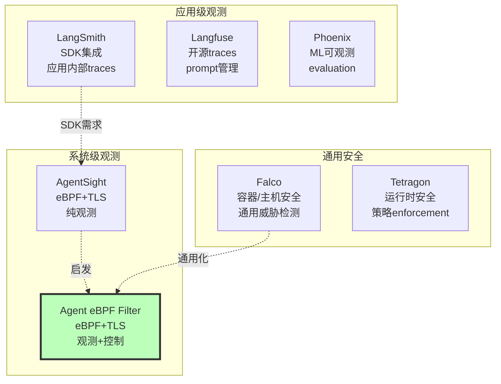

# 技术对比与差异化分析

本页面对比 Agent eBPF Filter 与同类项目的技术选型、架构设计和功能定位，帮助理解项目的差异化价值。

## 项目定位对比



## 核心技术对比

### vs. 应用级观测工具

| 维度 | LangSmith / Langfuse | Agent eBPF Filter |
| --- | --- | --- |
| **集成方式** | SDK、callback、代码注入 | 零插桩、eBPF 系统级 |
| **观测粒度** | LLM API、traces、prompts | 系统调用、文件、网络、进程 |
| **闭源 CLI 支持** | ❌ 需要 CLI 自身集成 | ✅ 外部观测，无需修改 |
| **TLS 流量** | ❌ 除非通过 proxy | ✅ uprobe 明文捕获 |
| **系统行为** | ❌ SDK 边界外不可见 | ✅ 完整 syscall 追踪 |
| **控制能力** | ❌ 无 | ✅ wrapper/cgroup/LSM |
| **部署复杂度** | 低（应用级） | 中（需要特权） |
| **适用场景** | 自有应用开发 | 本地工作站、实验节点 |

**优势**:
- 无需修改 Agent 代码
- 观测完整系统行为
- 支持闭源 CLI

**劣势**:
- 需要特权权限
- 不跨网络边界（本地）

### vs. AgentSight

| 维度 | AgentSight | Agent eBPF Filter |
| --- | --- | --- |
| **技术栈** | Rust + eBPF + Next.js | Go + eBPF + Vue 3 |
| **许可证** | MIT | GPL-3.0 |
| **定位** | 纯观测 | 观测 + 控制 |
| **控制能力** | ❌ 无 | ✅ wrapper/cgroup/LSM |
| **TLS capture** | 核心能力，默认开启 | 高风险诊断，默认关闭 |
| **集成方式** | 纯 eBPF | eBPF + adapters + hooks + wrapper |
| **存储** | SQLite | Protobuf + in-memory + JSONL |
| **事件模型** | JSON events | EventEnvelope (oneof) |
| **部署场景** | 本地开发 | 本地 + 实验 + 答辩 |
| **安全模型** | 观测为主 | 多层防御（runtime gates） |

**设计理念**:
- AgentSight: 验证技术可行性，提供观测基础
- Agent eBPF Filter: 扩展控制能力，面向操作系统课程答辩

**我们的扩展**:
- 13 个可选 feature（AgentSight 是单一观测）
- wrapper policy engine（命令决策层）
- cgroup + LSM enforcement（内核控制层）
- 脱敏分级（None/Basic/Standard/Strict）
- runtime gates 细粒度控制

### vs. Falco / Tetragon

| 维度 | Falco / Tetragon | Agent eBPF Filter |
| --- | --- | --- |
| **目标** | 通用容器/主机安全 | AI Agent 特化 |
| **规则系统** | 通用威胁检测 | Agent 行为语义 |
| **上下文** | 进程/容器/K8s | Agent run / tool call / trace |
| **策略** | 通用 syscall 规则 | Agent 命令 + ML 评分 |
| **TLS** | ❌ 通常不捕获 | ✅ 可选诊断能力 |
| **部署** | 生产集群 | 本地工作站 |
| **集成** | Kubernetes native | adapters + hooks |

**差异化**:
- 我们关联 Agent 语义（tool_name, trace_id, agent_run_id）
- 我们理解 Agent 工作流（tool call → syscall → file/network）
- 我们提供 Agent 特化的控制（wrapper 命令策略）

## 技术选型对比

### 语言栈选择

**Rust vs Go**:

| 维度 | Rust (AgentSight) | Go (Agent eBPF Filter) |
| --- | --- | --- |
| 性能 | 极致性能 | 优秀性能（足够） |
| 内存安全 | 编译期保证 | Runtime GC |
| 编译速度 | 慢 | 快 |
| 学习曲线 | 陡峭 | 平缓 |
| 生态 | 成长中 | 成熟 |
| cilium/ebpf | 无 | ✅ 官方支持 |
| 部署 | 静态二进制 | 静态二进制 |
| 并发模型 | async/await | goroutine |

**我们选择 Go**:
- cilium/ebpf 是 Go 生态的一流公民
- 更快的开发迭代
- 更低的学习门槛（课程答辩场景）
- Gin、Protobuf、OTLP 生态成熟

### 前端框架选择

**React/Next.js vs Vue 3**:

| 维度 | React/Next.js (AgentSight) | Vue 3 (Agent eBPF Filter) |
| --- | --- | --- |
| 学习曲线 | 中等 | 平缓 |
| 性能 | 优秀 | 优秀 |
| TypeScript | 良好 | 一流 |
| 生态 | 最大 | 丰富 |
| 模板语法 | JSX | SFC |
| 状态管理 | 多方案 | Pinia（官方） |
| 构建工具 | Next.js | Vite（最快） |

**我们选择 Vue 3**:
- Composition API + `<script setup>` 简洁
- Vite 8 + Rolldown 极速构建
- SFC 单文件组件易维护
- 团队熟悉度

### 存储与协议选择

**SQLite vs Protobuf + In-Memory**:

| 维度 | SQLite (AgentSight) | Protobuf (Agent eBPF Filter) |
| --- | --- | --- |
| 持久化 | 内置 | 可选 JSONL |
| 查询能力 | SQL 强大 | 内存过滤 |
| 历史回溯 | ✅ 完整 | ✅ 可选 |
| 实时性能 | 写入开销 | 内存环形缓冲 |
| 跨语言 | SQL 通用 | Protobuf 多语言 |
| 序列化 | JSON | 二进制高效 |
| WebSocket | 需要适配 | 原生支持 |

**我们选择 Protobuf**:
- 实时 WebSocket 优先（Dashboard 核心）
- 二进制序列化高效
- EventEnvelope `oneof` 多态清晰
- 可选 JSONL 持久化（不强制）

## 架构设计对比

### 事件管线

**AgentSight**:
```text
eBPF → JSON stdout → Rust runners → analyzers → SQLite → HTTP API → Frontend
```

**Agent eBPF Filter**:
```text
eBPF → ringbuf → Go decoder → EventEnvelope → broadcast → [archive, WS, OTLP, MCP]
```

**差异**:
- AgentSight: 管道式，每个 analyzer 独立
- Agent eBPF Filter: 广播式，多路并行输出

**我们的优势**:
- 零拷贝 ringbuf decode（35-65× 提升）
- 多目标并行（Dashboard + OTLP + archive 同时）
- EventEnvelope 统一封装

### 安全模型

**AgentSight**:
```text
观测 → 记录 → 查询
```

**Agent eBPF Filter**:
```text
观测 → [wrapper policy, cgroup block, LSM block] → 脱敏 → 记录 → 查询
```

**五层安全**:
1. 权限层（CAP_BPF）
2. 认证层（runtime token）
3. Runtime gate 层（13 个可选 feature）
4. 策略层（wrapper + cgroup + LSM）
5. 数据保护层（脱敏分级）

## 性能对比

### 吞吐量

| 系统 | Ringbuf 吞吐 | WebSocket 延迟 |
| --- | --- | --- |
| AgentSight | ~20K events/s | N/A（HTTP pull） |
| Agent eBPF Filter | 25-30K events/s | ~510μs (10 clients) |

**优化关键**:
- 零拷贝 decode
- Protobuf 二进制
- Goroutine 并发

### 内存占用

| 系统 | 内存 |
| --- | --- |
| AgentSight | SQLite + Rust runtime |
| Agent eBPF Filter | ~6MB (10K event ring) + Go runtime |

**bounded ring buffer** 避免无限增长。

## 适用场景对比

### AgentSight 适合

- ✅ Rust 技术栈团队
- ✅ 需要完整历史查询（SQLite）
- ✅ 单机观测，不需要控制
- ✅ 学术研究、数据收集

### Agent eBPF Filter 适合

- ✅ Go 技术栈团队
- ✅ 需要实时 Dashboard（WebSocket）
- ✅ 需要 wrapper / cgroup / LSM 控制
- ✅ 操作系统课程答辩
- ✅ 本地工作站 + 实验节点安全治理
- ✅ 需要 OTLP / MCP / AgentSight 兼容层

### Falco / Tetragon 适合

- ✅ 生产 Kubernetes 集群
- ✅ 通用容器安全
- ✅ 合规审计

### LangSmith / Langfuse 适合

- ✅ 自有应用开发
- ✅ LLM API 追踪
- ✅ Prompt engineering
- ✅ 跨网络边界（云端）

## 未来演进方向

### AgentSight 可能方向

- Kubernetes 集成
- 多机分布式
- 更多 LLM provider 支持

### Agent eBPF Filter 路线图

见 [项目路线图](../project-roadmap.md)

**关键方向**:
- Cluster mode 完善
- ML risk scoring 增强
- Plugin 生态扩展
- Kubernetes operator

## 总结

**Agent eBPF Filter 的差异化价值**:

1. **观测 + 控制**: 不只是看，还能阻断和改写
2. **Agent 语义**: 理解 tool call / trace / run 上下文
3. **多层防御**: wrapper + cgroup + LSM 组合
4. **实时优先**: WebSocket Dashboard，零拷贝优化
5. **安全默认**: TLS capture 默认关闭，runtime gates
6. **Go 生态**: 简单部署，快速迭代
7. **答辩交付**: 完整文档、演示脚本、评测报告

**不是替代**，而是**补充**:
- 与 LangSmith 配合：系统级 + 应用级
- 与 Falco 配合：Agent 特化 + 通用安全
- 基于 AgentSight：继承理念，扩展能力

---

**持续更新中**

有其他对比维度建议？欢迎提 Issue！
