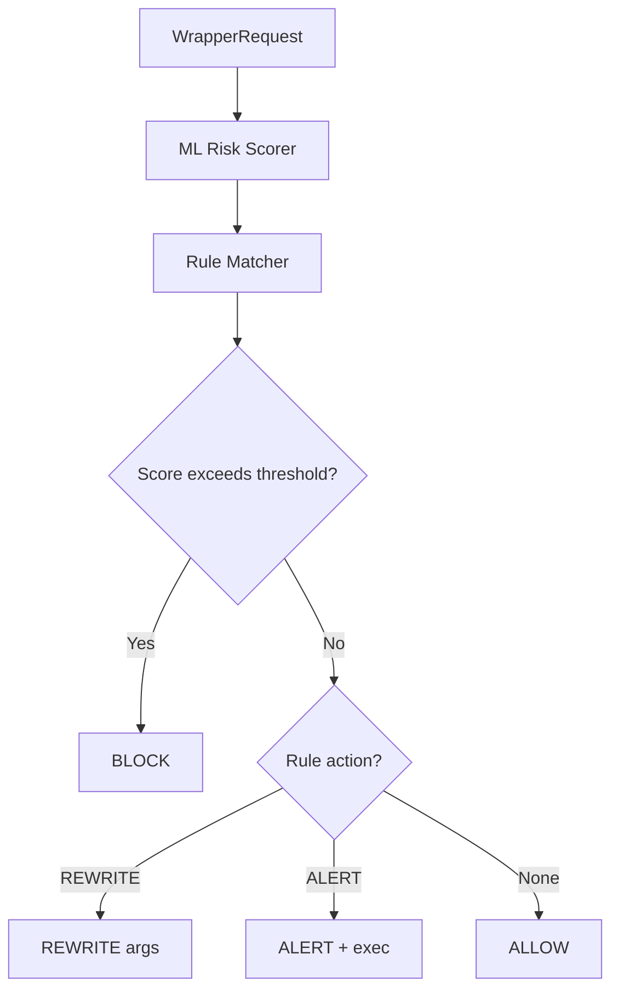

# 技术深度参考

本页面汇总项目中涉及的关键技术、算法和实现细节，为深入研究提供索引。

## eBPF 内核编程

### 核心概念

- **eBPF 程序类型**: tracepoint, cgroup/connect, cgroup/sendmsg, LSM hooks
- **Map 类型**: hash map (agent_pids, tracked_comms, tracked_paths), ringbuf (events), array (counters)
- **Pinning 机制**: `/sys/fs/bpf/agent-ebpf/` 持久化 maps 和 links
- **零拷贝优化**: mmap-backed ringbuf 直接读取，避免 `binary.Read` 拷贝

### 关键实现

**Ringbuf 解码**:
```go
// backend/app/jobs_background.go (伪代码)
func decodeBPFEventRecord(sample []byte) (*bpfEvent, error) {
    if isNativeLittleEndian && isAligned(sample) {
        // 零拷贝路径：直接构造指针视图
        evt := (*bpfEvent)(unsafe.Pointer(&sample[0]))
        return evt, nil
    }
    // fallback: binary.Read
    evt := &bpfEvent{}
    binary.Read(bytes.NewReader(sample), binary.LittleEndian, evt)
    return evt, nil
}
```

**相关文档**:
- [eBPF 与 OS Enforcement](/backend/ebpf-os-enforcement)
- [后端启动链路](/backend/runtime-startup)
- `docs/ebpf-optimization-summary.md`

### 性能指标

- Ringbuf 吞吐量：25,000-30,000 events/s
- P99 延迟：~150 μs
- 零拷贝提升：35-65×

## TLS 流量捕获

### Uprobe 技术

**支持的 TLS 库**:
- OpenSSL (`SSL_read`, `SSL_write`)
- BoringSSL (stripped binary 字节模式检测)
- GnuTLS (`gnutls_record_send`, `gnutls_record_recv`)
- NSS (`PR_Read`, `PR_Write`)
- Go TLS (runtime symbols)

**BoringSSL 字节模式检测**:
```c
// 伪代码：在 stripped binary 中搜索 SSL_write 函数签名
const u8 ssl_write_pattern[] = {0x55, 0x48, 0x89, 0xe5, ...};
for (addr = text_start; addr < text_end; addr++) {
    if (memcmp(addr, ssl_write_pattern, sizeof(pattern)) == 0) {
        return addr; // found SSL_write
    }
}
```

**相关文档**:
- [脱敏与隐私](/security/redaction-privacy)
- `docs/codex-implementation-complete.md`
- `docs/codex-stripped-analysis.md`

### HTTP 解析

**请求/响应匹配算法**:
- 基于 connection fd + timestamp 配对
- SSE stream 处理：识别 `data:` 前缀
- Chunked encoding 支持

**相关文件**:
- `backend/app/tls/httpparsertls.go`
- `backend/http/parser/tls.go`

## Wrapper 策略引擎

### 决策模型



**风险评分公式**:


$$
R_{command} = \sum_{i=1}^{n} w_i \cdot f_i(c, a, m)
$$


**相关文档**:
- [Wrapper 命令策略](/integrations/wrapper)
- [性能分析与数学模型](/reference/performance-models)

## Protobuf 事件模型

### EventEnvelope 结构

```protobuf
message EventEnvelope {
  string schema_version = 1;
  int64 timestamp_ns = 2;
  string source = 3;
  string event_id = 4;
  
  oneof payload {
    Event event = 10;
    NativeHookEvent native_hook = 11;
    WrapperEvent wrapper = 12;
    SystemMetrics system = 13;
  }
}
```

**关键设计**:
- `oneof` 多态事件类型
- 保留 `legacy_event` 兼容字段
- `timestamp_ns` 为 boot-relative，需转换为 wall-clock

**相关文档**:
- [协议与事件模型](/architecture/protocol-events)
- `proto/tracker_events.proto`

## 网络流聚合

### TCP 状态追踪

**状态转移矩阵**:


$$
P = \begin{bmatrix}
0.9 & 0.08 & 0.02 \\
0 & 0.95 & 0.05 \\
0 & 0 & 1
\end{bmatrix}
$$


状态：`{ACTIVE, IDLE, CLOSED}`

**Flow GC 策略**:
- 时间窗口：5 分钟无活动标记 stale
- 容量驱逐：FIFO
- 指数衰减：$P_{stale}(t) = 1 - e^{-\lambda \cdot t}$

**相关文档**:
- [Network 页面](/frontend/routes-and-pages)
- [性能分析与数学模型](/reference/performance-models)

## ML 风险评分

### 多因子模型

| 因子 | 权重 | 计算方式 |
| --- | --- | --- |
| 命令危险度 | 0.4 | 静态规则 |
| 参数模式 | 0.3 | ML classifier |
| Agent 历史 | 0.2 | Bayesian update |
| 上下文异常 | 0.1 | Isolation Forest |

### 贝叶斯信誉更新


$$
P_n(trustworthy) = \frac{\alpha + n_{safe}}{\alpha + \beta + n}
$$


**参数**:
- $\alpha = 8, \beta = 2$ (初始先验)
- $n_{safe}$: 安全行为次数
- $n$: 总观测次数

**相关文档**:
- [ML、Plugins 与扩展能力](/backend/ml-plugins)
- [性能分析与数学模型](/reference/performance-models)

## 安全脱敏

### 脱敏级别

| 级别 | 覆盖范围 |
| --- | --- |
| None | 无脱敏 |
| Basic | 明显 secrets (API keys, tokens) |
| Standard | + headers, query params |
| Strict | + PII, paths, network addresses |

### 检测算法

**Entropy-based detection**:
```go
func isHighEntropy(s string) bool {
    entropy := calculateShannonEntropy(s)
    return entropy > 4.5 && len(s) >= 20
}
```

**Regex patterns**:
- API keys: `[A-Za-z0-9_-]{32,}`
- JWT: `eyJ[A-Za-z0-9_-]+\.eyJ[A-Za-z0-9_-]+\.[A-Za-z0-9_-]+`
- Base64: `^[A-Za-z0-9+/]{40,}={0,2}$`

**相关文档**:
- [脱敏与隐私](/security/redaction-privacy)
- `docs/SANITIZATION_IMPLEMENTATION_SUMMARY.md`
- `backend/redaction/README.md`

## Execution Graph

### 图构建算法

**节点类型**:
- Process (PID, comm, argv)
- File (path, operation)
- Network (destination, port, protocol)
- Tool (tool_name, tool_call_id)
- Policy (action, rule_name)

**边类型**:
- `SPAWNED` (process → process)
- `ACCESSED` (process → file)
- `CONNECTED` (process → network)
- `CALLED` (agent → tool)
- `BLOCKED_BY` (process → policy)

**时序窗口**:
- 同一 trace_id 内事件自动关联
- 时间窗口：30s 内 PID 相同事件聚合
- Parent fallback: userspace `/proc/<pid>/stat` 读取

**相关文档**:
- [数据流](/architecture/data-flow)
- `docs/execution-graph-behavior-tracking-fix.md`

## BPF LSM

### Hook 点

- `bprm_check_security` - execve 前拦截
- `file_open` - 文件打开拦截
- `path_unlink` - 文件删除拦截
- `path_mkdir` - 目录创建拦截

### 策略语义

**精确匹配**:
- exec path: 完整路径或 basename
- file basename: 文件名（不含路径）

**非递归**:
LSM 文件策略基于 basename，不是目录树递归。

**相关文档**:
- [策略语义](/security/policy-semantics)
- [安全模型](/security/model)

## Cgroup eBPF

### Hook 点

- `cgroup/connect4`, `cgroup/connect6`
- `cgroup/sendmsg4`, `cgroup/sendmsg6`

### 阻断语义

**精确 IP + port**:
```c
struct blocked_dest_key {
    __u32 ip;      // IPv4 或 IPv6 的前 32 位
    __u16 port;
    __u8 proto;
};
```

**非 CIDR/range**:
每个 IP 需要独立 map entry，不支持 CIDR 块或端口范围。

**相关文档**:
- [策略语义](/security/policy-semantics)
- [eBPF 与 OS Enforcement](/backend/ebpf-os-enforcement)

## Vue 3 前端架构

### Composition API

**关键模式**:
```typescript
// composables/useEventStream.ts
export function useEventStream() {
  const events = ref<Event[]>([])
  const ws = ref<WebSocket | null>(null)
  
  const connect = () => {
    ws.value = new WebSocket('ws://...')
    ws.value.onmessage = (msg) => {
      const envelope = EventEnvelope.decode(msg.data)
      events.value.push(envelope.event)
    }
  }
  
  onUnmounted(() => ws.value?.close())
  
  return { events, connect }
}
```

**相关文档**:
- [前端工作台总览](/frontend/workbench)
- [组件与 Composables](/frontend/components-composables)

## 开发记录索引

详细的实现记录和历史决策见：
- [开发文档索引](DEV_DOCS_INDEX.md)

---

**提示**: 本页面为技术深度参考，适合已熟悉项目基础的开发者。新手建议先阅读 [快速开始](/guide/quick-start) 和 [总体架构](/architecture/overview)。
