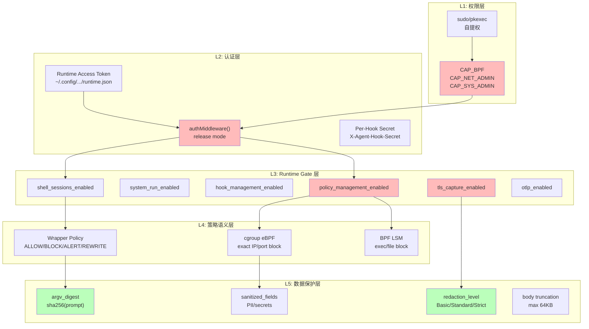
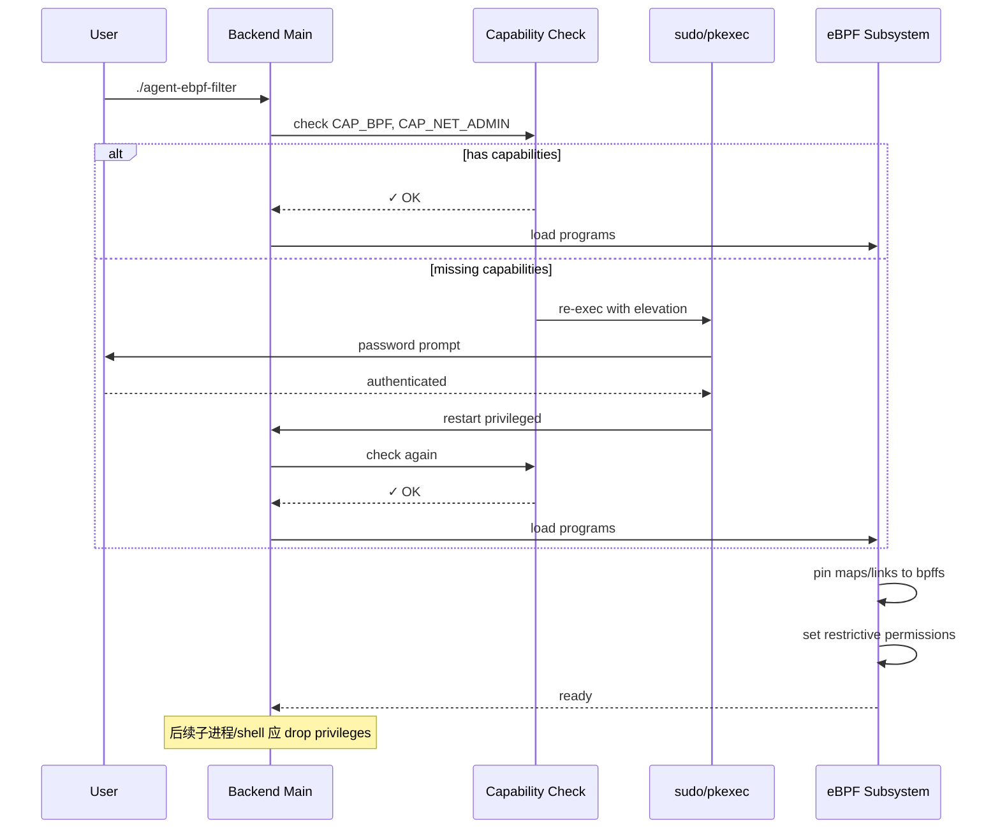
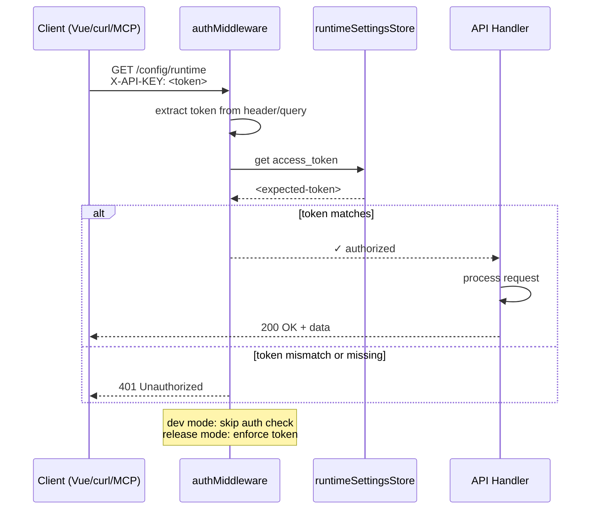
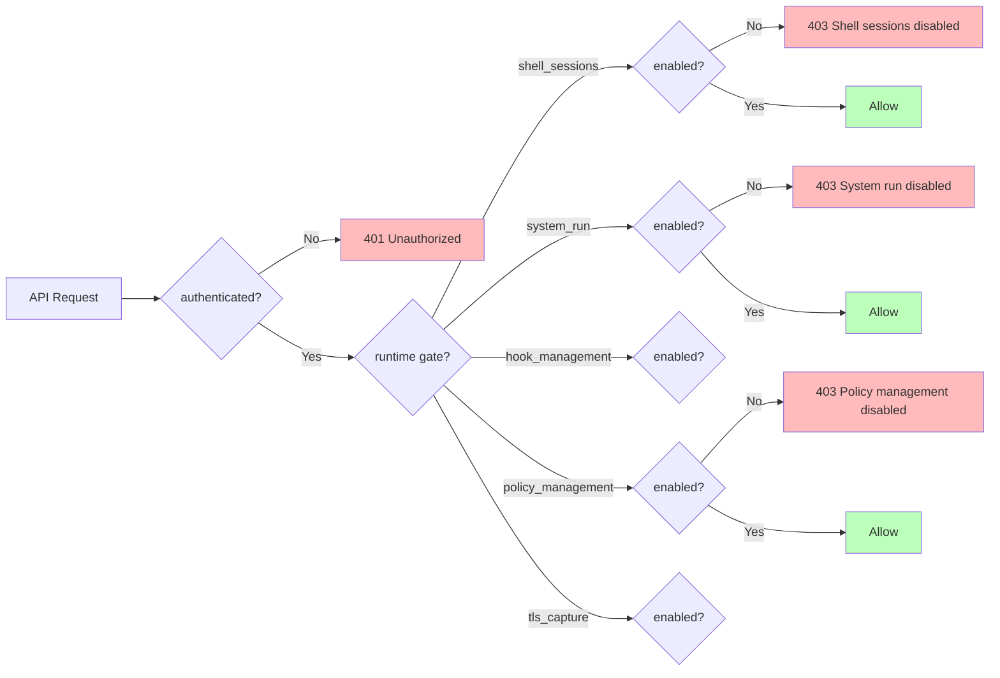
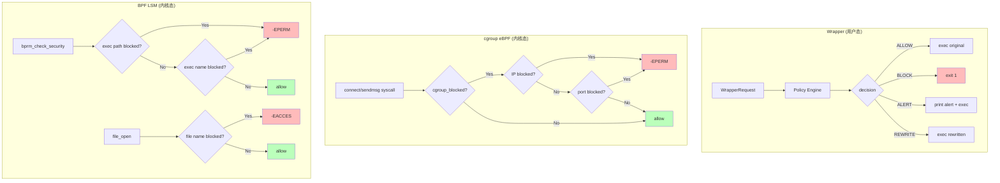
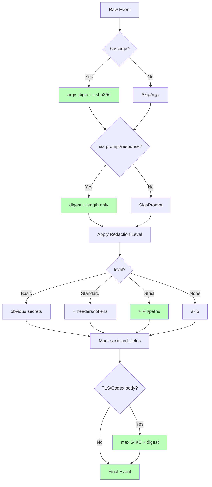

# 安全模型

Agent eBPF Filter 的安全模型由五层组成：权限、认证、runtime gates、策略语义、数据脱敏。

## 安全目标

- 只在授权环境中加载和管理 eBPF；
- release mode 保护敏感 API；
- 高风险能力默认关闭；
- policy mutation 通过认证后端 API；
- 避免普通事件流泄漏 secrets / TLS plaintext；
- 将观测、诊断、控制的边界说清楚。

## 权限层

后端需要特权进行：

- eBPF load / attach；
- map / link pinning；
- cgroup / LSM attach；
- restrictive map permissions；
- 可选 80/443 binding。

子 shell / 命令应尽量 drop privileges 回调用用户。

## Auth 层

release mode 下敏感 API 使用 runtime access token。常见受保护面：

- `/config/**`
- `/system/**`
- `/ws*`
- `/metrics`
- `/register`
- `/unregister`
- `/events/recent`
- `/events/graph`
- `/shell-sessions*`
- `/sandbox/**`
- `/agentsight/**`
- `/api/**`
- `/api/v1/**`
- `/mcp`

## Runtime gate 层

危险能力默认关闭：

- shell sessions.
- `/system/run`；
- hook management.
- policy management.
- TLS capture.
- OTLP export.
- domain forward.
- kernel risk feedback.

## 内核控制层

| 控制 | 语义 | 边界 |
| --- | --- | --- |
| cgroup sandbox | exact cgroup id、IPv4、IPv6、port | 不是 CIDR/range firewall |
| BPF LSM | exact exec path/name、file basename | 不是递归目录策略 |
| wrapper | command shim | 只覆盖经 wrapper 执行的命令 |

## 数据保护层

- argv digest；
- prompt / response digest + length；
- redaction levels；
- TLS / Codex body 截断；
- sanitized_fields；
- secrets / tokens / headers / query / JSON body redaction。
- 归档、JSONL 持久化、事件录制、OTel 导出、后台处理队列与 WebSocket 广播共用已脱敏的规范事件，避免原始敏感字段先于脱敏落盘或外发。

## 高风险能力清单

| 能力 | 风险 | 防护 |
| --- | --- | --- |
| TLS capture | 明文敏感数据 | 默认关闭、auth、runtime gate、redaction |
| system run / file access | 任意命令执行与主机文件访问 | critical feature、auth、`system_run` runtime gate、上传大小与文件类型限制 |
| shell sessions | 交互式 PTY | auth、runtime gate、privilege dropping |
| hook install | 修改用户 CLI 配置 | auth、runtime gate、确认授权 |
| policy mutation | 阻断网络/文件/执行 | auth、runtime gate、restrictive maps |
| domain forward | 80/443 public data plane | 默认关闭、auth-protected config |

## Kernel Enforcement Details

For security auditing and compliance, the following kernel-enforced security policies are active:
- **OS sandbox (`/sandbox/**`)**: Protects system calls and limits sandbox escapes.
- **Kernel-enforced policy paths**: Restricts executable paths and directories.
- **cgroup/connect and cgroup/sendmsg blocking for exact cgroup ids, IPv4/IPv6 destinations, and** network sockets.
- Handles **existing connected UDP send** operations securely.
- **IPv4 block entries are also honored for IPv4-mapped IPv6 socket** connections.
- **BPF LSM blocking for executable paths, executable basenames, and file or** directory operations.
- Intercepts **`file_permission`, `mmap_file`, `file_mprotect`, `inode_setattr`, `inode_create`**, **`inode_mknod`, and `inode_rename`** kernel security hooks.
- Restricts **existing-fd `ftruncate` / `fchmod`** modifications.
- Protects **own cgroup / LSM policy-map mutation and attach lifecycle** from tampering.

---

## 相关导航

- [Runtime Gates 与 Auth](runtime-gates-auth.md)
- [策略语义](policy-semantics.md)
- [脱敏与隐私](redaction-privacy.md)
- [威胁模型](threat-model.md)
- [eBPF 与 OS Enforcement](../backend/ebpf-os-enforcement.md)
