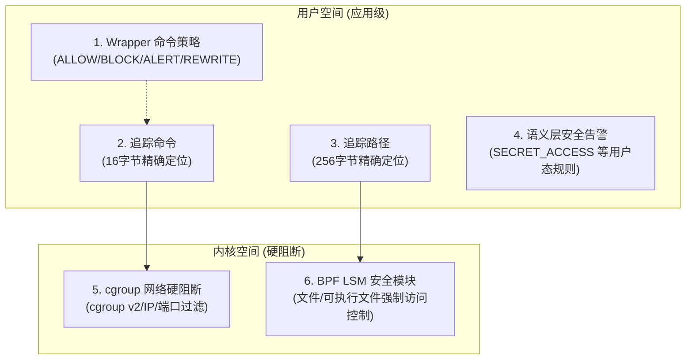

# 🛡️ 策略语义与劫持机制

本文件详细描述了 **Agent eBPF Filter** 在当前仓库状态下各策略层面的匹配语义、技术实现细节及其安全边界。

---

## 1. 策略拦截平面总览

系统目前包含以下六大策略控制与观测平面：

---

## 2. 策略语义技术细节

### 2.1 Wrapper 命令劫持策略 (Wrapper Rules)
* **配置方式**：通过 `/config/rules` API 进行配置，应用于 `agent-wrapper` 劫持入口。
* **支持动作**：
  * `ALLOW`：允许命令原样执行。
  * `BLOCK`：直接阻止执行并打印拦截提示，以退出码 `1` 退出。
  * `ALERT`：打印安全告警信息，但允许命令继续执行。
  * `REWRITE`：根据规则重写命令行参数后执行。
* **匹配语义**：以命令名 `comm` 进行精确匹配（Key-Value 查找），支持可选的正则匹配表达式（Regex）及替换参数。
* **局限性**：Wrapper 并非一个完备的沙箱，它仅能拦截**经由 wrapper 显式拉起**或通过环境变量劫持注入的命令，无法防范绕过 wrapper 直接在宿主机执行的操作。

### 2.2 追踪命令 (Tracked Commands)
* **底层机制**：由 `tracked_comms` 内核 Map 存储。
* **数据结构**：`16-byte` 精确命令名。
* **匹配语义**：精确字符串匹配。例如匹配 `git`、`python`、`node`、`npm`。
* **注意**：这不是通配符规则，无法模糊匹配前缀或后缀。

### 2.3 追踪路径 (Tracked Paths)
* **底层机制**：由 `tracked_paths` 内核 Map 存储。
* **数据结构**：`256-byte` 精确绝对路径。
* **匹配语义**：精确路径匹配。例如 `/workspace/repo/.env` 或 `/home/steve/.ssh/id_rsa`。
* **注意**：它不代表递归目录树，即跟踪 `/home/steve/` 并不代表会自动跟踪其子目录下的所有文件。

---

## 3. 内核态硬阻断机制

### 3.1 内核态 cgroup 网络阻断 (OS-level cgroup Network Policy)
* **配置入口**：`/sandbox/cgroup/*` API。
* **固定挂载**：挂载于 `/sys/fs/bpf/agent-ebpf/cgroup_sandbox` 路径下的 BPF Pinned Maps 中。
* **阻断 Hook 点**：`cgroup/connect4`, `cgroup/connect6`, `cgroup/sendmsg4`, `cgroup/sendmsg6`。
* **精确匹配键值**：
  * cgroup v2 inode ID（可通过 PID 自动解析）。
  * IPv4 目的地址（支持将 IPv4-mapped IPv6 地址如 `::ffff:a.b.c.d` 规范化为标准 IPv4 进行匹配）。
  * IPv6 目的地址。
  * TCP/UDP 目的端口。
* **行为效果**：对匹配规则的传出 TCP 连接（connect）、UDP 已连接 Socket（connect）及未连接的 UDP 消息发送（sendto/sendmsg）在内核态直接返回拒绝错误（如 `-EPERM`）。
* **非目标**：本模块**不支持** CIDR 网段匹配、IP 范围匹配、域名解析过滤以及 L7 应用层防火墙。此外，在阻断规则下发前已建立的 TCP 链接不会被回溯切断。

### 3.2 内核态 BPF LSM 文件与可执行文件阻断 (OS-level BPF LSM Policy)
* **配置入口**：`/sandbox/lsm/*` API。
* **固定挂载**：挂载于 `/sys/fs/bpf/agent-ebpf/lsm_enforcer` 路径下的 BPF Pinned Maps 中。
* **阻断 Hook 点**：
  * 执行阶段：`bprm_check_security`（拦截指定可执行路径或可执行文件名 basename）。
  * 文件操作：`file_open`, `file_permission`, `mmap_file`, `file_mprotect`, `inode_setattr`（拦截 chmod/chown/truncate 等）, `inode_create`, `inode_link`, `inode_symlink`, `inode_unlink`, `inode_mkdir`, `inode_rmdir`, `inode_mknod`, `inode_rename`。
* **行为效果**：在上述系统调用到达内核具体实现前拦截并直接返回 `EACCES`（权限拒绝）错误。
* **注意**：
  * 阻断生效前已建立的可读写内存映射（mmap）无法回溯撤销，但新的 `mmap_file` 或 `file_mprotect` 修改映射权限的操作将被拒绝。
  * 文件与目录阻断目前基于 **basename** 实现，不支持递归子路径、Glob 通配符或全盘文件系统沙箱逻辑。

---

## 4. 语义安全告警分类

后端领域层会基于上报的归一化事件流，在用户态分析并合成以下告警：

* `SECRET_ACCESS`：探测到非法读取或尝试访问敏感文件路径（如 `.ssh`、`/etc/passwd`）。
* `SEMANTIC_MISMATCH`：声明的 Tool Call 工具意图与实际捕获到的 OS 系统调用行为不符。
* `UNEXPECTED_NETWORK_EGRESS`：在未声明网络需求的前提下发生外部网络连接。
* `UNEXPECTED_CHILD_PROCESS`：Agent 进程派生出未在信任链注册的异常子进程。
* `TOOL_BEHAVIOR_DRIFT`：工具执行的行为模式偏离基线特征。
* `SUSPICIOUS_SHELL_PIPELINE`：交互式 shell 中存在可疑的管道符或多重重定向组合。
* `WORKSPACE_ESCAPE`：试图越权读写当前工作空间（Workspace）之外的文件目录。
* `TOKEN_EXFIL_RISK`：检测到通过环境变量、命令行参数或 HTTP 报头尝试外发凭证。
* `RESOURCE_WASTING_LOOP`：检测到进程分叉炸弹（fork storm）或短周期内重复出现的提示词消化与出口网络流量循环。
* `MULTI_AGENT_FILE_CONTENTION`：不同 Agent 运行上下文在极短的时间窗口内对同一核心路径进行并发写操作。

> ⚠️ **安全红线警示**：以上语义告警均在**用户空间（Userspace）**通过相关规则引擎分析生成，不属于内核同步阻断链路的一部分。它们主要用于生成安全报告并推荐下发硬阻断策略 Map 规则。

---

## 5. 限制与后续演进

当前版本的安全策略语义严格遵循“简单、快速、内核态友好”的设计。更复杂的规则体系计划在后续版本逐步引入：
1. **策略类扩展**：引入 `exact` / `prefix` / `suffix` / `class` 的混合匹配策略。
2. **分类分级**：支持工作空间（workspace）、密钥敏感区（secret）、系统保护区（system）等标签分类管理。
3. **更丰富的内核匹配**：增加 cgroup 进程归属感知、CIDR 网段及外部域名防火墙等。

## Specification Details

For compliance and auditing verification:
- Under **OS-level cgroup/connect + sendmsg policy**:
  - Restricts access by **TCP/UDP destination port**.
  - Handles **unconnected UDP sendto/sendmsg** operations.
  - Limits **existing connected UDP sends**.
  - **IPv4 block entries also deny IPv4-mapped IPv6 destinations**.
  - **API inputs in that form normalize to the equivalent IPv4 block key**.
  - **Existing TCP streams established before a matching block is added are not** retroactively closed.
  - Blocks **Existing-fd `ftruncate` / `fchmod`-style** operations.
- Under **OS-level BPF LSM policy**:
  - **Matching LSM decisions return `EACCES`**.
  - **File/directory LSM matching is basename-based today**.
  - Semantic alerts are **not in the synchronous cgroup/LSM decision path**.

---

## 🔗 相关导航

- [🛡️ 安全模型](model.md) —— 五层纵深防御体系设计
- [🔑 Runtime Gates 与认证机制](runtime-gates-auth.md) —— 高风险特性开关与 API 认证
- [🦕 eBPF 与 OS Enforcement](../backend/ebpf-os-enforcement.md) —— 底层 eBPF 程序挂载细节
- [📦 Wrapper 命令拦截协议](../integrations/wrapper.md) —— 应用层 Wrapper 原理说明
