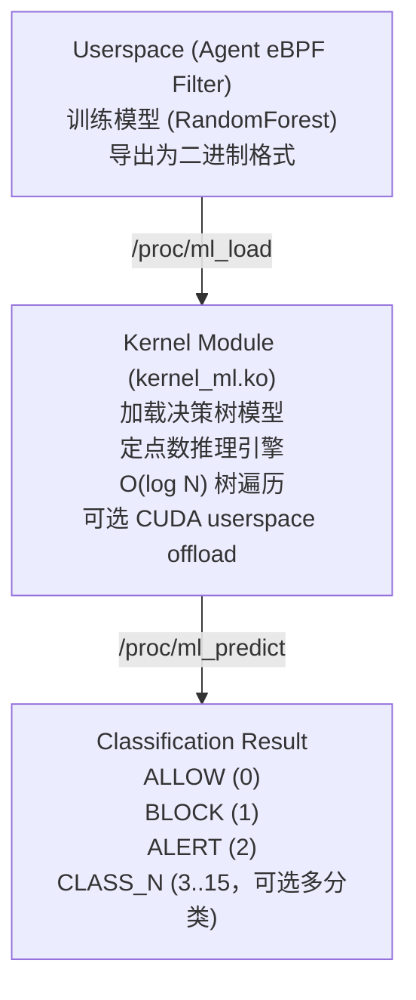
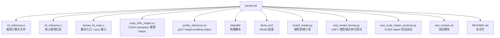

# Kernel ML Inference Module

内核态机器学习推理引擎 - 用于实时行为分类的 DKMS 内核模块。

## 架构



## 核心特性

### 1. 定点数运算
- **无浮点**: 内核禁止 FPU，使用整数运算
- **精度**: 1000x 缩放 (0.001 分辨率)
- **性能**: 纯整数比较，CPU 缓存友好

### 2. 决策树推理
- **算法**: Random Forest（默认 15 棵树，最多 64 棵树）
- **复杂度**: O(depth) 每棵树，v2 模型可携带 `max_depth`
- **可解释性**: 比神经网络更透明

### 3. Proc / sysfs 接口
- `/proc/ml_load` - 加载模型 (write-only)
- `/proc/ml_predict` - 推理请求 (write-only)
- `/proc/ml_stats` - 统计信息 (read-only)
- `/proc/ml_backend` - 选择 `kernel` / `cuda` / `auto` 推理后端
- `/proc/ml_cuda_request` - CUDA helper 阻塞读取推理请求
- `/proc/ml_cuda_result` - CUDA helper 写回推理结果
- `/proc/ml_cuda_model` - CUDA helper 镜像最新 `/proc/ml_load` 模型 blob
- `/sys/kernel/kernel_ml/backend` - sysfs 后端选择
- `/sys/kernel/kernel_ml/model_info` - 模型版本、generation、树数量、类别数
- `/sys/kernel/kernel_ml/stats` - 推理 / CUDA / fallback 统计
- `/sys/kernel/kernel_ml/cache_enabled` 与 `cache_stats` - LRU 缓存控制和统计
- `/sys/kernel/kernel_ml/cuda_timeout_ms` - CUDA helper 等待超时

### 4. v2 模型格式、版本控制和多分类

`model_loader.py` 默认导出 v2 header：

```
[version, num_trees, feature_dim, total_nodes, num_classes, max_depth]
```

- `version=2`：支持动态树数量、动态深度上限和 `1..16` 类输出。
- `version=1`：保持向后兼容，按 3 类和默认深度加载。
- 每次成功写入 `/proc/ml_load` 都会递增 `model_generation`；无效模型不会替换当前模型。
- CUDA helper 请求携带 `model_generation`，模型更新后会自动重新镜像 `/proc/ml_cuda_model`。
- `ALLOW/BLOCK/ALERT` 仍对应 `0/1/2`；额外类别以 `CLASS_N` 形式记录。

### 5. LRU 推理缓存

模块内置 64 项 exact-match LRU 缓存，key 为完整 `feature_vector` + 当前
`model_generation`。模型更新或禁用缓存时会清空缓存。

```bash
cat /sys/kernel/kernel_ml/cache_stats
echo 0 > /sys/kernel/kernel_ml/cache_enabled
echo 1 > /sys/kernel/kernel_ml/cache_enabled
```

### 6. CUDA GPU 后端

Linux 内核模块不能直接链接或调用 NVIDIA CUDA runtime；因此 CUDA 支持采用
**DKMS 内核模块 + userspace CUDA helper** 的安全分层：

1. 内核模块仍通过 DKMS 构建并提供 `/proc/ml_predict` 同步入口。
2. 选择 `cuda` 或 `auto` 后端时，模块把 `feature_vector` 发送到
   `/proc/ml_cuda_request`。
3. `kernel_ml_cuda_helper` 在用户态持有 `libcuda` / `libcudart`，自动从
   `/proc/ml_cuda_model` 镜像最新 RandomForest 模型并在 GPU 上遍历森林。
4. helper 将 `ALLOW` / `BLOCK` / `ALERT` 写回 `/proc/ml_cuda_result`。
5. helper 不存在、超时或 GPU 报错时，模块自动回退到内核 CPU 推理路径。

## 编译

```bash
# 方法 1: 直接编译
cd kernel-ml
make CC=clang LD=ld.lld

# 方法 2: DKMS 安装 (推荐)
sudo dkms add .
sudo dkms build kernel-ml/1.1
sudo dkms install kernel-ml/1.1

# 无需安装模块的 DKMS 构建 smoke（使用临时 --dkmstree/--sourcetree）
make dkms-smoke

# 可选：构建 CUDA userspace helper（不会作为 DKMS 内核构建的一部分）
make cuda-helper CUDA_HOME=/opt/cuda

# 可选：验证 CUDA helper 的 GPU kernel（无需加载内核模块）
make cuda-helper-self-test CUDA_HOME=/opt/cuda

# 单元测试 + CUDA helper request/result 协议测试（无需加载内核模块）
make test
```

Makefile 会在源码路径包含空格时自动复制到 `/tmp/kernel-ml-build.*` 再调用
Kbuild，并把生成的 `.ko` / `Module.symvers` 等产物同步回来；DKMS 常规路径
通常不包含空格。

## 使用

### 1. 加载模块
```bash
sudo insmod kernel_ml.ko
dmesg | tail -5  # 查看加载信息
```

### 2. 训练并导出模型
```python
from sklearn.ensemble import RandomForestClassifier
import pickle

# 训练模型
model = RandomForestClassifier(n_estimators=15, max_depth=7)
model.fit(X_train, y_train)

# 保存
with open('model.pkl', 'wb') as f:
    pickle.dump(model, f)

# 转换为内核格式
python model_loader.py model.pkl model.bin
```

### 3. 加载模型到内核
```bash
cat model.bin > /proc/ml_load
cat /proc/ml_stats  # 验证加载成功
```

### 4. 选择推理后端

```bash
# 默认纯内核 CPU 定点数后端
echo kernel > /proc/ml_backend

# CUDA 后端；helper 未运行或超时时会回退到 kernel 后端
echo cuda > /proc/ml_backend

# 自动模式；有 helper 时走 CUDA，否则走 kernel
echo auto > /proc/ml_backend

# 调整 CUDA 等待超时（毫秒，默认 50）
echo timeout_ms=100 > /proc/ml_backend

# sysfs 等价控制面
echo auto > /sys/kernel/kernel_ml/backend
echo 100 > /sys/kernel/kernel_ml/cuda_timeout_ms
cat /sys/kernel/kernel_ml/model_info
```

### 5. 启动 CUDA helper

```bash
# helper 会从 /proc/ml_cuda_model 自动镜像最新 /proc/ml_load 模型
sudo ./kernel_ml_cuda_helper

# 或者显式加载同一个模型文件
sudo ./kernel_ml_cuda_helper --model model.bin

# 无 root 的 GPU kernel 自检
./kernel_ml_cuda_helper --self-test
```

### 6. 推理
```c
#include <fcntl.h>
#include <unistd.h>
#include "ml_inference.h"

struct feature_vector fv;
extract_features(&fv, syscall_nr, pid, comm, args);

int fd = open("/proc/ml_predict", O_WRONLY);
write(fd, &fv, sizeof(fv));
close(fd);

// 查看 dmesg 获取结果
```

## 性能

- **推理延迟**: ~5-10 μs (15 棵深度 7 的树)
- **CUDA 后端**: 适合批量/高并发或更大模型；单条请求会包含用户态/GPU 往返开销
- **推理缓存**: 重复 feature vector 命中 64 项 LRU 后跳过模型遍历 / CUDA offload
- **内存占用**: ~300 KB 模块 + ~50 KB 模型
- **吞吐量**: >100k 推理/秒 (单核)

### perf / Nsight profiling

```bash
# 内核同步推理路径：需要已加载模块且当前用户可写 /proc/ml_predict
sudo ./profile_inference.sh perf 10000

# CUDA helper GPU kernel：优先用 nsys，没有 nsys 时回退到 helper self-test
./profile_inference.sh nsight
```

## 限制

1. **特征维度**: 固定 128 维
2. **树数量**: 最多 64 棵
3. **树深度**: v2 模型携带 `max_depth`，内核硬上限 1024 层
4. **模型大小**: ≤ 10 MB
5. **CUDA 分层**: CUDA runtime 只能在用户态 helper 中运行，内核模块通过 proc ABI 同步 offload
6. **类别数量**: 最多 16 类；内置策略计数仍重点统计 `BLOCK` / `ALERT`

## DKMS 配置

`dkms.conf`:
```ini
PACKAGE_NAME="kernel-ml"
PACKAGE_VERSION="1.1"
MAKE[0]="make all KVERSION=$kernelver"
BUILT_MODULE_NAME[0]="kernel_ml"
DEST_MODULE_LOCATION[0]="/extra"
AUTOINSTALL="yes"
```

## 文件结构



## 与 eBPF 对比

| 特性 | 内核模块 | eBPF |
|------|---------|------|
| 复杂度 | 无限制 | Verifier 严格限制 |
| 性能 | 极高 | 高 |
| 安全性 | 需人工审计 | Verifier 保证 |
| 动态加载 | 需 root | 普通用户 (CAP_BPF) |
| 调试 | printk/kgdb | bpftool |

**推荐**: eBPF 用于数据捕获，内核模块用于复杂 ML 推理

## 安全考虑

- ✅ 无用户输入直接执行
- ✅ 模型从 proc 加载，需 root
- ✅ 推理结果仅用于日志/统计
- ✅ 模型更新采用 generation，加载失败不会替换当前模型
- ✅ CUDA helper 超时/错误自动回退到内核 CPU 推理
- ⚠️  未启用内存保护（将来可添加）

## 故障排除

### 编译错误: "unrecognized emulation mode: llvm"
```bash
# 使用 LLVM 链接器
make CC=clang LD=ld.lld
```

### 浮点数错误: "__muldf3 undefined"
```bash
# 检查代码中的浮点运算
grep -r "\.0" *.c
# 替换为整数运算
```

### 路径空格
```bash
# 当前 Makefile 会自动 staging 到 /tmp；如果直接调用 Kbuild 仍要避免 M= 路径含空格。
make
```

## 已完成的 TODO

- [x] 添加 sysfs 接口（与 proc 并存，便于脚本和 systemd 集成）
- [x] 支持动态树数量/深度（v2 header，最多 64 棵树，深度上限 1024）
- [x] 实现模型版本控制（format version + `model_generation` + 加载失败不替换）
- [x] 添加推理缓存（64 项 exact-match LRU）
- [x] 支持多分类（最多 16 类，额外类别记录为 `CLASS_N`）
- [x] 集成 perf / Nsight 性能分析（`profile_inference.sh`）
- [x] 添加单元测试（`make test`）

## 许可证

GPL v2 - 与 Linux 内核兼容

## 作者

Agent eBPF Filter Project
