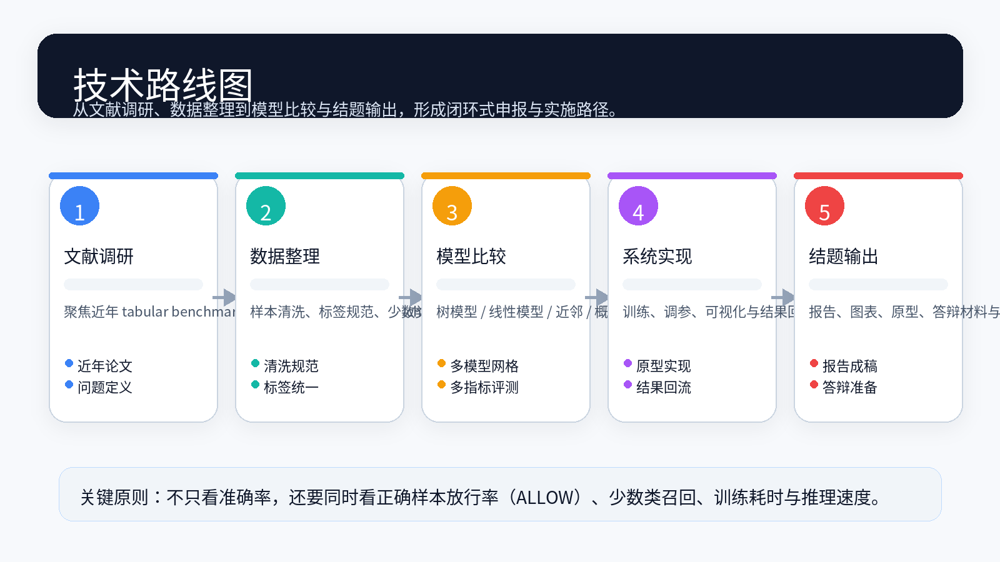
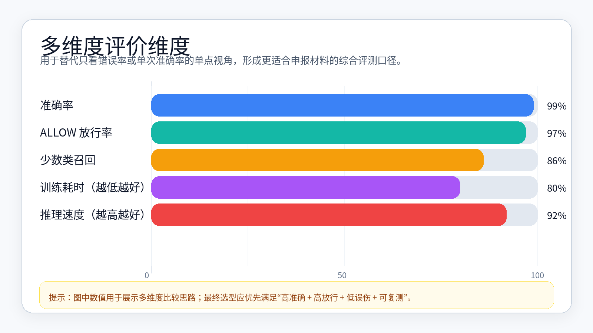

# 金种子科研项目申报书

> 本稿面向“华南师范大学学生课外科研金种子课题”类项目；已按 2026 年公开通知的申报要求和 2024—2026 年 tabular benchmark、类别不平衡学习、命令/安全检测与表格基础模型研究脉络整理。

**建议项目类别：** 科技发明制作类作品  
**建议课题层级：** 金种子一般课题（如有论文/专利/竞赛基础，可升级为重点课题）  
**核心卖点：** 不只看准确率，还看正确样本放行率（ALLOW）、少数类召回、误伤率、训练耗时与推理速度。

## 一、项目基本信息

- **项目名称**：面向高风险稀缺样本识别的轻量级可解释表格数据模型研究与系统实现
- **项目类别**：科技发明制作类作品
- **课题层级**：金种子一般课题
- **学科类别**：信息技术 / 人工智能 / 网络空间安全交叉方向
- **研究周期**：2026 年 6 月—2027 年 5 月
- **团队规模**：3—6 人（不超过学校规定的 10 人上限）
- **指导教师**：1—2 人

## 二、项目摘要

本项目面向高风险样本稀缺、类别分布不均衡、误判成本不对称的表格数据场景，研究一套轻量级、可解释、可复用的风险识别模型与数据闭环系统。典型应用包括工具调用、命令执行、运维审批、自动化流程安全放行等场景：一方面，高风险样本数量少但漏判代价高；另一方面，正确命令和正常请求也必须尽量放行，不能因为模型过度保守而误伤正常工作流。

项目将系统比较 Random Forest、Extra Trees、Logistic Regression、SVM、Perceptron、Passive Aggressive、KNN、Ridge、Naive Bayes、Nearest Centroid、Boosting、soft-vote ensemble 及其 balanced / class-weighted / distance-metric 变种，并参考 TabPFN、TabICL 等表格基础模型作为高阶对照。研究重点不是单次追求最高准确率，而是构建兼顾 **准确率、ALLOW 放行率、少数类召回、低误伤、训练耗时、推理吞吐与多次重复稳定性** 的综合评测体系。预期形成可运行原型系统、可复现实验脚本、深度调研报告、可视化图表与结题/竞赛材料。

## 三、立项依据

### 3.1 课题背景

在实际应用中，很多任务都具有明显的“高风险稀缺样本”特征，例如运维/审批中的异常请求识别、风控中的少数类拦截、工具调用与自动化流程中的安全放行判断。这类问题的共性是：高风险样本很少，但一旦漏判代价很高；同时，正确样本也必须尽量放行，不能因为过度保守而误伤正常行为。

传统安全策略常依赖规则、黑名单或人工审核，优点是可解释，但覆盖不足且维护成本高；纯深度模型在少样本、低延迟、可解释和部署成本上又存在门槛。因此，本项目选择“轻量基础模型 + 多维评测 + 数据闭环”的路线：先用可解释、可快速部署的模型建立可靠 baseline，再通过主动学习、难例回流、阈值校准和必要的 foundation model 对照逐步提升上限。

### 3.2 表格数据与不平衡学习研究现状

近两年的相关工作，已经从“单一数据集上比较几个模型”扩展到“数据规模更大、数据形态更复杂、评测协议更严格、结果可持续维护”的方向。对本课题最有启发的是：

| 项目 / 论文 | 覆盖范围 | 当前进展 / 结论 | 对本课题的启发 |
|---|---|---|---|
| **PMLB / PMLBmini / TabMini** | 通用 tabular 基准与低数据场景 | PMLBmini 聚焦 **44 个 ≤500 样本**二分类数据集，并指出低数据场景下简单 logistic baseline 仍很强 | 说明低样本时不能默认深度模型一定占优，应保留强基础模型与线性模型 |
| **CLIMB / IMBENS** | 类别不平衡 tabular 学习 | CLIMB 覆盖 **73 个真实世界数据集** 与 **29 个代表性 CIL 算法**，强调朴素重采样有局限，ensemble 与数据质量重要 | 本项目应同时比较采样、class-weight、balanced ensemble 与原始训练口径 |
| **TALENT / A Closer Look** | 深度表格模型工具箱与 300+ 数据集系统评测 | TALENT 提供 20+ 深度表格方法接口；后续研究显示树模型仍强，预训练表格模型正在缩小差距 | 本项目可把深度/基础模型作为拓展对照，但主线仍需保证轻量可部署 |
| **TabularBench** | 对抗鲁棒性 / 真实用例 | 在金融、医疗、安全等 5 类关键场景中评估 200+ 模型和 7 类鲁棒化机制 | 说明不能只看平均准确率，还要考虑扰动、稳定性和误伤 |
| **TabReD** | 工业漂移 / 时间切分 | 使用生产或 Kaggle 数据集，采用时间切分，贴近真实工业流水线 | 说明随机切分可能过度乐观，应补充时间/来源分层验证 |
| **TabArena** | living benchmark / 持续维护 | 公开仓库显示 **51 个手工整理数据集、16 种方法、2500 万次训练模型**，并提供 live leaderboard | benchmark 应缓存预测、保留复现实验协议，而不是一次性评测 |
| **RelBench / RelBench v2** | 关系型数据库任务 | RelBench v2 扩至 **11 个数据集、2200 万+ 行、29 张表**，并引入 autocomplete 等任务 | 后续可把单条命令扩展到“会话—进程—文件—网络”的关系结构 |

这些工作共同表明：**基础模型依旧重要、ensemble 和调参仍能显著影响结果、评价体系不能只看 accuracy。** 对本课题而言，这意味着要把 **正确样本放行率（ALLOW）**、少数类召回、推理速度、训练耗时和稳定性一起纳入主指标，而不是只盯单次最高分。

### 3.3 命令/安全检测相关研究与同类项目

本项目的应用表面更接近“命令风险识别”和“安全放行”，因此还需要参考网络安全、shell command analysis 和 living-off-the-land 检测方向：

| 来源 | 关键内容 | 对本课题的启发 |
|---|---|---|
| **MITRE ATT&CK T1059 / T1059.004** | 将命令与脚本解释器、Unix Shell 执行列为常见攻击技术，并给出行为检测思路 | 标签体系可对齐 ATT&CK：执行、下载、持久化、横向移动、数据外传等意图 |
| **GTFOBins / LOLBAS** | 维护 Unix / Windows 中可被滥用的合法二进制与功能列表，并映射 shell、download、upload、SUID、T1218、T1105 等行为 | 可作为合成样本、规则解释、风险词典和误判复核的高质量知识源 |
| **ShellCore** | 使用 term-level / character-level 特征检测 IoT 恶意 shell 命令，报告超过 99% 检测准确率 | 说明命令文本本身含有强信号，轻量文本/表格特征具有可行性 |
| **LOLAL** | 面向 Living-off-the-Land 命令检测提出主动学习框架，从少量标签开始迭代选择不确定样本 | 支持本项目的数据闭环：优先回收“模型不确定 + 高影响”的样本给人工复核 |
| **Robust Synthetic LOTL Reverse Shells** | 使用真实威胁情报和对抗训练合成大规模 reverse shell 变体，在极低 FPR 目标下提升检测率 | 支持“合成数据扩增 + 低误伤约束”的实验路线，但需避免只优化拦截不优化放行 |
| **UCI / Zenodo Shell Commands** | 包含 **21,459 条**网络安全训练中的 shell 命令、参数、时间戳、工作目录等字段 | 可作为正常/训练型命令分布的补充来源，帮助提高 ALLOW 放行率 |
| **DistilBERT Shell Session Anomaly** | 以会话序列为对象，结合无监督与监督方式检测 Unix shell session 异常 | 可作为后续“命令序列/会话级”扩展，不作为首期轻量主模型 |
| **RACONTEUR** | 使用专业知识增强的 LLM 解释 shell command，并映射到 MITRE ATT&CK 技术/战术 | 可用于解释与辅助标注，但不宜直接替代低延迟分类器 |

由此可见，已有工作往往更强调“识别恶意/异常”，而本项目的差异化重点是：**不仅要减少漏判，也要显式优化正常命令的 ALLOW 放行率和误伤率**。这使项目从“检测器”进一步变成“安全可用的放行决策系统”。

### 3.4 表格基础模型与前沿拓展

除了 benchmark 路线，近年的研究还在向“表格基础模型”和“大规模表格语料”推进，说明该方向的研究上限还在持续抬升：

- **TabPFN / TabPFN-2.5 / TabPFN-2.6**：面向小到中等规模 tabular 数据的 foundation model，强调少调参、in-context learning 和快速建模；官方仓库当前默认模型已到 TabPFN-2.6，并提示 GPU 对较大数据更合适。
- **TabPFN-2.5**：报告显示其支持更大的数据与特征规模，并提出把 foundation model 蒸馏为小 MLP 或树集成以降低推理延迟。
- **TabICL**：面向更大表格数据的 ICL 模型，宣称在 200 个 TALENT 分类数据集上与 TabPFNv2 接近且最高可快 10 倍，并能处理更大训练集。
- **Real-TabPFN**：说明仅用合成数据预训练并非终点，经过少量真实数据继续预训练可以提升下游效果。
- **TabLib / TabLLM**：前者提供大规模表格语料基础设施，后者探索将表格序列化为自然语言后用 LLM 做 few-shot 分类。

这些方向不作为本课题首期主实验对象，但可作为“上限对照”和二期拓展：若后续数据规模、任务形态或系统目标发生变化，本课题的原型系统可以进一步演进为 **基础模型辅助 + 传统模型对照 + 业务规则约束 + 人工复核闭环** 的混合框架。

### 3.5 研究空白与本项目定位

综合上述调研，目前可归纳出五个空白：

1. **通用 tabular benchmark 多，命令放行场景少。** 大量基准关注通用二分类/多分类，但很少直接面向“正确命令必须放行”的工具调用场景。
2. **恶意检测指标多，ALLOW 放行指标少。** 安全研究常强调检出率、F1、FPR，但对正常样本误伤带来的可用性损失讨论不足。
3. **深度/基础模型上限高，但首期部署门槛高。** GPU、模型体积、隐私、延迟和可解释性要求使其更适合作为对照或教师模型。
4. **规则库可解释但覆盖有限。** GTFOBins、LOLBAS、ATT&CK 适合做知识源，但不能直接覆盖所有业务语境。
5. **数据闭环是关键。** 命令风险样本会随工具、环境和用户行为变化，必须支持缓存、复核、重标注和再训练。

因此，本课题定位为：**以轻量可解释模型为主，以公开知识库和合成样本增强数据，以 ALLOW 放行率作为核心业务指标，以主动学习和误判回流构建持续迭代闭环。**

## 四、研究目标

1. 构建适用于高风险稀缺样本识别的轻量级表格数据评测框架。
2. 系统比较 30+ 个基础模型及其变种，找出更稳、更快、更可解释的方案。
3. 建立“准确率 + 正常样本放行率 + 少数类召回 + 误伤率 + 速度 + 稳定性”的多维评价体系。
4. 形成公开数据、合成数据、缓存样本和人工复核样本的统一数据规范。
5. 开发轻量原型系统，支持数据导入、标签修订、模型训练、结果展示与误判回流。
6. 输出可用于结题、挑战杯/国创赛培育、论文初稿或软著申报的研究成果包。

## 五、研究内容与方法

### 5.1 数据集构建与整理

项目拟构建“已有缓存数据 + 公开数据 + 合成数据 + 人工复核数据”的混合训练集：

| 数据来源 | 主要内容 | 用途 |
|---|---|---|
| 已有缓存训练集 | 当前系统中已有的命令/样本/标签/模型评测缓存 | 作为首轮 baseline 与稳定性复现基础 |
| UCI / Zenodo Shell Commands | 网络安全训练中采集的 shell 命令、参数和元数据 | 补充正常命令、训练命令和真实命令分布 |
| GTFOBins / LOLBAS | 可被滥用的系统工具、功能、上下文与 ATT&CK 映射 | 生成风险命令模板、解释标签来源 |
| MITRE ATT&CK | T1059、T1105、T1218 等行为技术定义 | 建立风险意图标签体系 |
| 合成样本 | 根据命令模板、参数扰动、上下文变体生成 | 扩充稀缺高风险类和边界样本 |
| 人工复核样本 | 模型误判、不确定样本、用户反馈样本 | 形成主动学习闭环 |

数据处理步骤包括：去重、命令归一化、参数 token 化、路径/URL/IP/变量占位、命令家族提取、上下文特征构建、标签一致性检查和训练/验证/测试切分。对涉及公开安全知识库的样本，仅保留用于防御评测的抽象特征、风险标签和必要命令片段，避免把申报材料写成攻击教程。

### 5.2 基础模型及其变种比较

重点比较以下模型族：

| 模型族 | 代表变种 | 主要作用 |
|---|---|---|
| 树模型 | Random Forest / Extra Trees / Balanced RF | 主力高精度候选，稳定性强 |
| 线性模型 | Logistic / Ridge / Linear SVM / Perceptron / Passive Aggressive | 轻量、可解释、速度快 |
| 相似度模型 | KNN / cosine KNN / Nearest Centroid | 对低数据场景友好，可解释“相似命令” |
| 概率模型 | Naive Bayes / balanced NB | 快速文本/离散特征 baseline |
| Boosting / 集成 | AdaBoost / Soft-vote / Stacking-lite | 提升稳定性与泛化 |
| 前沿对照 | TabPFN / TabICL / 蒸馏模型 | 作为上限参考，不作为首期强依赖 |

每类模型至少比较多组关键参数，并区分“影响结果的参数”和“仅影响训练过程的参数”。例如树模型重点看树数、深度、叶节点样本数；线性模型重点看学习率、正则化、class weight；KNN / 原型模型重点看 k 值、距离度量与权重策略。

### 5.3 多维评价体系

本项目将采用以下指标进行比较：

- **Accuracy**：整体分类正确率。
- **ALLOW pass rate**：真实应放行样本中，被模型正确放行的比例；这是本课题的核心业务指标。
- **Block / Alert recall**：高风险类召回，避免漏判。
- **False block rate / 误伤率**：真实应放行样本被阻断或告警的比例。
- **Macro-F1 / Balanced accuracy / MCC**：缓解类别不均衡下 accuracy 过度乐观的问题。
- **训练耗时**：评估参数搜索与重复实验成本。
- **推理吞吐 / 单样本延迟**：评估实时放行场景可用性。
- **多次重复稳定性**：至少 100 次重复统计均值、标准差、成功率和最差分位点。

评价原则：

1. 不以单次最高分定胜负；
2. 不用 accuracy 掩盖少数类或 ALLOW 误伤；
3. 同时报告“检测安全性”和“正常可用性”；
4. 对最终候选进行多切分、多随机种子和难例集合复测。

### 5.4 原型系统与数据闭环

系统支持：数据导入与编辑、标签修订、模型训练与自动调参、结果可视化、误判样本回流与再训练。闭环流程如下：

1. 初始训练：使用已有缓存数据和公开数据建立 baseline；
2. 模型评测：横向比较多模型、多参数、多指标；
3. 错误分析：将误阻断、漏放行、不确定样本归入复核池；
4. 人工修订：对复核池进行标签修正和原因记录；
5. 合成扩增：围绕边界样本生成安全、抽象、可控的变体；
6. 再训练：将新增样本纳入下一轮训练，并记录版本。

### 5.5 深度调研转化为实验假设

| 调研结论 | 转化为本项目实验 |
|---|---|
| PMLBmini 显示低样本下简单模型仍强 | 将 Logistic、Ridge、Nearest Centroid 作为强 baseline，不跳过 |
| CLIMB 强调不平衡学习不能只靠朴素重采样 | 对比原始、class-weight、balanced、ensemble 四类训练策略 |
| TabArena 强调缓存预测和 living benchmark | 保存每次 sweep 的结果、图表、参数和预测缓存，便于复现 |
| LOTL 检测强调低 FPR | 把 false block rate 和 ALLOW pass rate 作为硬约束 |
| LOLAL 强调主动学习 | 优先复核不确定样本、边界样本和高影响误判样本 |
| TabPFN / TabICL 上限提升 | 作为二期教师模型或蒸馏来源，对照轻量模型上限 |

## 六、技术路线

1. **问题定义**：明确 ALLOW / ALERT / BLOCK 标签边界、误伤成本和漏判成本。
2. **数据整理**：汇总缓存样本、公开 shell command 数据、GTFOBins / LOLBAS / ATT&CK 知识源和合成样本。
3. **特征构建**：提取命令家族、参数模式、危险操作词、路径/URL/IP/权限上下文、序列上下文等特征。
4. **模型扫描**：对 30+ 基础模型及变种做多参数 sweep。
5. **多指标筛选**：按 accuracy、ALLOW、召回、误伤、速度、稳定性综合排序。
6. **阈值与校准**：针对 ALLOW 和高风险召回做阈值校准，避免过度拦截。
7. **系统实现**：把最佳轻量模型接入原型系统，展示模型结果和误判复核入口。
8. **反馈迭代**：收集错误样本、补充训练数据、更新报告和可视化图表。

## 七、项目创新点

1. **以 ALLOW 放行率为核心指标**：不仅防止漏判，还明确衡量正常命令是否被正确放行。
2. **轻量可解释优先**：以树模型、线性模型、近邻/原型模型建立可部署 baseline，再用 foundation model 做上限对照。
3. **多源数据闭环**：结合已有缓存、公开命令数据、GTFOBins / LOLBAS / ATT&CK 知识源、合成样本和人工复核样本。
4. **面向不平衡与误伤的评测协议**：引入 balanced、cost-sensitive、低 FPR、100 次重复稳定性统计。
5. **研究与系统一体化**：最终不是单篇实验报告，而是可运行、可复现、可继续迭代的原型工具。

## 八、可行性分析

- **理论可行**：PMLBmini、CLIMB、TabArena 等研究表明，在小样本和不平衡 tabular 任务中，基础模型、调参和 ensemble 依然具有很高价值。
- **技术可行**：项目使用成熟机器学习方法和轻量特征工程即可开展，训练与部署成本可控；foundation model 仅作为对照或二期拓展，不影响首期落地。
- **数据可行**：已有缓存数据可作为基础，UCI / Zenodo Shell Commands、GTFOBins、LOLBAS、MITRE ATT&CK 等可作为补充来源和标签解释依据。
- **组织可行**：适合 3—6 人分工推进，1 年周期内可完成从调研、实验、系统原型到结题材料的闭环。

## 九、前期基础

- 已完成相关方向文献调研，覆盖 tabular benchmark、类别不平衡、命令安全检测、表格基础模型和 LLM 辅助解释；
- 已梳理多模型对比的技术框架和多维评价指标；
- 已具备基础数据处理、训练评估、可视化和原型系统实现思路；
- 已完成可运行的原型系统：后端与 Vue 前端已支持数据集拉取、导入、去重、脱敏、导出、训练样本浏览、LLM 批量打分、模型训练与参数 sweep；
- 已完成阶段性实验复核：`reports/ml-sweep-20260506-160249/` 记录了 949 条样本、10 次稳定性复核，当前稳定最佳为 `svm_long (lr=0.100, iter=8000)`，在该验证口径下达到 100.00% 的验证均值与 ALLOW 放行率；单次最优 `random_forest` 的推理吞吐可达 11.20M/s；
- 已整理可直接用于答辩与公开展演的图文材料：`docs/ml-benchmark-report.md`、`docs/ml-benchmark-presentation.html`、`docs/ml-opening-report.md` 以及 `proposal-output/02_短版.md`、`proposal-output/04_深度调研报告.md`；
- 以上材料已足以支撑投稿版申报书、公开展演提纲与后续实验扩展，后续只需按学校模板补齐签字、日期与盖章信息即可。

## 十、进度安排

| 阶段 | 时间 | 主要任务 | 阶段产出 |
|---|---|---|---|
| 第一阶段 | 2026 年 6—7 月 | 文献综述、问题定义、标签规范、数据源确认 | 调研报告、标签规范 |
| 第二阶段 | 2026 年 8—9 月 | 数据清洗、公开数据导入、合成样本生成、基础模型 baseline | 初始数据集、baseline 结果 |
| 第三阶段 | 2026 年 10 月 | 多模型多参数 sweep、100 次稳定性实验、多指标排序 | 模型评测表、准确率/放行率/耗时图 |
| 第四阶段 | 2026 年 11 月 | 阈值校准、误判分析、主动学习复核池、原型系统开发 | 可演示原型、复核流程 |
| 第五阶段 | 2026 年 12 月—2027 年 1 月 | 补充实验、数据回流、鲁棒性与漂移验证 | 二轮实验报告、图表更新 |
| 第六阶段 | 2027 年 2—5 月 | 总报告撰写、材料整理、答辩准备、论文/竞赛转化 | 结题报告、展示材料、论文/竞赛初稿 |

## 十一、预期成果

1. 一套可运行的轻量级风险识别原型系统；
2. 一份完整研究报告和结题报告；
3. 一套可复用的数据处理、模型训练、参数 sweep 和可视化脚本；
4. 至少一份 PPTX 风格演示 HTML / Markdown 图文材料；
5. 若条件成熟，形成论文初稿、挑战杯/国创赛作品、软著或专利申报基础材料。

## 十二、经费预算（建议版）

| 科目 | 预算（元） | 用途 |
|---|---:|---|
| 文献与资料整理 | 300 | 文献下载、资料打印、调研材料整理 |
| 数据整理与标注 | 700 | 数据清洗、人工标注、误判复核 |
| 算力与存储 | 1200 | 本地/云端训练、模型缓存、报告图表存储 |
| 打印装订与耗材 | 300 | 申报、结题、答辩材料 |
| 调研与交流 | 300 | 与老师、同学或相关团队讨论交流 |
| 预备费 | 200 | 机动支出 |
| **合计** | **3000** |  |

## 十三、团队分工

| 成员 | 角色 | 主要任务 |
|---|---|---|
| 项目负责人 | 统筹与写作 | 选题、路线设计、进度管理、总报告撰写 |
| 成员 A | 数据方向 | 数据收集、清洗、标签修订、公开来源整理 |
| 成员 B | 算法方向 | 模型训练、参数 sweep、指标统计、误判分析 |
| 成员 C | 系统方向 | 原型开发、前端展示、结果可视化、数据闭环 |
| 指导教师 | 方法指导 | 研究路线把关、阶段审核、论文/竞赛建议 |

## 十四、风险与应对

| 风险 | 表现 | 应对策略 |
|---|---|---|
| 少数类样本不足 | 高风险类召回不稳 | 难例回收、合成扩增、class-weight / balanced 方法 |
| 单次切分过拟合 | 某次结果很好但不可复现 | 100 次重复、多随机种子、分层/时间切分 |
| 正常样本误伤 | ALLOW 被错误拦截 | 放行率约束、阈值校准、误判回流 |
| 公开安全数据语境不完全一致 | 外部数据迁移后噪声增加 | 保留来源字段、分来源评测、人工复核高影响样本 |
| foundation model 成本较高 | GPU/延迟/隐私不满足 | 仅作为对照或教师模型，最终部署轻量模型 |
| 周期压缩 | 研究范围过大 | 先 baseline 与核心闭环，再扩展基础模型/深度模型 |

## 十五、参考文献与调研来源

### 学校申报依据

1. 华南师范大学 2026 年度学生课外科研金种子课题立项申报通知：<https://youth.scnu.edu.cn/announce/2026/0407/19006.html>
2. 华南师范大学学生课外科研金种子课题管理办法（华师〔2025〕19 号）：<https://statics.scnu.edu.cn/pics/xtw/2026/0407/1775572838589019.pdf>

### 表格数据、benchmark 与不平衡学习

3. CLIMB: Class-imbalanced Learning Benchmark on Tabular Data：<https://arxiv.org/abs/2505.17451>
4. A Comprehensive Survey on Imbalanced Data Learning：<https://arxiv.org/abs/2502.08960>
5. PMLBmini: A Tabular Classification Benchmark Suite for Data-Scarce Applications：<https://arxiv.org/abs/2409.01635>
6. TabMini：<https://github.com/RicardoKnauer/TabMini>
7. TALENT: A Tabular Analytics and Learning Toolbox：<https://arxiv.org/abs/2407.04057>
8. A Closer Look at Deep Learning Methods on Tabular Datasets：<https://arxiv.org/abs/2407.00956>
9. A Comprehensive Benchmark of Machine and Deep Learning Across Diverse Tabular Datasets：<https://arxiv.org/abs/2408.14817>
10. TabularBench: Benchmarking Adversarial Robustness for Tabular Deep Learning：<https://arxiv.org/abs/2408.07579>
11. TabReD: A Benchmark of Tabular Machine Learning in-the-Wild：<https://arxiv.org/abs/2406.19380>
12. TabArena: A Living Benchmark for Machine Learning on Tabular Data：<https://arxiv.org/abs/2506.16791>
13. RelBench：<https://relbench.stanford.edu/start/>
14. RelBench v2：<https://arxiv.org/abs/2602.12606>

### 命令/安全检测与公开数据源

15. MITRE ATT&CK T1059 Command and Scripting Interpreter：<https://attack.mitre.org/techniques/T1059/>
16. MITRE ATT&CK T1059.004 Unix Shell：<https://attack.mitre.org/techniques/T1059/004/>
17. GTFOBins：<https://gtfobins.org/>
18. LOLBAS：<https://lolbas-project.github.io/>
19. UCI Shell Commands Used by Participants of Hands-on Cybersecurity Training：<https://archive.ics.uci.edu/dataset/869/shell%2Bcommands%2Bused%2Bby%2Bparticipants%2Bof%2Bhands-on%2Bcybersecuri>
20. ShellCore: Automating Malicious IoT Software Detection by Using Shell Commands Representation：<https://arxiv.org/abs/2103.14221>
21. Living-Off-The-Land Command Detection Using Active Learning：<https://arxiv.org/abs/2111.15039>
22. Robust Synthetic Data-Driven Detection of Living-Off-the-Land Reverse Shells：<https://arxiv.org/abs/2402.18329>
23. Anomaly Detection of Command Shell Sessions based on DistilBERT：<https://arxiv.org/abs/2310.13247>
24. RACONTEUR: A Knowledgeable, Insightful, and Portable LLM-Powered Shell Command Explainer：<https://arxiv.org/abs/2409.02074>

### 表格基础模型与 LLM 拓展

25. TabPFN GitHub：<https://github.com/PriorLabs/TabPFN>
26. Accurate predictions on small data with a tabular foundation model：<https://www.nature.com/articles/s41586-024-08328-6>
27. TabPFN-2.5: Advancing the State of the Art in Tabular Foundation Models：<https://arxiv.org/abs/2511.08667>
28. TabICL: A Tabular Foundation Model for In-Context Learning on Large Data：<https://arxiv.org/abs/2502.05564>
29. Real-TabPFN: Improving Tabular Foundation Models via Continued Pre-training With Real-World Data：<https://arxiv.org/abs/2507.03971>
30. TabLib: A Dataset of 627M Tables with Context：<https://arxiv.org/abs/2310.07875>
31. TabLLM: Few-shot Classification of Tabular Data with Large Language Models：<https://arxiv.org/abs/2210.10723>
