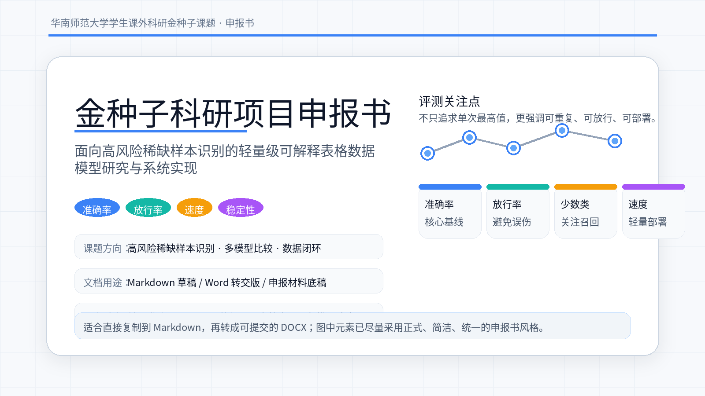

# 金种子科研项目申报书

> 本稿面向“华南师范大学学生课外科研金种子课题”类项目；已按 2026 年公开通知的申报要求和近年 tabular benchmark 研究脉络整理。

**建议项目类别：** 科技发明制作类作品

**建议课题层级：** 金种子一般课题（如有论文/专利/竞赛基础，可升级为重点课题）

**核心卖点：** 不只看准确率，还看正确样本放行率（ALLOW）、少数类召回、训练耗时与推理速度。

## 封面页

**项目名称：** 面向高风险稀缺样本识别的轻量级可解释表格数据模型研究与系统实现

**项目类别：** 科技发明制作类作品

**课题层级：** 金种子一般课题

**学科类别：** 信息技术

**研究周期：** 2026 年 6 月—2027 年 5 月

ewpage

## 目录

1. 项目基本信息  
2. 项目摘要  
3. 立项依据  
4. 研究目标  
5. 研究内容与方法  
6. 技术路线  
7. 创新点  
8. 可行性分析  
9. 前期基础  
10. 进度安排  
11. 预期成果  
12. 经费预算  
13. 团队分工  
14. 风险与应对  
15. 指导教师意见  

ewpage

## 指导教师意见（模板）

> 该项目选题具有一定的学术价值和现实意义，研究路线清晰，技术方案可行，团队分工合理，具备开展课外科研工作的基础。建议同意申报，并在后续研究中重点关注数据质量、模型稳定性及结果可复现性。

**指导教师签名：** ____________________

**职称：** ____________________

**日期：** ____________________

## 学院/学校审核意见（预留）

> ____________________________________________
>
> ____________________________________________
>
> ____________________________________________
>
> ____________________________________________

**盖章：** ____________________

## 参考依据

1. 华南师范大学 2026 年度学生课外科研金种子课题立项申报通知：<https://youth.scnu.edu.cn/announce/2026/0407/19006.html>
2. 华南师范大学学生课外科研金种子课题管理办法（华师〔2025〕19 号）：<https://statics.scnu.edu.cn/pics/xtw/2026/0407/1775572838589019.pdf>
3. CLIMB (2025)：<https://arxiv.org/abs/2505.17451>
4. PMLBmini (2024)：<https://arxiv.org/abs/2409.01635>
5. A Comprehensive Benchmark of Machine and Deep Learning Across Diverse Tabular Datasets (2024)：<https://arxiv.org/abs/2408.14817>
6. TabArena (2025)：<https://arxiv.org/abs/2506.16791>
